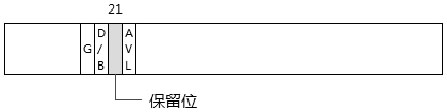
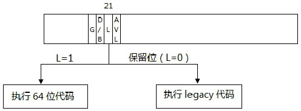

<!-- @import "[TOC]" {cmd="toc" depthFrom=1 depthTo=6 orderedList=false} -->

<!-- code_chunk_output -->

- [1 兼容性](#1-兼容性)
- [2 在 64 位系统上执行 legacy 代码](#2-在-64-位系统上执行-legacy-代码)
- [3 编译器的职责](#3-编译器的职责)

<!-- /code_chunk_output -->

由于是在 x86 上扩展为 64 位技术, 在 x64 的设计上的两个原则是: 照顾**兼容性**和在**long\-mode**里能够平滑无缝地兼容**执行 legacy 模式的代码**. 它们是 x64 体系最为成功的地方.

# 1 兼容性

在支持**x64 架构**的处理器上, **软件**可以选择使用**legacy 模式**(即原来的 x86 模式), 也可以**开启 long\-mode 进入 64 位**的环境.

# 2 在 64 位系统上执行 legacy 代码

引进了**64 位模式**和**compatibility 模式**, 使得在一个全新设计的**64 位 OS 系统**里可以平滑地执行**原有的 32 位代码**或**16 位代码**.

如上所示, 在**legacy 模式**下**code segment descriptor(代码段描述符！！！**)的**bit 21 位是保留位**, 当**开启 long mode(这个位不是开启位！！！**)后, 处理器对 bit 21 的解释为**L 标志位**.

在**x64 体系**里利用这个**bit 21 位**来切换**64 位模式**和**compatibility 模式**, 当**L=1**时进入**64 位模式**, 当**L=0**时进入**compatibility 模式**.

在一个**64 位的 OS 系统**设计里, 系统的**核心执行模块**是运行于**64 位模式**的, 64 位的用户软件执行在 64 位模式, 而 legacy 用户软件执行在**compatibility 模式**.

对于**64 位的代码**来说, 它的**code 描述符**的**bit 21 为 1**; 对于**legacy 模式的代码**来说, 它的**code 描述符**的**bit 21 为保留位**(**L=0**). 因此, 在 OS 系统加载目标软件执行时处理器自动进行切换, 将进入 64 位模式执行 64 位代码还是进入 compatibility 模式执行 legacy 代码.

# 3 编译器的职责

在 64 位的系统上, 通常**编译器**还可以为源代码**选择编译为 32 位还是 64 位**, 从而分别为它们**链接到 32 位或 64 位的库**.