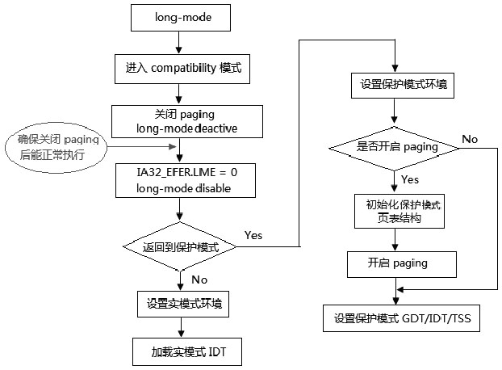
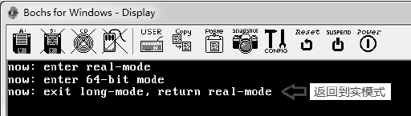

<!-- @import "[TOC]" {cmd="toc" depthFrom=1 depthTo=6 orderedList=false} -->

<!-- code_chunk_output -->

- [0 基本原理](#0-基本原理)
- [1 退出 long-mode 的制约条件](#1-退出-long-mode-的制约条件)

<!-- /code_chunk_output -->

# 0 基本原理

退出 long-mode 的情景比进入 long\-mode 要复杂. 因为, 我们需要确保退出 long\-mode 能保持正常的运作.



上面是退出 long\-mode 的简要流程, 我们看到可以分为两大类: 退出 long\-mode 返回到保护模式或者返回到实模式.

值得注意的是, 当关闭 paging 机制时, 我们需要保持后续的执行流能够得到正常的执行, 也就是说, 失去页的映射后, 后续的指令地址还是正确的. 要达到这个要求, 我们必须在关闭 paging 前, 额外提供一对一的页映射模式(虚拟地址和物理地址一一对应, 它们是相等的).

# 1 退出 long-mode 的制约条件

同样, 由于 long\-mode 的 enable 与 active 状态. 我们在退出 long\-mode 时, 也要遵循它的制约条件.

1) 在关闭 long\-mode(IA32\_EFER.LME=0)前, 必须先使 long\-mode 处于 deactive(非活动)状态, 即先关闭 paging 机制.

2) 在关闭 paging 机制前, 必须先退出 64 位模式(CS.L=1), 也就是说, 必须先使 CS.L=0(即先切换到 compatibility 模式).

3) 在关闭 PAE 分页模式前, 必须先关闭 paging 机制. 也就是说, 不能在 long-mode active 的状态下对 CR4.PAE 进行修改.

因此, 如上所示, 最关键的退出的操作次序如下.

1) 切换到 compatibility 模式.

2) CR0.PG=0 关闭 paging 机制, 使用 long\-mode 处于非激活状态.

3) IA32\_EFER.LME=0, 关闭 long\-mode.

>实验 12-2: 从 long\-mode 返回到实模式中.

这个实验是与实验 12\-1 对应的逆操作, 实验的源码在 topic12\ex12\-2\setup.asm 文件里.

代码清单 12\-3(topic12\ex12-2\setup.asm):

```assembly
;  切换到 compatibility 模式
      jmp DWORD far [compatibility_pointer]
compatibility_pointer:
      dd compatibility_entry    ;  适用 Intel64 和 AMD64
      dw 08h        ;  16 位的 compatibility 模式
;  以下是 16 位 compatibility 模式代码
      bits 16
compatibility_entry:
;  关闭 paging
      mov eax, cr0
      btr eax, 31       ;  CR0.PG=0
      mov cr0, eax
;  关闭 PAE
      mov eax, cr4
      btr eax, 5       ;  CR4.PAE=0
      mov cr4, eax
;  关闭 long-mode
      mov ecx, IA32_EFER
      rdmsr
      btr eax, 8       ;  IA32_EFER.LME=0
      wrmsr
;  保护模式环境
      mov ax, 0x10      ;  加载为 16 位的描述符
      mov es, ax
      mov ds, ax
      mov ss, ax
      mov esp, 0x7ff0
;  关闭 protecte-mode
      mov eax, cr0
      btr eax, 0        CR0.PE=0
      mov cr0, eax
      jmp 0: real_entry     ;  刷新 CS
real_entry:
;  设置实模式环境
      mov ax, 0
      mov es, ax
      mov ds, ax
      mov ss, ax
      mov sp, 0x7ff0
;  加载实模式的 IVT
      lidt [IVT_POINTER]     ;  加载实模式的 IVT 表
      mov si, msg4
      call puts       ;  打印实模式下的测试信息
      jmp $
```

这里直接切换到 16 位的 compatibility 模式(L=0 并且 D=0). 在返回到实模式前, 必须要对各个段寄存器进行加载, 加载的段描述符需要符合: DPL 为 0 值, 以及 limit 为 64K 的段限.

显然, 这些属性是为实模式而准备的, 当然如果还是使用 4G 的段限, 那么这个实模式属于 big\-real mode 或者说 unreal-mode 形式(即实模式下访问 4G 的空间).

下面是在 Bochs 中运行的结果.

