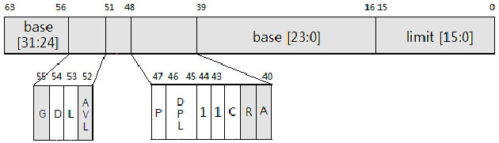
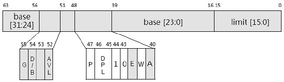
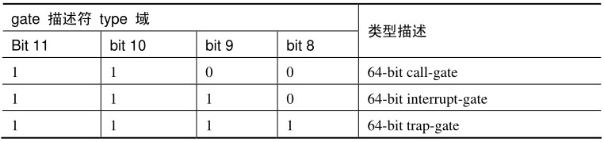
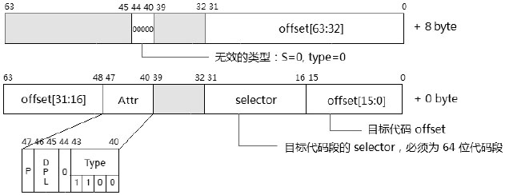
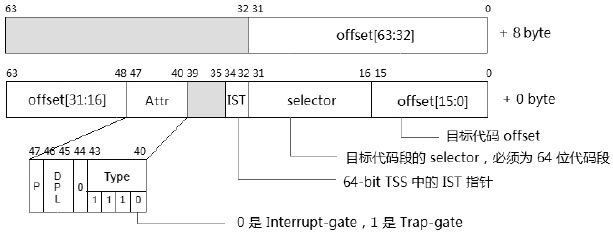
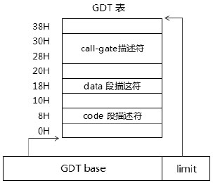
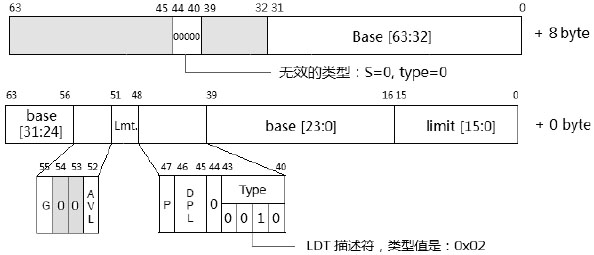
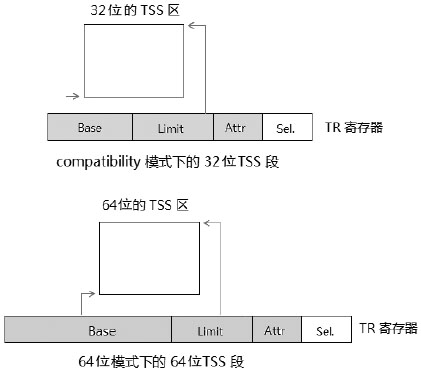
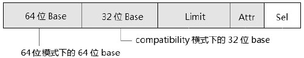

<!-- @import "[TOC]" {cmd="toc" depthFrom=1 depthTo=6 orderedList=false} -->

<!-- code_chunk_output -->

- [1. 概述](#1-概述)
- [2. 处理器模式的判断](#2-处理器模式的判断)
- [3. 64 位模式下的代码段和数据段描述符](#3-64-位模式下的代码段和数据段描述符)
- [4. Long-mode 的 gate 描述符](#4-long-mode-的-gate-描述符)
- [5. Long-mode 的描述符表结构](#5-long-mode-的描述符表结构)
- [6. Long-mode 模式的段寄存器](#6-long-mode-模式的段寄存器)
  - [6.1. 设置 FS 和 GS 的 base 值](#61-设置-fs-和-gs-的-base-值)
  - [6.2. 交换 GS.base 值](#62-交换-gsbase-值)
- [7. Long-mode 的 paging 机制](#7-long-mode-的-paging-机制)

<!-- /code_chunk_output -->

# 1. 概述

long-mode 存在两个子模式: **64 位模式**和**compatibility 模式**. 因此在 long\-mode 可能存在两个不同的执行环境: 64 位模式的执行环境和 compatibility 模式执行环境.

在 compatibility 模式下, 处理器的行为与 legacy 模式一般无异. 在 64 位模式下, 处理器可使用的物理资源得到扩展.

# 2. 处理器模式的判断

当 Code segment descriptor 被加载到 CS 寄存器时, CS 内部 cache 内的属性得到更新, 我们使用下面的逻辑来判断处理器处于什么模式.

```cpp
if (IA32_EFER.LMA == 1)  /* long-mode */
{
      if (CS.L == 0)
      {
                           /* 处于 compatibility 模式 */
      }
      else if (CS.L == 1 && CS.D == 0)
      {
                           /* 处于 64 位模式 */
      }
}
else
{
                           /* legacy 模式 */
}
```

IA32\_EFER 寄存器的 LMA 位用来判断处理器是否处于 long\-mode, CS.L 标志位用来判断是否处于 64 位模式.
在 long\-mode 下, 有效的 64 位模式标志是: CS.L=1 并且 CS.D=0. 而 CS.L=1 并且 CS.D=1 这个组合是无效的. 在加载 CS 寄存器时, 处理器判断到 CS.L=1 并且 CS.D=1 会产生\#GP 异常. (从这个角度看, 实际只需要判断 CS.L 是否为 1 就足够了. )

# 3. 64 位模式下的代码段和数据段描述符

和 legacy 模式一样, 在**64 位模式**下, **代码段和数据段描述符(！！！**)仍然是**8 字节宽(！！！**), 然而大部分域和属性都是无效的.



在上面的代码段描述符里, S 标志(bit 44)和 C/D 标志(bit 43)固定为 1 值. 实际上, 在属性域里仅有 C、DPL、P、L, 以及 D 标志位是有效的.

**L 和 D 标志位**控制处理器在 long\-mode**子模式的选择**及其**default operand size(默认操作数大小**).



在**数据段描述符**里, S 标志(bit 44)为 1, C/D 标志(bit 43)为 0. W 标志(bit 41)仅用于作为 Stack 段描述符时, 处理器在加载时会检查 stack 段必须为 Writable(可写的)段. 而 DPL 和 P 标志在加载时会使用, 当加载成功后, 这些属性都被忽略.

# 4. Long-mode 的 gate 描述符

在**long\-mode**下, 所有的**gate 描述符**的类型都是**64 位的(描述符的宽度为 16 字节！！！**), 包括:

1) 64 位**Call\-gate**.

2) 64 位**Interrupt\-gate**.

3) 64 位**Trap\-gate**.

值得注意的是, 在 compatibility 模式下**这些 gate 描述符类型也是 64 位**的, 这根本决定了运行在 compatibility 模式下的代码当进入 0 级权限后(通过调用 call gate, 或者通过中断调用方式), 必须从 compatibiltiy 模式切换到 64 位模式.



在 long\-mode 下, gate 描述符的类型除上表所列的值外, 其他值都是无效的.



Call\-gate 描述符 type 值为 1100B. 由于 call\-gate 放在 GDT 或 LDT 表里, 因此在高 8 字节的 S 标志为 0, type 值为 0, 这是一个无效的描述符类型, 用来防止对它的错误引用(即高 8 字节被错误当做段描述符来使用).



Interrupt\-gate 和 Trap\-gate 描述符的结构是完全相同的, 当 type 值为 1110B 时为 Interrupt\-gate, 当 type 值为 1111B 时 Trap\-gate.

**在 Interrupt/Trap\-gate 描述符里增加了一个 IST 域**, 可以为 interrupt handler 提供**额外的 stack 指针**, 当**IST 值为非 0**时, IST 值用来在**当前 TSS 块**里查找**相应的 stack 指针值**.

值得注意的是, 在 long\-mode 下并**不存在 Task\-gate 描述符**, 基于**TSS 的任务切换机制将不再支持**.

**中断门和陷阱门描述符都只允许存放在 IDT 内(！！！**), **任务门可以位于 GDT、LDT 和 IDT 中(！！！**)

# 5. Long-mode 的描述符表结构

在 long\-mode 下, 除了 IDT 内的**描述符固定为 16 字节**外. GDT 和 LDT 与 legacy 模式下一般无异(call gate 是 16 字节外).



在这个 GDT 里可能会存在**call\-gate 描述符**, 它在 long\-mode 下是**16 字节**, 它的高 8 位 S 与 type 值为 0, 可以有效地区别于其他的描述符.


如上所示, 在 long\-mode 模式下**GDTR 和 IDTR 寄存器**的**base 值被扩展为 64 位**, 而 limit 值仍然是 16 位不变. **即使在 compatibility 模式**下, GDTR.base 与 IDTR.base 都是**64 位**.

然而, 在 compatibiltiy 模式下, 所有段寄存器的 base 值只能使用低 32 位. 例如: FS.base 在 64 位模式使用 64 位基地址, 而在 compatibility 模式下只能使用低 32 位.

**GDT 内的 TSS 与 LDT 描述符**在**compatibility 模式**下是 32 位类型的, 这与 legacy 模式下是一样的. 在 compatiblity 模式下加载 TSS 或 LDT 描述符, 处理器会以 legacy 模式的行为进行加载.



在 compatibility 模式下, **LDT 描述符**与 legacy 模式是一致的(32 位 TSS 类型**8 字节宽**), 而在**64 位模式**下**LDT 描述符**也被扩展为**64 位 LDT 16 字节宽**.

与 call\-gate 描述符同样的处理手法, 高 8 字节的 S 和 type 值为 0.



在 64 位模式下, LDTR 寄存器与 TR 寄存器的 base 值扩展为 64 位, 而在 compatibility 模式下与 legacy 模式下是一致的(base 值仍然使用 32 位).

对于**TSS 段**的结构在 64 位模式和 compatibility 模式下也会不同, 如上所示, **在 64 位模式下使用 16 字节宽**, 在 compatibility 模式还是使用 32 位格式的 TSS 段.

**LDT 和 TSS**在系统中可能有**很多个**, 所以需要在**GDT**中添加**每个 LDT**和**每个 TSS 的描述符**, 用来查找. 而**IDT 是没有描述符**的, 因为**IDT 在系统中就只有一个**, **IDTR 指向**就可以, 永远不变,  **不需要在 GDT 中存在一个 IDT 的描述符**.

当要使用这些**LDT**时, 可以用它们的**选择子(32 位下 TSS 中有一个 IDT 段选择符！！！**)来访问 GDT, 将**LDT 描述符**加载到 LDTR 寄存器.

# 6. Long-mode 模式的段寄存器



**段寄存器的 base 域**在**64 位模式**下被扩展为**64 位**, 对于**CS、ES、SS 和 DS(！！！**)寄存器来说这个**64 位的基值没什么意义**. 在 64 位模式下, 这些**段的基值都被强制为 0 值(！！！**).

**64 位的段基值**对于**FS 和 GS 寄存器**来说才有意义, **FS 和 GS 寄存器(！！！**)可以由**软件设置非 0 的 64 位值**.

## 6.1. 设置 FS 和 GS 的 base 值

使用**代码段或数据段描述符(！！！**)的**加载方法**, 只能加载一个**32 位的 base 值**, 在**x64 体系**中, 新增了两个 MSR 寄存器: **IA32\_FS\_BASE**和**IA32\_GS\_BASE**. 它们分别映射到**FS.base 和 GS.base**.

```assembly
;;设置 FS.base
      mov ecx, IA32_FS_BASE
      mov eax, fs_base_low32  ;  低 32 位
      mov edx, fs_base_hi32  ;  高 32 位
      wrmsr
;;设置 GS.base
      mov ecx, IA32_GS_BASE
      mov eax, gs_base_low32  ;  低 32 位
      mov edx, gs_base_hi32  ;  高 32 位
      wrmsr
```

如上所示, 对这两个寄存器进行写可以设置相应的 64 位 base 值.

## 6.2. 交换 GS.base 值

**SYSCALL 指令**使用一个特殊的方式来达到**设置 RSP 寄存器的目的**, x64 体系提供了另一个寄存器: **IA32\_KERNEL\_GS\_BASE**.

**IA32\_KERNEL\_GS_BASE 寄存器**用来保存**OS 的 kernel 数据结构**.

```assembly
      mov rax, kernel_data_table
      mov rdx, rax
      Shr rdx, 32
      mov ecx, IA32_KERNEL_GS_BASE
      wrmsr
;;kernel 数据结构示例
Kernel_data_table:
      Kernel_stack_pointer dq 0xfffff80000fffff0  ;  RSP 值
      ... ...
```

在**syscall 指令**进入的**系统服务例程**里, 使用**SWAPGS 指令**来**交换 GS.base**与**IA32\_KERNEL\_GS\_BASE 寄存器的值(下面操作很重要！！！**).

```assembly
syscall_service:
      swapgs            ;交换 GS.base 与 IA32_KERNEL_GS_BASE 值
      mov rsp, gs: [0]  ;获得 kernel 的 stack 指针
      push rbp          ;在 kernel stack 上保存数据
      ... ...
      pop rbp
      swapgs            ;退出前交换回原来的 GS.base 值
      db 0x48
      sysret
```

当然, IA32\_KERNEL\_GS\_BASE 寄存器并不只是使用在获取 RSP 值上, 完全可以作为他用.

# 7. Long-mode 的 paging 机制

在 long\-mode 下只能使用一种分页模式(long\-mode 分页模式, 或者说 IA\-32e paging 模式), 在 IA\-32e paging 模式下, 使用 4 级的页转换表结构. 在 x64 体系中, 在 64 位模式里实现的最高线性地址为 48 位. 这 48 位的线性地址在 4K 页面映射下被分割成 5 个部分:

1) PML4TE index(bit 47~bit 39).

2) PDPTE index(bit 38~bit 30).

3) PDE index(bit 29~bit 21).

4) PTE index(bit 20~bit 12).

5) page offset(bit 11~bit 0).

IA\-32e paging 能使用的页面大小为: 4K 页, 2M 页, 以及 1G 页. 关于 IA-32e paging 分页模式, 详情请参考 11.5 节.