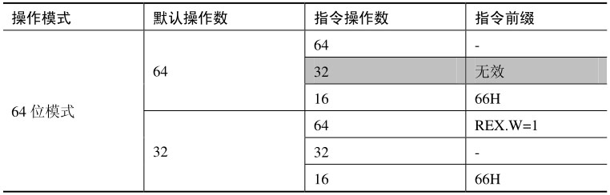
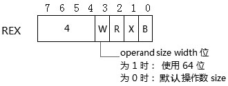
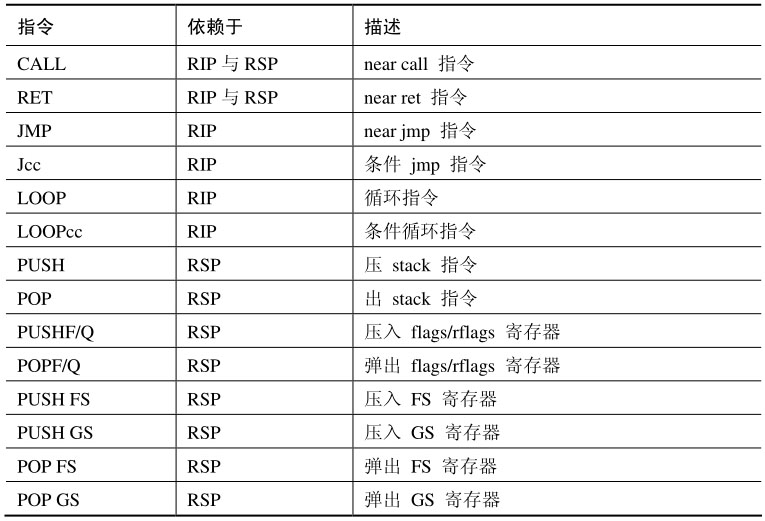
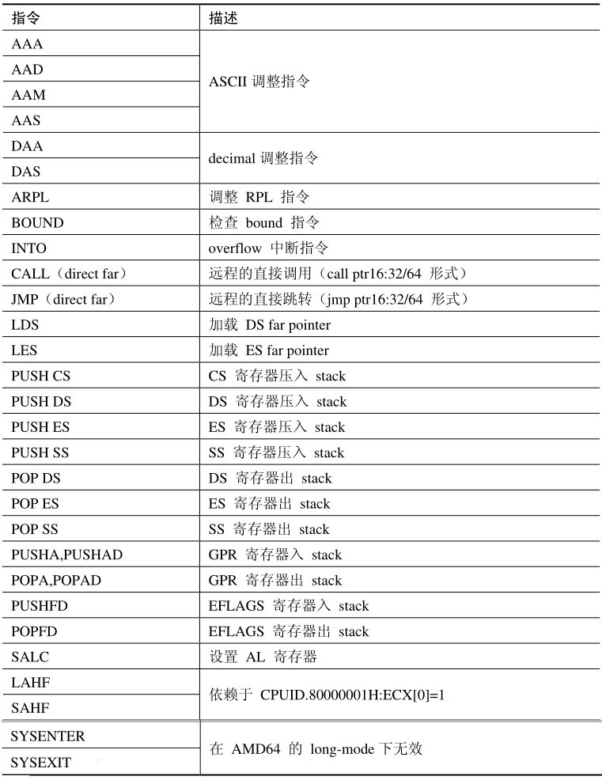
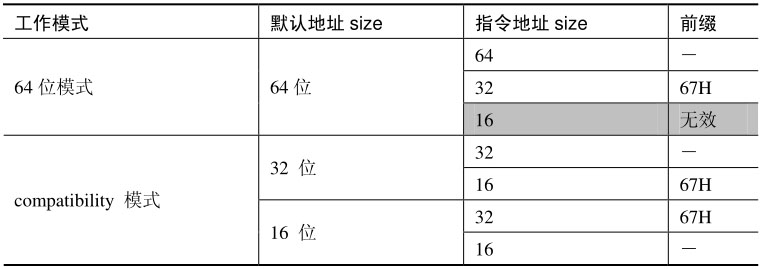

<!-- @import "[TOC]" {cmd="toc" depthFrom=1 depthTo=6 orderedList=false} -->

<!-- code_chunk_output -->

- [0 概述](#0-概述)
- [1 64 位模式的操作数](#1-64-位模式的操作数)
  - [1.1 默认操作数大小](#11-默认操作数大小)
  - [1.2 默认操作数为 64 位的指令](#12-默认操作数为-64-位的指令)
- [2 64 位模式下的无效指令](#2-64-位模式下的无效指令)
- [3 64 位模式下的寻址模式](#3-64-位模式下的寻址模式)
  - [3.1 默认地址大小](#31-默认地址大小)
  - [3.2 stack address size(栈地址大小)](#32-stack-address-size栈地址大小)
  - [3.3 stack address(栈地址)与 operand address(操作数地址)](#33-stack-address栈地址与-operand-address操作数地址)
  - [3.4 指令指针 size 与 operand size](#34-指令指针-size-与-operand-size)

<!-- /code_chunk_output -->

# 0 概述

在 x86/x64 体系的指令执行环境中, 有几个知识是很重要的: **operand\-size(操作数大小**), **address\-size(地址大小**), **stack\-address size(栈地址大小**), 以及**instruction pointer size(指令指针大小**).

参见 `Virtualization/Learning/处理器虚拟化/1.2.2`
# 1 64 位模式的操作数

在 long\-mode 下, 当 CS.L=1 并且 CS.D=0 时, 处理器将运行在 64 位模式. 可是并不代表指令的操作数是 64 位的.

## 1.1 默认操作数大小

在 64 位模式下, 仅有**少数指令的默认操作数是 64 位**, **大多数指令**的默认操作数仍是**32 位**的. 在默认操作数为 32 位的情况下, 访问**64 位的操作数**必须使用**REX prefix**.

在**64 位模式**下指令可以使用 16 位的操作数, 但是在下面的情形里是不能使用 32 位的操作数的:

- 当指令的 default operand size(默认操作数)是 64 位的情况下, 指令不能通过 operand override perfix 来使用 32 位的操作数.

下表总结了 64 位模式下指令操作数的使用情况.



在上面这个表格里, 我们看到了 64 位模式下的两种 default operand size(默认操作数大小): 64 位和 32 位.

当指令的默认操作数是 64 位时, 使用 64 位的操作数无须加上 REX prefix(前缀), 使用 66H prefix 可以改写为 16 位的操作数, 如下所示.

```assembly
bits 64    ;  为 64 位模式编译
push ax    ;  加上 66H prefix
push eax   ;  无效的操作数！不能使用 32 位的操作数
push rax   ;  无须加 prefix
```

这条 push 指令的默认操作数是 64 位的, 那么 push eax 这条指令是错误的(无效的 32 位操作数).

当指令的默认操作数是 32 位时, 使用 64 位的操作数需要加上 REX prefix(REX.W=1), 这个 REX 前缀的 W 标志必须为 1 值.



关于 x64 体系指令的详细讲解请参考笔者站点 www.mouseos.com/x64/default.html 上的相关内容.

```assembly
bits 64     ;  为 64 位模式编译
mov ax, bx    ;  加上 66H prefix
mov eax, ebx   ;  无须加 prefix
mov rax, rbx   ;  加上 48H prefix
```

这条 mov 指令在 64 位模式下的默认操作数为 32 位, 因此使用 64 位的操作数, 编译器会生成一个 REX prefix(48H).

## 1.2 默认操作数为 64 位的指令

少数指令的默认操作数是 64 位的, 这些指令分为两大类: 依赖于 RIP 指针的 near branch(近程分支)指令, 以及依赖于 RSP 指针的 stack 操作指令.



这些 64 位操作数的指令不使用 far pointer(远程指针), 而使用 far pointer 类的分支指令(如: retf 指令与 iret 指令)默认操作数是 32 位的.

```assembly
db 48h       ;  在 64 位模式下手工加上 REX.W=1
retf       ;  far ret 指令
```

编译器不支持 RETFQ(类似这种 64 位的助记符)形式, 需要使用 64 位的操作数时, 必须手工加上 REX prefix. 不像 IRETQ 指令(支持 64 位的助记符), 编译器会帮我们加上 REX prefix.

# 2 64 位模式下的无效指令

部分指令在 64 位模式下将是无效的, 如下表所示.



SALC 这条指令比较奇怪, 在 AMD 的 opcode 表上出现但并没对指令进行说明. 在 Intel 上是不存在的. LAHF 和 SAHF 指令在 64 位模式下依赖于 CPUID.80000001H: ECX[0]的值是否为 1.

而在 AMD64 平台上, SYSENTER 和 SYSEXIT 指令只支持在 legacy 模式上使用, 在 long\-mode 是无效的. 在 Intel64 平台上, SYSCALL 和 SYSRET 指令仅支持在 64 位模式下.

# 3 64 位模式下的寻址模式

64 位的寻址模式在 32 位寻址模式的基础上扩展而来, 最大的区别是: 所有 base 和 index 寄存器都扩展为 64 位寄存器, 并新增了一个 RIP-relative(RIP 相对)寻址.

## 3.1 默认地址大小

在 64 位模式下, 指令的 default address size(默认地址大小)是 64 位的, 这与 default operand size(默认操作数大小)有很大的区别.



指令的默认地址大小同样由 CS.L 和 CS.D 标志决定.

1) 当 CS.L=1 并且 CS.D=0 时, 默认的地址是 64 位.

2) 当 CS.L=0 并且 CS.D=1 时, 在 compatibility 模式下, 使用 32 位的默认地址.

3) 当 CS.L=0 并且 CS.D=0 时, 在 compatibility 模式下, 使用 16 位的默认地址.

在 64 位模式下, 16 位的地址是无效的. 使用 32 位的地址, 必须加上 67H 前缀(address override prefix).

```assembly
bits 64
mov rax, [esi]    ;  64 位模式下使用 32 位的地址
```

在上面这条指令里, 使用了 32 位的地址值, 编译器在生成机器指令时会加入 67H 前缀.

## 3.2 stack address size(栈地址大小)

在 64 位模式下, stack 地址大小(即 RSP 寄存器代表的 stack pointer 值)固定为 64 位, 并不因为使用 67H 前缀而改变.

```assembly
bits 64
push rax      ;  隐式使用 64 位 rsp 指针
db 67h       ;  企图改变栈地址, 实际上是改变操作数地址
push rax      ;  固定使用 64 位的 stack address 值
```

在上面示例的最后一种情形里, 企图加上 67H 前缀更改 stack address 大小, 这将是失败的. push rax 指令使用固定的 64 位 RSP 值. 这是因为 stack address(栈地址)和 operand size(操作数地址)有本质区别, 后面我们将看到.

## 3.3 stack address(栈地址)与 operand address(操作数地址)

stack 地址大小与指令操作数地址大小是不同的概念: operand address size 是指操作数的寻址, stack address size 是指 stack 的地址宽度, 如下面代码所示.

```assembly
mov rax, [esp]    ;  operand address size 是 32 位
mov rax, [rsp]    ;  operand address size 是 64 位
push qword [eax]   ;  stack address 是 64 位, operand address 是 32 位
```

我们看到最后一条指令 push qword [eax]将出现两个 address size: operand address size, 以及 stack 的 address size.

Stack address 大小是由 SS 寄存器的 B 标志位决定, 在 legacy 模式和 compatibility 模式下, B=1 时属于 32 位的 ESP 指针, B=0 时是 16 位的 SP 指针.

然而在 64 位模式下, SS 寄存器的 B 标志位是无效的, RSP 固定为 64 位. 因此 stack address 大小固定为 64 位, 不会被改变.

## 3.4 指令指针 size 与 operand size

在这里同样遭遇了"栈地址与操作数地址"的问题, Instruction pointer(指令指针)RIP 值如同 stack pointer(栈指针)RSP 值, 在 64 位模式下固定为 64 位.

然而指令指针大小与操作数大小也是本质不同的事物. 与 push 指令一样, jmp/call 指令也会同时面对指令指针与操作数这两个事物.

```assembly
jmp eax    ;  不被支持
jmp ax    ;  操作数为 16 位, RIP 指针固定为 64 位
jmp rax    ;  64 位的 RIP 值, 操作数为 64 位
jmp offset32  ;  32 位 offset 值符号扩展到 64 位加上 RIP
```

当 jmp/call 指令提供寄存器和内存操作数时, 在 64 位模式下 32 位的操作数不被支持. 在 jmp ax 这条指令里, 它的操作数是 16 位, ax 寄存器的值最终会被零扩展到 64 位然后加载到 RIP 里.