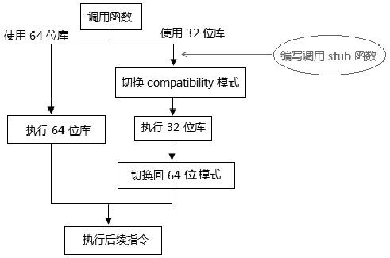
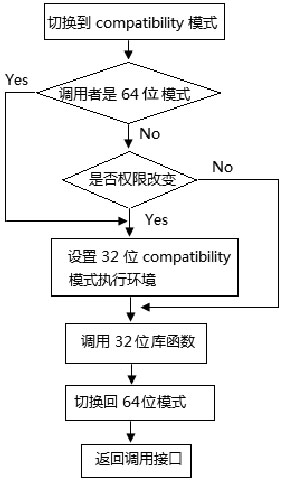

<!-- @import "[TOC]" {cmd="toc" depthFrom=1 depthTo=6 orderedList=false} -->

<!-- code_chunk_output -->

- [1 64 位模式切换到 compatibility 模式](#1-64-位模式切换到-compatibility-模式)
  - [1.1 照顾通用性](#11-照顾通用性)
- [2 compatibility 模式切换到 64 位模式](#2-compatibility-模式切换到-64-位模式)
- [3 利用 compatibility 模式执行 legacy 的库函数](#3-利用-compatibility-模式执行-legacy-的库函数)
  - [3.1 提供调用的接口](#31-提供调用的接口)
  - [3.2 实现调用 stub 函数](#32-实现调用-stub-函数)
  - [3.3 定义调用宏](#33-定义调用宏)

<!-- /code_chunk_output -->

在 long\-mode 里, 出于某些考虑, 可能需要从 64 位模式切换到 compatiblity 模式进行相关的处理. 除了兼容执行 legacy 模式代码外, 切换到 compatibiltiy 模式有时是很有用途的.

# 1 64 位模式切换到 compatibility 模式

在前面已提及, 要退出 long-mode 必须先换到 compatibility 模式. 要切换到 compatibility 模式, 我们需要提供一个 far pointer 来加载 comaptibility 模式的 Code segment 描述符. 这个 far pointer 必须以间接形式给出, 在 64 位模式下不允许使用直接的 far pointer(即 jmp 16: 32 直接在指令里给出 far pointer 值).

```assembly
       jmp far [compatibility_pointer]
compatibility_pointer:
       dq compatibility_entry   ;  compatibility 代码入口点
       dw compatibility_selector  ;  compatibility 模式的 CS selector
```

上面代码使用远程的 jmp 指令提供 compatibility 模式的 far pointer 切换到 compatibility 模式, 这是一个典型的示例.

## 1.1 照顾通用性

在 nasm 编译器里, 会将 jmp far [compatibility_pointer]这条指令编译为 64 位的操作数. 实际上 nasm 是不合理的, 因为远程的 jmp 指令默认操作数是 32 位！如果需要明确使用 64 位操作数, 应该需要如下这样.

```assembly
jmp QWORD far [compatibility_pointer]  ;  提供显式的 QWORD 指示字
```

在 Intel64 平台上支持 80 位(16: 64)的 far pointer 形式. 因此, 这个 compatibility_entry 值是 64 位的.

然而, 在 AMD64 平台的 64 位模式里最大只能支持 48 位(16: 32)的 far pointer 形式, 因此, 在 AMD64 平台上这个 compatibiltiy_entry 值须设置为 32 位的.

为了照顾通用性, 我们应该明确地使用 32 位的操作数, 上面的示例代码将修改为

```assembly
       jmp DWORD far [compatibility_pointer]  ;  强制使用 32 位的操作数
compatibility_pointer:
       dd compatibility_entry     ;  32 位的入口地址值
       dw compatibility_selector    ;  compatibility 模式的 CS selector
```

将 jmp 指令的操作数强制定为 32 位, 那么在 Intel64 和 AMD64 平台都能够使用.

# 2 compatibility 模式切换到 64 位模式

相比之下, 从 compatibility 模式切换 64 位模式则会简单些, 在 compatibility 模式下, 我们可以使用 direct far jmp(直接远程跳转)指令形式, 代码如下.

```assembly
jmp DWORD far 0x28: entry64    ;  提供直接的 far pointer 指针.
```
这个直接 far pointer 在 64 位模式是不支持的, 而我们则正好是利用 compatibility 模式下支持的特性, 提供目标 64 位代码的 far pointer. 值得注意的是, 这个 entry64 是 32 位值, 会被零扩展后加载到 RIP 指针里.

# 3 利用 compatibility 模式执行 legacy 的库函数

如果当需要实现某个功能时, 原来 32 位代码库已经实现了. 那么在 64 位模式下, 我们有两个选择.

1) 编写相应的 64 位版本.

2) 在允许的情况下, 重复利用 32 位的库.



假如选择调用 32 位的库, 那么我们需要切换到 compatibility 模式执行, 执行完 32 位库后, 切换回 64 位模式. 在这个调用函数的模式切换过程中, 最好的办法是实现一个 stub 函数.

## 3.1 提供调用的接口

我们需要保证任何权限下, 典型地如 0 级 kernel 代码和 3 级的 user 代码都能够使用这个机制来调用 32 位库. 我们可以实现一个调用接口提供给任何权限下使用.

```assembly
mov esi, msg1      ;  puts() 函数参数
mov eax, LIB32_PUTS     ;  32 位库的函数号, 调用 puts() 函数
call lib32_service     ;  调用接口函数
```

这段代码在 64 位模式的 0 级权限或者 3 级权限下都能够运行. 这个 lib32_service()函数就是系统提供的调用接口函数, 它的内部是调用 stub 函数.

代码清单 12-4(lib\lib64.asm):

```assembly
; -------------------------------------------------------
;  lib32_service(): 对外接口
;  input:
;   rax: 库函数编号
;  描述:
;   通过 call-gate 调用实际工作的 lib32_service()
; -------------------------------------------------------
lib32_service:
jmp lib32_service_next
CALL_GATE_POINTER: dq 0 dw call_gate_sel   ;  Call-gate 的 selector
lib32_service_next:
       call QWORD far [CALL_GATE_POINTER]   ;  从 64 位模式里调用 call gate
       ret
```

接口函数 lib32\_service()实现在 lib\lib64.asm 库里, 为 64 位代码而实现. 这个函数的核心是使用 Call\-gate 切换到 0 级的 64 位 stub 函数. 使用了 call\-gate, 所以无论在 0 级还是 3 级下最终都会来到 0 级的 64 位代码.

## 3.2 实现调用 stub 函数

stub 函数是运行在 0 级的 64 位模式下的, 它将负责:

1) 从 64 位模式切换到 compatibility 模式.

2) 调用 32 位库的具体函数.

3) 从 32 位库返回后, 切换回 64 位模式.

代码清单 12-5(lib\lib64.asm):

```assembly
       bits 64
; -------------------------------------------------------
;  __lib32_service(): 在 64 位的代码下使用 32 位的库函数
;  input:
;   rax: 库函数编号, rsi...相应的函数参数
;  描述:
;   (1) rax 是 32 位库函数号, 类似于系统服务例程的功能号
;   (2) 代码会先切换到 compatibility 模式调用 32 位模式的函数
;   (3) 32 位例程执行完毕, 切换回 64 位模式
;   (4) 从 64 位模式中返回调用者
;   (5) lib32_service() 函数使用 call-gate 进行调用
; -------------------------------------------------------
__lib32_service:
      push rbp
      mov rbp, rsp
      push rbx
      push rsi
      push rdi
      mov rbx, rax       ;  功能号
      mov rsi, [rbp + 16]      ;  读 CS selector
      call read_segment_descriptor
      shr rax, 32
      pop rdi         ;  恢复函数参数
      pop rsi
      jmp QWORD far [lib32_service_compatiblity_pointer] ;  切换到 compatibility 模式
; ;  定义 far pointer(为切换到 compatibility 模式而准备)
lib32_service_compatiblity_pointer: dq lib32_service_compatibility
                                       dw  code32_sel
; ;  下面为切换回 64 位模式而定义(32 位的入口地址)
lib32_service_64_pointer:    dd lib32_service_done
                                dw KERNEL_CS
lib32_service_compatibility:
      bits 32           ;  使用 32 位编译
      bt eax, 21          ;  测试 CS.L
      jc reload_sreg         ;  调用者是 64 位代码
      shr eax, 13
      and eax, 0x03         ;  取 RPL
      cmp eax, 0
      je call_lib32         ;  权限不变
reload_sreg:
      ; ;  重新设置 32 位 compatibility 模式环境
      mov ax, data32_sel
      mov ds, ax
      mov es, ax
      mov ss, ax
      mov esp, LIB32_ESP
call_lib32:
      ; ; ;  计数目标函数的位置: ebx * 5 + LIB32_SEG 得到 lib32 库函数地址
      lea eax, [LIB32_SEG + ebx * 4 + ebx]
      call eax          ; ;  执行 32 位例程
      jmp DWORD far [lib32_service_64_pointer]  ; ;  切换回 64 位模式
      bits 64           ;  使用 64 位编译
lib32_service_done:
      lea rsp, [rbp - 8]
      pop rbx
      pop rbp
      db 0x48
      retf           ;  返回到接口函数
```

\_\_lib32\_service()是 Call\-gate 的服务例程, 经 lib32\_service()接口函数调用进入. 它将接纳从 64 位模式的 0 级或 3 级调用, 以及从 compatibility 模式里调用.

值得注意的是, 它只能在 Intel64 平台上执行, 因为使用了 80 位(16: 64)的 far pointer 形式, 当然我们可以将它改为 32 位操作数做到通用. 它的工作流程如下所示.



如果是从 compatibility 模式下的 0 级权限进行调用, 那么就不需要设置目标代码运行的 32 位 compatibility 模式环境, 否则必须设置 compatibility 模式的环境.

## 3.3 定义调用宏

为了做得更好, 我们可以定义一些宏函数, 用来包装 32 库函数的调用, 下面是典型的定义.

```assembly
;  定义 32 位库 puts() 函数的调用宏
%macro LIB32_PUTS_CALL 0
       mov eax, LIB32_PUTS     ;  32 位库函数号
       call lib32_service     ;  接口函数
%endmacro
```

那么, 在我们的 64 位或者 compatibility 模式代码里, 可以使用下面的方式进行调用.

```assembly
mov esi, msg      ;  puts() 函数的参数
LIB32_PUTS_CALL      ;  调用 32 位库函数 puts()
```

当然还可以定义得更像宏一样, 如下:

```assembly
%macro LIB32_PUTS_CALL 1
       mov esi, %1       ;  puts() 的参数
       mov eax, LIB32_PUTS     ;  32 位库函数号
       call lib32_service     ;  接口函数
%endmacro
```

那么, 我们就可以这样调用(宏的使用):

```assembly
LIB32_PUTS_CALL msg     ;  调用 32 位库函数 puts()
```
通过这种机制, 就重复利用了 legacy 的 32 位库代码. 上面的代码看起来和在 32 位保护模式下调用 puts()没多大区别.