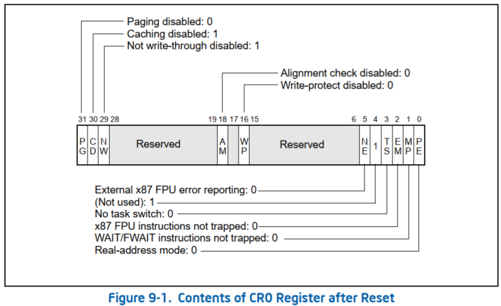
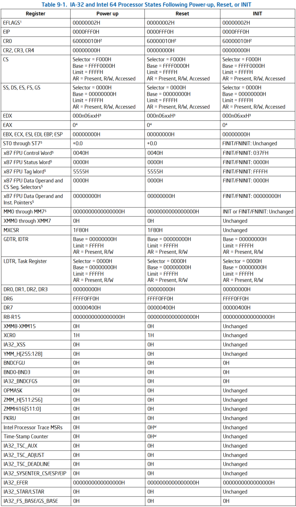
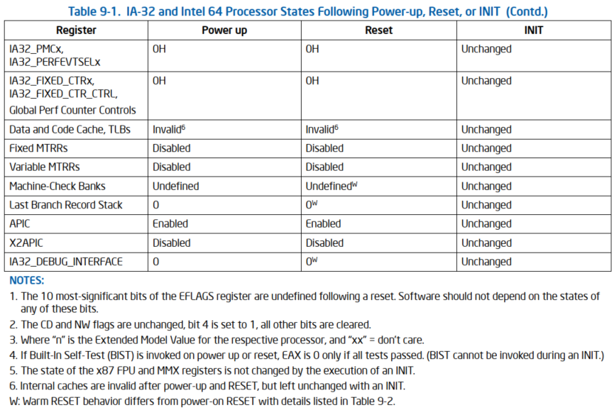
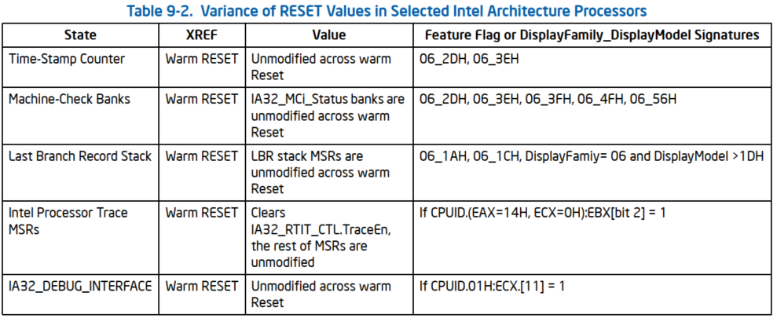

# 概述

上电或置位 `RESET#` **引脚**后, 系统总线上的每个处理器执行处理器的硬件初始化(称为硬件复位,hardware reset)和可选的**内置自检**(`built-in self-test`, BIST). **硬件复位**将**每个处理器**的**寄存器**设置为**已知状态**, 并将处理器置于**实模式**.它还会使**内部缓存**, TLB 和分支目标缓冲区(BTB) 失效. 此时, 所执行的操作取决于处理器系列:

* Pentium 4 处理器 (cpuid DisplayFamily 是 0Fh): 系统总线上的**所有处理器**(包括单处理器系统中的单个处理器)都执行**多处理器**(MP)**初始化协议**.然后,通过**此协议**选择作为**自举处理器** (`bootstrap processor`, BSP)的处理器立即开始在**当前代码段** (code segment) 中, 从 **EIP** 寄存器中的**偏移量**开始执行**软件初始化代码**. 当 BSP 执行初始化代码时, 应用进程(**非 BSP)处理器 (AP**) 会进入**等待启动 IPI**(`Startup IPI`, **SIPI**)状态. 有关更多详细信息, 请参见"多处理器(MP)初始化". 请注意, 在单处理器系统中,单个 Pentium 4 或 Intel Xeon 处理器自动成为 BSP.

* IA-32 和 Intel 64 处理器 (cpuid DisplayFamily 是 06h): 和 Pentium 4 一致.

* Pentium 处理器:

* Intel486 处理器:

**软件初始化代码**会执行 **BSP** 或**主处理器**和系统逻辑的所有**特定于系统的初始化**.

此时, 对于 MP(或 DP)系统, BSP(或主)处理器会唤醒每个 AP(或 secondary)处理器, 使这些处理器使能并执行自配置代码.

当**所有处理器**都**初始化**、**配置**和**同步**后, **BSP** 或主处理器开始执行**初始操作系统**或执行任务.

在**硬件重置期间**, **x87 FPU** 也会初始化为**已知状态**. 然后可以执行 x87 FPU 软件初始化代码来执行设置 x87 FPU 的精度和异常掩码等操作. 无需对 x87 FPU 进行特殊初始化即可切换操作模式.

在处理器上断言(assert, 置位) `INIT#` **引脚**会调用**对硬件重置**的类似响应. 主要区别在于, 在 **INIT** 期间, **内部缓存**、**MSR**、**MTRR** 和 **x87 FPU** 状态保持不变(尽管 TLB 和 BTB 与硬件 reset 一样失效). **INIT** 提供了一种从受**保护模式**切换到**实地址模式**的方法, 同时**保留内部缓存**的内容.

# Reset 之后的处理器状态

上电后, 控制寄存器 CR0 的状态为 `60000010H`(见图9-1). 这会将处理器置于**禁用分页**的**实地址模式**.

下表 9-1 显示了 IA-32 和 Intel 64 处理器(CPUID DisplayFamily 为 06H)在以下事件中的状态: 开机、RESET 和 INIT. 在**少数情况**下, **某些寄存器**的行为在 **warm RESET** 中的行为**略有不同**, 表中标记了变体情况, 在表 9-2 中对此进行了更详细的描述.

注:

* 1, 复位后, EFLAGS 寄存器的 10 个最高有效位是 **undefined**. 软件不应依赖于这些位中的任何一个的状态.
* 2, CD 和 NW 标志保持不变, 位 4 设置为 1, 所有其他位均被清除.
* 3, 其中 "n" 是相应处理器的扩展模型值, "xx"= 不关心.
* 4, 如果在上电(`power-on`)或复位(`reset`)时调用**内置自检**(`Built-In Self-Test`, BIST), 则仅当所有 test 都通过时, EAX 才为 0. (在 INIT 期间不能调用 BIST).
* 5, x87 FPU 和 MMX 寄存器的状态不会因执行 INIT 而改变.
* 6, 内部缓存在上电(`power-on`)和复位(`reset`)后无效, 但在 INIT 中保持不变.
* W: warm RESET 行为与 power-on RESET 不同, 详细信息如表 9-2 所示.

所以对于 CPU 来讲, 只是 power-up, warm reset, cold reset 以及 INIT 这四种,