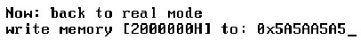

由于在实模式下不能使用 GDT, 因而不能从正常途径去更改 segment 的 limit 值. 可以通过变通方法, 先进入保护模式修改再返回实模式下. 在保护模式里将 limit 值改为 4G, 返回实模式前并不修改 limit 值, 那么回到实模式后 limit 就变成了 4G.

> 实验 8-2: 在实模式下使用 4G 的空间

这个实验在 setup.asm 模块里进行, 主要的代码如下.

代码清单 8-2 (`topic08\ex8-2\setup.asm`)​:

```assembly
; ;  切换回 16 位
    jmp code16_sel: entry16                                   ;  进入 16 位保护模式
    bits 16
entry16:
    mov eax, cr0
    btr eax, 0
    mov cr0, eax
; ;  切换回 real 模式
    jmp 0: back_to_real
; ; ;   下面是 real 模式
back_to_real:
    mov ax, cs
    mov ds, ax
    mov es, ax
    mov ss, ax
    mov sp, 0x7ff0
; ;  切换回实模式的 IVT
    lidt [IVT_POINTER]
    mov eax, LIB16_SEG + LIB16_CLEAR_SCREEN * 3
    call eax
    mov eax, LIB16_SEG + LIB16_PUTS * 3
    mov si, msg2
    call eax
    mov eax, 2000000H
    mov DWORD [eax], 0x5A5AA5A5                              ;  测试写 32M 空间
    mov esi, DWORD [eax]                                       ;  读 32M 空间
    mov edi, value_address
    mov eax, LIB16_SEG + LIB16_GET_DWORD_HEX_STRING * 3
    call eax
```

实验通过先写 32M 的地址空间, 然后再读出来, 看是否成功, 结果如下.



在返回的实模式中, 除了 limit 为 4G 外, 其他没什么特别. 值得注意的是, 返回实模式时应加载回原来的 IVT.

