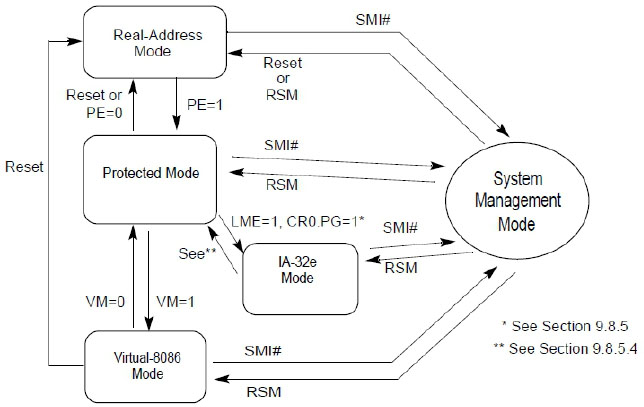
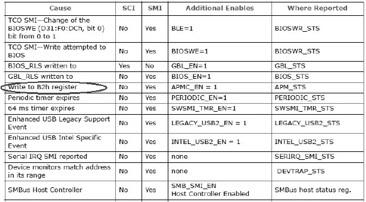

Intel明确说明进入SMM只能通过接收到SMI信号, SMI信号有两种产生途径.

1) 处理器从SMI# pin上接收到SMI信号.

2) 处理器从system bus上接收到SMI message (使用SMI delivery模式的 interrupt 消息).

SMI信号可以从硬件产生, 也可以由软件发起. 在BIOS初始化期间一般会由BIOS主动发起一个SMI#从而进入SMI处理程序做一些必要的设置.

由于SMM是一个独立的管理模式, 它可以从 real 模式、protected 模式 (包括 long 模式), 以及 V8086 模式进入. 下图摘自 Intel 手册.



在这个图中都是因为产生了 SMI# 信号而进入 SMM. 使用 rsm 指令从 SMM 退出后会返回到相应被中断的工作模式. 在 System bus 会产生一个 EXF#4 信号 (从 P6 Family 引进), 记录着处理器进入了 SMM.

# 如何产生 SMI# 信号

在芯片组的 datasheet 文档里有关于硬件产生 SMI# 信号的描述, 在 Intel 各个系列的芯片组中都有对应的 datasheet 文档, 从 5 Series (5系列) 芯片组开始, 已经不单独提供 (G)MCH (Memory Controller Hub) 芯片组 (俗称北桥芯片) 的资料 (不知是否因为集成在处理器内部的缘故), 而 PCH (Platform Controller Hub) 芯片组取代了 ICH (俗称南桥芯片) 的称呼继续提供相应的说明.

在 PCH 芯片组里提供了多种硬件产生 SMI# 的条件, 其中也有软件产生 SMI# 的方法. 特别是在 LPC bridge 里的 Power Managment 模块里提供了比较详细的关于 SMI 与 SCI 中断的条件, 下面列举了一些来自 LPC bridge 里的信息 (部分).



这里包括了硬件和软件产生 SMI 的情形, 我们注意到: 当往 B2h 端口写一个值会产生 SMI 中断, 就是由软件产生 SMI 中断, 这个方法是 Intel 官方所支持的.

> PCH datasheet 文档里所描述的信息有时确实比较难懂, 不太直观, 对这些产生的情形, 需要慢慢测试琢磨, 毕竟这属于 BIOS 开发人员所需要掌握的.

当 APMC_EN 被置位时, 写 B2h 端口 (或称寄存器) 会产生 SMI 中断, 这个 APMC_EN 位在哪里?

它就在 LPC 桥里的 Power Management I/O 寄存器组中的一个寄存器 SIM_EN 里.

> LPC 桥的 PCI 地址是 Bus 0, Device 31, Function 0.

Power Management I/O 寄存器组在 variable I/O 区域里, 即在可变的 IO 映射空间里, 这个区域的基地址在 LPC 桥里的 PMBASE 寄存器里 (地址是 40h, 32位宽). 而 B2h 寄存器是属于固定的 I/O 映射, 因此不必担心 B2h 端口会改变为其他用途.

下面是来自 `lib\pic.asm` 模块里的 `get_PMBASE()` 代码.

代码清单 9-1 (lib\pci.asm):

```assembly
; -------------------------------------------
;  get_PMBASE():得到 Power Management I/O base
;  output:
;         eax:PMBASE
; -------------------------------------------
get_PMBASE:
;  读 bus 0, device 31, function 0, offset 40h
    READ_PCI_DWORD  0, 31, 0, 40h
;  返回 PMBASE
    and eax, 0FF80h                        ;  PMBASE 地址 128 bytes 对齐 (I/O 地址)
    ret
```

READ_PCI_DWORD 被定义为一个宏 (在 inc\pci.inc 模块里), 用来读取 PCI 设备寄存器, 上面的代码中 eax 将返回一个 PMBASE 寄存器提供的 I/O 基地址.

代码清单 9-2 (topic09\ex9-1\protected.asm):

```assembly
; ;  写 SMI_EN 寄存器的 APMC_EN 位
    call get_PMBASE
    mov edx, eax
    add edx, 30h                          ;  SMI_EN 寄存器位置
    in eax, dx                                ;  读 DWORD
    bts eax, 5                                ;  APMC_EN=1
    out dx, eax                                ;  写 DWORD
```

SMI_EN 寄存器的 I/O 地址在 PMBASE 寄存器的 30h 偏移位置上, 第 5 位就是 APMC_EN 控制位.

> 请注意: 芯片组不同, 位置可能会不同, 但笔者发现 5 系列后芯片组的位置都是相同的.

实际上 APMC_EN 位是打开的, 这可能是 BIOS 设置的缘故. 作为一个演示, 这里进行了打开操作. 如果产生 SMI 不成功, 请检查这个位是否被置位. 接下来我们就可以主动触发 SMI.

代码清单 9-3 (topic09\ex9-1\protected.asm):

```assembly
mov dx, APM_CNT          ;  APM_CNT=B2h
out dx, al                ;  写 B2h 寄存器触发 SMI 中断
```

实际上这里触发了 SMI, 不过根本感觉不到效果, 因为 SMI 处理程序在默默地运行, 直到它退出来你也察觉不到 SMI 已经发生过.

