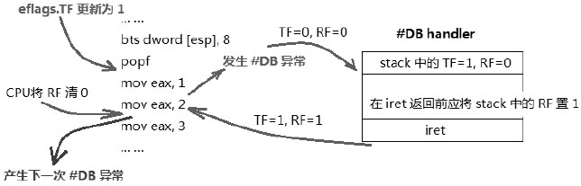

单步调试使用**Eflags 寄存器**里的**TF 标志**和**RF 标志位**, 当`Eflags.TF=1`时, 处理器进入 Single\-step 调试模式.

关于`single-step`另见`5.3`节描述.

由**Eflags.TF 标志位置位**引起的\#DB 异常属于**Trap 类型**, 当使用**POPF 指令**对 Eflags.TF 置位时, 处理器将执行完**紧接着 POPF 指令后**的**第一条指令！！！** 才响应\#DB 异常. 在进入\#DB handler 时, 处理器会**清 TF 和 RF 标志位**. 因此在\#DB **handler**内是**关闭 singlestep**调试的.

```assembly
; 开启 single debug 功能
      pushfd
      bts dword [esp], 8        ;eflags.TF=1
      popfd                     ;更新 eflags 寄存器
      mov eax, 1                ;test 1
      mov eax, 2                ;test 2
      mov eax, 3                ;test 3
      mov eax, 4                ;test 4
      mov eax, 5                ;test 5
```

在上面的代码里, 通过使用**popf 指令**对`eflags.TF`**进行置位**, 处理器在执行完`mov eax, 1`指令后进入`#DB handler`.



上面是处理器响应`Single-Step`调试的示意图, 处理器在执行指令`mov eax, 1`后产生了`#DB`异常, 在`#DB handler`处理完毕后, 返回到指令`mov eax, 2`位置上继续执行.

# 1. #DB handler 里的 Stack 映像

在进入`#DB handler`执行前, **处理器**将**Eflags 寄存器**和**下一条指令的地址**压入`#DB handler`的**stack**中, stack 中的**eflags 寄存器 TF 标志为 1**. 因此, 当从\#DB handler 里返回产生\#DB 异常的下一条指令继续执行, 后续会继续产生 single\-step 调试异常(\#DB), **除非清 TF 标志位**.

仔细观察实验 5-3 里的输出结果可以发现 single\-step 调试里的执行流程.