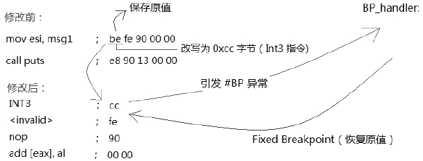

当处理器在执行过程中遇到 INT3 指令时会产生\#BP(BreakPoint, 断点)异常, 关于 BreakPoint 调试另见 10.5.4.4.9 节描述.

```assembly
; ;  断点调试的使用
      mov al, [breakpoint]                                ;  保存原字节
      mov BYTE [breakpoint], 0xcc                       ;  写入 int3 指令
breakpoint:
      mov esi, msg1                                         ;  这是断点位置, 引发 #BP 异常
      call puts
```

上面这段代码在 breakpoint 位置上通过写入 0xCC 字节来构造一个 BreakPoint 调试环境.



在被调试的软件里对一个执行点下断点, debugger(调试软件)将目标位置改写为 0CCh 字节是最简单的设置断点的方式. 如上所示, 调试软件在改写前应保留断点的原字节, 用来恢复原内容.