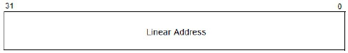
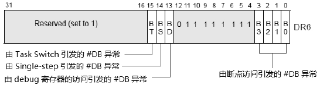
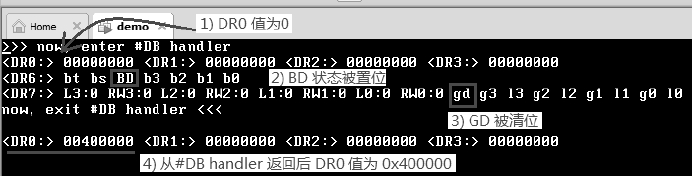
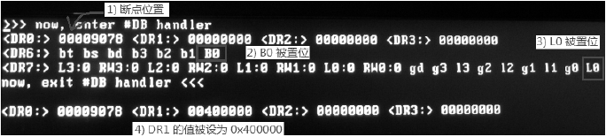
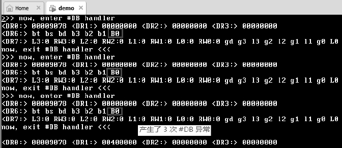
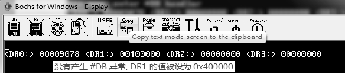

<!-- @import "[TOC]" {cmd="toc" depthFrom=1 depthTo=6 orderedList=false} -->

<!-- code_chunk_output -->

- [3.1. 处理器的支持](#31-处理器的支持)
  - [3.1.1. DR4 和 DR5 寄存器](#311-dr4-和-dr5-寄存器)
- [3.2. 断点寄存器 DR0~DR3](#32-断点寄存器-dr0dr3)
  - [3.3. 状态寄存器 DR6](#33-状态寄存器-dr6)
    - [3.3.1. B0~B3 标志位](#331-b0b3-标志位)
    - [3.3.2. BD 标志位](#332-bd-标志位)
    - [3.3.3. BS 标志位](#333-bs-标志位)
    - [3.3.4. BT 标志位](#334-bt-标志位)
    - [3.3.5. 多个 debug 条件同时触发](#335-多个-debug-条件同时触发)
    - [3.3.6. EFLAGS.RF 标志位](#336-eflagsrf-标志位)
  - [3.4. 控制寄存器 DR7](#34-控制寄存器-dr7)
    - [3.4.1. L0~L3(local breakpoint enable)控制位](#341-l0l3local-breakpoint-enable控制位)
    - [3.4.2. G0~G3(global breakpoint enable)控制位](#342-g0g3global-breakpoint-enable控制位)
    - [3.4.3. GE 与 LE 控制位](#343-ge-与-le-控制位)
    - [3.4.4. GD(general detect enable)控制位](#344-gdgeneral-detect-enable控制位)
    - [3.4.5. R/W0~R/W3(read/write)控制位](#345-rw0rw3readwrite控制位)
    - [3.4.6. LEN0~LEN3(Length)控制位](#346-len0len3length控制位)
- [4. Fault 与 Trap 类型的 debug 异常](#4-fault-与-trap-类型的-debug-异常)
- [5. General Detect 产生的#DB 异常](#5-general-detect-产生的db-异常)
- [6. 执行断点指令产生的#DB 异常](#6-执行断点指令产生的db-异常)

<!-- /code_chunk_output -->

# 3.1. 处理器的支持

处理器提供了三类 Debug Register 以支持调试功能.

1) **断点**寄存器: DR0、DR1、DR2 及 DR3.

2) **状态**寄存器: DR6.

3) **控制**寄存器: DR7.

这些 debug 寄存器的**读/写**使用**MOV 指令**进行.

```
mov DR0, 0x200000             ;  设置断点 1
```

上面这条 mov 指令将`0x200000`值写入**DR0**, 用来设置**其中一个断点地址**.

debug 寄存器属于**特权级资源**, 需要在`CPL=0`权限下进行读/写.

## 3.1.1. DR4 和 DR5 寄存器

这两个寄存器是**保留**的, 当 `CR4.DE=1` 时, 访问 DR4 和 DR5 将会产生 `#UD` 异常. 当 `CR4.DE=0` 时, 访问 DR4 和 DR5 寄存器的结果将是对 **DR6** 和 **DR7** 的访问.

# 3.2. 断点寄存器 DR0~DR3

4 个断点寄存器 DR0、DR1、DR2 及 DR3 用来设置**断点的线性地址**.



在 64 位模式下, DR0~DR3 寄存器是 64 位宽, 保存 64 位的线性地址.

## 3.3. 状态寄存器 DR6

状态寄存器有一个: DR6 寄存器.



DR6 寄存器反映**最后一次**发生\#DB 异常时的状态, 这些状态位记录着**最后一次**由**哪些条件**引发\#DB 异常.

只有当**再一次**发生\#**DB 异常**时, DR6 寄存器的状态才会更新.

### 3.3.1. B0~B3 标志位

B0~B3 标志位**被置位**时, 指示**处理器**在执行指令时遇到了 DR0~DR3 寄存器所设置的断点地址而引发\#DB 异常.

例如: 当**B0 被置位**时, 表示**DR0 寄存器**内的**断点**被触发.

### 3.3.2. BD 标志位

当`DR7.GD=1`时, 对任何一个 debug 寄存器的访问(读或写)都会引发#DB 异常. 此时`DR6.BD`将会被置位, 指示**下一条指令**是**对 debug 寄存器的访问**.

### 3.3.3. BS 标志位

当由`Eflags.TF`标志位置位而引发 Single\-Step 调试时, **DR6.BS 将被置位**, 指示发生了 single\-step 调试.

### 3.3.4. BT 标志位

在使用 TSS 进行任务切换时, 由 TSS 块内的 T 标志置位而引发 Trap 调试时, DR6.BT 将被置位, 指示在任务切换时发生了 Trap(#DB 异常).

### 3.3.5. 多个 debug 条件同时触发

在 DR6 寄存器记录的**多个 debug 条件**可能会遇到同时触发的情形, 读取 DR6 寄存器内容可以得到多个标志位被置位.

### 3.3.6. EFLAGS.RF 标志位

当遇到**Fault 类型**的 debug 异常发生时, EFLAGS 寄存器的 RF 标志位将起重要的作用. 此时需要对 RF 置位, 让发生 debug 异常的指令得到成功执行(对 Trap 类型的\#DB 异常无影响).

## 3.4. 控制寄存器 DR7

debug 异常发生的允许条件由 DR7 寄存器进行控制, 如下图所示.


除了 DR6 寄存器中记录的 BS(single\-step)和 BT(task switch, 即由**TSS 内的 T 标志**引发)debug 异常外, 其他类型的 debug 发生都可以在 DR7 里开启.

### 3.4.1. L0~L3(local breakpoint enable)控制位

对应于 DR0~DR3 这 4 个断点寄存器. 当被置位时, 允许对 DR0~DR3 中设置的断点地址访问时发生#DB 异常(包括数据断点和执行断点).

当发生 task switch 时, 处理器会对 L0~L3 控制位清位, 以防止在新任务里受原任务的影响而产生#DB 异常.

### 3.4.2. G0~G3(global breakpoint enable)控制位

意义与 L0~L3 控制位一致, 不同的是, 在发生 task switch 时, 处理器会保持原任务的 G0~G3 控制位有效, 不会进行清位处理.

处理器检测到 L0~L3 或 G0~G3 中任何一个被置位, 对应的 DR0~DR3 寄存器的断点被访问都会引发#DB 异常.

举例说, 无论是 G0=1 还是 L0=1, 在 DR0 寄存器中的断点地址被访问(在符合产生#DB 异常的条件下)都会产生#DB 异常.

### 3.4.3. GE 与 LE 控制位

这两个控制位在 P6 家族以后的处理器不支持, Intel 推荐这两个位设为 1 以兼容旧处理器.

### 3.4.4. GD(general detect enable)控制位

当 DR7.GD=1 时, 对任何一个 debug 寄存器的访问都会产生#DB 异常. 处理器在进入#DB handler 前会将 GD 清位, 这将允许在#DB handler 内访问 debug 寄存器.
GD 控制位的设立是为了给 emulator(模拟器)使用, 在 emulator 里面的 guest 系统需要设置 debug 寄存器时, emulator 可以对真实机器里的 DR7.GD 进行置位, 让 emulator 产生#DB 异常, 在#DB handler 里进行相关的处理.
DR7.GD 用于避免 emulator 里的 guest 系统影响到真实机器里的 debug 寄存器.

>按笔者的理解, 这里所说的 emulator 应该是指 VMware 这类虚拟机软件, 但应该不包括 Bochs 这类模拟器.

### 3.4.5. R/W0~R/W3(read/write)控制位

这 4 个域用来设置对 DR0~DR3 寄存器里的断点地址所进行访问的类型, 可以包括:

1) 00B: 对断点地址 fetch 指令(即执行断点里的指令).

2) 01B: 对断点地址进行 Write 操作(仅限于写).

3) 10B: 对 I/O 地址进行 Read 和 Write 操作. 此时对应的 DR0~DR3 寄存器保存的是 I/O 地址.

4) 11B: 对断点地址进行 Read 和 Write 操作.

在上面的(3)里, 需要开启 CR4.DE(Debug Extension)控制位. 当 CR4.DE=0 时, 10B 值是未定义的设置. 注意(2)与(4)的区别, 01B 仅限于写操作, 11B 可以包括读操作.

### 3.4.6. LEN0~LEN3(Length)控制位

这 4 个域用来设置 DR0~DR3 寄存器的断点地址有效范围, 如下所示.

1) 00B: byte(1 个字节).

2) 01B: word(2 个字节).

3) 10B: quad word(8 个字节).

4) 11B: double word(4 个字节).

上面的(3), 使用在 IA-32e 模式(long-mode)里, 否则是未定义的设置.

# 4. Fault 与 Trap 类型的 debug 异常

\#DB 异常可以是 Fault 或者 Trap 类型, 下面两类条件引发的#DB 异常属于 Fault 类型.

1) DR7.GE=1 时, 对 debug 寄存器的访问引发#DB 异常.

2) 对断点指令的执行引发#DB 异常.

下面条件引发的#DB 异常属于 Trap 类型.

1) Eflags.TF=1 时引发的 single-step #DB 异常.

2) 由 task switch 时 TSS 段里的 TF 置位而引发的#DB 异常.

3) 对断点地址的访问引发的#DB 异常.

4) 对 I/O 地址的访问引发的#DB 异常.

Fault 类型的 debug 异常在引发异常的指令执行之前产生, 而 Trap 类型的 debug 异常在引发异常的指令执行完后产生.

# 5. General Detect 产生的#DB 异常

由 General Detect 产生的 debug 异常很简单, 它所需要的条件如下.

1) DR7.GD=1.

2) 在后续指令流里访问任何一个 debug 寄存器.

处理器在响应 general detect 产生的#DB 异常时, 会将 DR6.BD 位置位, 记录发生了 general detect(即对 debug 寄存器的访问).

值得注意的是, 由于 general detect 条件是一次性的, 处理器在进入#DB handler 前, 会将 DR7.GD 清位, 以便在#DB handler 里访问 debug 寄存器. 因此, DR7.GD 只能使用一次. 如果需要再次启动 general detect, 那么需要重新对 DR7.GD 进行置位.

下面我们作为一个练习用实验 13-1 来测试 general detect 功能.

实验 13-1: 测试 general detect 产生的#DB 异常

由于 general detect 产生的#DB 异常属于 Fault 类型, 因此我们通过对其中一个断点寄存器进行写来观察其行为.

代码清单 13-1(topic13\ex13-1\protected.asm):

```assembly
; 1) 对 DR7.GD 置位
      mov eax, dr7
      bts eax, 13                        ;  GD=1
      mov dr7, eax
; 2) 写 debug 寄存器, 引发 #DB 异常
      mov ebx, 0x400000
      mov dr0, ebx                        ;  写 DR0 寄存器, 产生 #DB 异常
; 3) 从#DB handler 返回后, 再输出 debug 寄存器
      call println
      call dump_drs
```

上面的代码中, 在1)里对 DR7.GD 进行置位, 在2)里往 DR0 寄存器写入 0x400000 作为断点地址值, 3)中打印 DR0~DR3 寄存器的内容.

代码清单 13-2(topic13\ex13-1\protected.asm):

```assembly
; *********************************
;  #DB handler
; *********************************
debug_handler:
      jmp do_db_handler
dh_msg1        db '>>> now, enter #DB handler', 10, 0
dh_msg2        db 'now, exit #DB handler <<<', 10, 0
do_debug_handler:
      mov esi, dh_msg1
      call puts
      call dump_drs                                ;  打印 DR0~DR3
      call dump_dr6                                ;  打印 DR6
      call dump_dr7                                ;  打印 DR7
      mov esi, dh_msg2
      call puts
do_debubg_handler_done:
      bts DWORD [esp+8], 16                      ;  RF=1
      iret
```

在这个#DB handler 里只是简单地打印各个 debug 寄存器的值, 这些 dump 函数在 lib\debug.asm 文件里实现.
最后一步是将 stack 内里 EFLAGS 寄存器映像的 RF 标志位置位, 使发生#DB 异常的指令可以继续执行下去.
运行结果如下.



我们留意运行结果的输出:

1) 在进入#DB handler 时, DR0 值为 0, 这表明#DB 异常发生在指令执行之前.

2) DR6 寄存器的 BD 状态被置位, 这表明发生了由 general detect 引发的#DB 异常.

3) DR7 寄存器的 GD 被清位, 这表明在进入#DB handler 前, 处理器对它执行清位.

4) 从#DB handler 返回后, DR0 的值为 0x400000, 这表明指令顺利得到执行.

我们通过这个实验对 general detect 产生的#DB 异常情况已经有所了解. 在下面的实验里我们还会得到更多的信息.

# 6. 执行断点指令产生的#DB 异常

在 debugger(调试软件)里进行调试时, 我们可以对一个指令流设置断点, 当处理器执行到这个断点时产生#DB 异常.

除了可以使用 INT3 指令(Opcode 为 0xCC)设置断点外, 还可以使用功能更强大的断点寄存器设置断点位置.

执行一个断点指令产生#DB 异常的条件如下.

1) DR7 寄存器的 L0~L3 或者 G0~G3 位被置位.

2) DR7 寄存器的 R/W0~R/W3 域的值为 00B, 指示属于执行访问类型.

3) DR7 寄存器的 LEN0~LEN3 域的值为 00B, 指示属于 byte(1 个字节)的有效宽度.

4) 在 DR0~DR3 寄存器里设置断点地址.

对于断点的执行, 必须使用 1 个字节的访问宽度, 其他的值是不被支持的. 由执行断点指令产生的#DB 异常也属于 Fault 类型. 表明在指令执行前产生#DB 异常. 下面我们作为一个练习用实验 13-2 来测试由执行断点产生的#DB 异常.

实验 13-2: 测试执行断点指令产生的#DB 异常

作为对比, 我们使用了和实验 13-1 相同的代码结构.

代码清单 13-3(topic13\ex13-2\protected.asm):

```assembly
; 1) 对 DR7 进行设置
      mov eax, dr7
      bts eax, 0                            ;  L0=1, R/W0=0, LEN0=0
      mov dr7, eax
; 2) 设置断点位置
      mov eax, breakpoint                 ;  断点位置在后续指令流里
      mov dr0, eax                          ;  DR0 保存断点
      mov ebx, 0x400000                    ;  写入值
; 3) 断点位置
      breakpoint:
      mov dr1, ebx                           ;  断点位置的指令执行写 DR1 寄存器
; 4) 从#DB handler 返回后, 再输出 debug 寄存器
      call println
      call dump_drs
```

上面代码中1)里对 DR7 进行设置: L0=1, R/W0 及 LEN0 都保持 0 值. 这一步设置开启指令断点 enable 位. 在2)里将断点设为接下来要执行的指令, 断点位置保存在 DR0 寄存器里.
在 breakpoint 里的指令是对 DR1 寄存器进行设置, 值为 0x400000, 最后在#DB handler 返回后输出 debug 寄存器的标志位.

\#DB handler 代码和实验 13-1 是相同的.

下面是在笔者的 Core i5 处理器笔记本式计算机上的测试结果.



在这个实验里, 只有在真实机器上的结果才是正确的. 这个结果显示:

1) 断点地址位置在 0x00009078 处, 这是因为我们的 protected.asm 模块的起始地址在 0x9000 位置上.

2) DR6 寄存器的 B0 标志位被置位, 指示#DB 异常由 DR0 寄存器内的断点地址引发.

3) DR7 寄存器的 L0 位被置位, 允许使用 DR0 寄存器内的断点.

4) 最后, 在#DB handler 返回后, DR1 寄存器的值被设为 0x400000.

我们从最后的信息里得知, 由执行断点指令引发的#DB 异常在指令执行之前引发. 在#DB handler 返回后完成对指令的执行, 这个情形和 general detect 引发的#DB 异常一样.

实验 13-2 在 VMware 上运行产生了意想不到的结果(不正确的).



我们看到, 在 VMware 中却产生了 3 次#DB 异常. 这个结果是由下面这条指令产生的.

```assembly
breakpoint:       mov dr1, ebx                           ;  断点位置的指令执行写 DR1 寄存器
```

这着实让人摸不着头脑, 笔者无法知道这个结果产生的原因.

然而在 Bochs 上运行, 结果更加让人啼笑皆非, 下面是 Bochs 上的运行结果(不正确).



完全相同的代码在 Bochs 上运行居然没有产生#DB 异常, 执行断点的指令顺利通过, DR1 的值被设为 0x400000. 这是 Bochs 上的一个重大错误(或者说未实现功能)！

在下面的另一个测试中, 我们又发现了 Bochs 和 VMware 上的结果与真实机器不同.

同时设置 Single-step 与 General detect 条件

在这个实验里, 我们同时设置 single-step 和 general detect 的产生条件.

实验 13-3: 测试 single-step 与 general detect 条件

在代码里我们使用 popfd 指令对 Eflags.TF 进行置位, 并且对 DR7.GD 置位, 实验代码在 topic13\ex13-3\目录下. 在这个实验测试里, 我们看看下面两个情形.

1) general detect 和 single-step 的触发条件先后发生.

代码清单 13-4(topic13\ex13-3\protected.asm):

