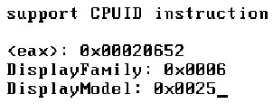

在 Intel 的手册里经常会遇到对各个微架构处理器进行区分对待的情况, 它使用 DisplayFamily 和 DisplayModel 的组合来区分处理器.

可以使用 4.4 节所介绍的方法来确定您的处理器的 DisplayFamily 和 DisplayModel 值, 下面是笔者的处理器的 DisplayFamily\_DisplayModel 值.

那么它们的组合就是 06_25H, 因此笔者的处理器属于 Westmere 微架构(继承于 Nehalem 微架构), 具体是属于代号为 Arrandale 架构的移动 Core i5 处理器.

因此, 在后续的探讨中笔者将注意力放在 Westmere 微架构中(同于 Nehalem 微架构).

Westmere 微架构的下一代微架构就是大名鼎鼎的 Sandy Bridge 微架构, 因此关于 Westmere 的 last branch 相关描述基本上是适用于 Sandy Bridge 处理器的(新一代的 Ivy Bridge 应该也适合).

之所以基于真实机器的 Westmere 微架构进行探讨, 是因为在 VMware 和 Bochs 上根本无法测试处理器的 last branch 机制.