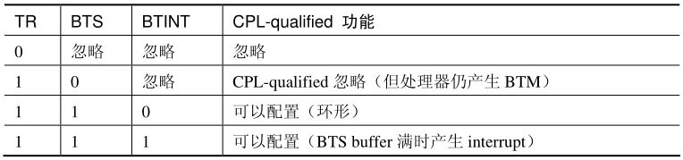

<!-- @import "[TOC]" {cmd="toc" depthFrom=1 depthTo=6 orderedList=false} -->

<!-- code_chunk_output -->

- [1. IA32_DEBUGCTL 控制寄存器(Branch 记录功能)](#1-ia32_debugctl-控制寄存器branch-记录功能)
  - [1.1. LBR(Last Branch Record)位](#11-lbrlast-branch-record位)
  - [1.2. BTF(single\-step on branch)位](#12-btfsingle-step-on-branch位)
  - [1.3. TR(trace record message)位](#13-trtrace-record-message位)
  - [1.4. BTS(branch trace store)位](#14-btsbranch-trace-store位)
  - [1.5. BTINT(branch trace interrupt)位](#15-btintbranch-trace-interrupt位)
- [2. 配置 Branch trace record 的存放](#2-配置-branch-trace-record-的存放)
- [3. CPL\-qualified branch record(受 CPL 限制的 BTS)](#3-cpl-qualified-branch-record受-cpl-限制的-bts)
  - [3.1. 查询是否支持 CPL-qualified 功能](#31-查询是否支持-cpl-qualified-功能)
  - [3.2. 配置 CPL-qualified 功能](#32-配置-cpl-qualified-功能)
- [4. 冻结监控](#4-冻结监控)
  - [4.1. 冻结 LBR 监控](#41-冻结-lbr-监控)
  - [4.2. 冻结 Performance monitoring counter 监控](#42-冻结-performance-monitoring-counter-监控)
  - [4.3. 在 SMM 里冻结所有监控](#43-在-smm-里冻结所有监控)
  - [4.4. 测试是否支持 FREEZE_WHILE_SMM_EN 位](#44-测试是否支持-freeze_while_smm_en-位)
  - [4.5. Core 外的 PMI 请求](#45-core-外的-pmi-请求)
  - [4.6. PMI 中断](#46-pmi-中断)

<!-- /code_chunk_output -->

# 1. IA32_DEBUGCTL 控制寄存器(Branch 记录功能)

处理器的**Branch 记录功能开启**由一个**总的寄存器 IA32\_DEBUGCTL**进行控制.

IA32\_DEBUGCTL 是**架构化(architectural)的 MSR 寄存器**, 所有支持 last branch record 功能的微架构的处理器中, IA32\_DEBUGCTL 寄存器的**地址都是统一的(！！！**), 在**1D9H 地址**上.


上面这是在 Nehalem 微架构上的 IA32\_DEBUGCTL 寄存器, 这个寄存器结构也同样适合在 Westmere 和 Sandy Bridge 微架构的处理器上.

## 1.1. LBR(Last Branch Record)位

这个位用来**开启 LBR stack**的使用. 当**LBR=1**时, 处理器将在**LBR stack 中**记录处理器的**branch/interrupt/exception**的记录(**from 和 to 地址**). 当 LBR=0 时, 处理器将不会在 LBR stack 中记录.

值得注意的是, 当**发生 debug 异常**(\#**DB 异常！！！**)时, 处理器会**对 LBR 位进行清位**. 这意味着, **不能捕捉到\#DB 异常的 trace！！！**, 在\#**DB handler 退出**时也**不会恢复 LBR 的值**, 需要**软件置位来重新开启 LBR 记录功能(！！！**).

## 1.2. BTF(single\-step on branch)位

这个控制位的开启可以使**每个 single\-step(单步调试**)基于**每次的 branch(分支**), 而**不是基于每条指令**.

- 当**BTF=1**并且**Eflags.TF=1**, 那么处理器将在**每次 branch/interrupt/exception 发生时**才**产生 single\-step 调试**.

- 当**BTF=0**并且**Eflags.TF=1**时, 处理器在**每条指令执行后**产生**single\-step 调试**.

值得注意的是, 处理器**进入\#DB handler 时**也会**对 BTF 进行清位**, 这同样意味着**基于 branch 的单步调试将被关闭**. \#DB handler 退出**不会恢复 BTF 位**的值.

如果**call/jmp 指令**引发**task switch(任务切换**), 处理器将**不会发生 single\-step 调试异常(BTF 被忽略**). **debugger 软件**应该使用**TSS 的 T 标志**位来**产生 task switch 时**的\#**DB 异常**.

## 1.3. TR(trace record message)位

设置 TR 位可以**开启 BTM(Branch Trace Message)的产生**. 当 TR=1 时, 每次发生**branch**、**interrupt**及**exception**时, 处理器将**产生 BTM 记录**送往**system bus**或记录在**BTS 区域(依赖于是否开启 BTS 控制位**), 否则将**不会产生 BTM 记录**.

值得注意的是, 当**进入\#DB handler**时, 处理器**会维持 TR 的值**, 也就是**BTM 的产生依然是有效(！！！**)的. 即使**LBR 位被清**, **TR=1**时, 处理器**依旧会更新 LBR stack**(这点产生了疑惑).

## 1.4. BTS(branch trace store)位

设置**BTS 位**可以让处理器使用**BTS buffer 存储区域**来**记录分支**, 不过还需要**依赖于 TR 控制位**.

当**BTS=1**并且**TR=1**时, 处理器每次检测到发生**branch**、**interrupt**及**exception**时**产生 BTM 记录**, 并将 BTM 存储在**内存 DS(Debug Store)区域**内的**BTS buffer**里.

## 1.5. BTINT(branch trace interrupt)位

当**BTINT=1**时, 允许处理器在检测到**BTS buffer 满**时产生一个**DS interrupt(！！！**), 这个 DS interrupt 将使用由**Local APIC 的 LVT Performance 寄存器**中设置的**PMI(Performance Monitoring Interrupt)中断 handler(！！！**)处理.

当**BTINT=0**时, BTS buffer 将以一个**环形回路**的形式存在. 当 BTS buffer 满时自动**回绕到 BTS buffer 的 base(buffer 头部**)继续记录.

# 2. 配置 Branch trace record 的存放

前面提及 Branch trace record 可以存放在**三个地方**: **LBR stack**, **system bus**, 以及**BTS buffer 区域**, 到底存放在哪里由上面所说的 IA32\_DEBUGCTL 寄存器的**LBR**、**TR**、**BTS**, 以及**BTINT 位**来决定, 如下表所示.


我们看到三个地方的配置如下.

1) **仅 LBR=1**时, branch trace record 将在**LBR stack**中记录.

2) **仅 TR=1**时, BTM 将发送到**system bus**上.

3) **TR=1**并且**BTS=1**时, BTM 将记录在**内存 DS(Debug Store**)区域内的**BTS buffer**里.

在 NetBurst、Atom 家族, 以及 Nehalem(包括**后续的**)微架构上支持 BTM**同时记录在 LBR stack 和 System bus/BTS buffer 上(！！！**), 而 Core 微架构及 Pentium M 前的处理器将不支持同时设置 TR 和 LBR 位(当同时设置时 LBR stack 的内容未定义).

当**TR=0**时, **BTS 位和 BTINT 位**是**被忽略**的.

关于 LBR stack、DS(Debug Store), 以及 BTS buffer 将在后续的章节进行探讨.

# 3. CPL\-qualified branch record(受 CPL 限制的 BTS)

处理器允许根据**CPL(当前运行的权限级别**)的**不同**来**记录 BTM 信息**. 根据**IA32\_DEBUGCTL 寄存器的配置**, 当处理器运行在 OS kernel 级别或 User 级别时有**选择性地进行记录**.

## 3.1. 查询是否支持 CPL-qualified 功能

CPL\-qualified 功能需要处理器的支持, 使用**CPUID 指令**查询 CPUID.01H: ECX[4].DSCPL 位置位时, 处理器将支持该功能.

## 3.2. 配置 CPL-qualified 功能

这个功能需要使用**IA32\_DEBUGCTL 寄存器**的**BTS\_OFF\_OS**和**BTS\_OFF\_USR 位**, 如下表所示.


当 BTS\_OFF\_OS=1 时, 关闭记录 kernel(CPL=0)里的 BTM 记录. 当 BTS\_OFF\_USR=1 时, 关闭记录 User(CPL>0)里的 BTM 记录.

当两个位同时置位时, 这是一个极端的情况, 则会**关闭所有的 BTM 记录**. 虽然**BTM 不会在 BTS buffer**里记录, 但处理器**依然产生 BTM**(Branch Trace Message).

我们看到, CPL\-qualified 功能可以减少部分监控 branch 时系统的开销.

注意, CPL\-qualified 功能**仅使用在 BTS buffer(！！！**)上.

当 TR=1 且 BTS=1 时, 可以对 BTS buffer 的 BTM 进行配置, 如下表所示.



我们看到, CPL\-qualified**不能**使用在**LBR stack**和送往**System bus**的情形上.

# 4. 冻结监控

在 IA32\_DEBUGCTL 寄存器中有**三个位**可以设置**当发生某些中断时停止监控(！！！**), 这三个位如下.

1) FREEZE\_LBRS\_ON\_PMI(bit 11): 在**PMI**里**关闭 LBR stack 的记录功能**.

2) FREEZE\_PERFMON\_ON\_PMI(bit 12): 在**PMI**里**关闭所有 counter(计数器**).

3) FREEZE\_WHILE\_SMM\_EN(bit 14): 在**SMM**里**关闭所有 counter**及**分支记录功能**.

这些**监控事项**包括:

1) **LBR stack**记录的**branch trace record**.

2) **System bus**和**BTS buffer**中的**BTM**.

3) **performance monitoring counter(性能监控事件的计数器**).

上述的 IA32\_DEBUGCTL 寄存器的 3 个控制位可以冻结这些事项中的部分或全部.

## 4.1. 冻结 LBR 监控

对**FREEZE\_LBRS\_ON\_PMI 置位**时, 当处理器发生**PMI 中断(Performance Monitoring Interrupt！！！**)时, 将**清 IA32\_DEBUGCTL 寄存器的 LBR 位**. 因此**进入 PMI 中断 handler 时**, 处理器将**不能记录 LBR stack**, 当从 PMI handler**退出后**, 如果**软件需要重新对 LBR 进行监控(！！！**), 必须**对 LBR 位进行置位**重新开启 LBR stack 的记录.

## 4.2. 冻结 Performance monitoring counter 监控

对 FREEZE\_PERFMON\_ON\_PMI 置位时, 当处理器发生**PMI 中断时(！！！**), 将**清**IA32\_PERF\_GLOBAL\_CTRL 寄存器的所有 enable 位, 包括: **IA32\_PMC(通用计数器**)的 enable 位和**IA32\_FIXED\_CTR(固定用途计数器**)的 enable 位.

IA32\_PMC 寄存器与 IA32\_FIXED_CTR 寄存器的数量依赖于微架构的实现. 我们将在第 15 章里进行探讨.

因此, FREEZE\_PERFMON\_ON\_PMI 置位会**对所有的 counter(计数器)停止计数**, 软件必须重新设置 IA32\_PERF\_GLOBAL\_CTRL 寄存器的 enable 位来**重启事件监控**.

## 4.3. 在 SMM 里冻结所有监控

对**FREEZE\_WHILE\_SMM\_EN 进行置位**时, 当发生**SMI 请求**进入**SMM 模式**, 处理器将清所有的 IA32\_PERF\_GLOBAL\_CTRL 寄存器 enable 位, 停止所有的 performance monitoring 事件监控, 并且清 IA32\_DEBUGCTL 寄存器的 LBR、BTF、TR 及 BTS 位, 停止所有的 branch trace 监控.

在退出 SMM 模式后, 处理器将恢复 IA32\_DEBUGCTL 寄存器原有的设置, IA32\_PERF\_GLOBAL\_CTRL 寄存器的 enable 位被置 1, 重启所有的监控. 因此, 我们看到, 处理器保证在 SMI handler 执行期间(在将要进入 SMI handler 和退出 SMI handler 之前)不会监控所有这些事项.

## 4.4. 测试是否支持 FREEZE_WHILE_SMM_EN 位

在对 FREEZE\_WHILE\_SMM\_EN 置位前, 需要在 IA32\_PREF\_CAPABILITIES 寄存器里查询 bit 12 是否为 1 来确认支持使用 FREEZE\_WHILE\_SMM\_EN 位.

而 IA32\_PREF\_CAPABILITIES 寄存器需要查询 CPUID.01H: ECX[15].PDCM 位来获得支持. 下面是一个设置 FREEZE\_WHILE\_SMM\_EN 位的示例.

```assembly
      mov eax, 01
      cpuid
      ; 测试 PDCM 位, 是否支持 IA32_PREF_CAPABILITIES 寄存器
      bt ecx, 15
      ; 不支持
      jnc no_support
      ; MSR 寄存器地址 345H
      mov ecx, IA32_PREF_CAPABILITIES
      ; 读 IA32_PREF_CAPABILITIES
      rdmsr
      ; 测试 FREEZE_WHILE_SMM 位
      bt eax, 12
      ; 不支持
      jnc no_support
      ; MSR 寄存器地址 1D9H
      mov ecx, IA32_DEBUGCTL
      rdmsr
      ; FREEZE_WHILE_SMM_EN=1
      bts eax, 14
      ; 设置 IA32_DEBUGCTL 寄存器
      wrmsr
      jmp next
no_support:
... ...
```

这段代码只是展现了对 FREEZE\_WHILE\_SMM\_EN 置位所需的流程, IA32\_PREF\_CAPABILITIES 寄存器的支持度查询可能在其他地方已经测试过.

## 4.5. Core 外的 PMI 请求

在 Nehalem 微架构及后续的微架构上, **IA32\_DEBUGCTL 寄存器**加入了一个**UNCORE\_PMI\_EN 位**, 当 UNCORE\_PMI\_EN=1 时, 允许处理器**接受 uncore(core 外部**)的**PMI 中断**请求.

## 4.6. PMI 中断

**PMI(Performance Monitoring Interrrupt)中断**是**监控某个事件**, 当**事件的 counter(计数器**)产生 **overflow(溢出**)时而**引发的中断**. 它需要在**Local APIC 的 LVT 寄存器表**中的**LVT preformance monitor 寄存器**里提供**vector、delivery 模式等相关设置**. 因此, 使用 PMI 中断(或说 preformance monitoring 机制)**必须开启 APIC**的使用. 实际上**DS(Debug Store)interrupt**和**PMI 中断**使用**同一个 vector 和 ISR(Interrupt Service Routine！！！**), 我们将在后续的章节里探讨.