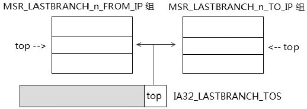
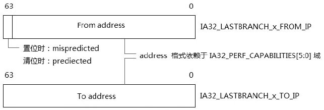
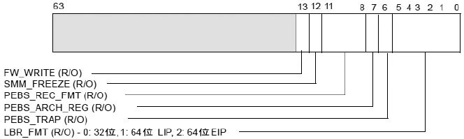
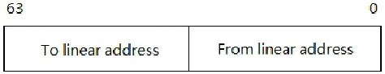
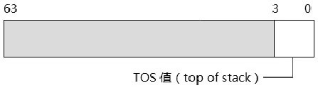

<!-- @import "[TOC]" {cmd="toc" depthFrom=1 depthTo=6 orderedList=false} -->

<!-- code_chunk_output -->

- [1. LBR stack 机制](#1-lbr-stack-机制)
- [2. FROM_IP 与 TO_IP 寄存器](#2-from_ip-与-to_ip-寄存器)
  - [2.1. From/To 寄存器中 address 的格式](#21-fromto-寄存器中-address-的格式)
  - [2.2. 在 IA32 处理器下的 MSR_LASTBRANCH 寄存器](#22-在-ia32-处理器下的-msr_lastbranch-寄存器)
- [3. IA32_LASTBRANCH_TOS 寄存器](#3-ia32_lastbranch_tos-寄存器)
- [4. LBR stack 的使用](#4-lbr-stack-的使用)
  - [4.1. Top 指针的回绕](#41-top-指针的回绕)

<!-- /code_chunk_output -->

# 1. LBR stack 机制

当 `IA32_DEBUGCTL` 寄存器的**LBR 位置位**时, 使用**LBR stack**记录**branch trace**, LBR stack 是使用**数对 from/to MSR 寄存器来构造的**.

from/to 寄存器的数量由处理器的微架构来决定. 使用 14.1 节所说的方法检测处理器的 DisplayFamily\_DisplayModel 后, 在**相应的 MSR 表**里查出处理器**相应的 from/to 寄存器对数量**.

如上所示, **LBR stack**由**MSR\_LASTBANCH\_n\_FROM\_IP**和**MSR\_LASTBANCH\_n\_TO\_IP**组成, 其结构**与内存的 stack 结构相似**, 也有相应的**Top 指针**来确定**LBR stack 栈顶(！！！**)位置.

# 2. FROM_IP 与 TO_IP 寄存器

MSR\_LASTBRANCH\_n\_FROM\_IP 和 MSR\_LASTBRANCH\_n\_TO\_IP 是**MSR 寄存器**, 它们的地址和数量因处理器微架构的不同而不同, 在 Nehalem 微架构下的结构如下所示.

其中 IA32\_LASTBRANCH\_x\_FROM/TO\_IP 中的**x 是指寄存器的编号**, 在 Nehalem 微架构及后续的 Westmere 和 SandyBridge 上共有**16 对 FROM/TO 寄存器**, 分别如下.

1) IA32\_LASTBRANCH\_0\_FROM\_IP 到 IA32\_LASTBRANCH\_15\_FROM_IP.

2) IA32\_LASTBRANCH\_0\_TO\_IP 到 IA32\_LASTBRANCH\_15\_TO\_IP.

它们的地址分别如下(Nehalem 微架构下).

1) `x_FROM_IP`寄存器地址: **从 680H 到 68FH**.

2) `x_TO_IP`寄存器地址: **从 6C0H 到 6CFH**.

每个微架构下的处理器**MSR 地址可能会不同**(**这些寄存器**可以说是**nonarchitectural**).

从 Nehalem 微架构开始**IA32\_LASTBRANCH\_x\_FROM\_IP 寄存器**的**Bit 63 位是 MISPRED 位(！！！只有 FROM 寄存器！！！**), 在 Intel64 手册里, 这个位名叫**MISPRED 位**. 可是当 Bit 63**置位**时, **指示 branch 是 mis\-predicted(非预测的**), 清位时是**predicted(预测的**).

值得注意的是, 这些**MSR 寄存器**是**Read\-Only(只读的！！！**), 不能对它进行写.

在 IA\-32e 模式下可以使用 64 位的地址, 可是这个 64 位地址有几种格式依赖于 IA32\_PERF\_CAPBILITIES 寄存器.

## 2.1. From/To 寄存器中 address 的格式

在**Intel64**处理器下**From/To 寄存器**中存放的**address 可以有不同的格式**, 依赖于`IA32_PERF_CAPABILITIES`寄存器的`[5:0]`域的值, 分别如下.

1) 000000B 时: 存放**32 位**的格式.

2) 000001B 时: 存放**64 位的 linear address**格式.

3) 000010B 时: 存放**64 位的 EIP 值**(注意: 与上面的 000001B 格式是不同的).

4) 000011B 时: 存放**64 位的 EIP**值, 并且存放额外的 Flag 值(即 MISPRED 位).

下面是**IA32\_PERF\_CAPABILITIES 寄存器的结构**.

注意, **这个 MSR 寄存器是只读**的, 因为只能从它读出值, 在它的[5: 0]就是 LBR format 域, 它的值就是上面所述的 4 个值(在图中只注明了 3 个值, 不包括 3 值)

因此, 要确定**From/To 寄存器**里存放的**地址是什么格式**, 需要从**IA32\_PERF\_CAPABILITIES 寄存器**读出**LBR format 域**来判断.

我们关注到在**64 位**下有**3 种不同的 64 位地址**格式.

1) **64 位 linear address 格式**: 那么 From/To 寄存器将存放经过 segmentation(段式管理)转换过来的**linear address 值**.

2) **64 位的 RIP 值**: 那么 From/To 寄存器将存放 RIP 寄存器的值, 这个值是**未经过转换的 effective address 值(即逻辑地址**), 也就是在程序代码中所直接看到的 RIP 值.

3) **64 位的 RIP 值**加上**额外的 MISPRED 标志位**. 在 From 寄存器的 bit 63 位就是 MISPRED 标志位.

在**Intel64**和 AMD64 体系的 64 位模式下都使用**平坦的内存模式**, **CS 段**的**base**都**强制为 0 值**. 因此, 实际上在**64 位模式下**, **64 位的 RIP 值**与**64 位的 linear address 的存放格式是一样**的.

可是, 当处理器运行在**IA\-32e 模式**的**compatibility 模式**下, 这个 64 位的 RIP 与 64 位的 linear address 格式就**可能不同**了(在**大多数 OS**下使用**平坦的内存模式**, **各个段的 base 值使用 0 值**, 因此**大多数情况下还是相同的！！！**).

在**compatibility 模式**下, 64 位的地址值只有**低 32 位是有效**的. 高 32 位值将被清 0.

## 2.2. 在 IA32 处理器下的 MSR_LASTBRANCH 寄存器

在 32 位体系(不支持 Intel64 体系)的处理器下, LBR stack 使用共 4 个 MSR\_LASTBRANCH\_x 寄存器来组成, 从 MSR\_LASTBRANCH\_0 到 MSR\_LASTBRANCH\_3, 其结构如下.

在 32 位处理器下将 64 位的 MSR 寄存器分为两个 32 位的 from/to 寄存器使用, 低 32 位是 FROM\_IP 寄存器, 高 32 位是 TO\_IP 寄存器. 这些地址是 32 位的 linear address 形式.

在早期的 NetBurst 微架构的 Pentium4 处理器是属于 32 位的处理器, 不支持 Intel64 体系(即不支持 IA-32e 模式).

# 3. IA32_LASTBRANCH_TOS 寄存器

**LBR stack**中的**Top 指针**由**IA32\_LASTBRANCH\_TOS 寄存器**来担任, 如下所示.

IA32\_LASTBRANCH\_TOS 寄存器的**低 4 位[3: 0**]是**LBR stack 的 top 指针值(！！！**), 它指向共**16 个 LBR stack entry 值**, TOP 指针指向**最后一条捕获的分支记录(！！！**).

IA32\_LASTBRANCH\_TOS 将**同时指出 From\_IP 和 To\_IP 寄存器的位置**, 因此当前的 From\_IP 和 To\_IP 寄存器位置是相同的. IA32\_LASTBRANCH\_TOS 寄存器的地址在 1C9H, 属于 architectural 化的寄存器, 在各个微架构中地址都是统一的.

# 4. LBR stack 的使用

LBR stack 的使用几乎与内存 stack 是一样的, **最大的不同**如下.

1) **LBR stack 的 top 指针**是**加 1**指向**下一个 stack 元素**(似乎可以说是向上增长).

2) **内存 stack**的**ESP/RSP 指针是减 4/8**, 指向**下一个 stack 元素**, 它是向下增长的.

## 4.1. Top 指针的回绕

在 LBR stack 中, 目前实现仅仅**只有 16 个 stack entry(！！！**). 因此, 这个 LBR stack 很快就会**写满**了. 当 LBR stack 写满时**IA32\_LASTBRANCH\_TOS 的值会重新回到 0 值**, 重新指向开头的 IA32\_LASTBRANCH\_0\_FROM\_IP 和 IA32\_LASTBRANCH\_0\_TO\_IP 寄存器.

在后面我们将会看到, **BTS buffer 写满**时可以产生一个**DS Interrupt**来做相应的处理.