<!-- @import "[TOC]" {cmd="toc" depthFrom=1 depthTo=6 orderedList=false} -->

<!-- code_chunk_output -->

- [1. 基本原理](#1-基本原理)
  - [1.1. LBR stack 中的 TOP 指针工作方式](#11-lbr-stack-中的-top-指针工作方式)
- [2. LBR 的过滤功能](#2-lbr-的过滤功能)
  - [2.1. MSR_LBR_SELECT 寄存器](#21-msr_lbr_select-寄存器)
  - [2.2. 过滤 CPL=0 时的 branch](#22-过滤-cpl0-时的-branch)
  - [2.3. 过滤 CPL!=0 时的 branch](#23-过滤-cpl0-时的-branch)
  - [2.4. 过滤 JCC 的 branch](#24-过滤-jcc-的-branch)
  - [2.5. 过滤 near relative call(相对调用)的 branch](#25-过滤-near-relative-call相对调用的-branch)
  - [2.6. 过滤 near indirect call(间接调用)的 branch](#26-过滤-near-indirect-call间接调用的-branch)
  - [2.7. 过滤 near ret(near 返回)的 branch](#27-过滤-near-retnear-返回的-branch)
  - [2.8. 过滤 near indirect jmp(间接跳转)的 branch](#28-过滤-near-indirect-jmp间接跳转的-branch)
  - [2.9. 过滤 near relative jmp(相对跳转)的 branch](#29-过滤-near-relative-jmp相对跳转的-branch)
  - [2.10. 过滤 far branch](#210-过滤-far-branch)
  - [2.11. 使用 LBR 过滤功能](#211-使用-lbr-过滤功能)
- [3. 实验](#3-实验)
  - [3.1. 测试一](#31-测试一)
  - [3.2. 测试二](#32-测试二)

<!-- /code_chunk_output -->

# 1. 基本原理

现在, 我们可以使用**LBR stack**来监控**所有最近的 branch、interrupt, 以及 exception**, 除了前面所述的几种情形.

1) 发生`#DB 异常`时**不能被捕捉到 branch trace**, LBR 将**被冻结**.

2) 当 FREEZE\_LBRS\_ON\_PMI 被置位, 发生的**PMI 中断**时, LBR 将**被冻结**.

3) 当 FREEZE\_WHILE\_SMM\_EN 被置位, 进入**SMM 模式**, LBR**将被冻结**.

除了退出 SMM 模式处理器会自动恢复 LBR 外, 其他情形需要软件重新开启 LBR 位.

>实验 14-1: 使用 LBR 捕捉 branch trace 记录

下面我们将通过一个练习实验来使用 LBR, 实验的代码在 topic14\ex14-1\目录下.

代码清单 14-1(topic14\ex14-1\protected.asm):

```assembly
;  1) 开启 LBR
      mov ecx, IA32_DEBUGCTL
      rdmsr
      bts eax, LBR_BIT                        ;  LBR=1
      wrmsr
;  2) 调用一个函数, 产生 branch trace record
      call func
;  3) 清 LBR
      mov ecx, IA32_DEBUGCTL
      rdmsr
      btr eax, LBR_BIT                        ;  LBR=0
      wrmsr
;  4) 打印 LBR stack 信息
      call dump_lbr_stack
      call println
```

上面代码中, 1) 中开启**IA32\_DEBUGCTL 寄存器**的**LBR 位**.

2) 里调用一个**测试函数**来**产生 branch trace 记录**.

3) 里我们需要**关闭 LBR 位**, 目的是执行下面的打印函数, 否则处理器会继续产生 branch trace 记录.

在4) 里调用 dump\_lbr\_stack()函数来**打印 LBR stack 的信息**.

代码清单 14-2(topic14\ex14-1\protected.asm):

```assembly
; ;  测试函数
func:
      mov edx, puts
      mov ebx, dump_pae_page
      mov esi, msg2
      call edx
      mov esi, 0x400000                ;  dump virtual address 0x400000
      call ebx
      ret
func_end:
```

上面代码是调用测试函数 func(), 用来打印出**0x400000 地址**的**各级 table entry**信息.

这个**dump\_lbr\_stack**()实现在 lib\debug.asm 模块里, 函数较长, 这里不再列出. 使用的**原理如下**.

1) **枚举 16 个 from/to 寄存器**.

2) 读取**IA32\_LASTBRANCH\_TOS 寄存器**, 确定**当前的 top 指针**.

3) 输出**from/to 寄存器值**和**top 信息**.

这个实验只能在真实的机器上运行, 因为**Bochs 和 VMware 将不支持(！！！**).

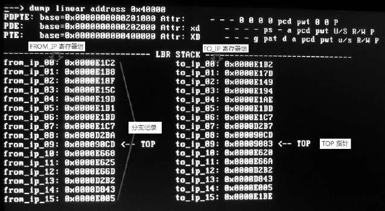

这是在 Westmere 微架构的 Core i5 处理器上的运行结果. 上面的 dump 0x400000 地址信息是调用测试函数 func()的输出结果.

我们可以看到:

1) 结果分别列出了**16 个 from\_ip**和**to\_ip 寄存器**的**地址值**.

2) **LBR stack 已经装满**了, top 指针正指向**第 9 号 FROM\_IP/TO\_IP 寄存器**, 这是**最后一条捕获的 branch record**.

3) 最后一条分记录的**from\_ip 地址是 0x000090CD**, to\_ip 地址是**0x00009083**.

由于**LBR stack 实在太小**了, 一个函数里又调用了其他的函数, 因此已经让它满了十数次(或许数十次甚至更多).

我们来看看**当前的 from\_ip**和**to\_ip 地址**是什么指令(借助于 Bochs 的调试功能).

```
(0) Breakpoint 1, 0x00000000000090cd in ?? ()
Next at t=156762556
(0) [0x00000000000090cd] 0018: 00000000000090cd (unk. ctxt): ret                 ;  c3
<Bochs: 3> s
Next at t=156762557
(0) [0x0000000000009083] 0018: 0000000000009083 (unk. ctxt): mov ecx,
0x000001d9       ;  b9d9010000
<Bochs: 4>
```

我们将执行**断在 0x000090CD 地址**上, 这个地址是一条**ret 指令(！！！**), 它**返回到 0x00009083 地址**上, 正好是我们上面实验结果输出的**当前 top 指向**.

很显然, 这是 func()执行完毕后**返回到调用者**, 这是**最后一次的 branch trace 记录**, 0x00009083 处的指令将用来**清 LBR 位(IA32\_DEBUGCTL 寄存器地址是 1d9H**), 我们可以对比一下上面的代码清单 14\-1 和 14\-2 结果看看是否符合.

实验 14-2: 观察 LBR stack

如果说上面的实验还**不够直观显示 LBR stack 动态效果(因为满了**), 下面我们做一个更直观些的实验, 产生**数条 branch trace 记录**但**不让 LBR stack 装满**.

代码清单 14-3(topic14\ex14-2\protected.asm):

```assembly
;  实验 14-2: 观察 LBR stack
      mov esi, msg2
      call puts
;  1) 开启 LBR
      mov ecx, IA32_DEBUGCTL
      rdmsr
      bts eax, LBR_BIT   ;  置 LBR 位
      wrmsr
;  2) 测试分支
jmp l1
l1:   jmp l2
l2:   jmp l3
l3:   jmp l4
l4:   jmp l5
l5:   jmp l6
l6:   jmp l7
l7:   jmp l8
l8:   jmp l9
l9:   jmp l10
l10:
;  3) 清 LBR
      mov ecx, IA32_DEBUGCTL
      rdmsr
      btr eax, LBR_BIT   ;  清 LBR 位
      wrmsr
;  4) 输出 LBR stack 信息
      call dump_lbr_stack
      call println
```

这一次实验的2)里直接使用**10 条 jmp 指令**产生**10 条分支记录**, 这样可以不让 LBR stack 装满, 我们可以直观地查看 LBR stack 的情况.
下面是在 Westmere 架构的 Core i5 处理器上的运行结果.

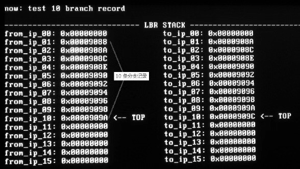

由于使用连续的 jmp 指令产生分支, 我们看到在这些分支记录中, **前一条记录的 to\_ip 值**是**后一条记录的 from\_ip**值. **当前 TOP 指针**指向**第 10 号的 FROM\_IP/TO\_IP 寄存器**.

## 1.1. LBR stack 中的 TOP 指针工作方式

我们看到**当前的 top 指针值是 10**, 而**0 是空**的, 这个结果就很能说明问题: **LBR stack**和**内存栈**的**工作原理一样**(先 push 指向下一条记录位置, 再记录), 所**不同的是生长方向**. 在**内存 stack**中, 当**push**时, 先将**esp 减 4 再压入值**. 而 LBR stack 在记录时, 先将**top 加 1**再**写入 From\_IP 和 To_IP 寄存器(！！！**).

# 2. LBR 的过滤功能

**CPL\-qualified BTS 功能**只能用于**BTS**上, 于是从 Nehalem 微架构开始(及后续的 Westmere 和 SandyBirdge)**增强了 LBR**功能, 允许处理器**对 LBR 进行过滤**, 屏蔽一些 branch trace 不进行记录, 包括**CPL 限制功能**.

## 2.1. MSR_LBR_SELECT 寄存器

在**增强的 LBR 功能**里, 处理器可以通过设置一些**过滤条件**来对**某些 branch trace 进行屏蔽**, 这些过滤条件由一个**MSR\_LBR\_SELECT 寄存器**来实现, 这个寄存器的地址在**1C8H**.

它的结构如下所示.

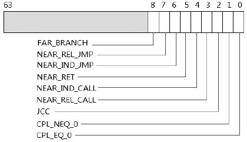

MSR\_LBR\_SELECT 是一个**mask 寄存器**, 也就是说当**相应的位置位**时, **对应的分支情况将被过滤**. 因此, 有**两种极端**的情形.

1) 当**所有位清 0**时将捕捉**所有的 branch**情况.

2) 当**所有位置位**时将过滤**寄存器列举**的所有 branch 情况.

处理器在**power\-up**或**reset**时会**清 MSR\_LBR\_SELECT 所有位**, 将允许捕捉**所有的 branch**.

MSR\_LBR\_SELECT 允许**对 9 种 branch**进行过滤.

## 2.2. 过滤 CPL=0 时的 branch

当 CPL\_EQ\_0=1 时, 处理器运行在 CPL=0 级别时将过滤所有 branch.

## 2.3. 过滤 CPL!=0 时的 branch

当 CPL\_NEQ\_0=1 时, 处理器运行在 CPL！=0 时(即 1、2 及 3 级)将过滤所有 branch.

## 2.4. 过滤 JCC 的 branch

当 JCC=1 时, 处理器将**过滤所有 Jcc 指令的 branch**, Jcc 指令中的**cc 是条件码**, 关于 cc 条件码请参考 2.5.2.4 节的描述.

## 2.5. 过滤 near relative call(相对调用)的 branch

当 NEAR\_REL\_CALL=1 时, 处理器将**过滤所有 near(段内)的相对 call 指令的 branch**, 这个 relative call 是指基于 IP/EIP/RIP 指令指针偏移的 call 指令. 而 near 是指段内的 call/jmp.

哪一类 call 指令属于 near relative call 呢?下面的代码属于 relative call.

```assembly
      call next                ;  E8 01 00 00 00   ( relative call)
      nop                        ;  90
next: nop                        ;  90
```

上面这条 call 指令属于 relative call, 它被编译出来的 opcode 是 E8, 实质上所有的 relative call 都是 near 类型的(不可能属于 far 类型).

## 2.6. 过滤 near indirect call(间接调用)的 branch

当 NEAR\_IND\_CALL=1 时, 处理器将过滤所有的间接 near call 指令的 branch, 这个 indirect call(间接调用)中的 indirect 是指 EIP 值是间接从操作数里得到, 这个操作数或者是寄存器, 或者是内存操作数.

哪类 call 属于 near indirect call 呢?依据 call 指令的操作数有两类情形.

1) `call reg16/32/64`: 使用寄存器操作数.

2) `call [mem]`: 使用 memory 操作数.

如下代码展示了两种 near indirect call 形式.

```assembly
      mov eax, func
      mov [func_pointer], eax
      call eax                        ;  near indirect call 形式 1
      call [func_pointer]          ;  near indirect call 形式 2
      ... ...
func: ret
```

当 call 指令操作数是寄存器时这个 call 必然是 near 类型. 当操作数是内存时可能属于 far 类型, 参见后面的 far branch 描述.

## 2.7. 过滤 near ret(near 返回)的 branch

当 NEAR_RET=1 时, 处理器将过滤所有 near ret 指令的 branch. near ret 是与 near call 配套的指令. 在指令助记符方面, near ret 和 far ret 是有区别的.

1) near ret 指令的助记符是 RET, 它的 opcode 是 C3H 或 C2H.

2) far ret 指令的助记符是 RETF, 它的 opcode 是 CBH 或 CAH.

## 2.8. 过滤 near indirect jmp(间接跳转)的 branch

当 NEAR\_IND\_JMP=1 时, 处理器将过滤所有的 near indirect jmp 指令的 branch, 和 near indirect call 的情形一样, 下面两类属于 near indirect jmp 指令.

1) jmp reg16/32/64: 使用寄存器操作数.

2) jmp \[mem\]: 使用 memory 操作数.

```assembly
      mov eax, target
      mov [func_pointer], eax
      jmp eax                        ;  near indirect jmp 形式 1
      jmp [func_pointer]          ;  near indirect jmp 形式 2
      ... ...
target:
      ... ...
```

上面展示了这两种 near indirect jmp 指令形式. 可是还有下面的特别情况.

注意: 在 Nehalem 和 Westmere 微架构的处理器上, NEAR\_IND\_JMP=1 时, 同时也会对 near indirect call 指令的分支记录进行过滤！

这真是让人费煞思量, NEAR\_IND\_JMP=1 时, 间接等于同时也将 NEAR\_IND\_CALL 置位.

## 2.9. 过滤 near relative jmp(相对跳转)的 branch

当 NEAR\_REL\_JMP=1 时, 处理器将过滤 relative jmp 指令的 branch, relative jmp 也是基于 IP/EIP/RIP 指令指针的偏移跳转, relative jmp 依据操作数的长度产生两个 opcode 码: EBH 和 E9H.

注意: 在 Nehalem 和 Westmere 微架构的处理器上, NEAR\_REL\_JMP=1 时, 同时也会对 near relative call 指令的分支记录进行过滤！

因此, 当 NEAR\_REL\_JMP=1 时, 它的效果还要附加上将 NEAR\_REL\_CALL 置位.

## 2.10. 过滤 far branch

当 FAR\_BRANCH=1 时, 处理器将过滤所有的 far branch, 包括 far call 和 far jmp 情形. far call 或 jmp 指令的操作数将是 far pointer 形式, 这个 far pointer 包括 direct 形式和 indirect 形式.

1) direct(直接)形式: 如 call 0x0018: 0x00400000(使用立即数操作数).

2) indirect(间接)形式: 如 call far \[func\_pointer\](使用 memory 操作数).

注意: far branch 的情形还包括 Int/iret(中断调用和返回), 以及 retf 指令的分支！因此, 什么是 far?什么是 near?far 是指跨段调用(也就是需要加上 segment selector), near 是段内调用(不改变运行权限, 不需要加上 segment selector).

因此, 当 FAR_BRANCH=1 时, 实际上有下面几种分支记录会被过滤.

1) far call(远程调用)与 retf(远程返回).

2) far jmp(远跳转).

3) int 与 iret(中断调用与返回), sysenter/sysexit 指令调用, syscall/sysret 指令调用, 以及各种异常发生而进入异常服务例程. 它们都改变了权限, 需要提供目标代码的 selector.

上面这 9 个过滤条件可以同时设置多个组合来达到过滤多个 branch trace, 这样可以使用 LBR 有效地监控某一些 branch 事件.

## 2.11. 使用 LBR 过滤功能

下面我们将设置几组过滤条件来测试 LBR 的过滤功能.

1) 实验 14-3 里: 过滤所有的 near relative call 和 near relative ret 指令产生的 branch trace.

2) 实验 14-4 里: 将测试由 jmp 指令产生的 branch trace 过滤情况.

实验 14-3: 过滤 near relative call/ret 分支

笔者是带着下面这个问题来测试 call 分支的, 接下来的测试将为我们解开疑惑.

问题: 当设置了过滤 call 指令时, 是过滤 call 指令, 还是整个 call 分支都过滤掉?

测试实验的代码在 topic14\ex14-3\目录下, 下面是主体代码.

代码清单 14-4(topic14\ex14-3\protected.asm):

```assembly
;  1) 复制测试函数 func() 到 0x400000 地址上
      mov esi, func
      mov edi, 0x400000
      mov ecx, func_end - func
      rep movsb
;  2) 开启 LBR
      mov ecx, IA32_DEBUGCTL
      rdmsr
      bts eax, LBR_BIT                       ;  置 LBR 位
      wrmsr
;  3) 设置过滤条件
      mov ecx, MSR_LBR_SELECT
      xor edx, edx
      mov eax, 0x28                           ;  过滤所有 near relative call/ret 指令
      wrmsr
;  4) 测试函数
      mov eax, 0x400000
      call eax                                  ;  使用 near indirect call
;  5) 清 LBR
      mov ecx, IA32_DEBUGCTL
      rdmsr
      btr eax, LBR_BIT                        ;  清 LBR 位
      wrmsr
;  6) 输出 LBR stack 信息
      call dump_lbr_stack
      call println
```

在1)里将测试函数 func()复制到 0x400000 位置进行调试测试. 在3)中设置的过滤条件如下.

1) NEAR\_REL\_CALL=1.

2) NEAR\_RET=1.

这将过滤所有的 near relative call 和 near ret 指令产生的分支. 在4)里有效使用 indirect call 来调用测试函数 func().

代码清单 14-5(topic14\ex14-3\protected.asm):

```assembly
; ;  测试函数
func:
      mov eax, func_next
      jmp eax                              ;  near indirect jmp
func_next:
      call get_eip                        ;  near relative call
get_eip:
      pop eax
      mov eax, 0
      mov esi, msg1                        ;  空字符串
      int 0x40                              ;  使用 int 来调用 system service
      ret
func_end:
msg1        db 10, 0                         ;  空字符串(换行)
```

上面代码是测试函数 func(), 里面测试了三种分支: indirect jmp(间接跳转), relative call(相对调用)和 int 0x40(中断调用). 这个中断调用是用来测试打印一个换行符. 下面是运行结果.

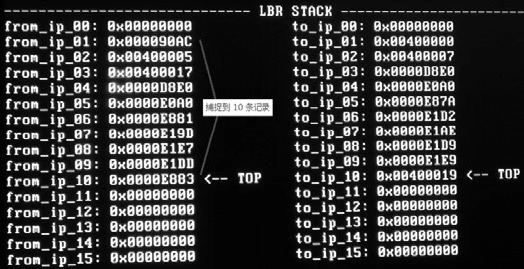

在这个结果里, 共捕捉了 10 条 branch 记录, 这些分支记录如下表所示.

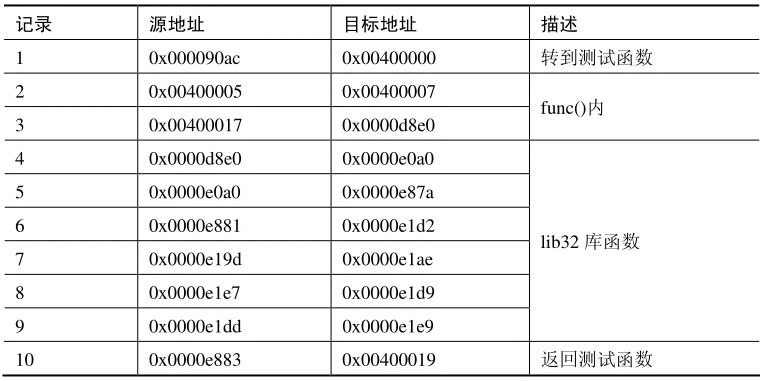

下面将它分解为几个阶段来仔细分析这个过滤过程.

1) 在主体代码里(0x9000 区域的运行空间)第 1 条记录转到 func()函数, 如下所示.

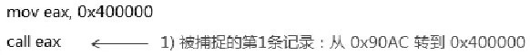

这是在调用测试函数时产生的 branch. 这个 call 属于 indirect(间接)call 指令, 我们的过滤条件是 relative(相对)call 指令, 因此这个 branch 不会被过滤.

2) 在测试函数 func()里(运行在 0x400000 区域里), 如下所示.

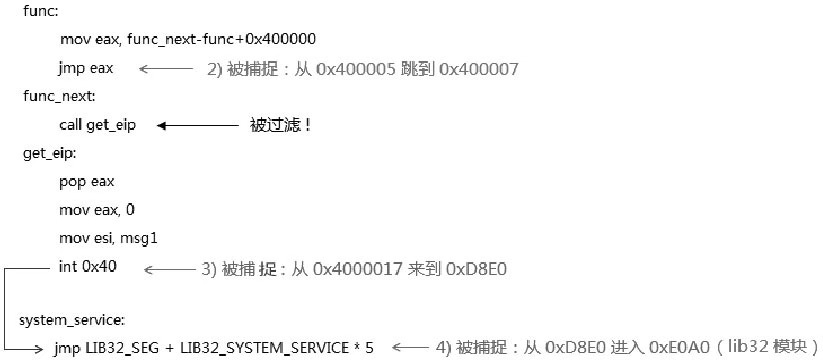

在 func()里被捕捉到两个 branch, 最后由 int 0x40 中断调用来到一个 stub 函数, 地址在 0xD8E0 上, 最后跳入 0xE0A0 地址, 这是属于 lib32 模块的运行空间. 注意在这个阶段里有一个 call 指令被过滤掉, 这是一个 near relative 类型的 call 指令.

3) 接着进入到 lib32 模块里的\_\_system\_service()函数.

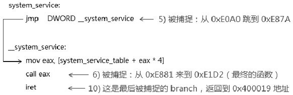

在\_\_system\_service()函数中被捕捉到 3 条 branch, 由 call eax 指令调用最终的函数, 而 iret 指令是最后一条被捕捉的 branch, 当执行完服务函数后, 由 iret 指令返回到 0x400000 运行空间里.

4) 由\_\_system\_service()函数里的 call 指令调用最终的实现服务例程\_\_puts(), 这个服务函数位于 lib32.asm 模块里.

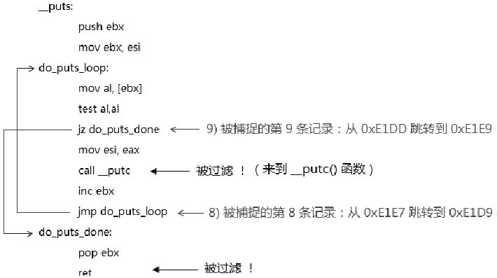

在\_\_puts()函数里, 捕捉到 2 条 branch 记录, 分别是: 第 8 条和第 9 条 branch 记录. 注意第 7 条 branch 记录在 call__putc 指令继续调用其他函数的后续指令流里产生.
而第 9 条被捕捉的 jz 指令虽然在前面, 但是只有当最后一次循环(ZF=1)时才产生 branch 记录, 因此当第 8 条 branch 记录(jmp 指令)产生时, 前面的 jz 指令没有被执行.
5) 最后, 我们看看第 7 条被捕捉到的 branch 是来自哪里, 看看下面的示意图.

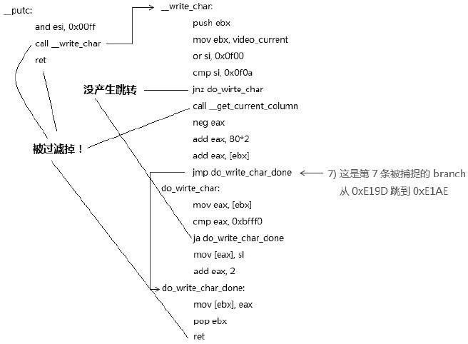

第 7 条 branch 来自最低一层的\_\_write\_char()函数, 它是负责写一个字符到 video 区的最终函数. 它由\_\_putc()来调用, \_\_putc()函数里被过滤了 2 条 branch, 而\_\_write\_char()函数被过滤了 4 条 branch, 实际情况会很多, 因为当打印一条字符串时, 便会产生很多条跳转 branch, 因此多少条 branch 取决于输出多长的信息.

到此为止, 我们跟踪完这个实验所捕捉到的 10 条 branch 的产生情况. 我们看到, 所有的 near relative call 和 relative ret 指令产生的 branch 都被成功地过滤掉了.

现在我们可以回答上面提出的问题.

处理器仅过滤 call 指令, 不会过滤由 call 指令调用所产生的整个 branch 记录(后续指令中符合条件的所有 branch 记录会被过滤).

同时, 我们也看到执行 int 指令进行中断调用也被成功记录在 LBR stack 上.

# 3. 实验

>实验 14\-4: 测试 jmp 分支的过滤条件

在这个实验里我们将进行两个测试.

1) 当将所有的 jmp 指令过滤条件设置时.

2) 将所有的 jmp 指令过滤条件置位, 除 FAR\_BRANCH 条件外.

## 3.1. 测试一

在测试一里将过滤所有 jmp 分支, 包括 indirect 和 relative 的 jmp 指令, 所有的 Jcc(条件跳转), 还包括 far jmp(远跳转)的情况. 我们需要设置:

1) JCC=1, 过滤所有条件跳转指令分支记录.

2) NEAR\_IND\_JMP=1, 过滤所有 near indirect jmp 指令分支记录.

3) NEAR\_REL\_JMP=1, 过滤所有 relative jmp 指令分支记录.

4) FAR\_BRANCH=1, 过滤所有 far jmp 指令(还包括 far call 的情形)分支记录.

与实验 14-3 是同样的代码, 只是过滤的条件改变了.

代码清单 14-6(topic14\ex14-4\protected.asm):

```assembly
;  3) 设置过滤条件
      mov ecx, MSR_LBR_SELECT
      xor edx, edx
      mov eax, 0x1c4                  ;  过滤所有 jmp 指令
      wrmsr
```

这个过滤条件值为 0x1C4, 表示上述的 4 个过滤条件都被置位.

下面是测试的结果, 或许会让你有些失望.

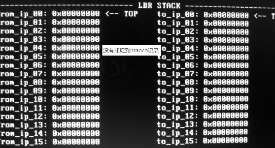

这个测试没有捕捉到任何的 branch 记录, 因此我们知道:

1) 当 NEAR\_IND\_JMP=1 时, 同时也将所有 near indirect call 的分支记录过滤了.

2) 当 NEAR\_REL\_JMP=1 时, 同时也将所有的 relative call 分支记录过滤了.

3) 当 FAR\_BRANCH=1 时, 同时也将 Int 0x40 中断调用产生的分支记录过滤了.

## 3.2. 测试二

下面我们再看看测试二, 在这里, 我们需要改一下测试代码, 修改的部分如下.

代码清单 14-7(topic14\ex14-4\protected.asm):

```assembly
;  测试二(对所有的 jmp 过滤条件置位, 除了 FAR_BRANCH)
      mov ecx, MSR_LBR_SELECT
      xor edx, edx
      mov eax, 0xc4                          ;  过滤所有 jmp 指令(除了 FAR_BRANCH)
      wrmsr
;  4) 测试函数
;  测试一(使用 near indirect call)
;       mov eax, 0x400000
;       call eax                              ;  使用 near indirect call
;  测试二(使用 far call)
      call DWORD KERNEL_CS: 0x400000     ;  改用 far call 形式调用
```

修改的代码有两部分.

1) 过滤条件值改为 0xC4, 分别为 NEAR\_IND\_JMP=1、NEAR\_REL\_JMP=1, 以及 JCC=1.

2) 测试函数改用 far call 调用形式, 用来测试 FAR\_BRANCH.

下面是测试的结果.

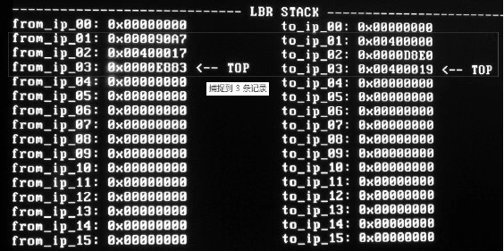

当去掉 FAR\_BRANCH 过滤条件时, 这个测试可以捕捉 3 条件 branch 记录. 分别如下.

1) 从 0x90A7 到 0x400000: 这条 branch 记录是由 call KERNEL_CS: 0x400000 指令产生的(执行 far call 指令).

2) 从 0x400017 到 0xD8E0: 这条 branch 记录是由 int 0x40 指令产生的(执行中断调用).

3) 从 0xE883 到 0x400019: 这条 branch 记录是由 iret 指令产生的(执行中断返回).

```
(0) [0x00000000000090a7] 0018: 00000000000090a7 (unk. ctxt): call far
0018: 00400000  ;9a000040001800
<Bochs: 5> c
(0) Breakpoint 2, 0x0000000000400017 in ?? ()
Next at t=156751382
(0) [0x0000000000400017] 0018: 0000000000400017 (unk. ctxt): int 0x40   ;cd40
<Bochs: 6> c
(0) Breakpoint 3, 0x000000000000e883 in ?? ()
Next at t=156751427
(0) [0x000000000000e883] 0018: 000000000000e883 (unk. ctxt): iretd  ;cf
```

利用 Bochs 的调试功能, 我们在这些捕捉到的 branch 记录下断点, 观察到上面的这 3 条 branch 记录的 from 和 to 地址.

NEAR\_IND\_JMP 和 NEAR\_REL\_JMP 对 call 指令会产生影响, 不知是否可以算是处理器的 bug！

直到 Sandy Bridge 微架构中, 才修改这个问题, 用 Intel 的话来说是在 Sandy Bridge 微架构, LBR 过滤机制已经被 enhanced(增强):

"In Intel microarchitecture code name Sandy Bridge, each logical processor has its own MSR\_LBR\_SELECT. The filtering semantics for "Near\_ind\_jmp" and "Near\_rel\_jmp"has been enhanced"

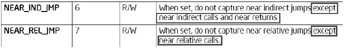

我们看到, 在 Sandy Bridge 微架构上, 已经对这个问题进行改正, 上图来自 Intel 新文档, 显示 call 指令不再受 NEAR\_IND\_JMP 和 NEAR\_REL\_JMP 的影响了.