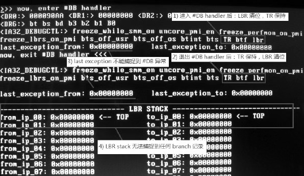

当发生\#**DB 异常**时, **LBR stack**无法捕捉到\#DB 异常, 处理器在**将要(！！！**)进入\#DB handler 时会**对 LBR 位进行清位处理**, 因此, **在\#DB handler 内(！！！**)无法使用 LBR stack 来捕捉 branch 记录.

在**退出\#DB handler 后**, 如果我们需要继续使用 LBR stack 捕捉 branch, 则必须要**重新对 LBR 进行置位**.

可是, **在\#DB 异常**发生后, 处理器并**不清 TR 位**, 这意味着在\#DB hanlder 内继续可以**使用 BTS(！！！**)来**记录 branch(！！！**)或者**发送 BTM 到 system bus(！！！**)上.

实验 14-5: 观察 `#DB` 异常下的 LBR 机制

我们有一连串的疑问.

1) **LBR 与 TR 是否被清位**, **退出\#DB handler**是否会**自动恢复**?

2) **LBR stack 是否会被更新**?

3) **LBR stack**是否真的**无法捕捉\#DB 异常的 branch**?

我们需要实实在在地进行测试来解决上面的疑问, 我们将在实验 14\-5 里解开这些迷惑.

代码清单 14-8(topic14\ex14-5\protected.asm):

```assembly
;  1) 开启 L0 执行断点位
      mov eax, 1
      mov dr7, eax
;  2) 设置执行断点
      mov eax, breakpoint
      mov dr0, eax
;  3) 开启 LBR
      mov ecx, IA32_DEBUGCTL
      rdmsr
      bts eax, LBR_BIT                             ;  置 LBR 位
      bts eax, TR_BIT                              ;  置 TR 位
      wrmsr
breakpoint:
;  4) 在退出 #DB handler 后观察 IA32_DEBUGCTL 寄存器
      call dump_debugctl                          ;
      call println
;  5) 清 TR
      mov ecx, IA32_DEBUGCTL
      rdmsr
      btr eax, TR_BIT                             ;  清 TR 位
      wrmsr
;  6) 关闭执行断点
      mov eax, dr7
      btr eax, 0
      mov dr7, eax
;  7) 查看 last exception 是否能记录 #DB hanlder
      call dump_last_exception
;  8) 输出 LBR stack 信息
      call dump_lbr_stack
```

在这个主体代码里, 有 8 个步骤.

1) 打开 DR7.L0, 并且 R/W0=0, LEN0=0 允许使用执行断点.

2) 设置执行断点.

3) 同时打开 LBR 和 TR 位, 用来测试 TR 位.

4) 由于\#DB 异常是属于**Fault 类型(在这里是, Fault 和 Trap 都有可能**), 在断点指令执行前发生, 第 4 步是在\#DB hanlder 退出后打印 IA32\_DEBUGCTL 寄存器信息来观察.

5) 清 TR 位.

6) 关闭 L0 位.

7) 尝试使用 MSR\_LER\_FROM\_LIP 和 MSR\_LER\_TO\_LIP 寄存器来观察最后一次发生异常的 branch 情况.

8) 输出 LBR stack 的信息.

在我们的#DB handler 里也做出了相应的修改, 如下.

代码清单 14-9(topic14\ex14-5\protected.asm):

```assembly
db_handler:
      jmp do_db_handler
db_msg1        db '>>> now, enter #DB handler', 10, 0
db_msg2        db 'now, exit #DB handler <<<', 10, 0
db_msg3        db 'last exception from: 0x', 0,
db_msg4        db 'last exception to: 0x', 0
do_db_handler:
      mov esi, db_msg1
      call puts
      call dump_drs                                ;  打印 DR0~DR3
      call dump_dr6                                ;  打印 DR6
      call dump_debugctl                          ;  观察 IA32_DEBUGCTL 寄存器
      call dump_last_exception                  ;  观察 last exception
      mov esi, db_msg2
      call puts
      call println
      bts DWORD [esp+8], 16                      ;  RF=1
      iret
```

在\#DB handler 里分别打印了 4 个断点寄存器, DR6, IA32_DEBUGCTL 寄存器, 以及 last exception 分支信息.

下面是在 Westmere 微架构下的 Core i5 处理器上的测试结果.



图上标注了 4 个注意点.

1) 在进入\#DB handler 后, LBR 确实被清位, TR 会保持不变.

2) 在退出\#DB handler 后, LBR 位不会被恢复, 因此, 要继续使用 LBR stack 的话, 需要重新对 LBR 进行置位.

3) 我们看到, 在进入\#DB handler 和退出\#DB handler 后使用 last exception 寄存器也不能捕捉到\#DB 异常.

4) 最后是最关键的, 在 LBR stack 里捕捉不到任何的 branch 记录, 因为在将要进入\#DB handler 时, LBR 位已经被清位.

因此, 我们使用 LBR 确实无法捕捉到\#DB 异常的 branch 记录, 也无法使用 last exception 寄存器来捕捉.

可是, 在 Intel64 手册里有这样一段话:

If the LBR flag is cleared and TR flag in the IA32_DEBUGCTL MSR remains set, theprocessor will continue to update LBR stack MSRs. This is because BTM information must be generated from entries in the LBR stack. A #DB does not automatically clear the TR flag.

我们注意到这段话所说的: **当 LBR 被清位**, **TR 位保持置位**时, 处理器将**继续更新 LBR stack MSR 寄存器**, 因为**BTM 信息**需要**从 LBR stack 里产生(！！！**).

但是, 从我们实验里, 在 LBR=0, TR=1 时, **LBR stack 并没有捕捉到任何 branch 记录(！！！**). (在\#DB handler 里产生了许多的 branch 没有被记录)

笔者无法理解这个 continue to update LBR stack MSRs 是指什么.