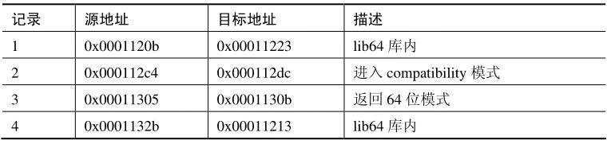
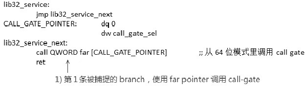
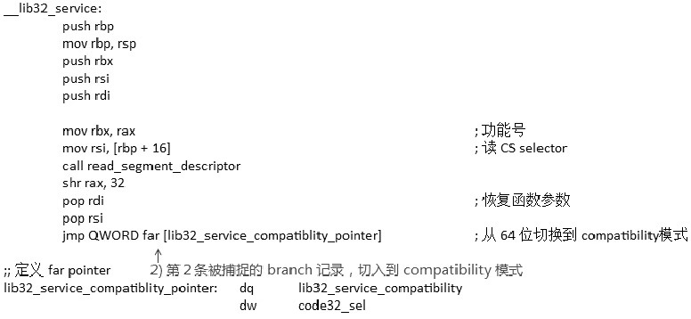
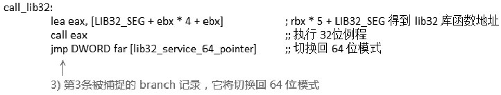
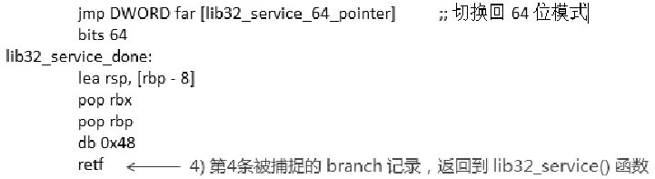
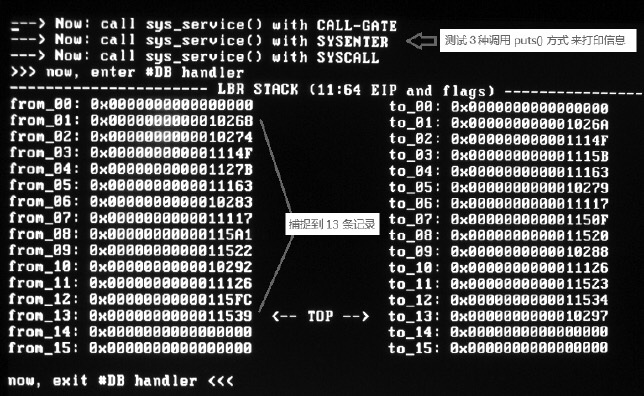
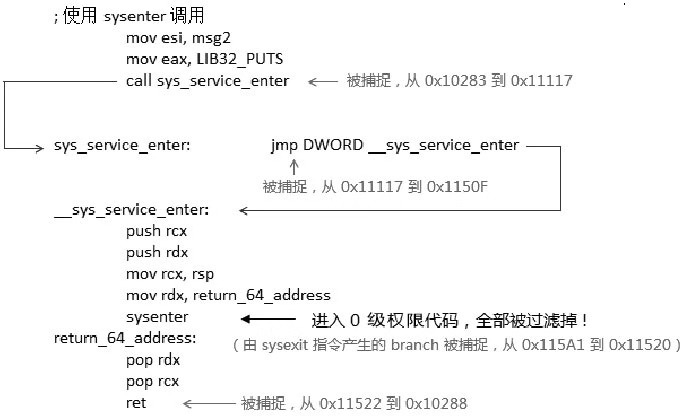
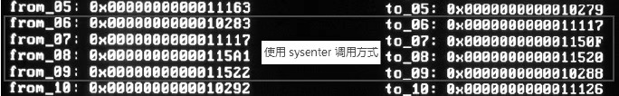

<!-- @import "[TOC]" {cmd="toc" depthFrom=1 depthTo=6 orderedList=false} -->

<!-- code_chunk_output -->


<!-- /code_chunk_output -->

从上面 14.4.1 节的描述里, 我们知道在**IA\-32e 模式**下, **LBR stack**的**from/to 地址使用 64 位的格式**, 包括:

1) **64 位的 linear address**.

2) **64 位的 rip 值**.

3) **64 位的 rip 值及 flags**.

在 compatibility 模式下, 使用 64 位地址的低 32 位. 下面我们将对 IA\-32e 模式的 LBR stack 进行测试, 包括**在 0 级**和**3 级**权限下进行测试.

我们使用了 LBR 的过滤机制, 在 0 级权限下过滤条件设置为

1) JCC=1: 过滤所有 Jcc 指令分支记录.

2) NEAR\_IND\_JMP=1: 过滤所有的 near indirect jmp 指令和 near indirect call 指令分支记录(对 Westmere 微架构来说).

3) NEAR\_REL\_JMP=1: 过滤所有的 near relative jmp 指令和 near relative call 指令分支记录(对 Westmere 微架构来说).

因此, 在这个实验里只保留了 far branch 的分支记录.

实验 14-6: 测试 64 位模式下的 LBR stack

在 64 位模式下测试, 笔者将 dump\_lbr\_stack()函数进行了相应的修改, 实现在 lib\debug64.asm 文件里, 是为 64 位代码而准备的.

我们的主体代码在 long.asm 模块里, 如下.

代码清单 14-10(topic14\ex14-6\long.asm):

```assembly
;  1) 开启 LBR
      mov ecx, IA32_DEBUGCTL
      rdmsr
      bts eax, 0                            ;  LBR=1
      wrmsr
;  2) 设置过滤条件
      mov ecx, MSR_LBR_SELECT
      mov edx, 0
      mov eax, 0xc4                        ;  JCC=NEAR_IND_JMP=NEAR_REL_JMP=1
      wrmsr
;  3) 产生 branch
      mov esi, msg
      LIB32_PUTS_CALL                      ;  调用 lib32 库的 puts() 函数
;  4) 关闭 LBR
      mov ecx, IA32_DEBUGCTL
      rdmsr
      btr eax, 0                             ;  LBR=0
      wrmsr
;  5) 输出 LBR stack 信息
      call dump_lbr_stack
```

这里的过滤条件是 JCC=1, NEAR\_IND\_JMP=1, 以及 NEAR\_REL\_JMP=1, 如前面所述, 这个条件在 Nehalem 和 Westmere 微架构下将过滤所有的 near call 和 jmp 指令分支, 除了 far branch(在 Sandy Bridge 微架构下得到改正).

这个实验的 branch 的产生是

```assembly
mov esi, msg
LIB32_PUTS_CALL                      ;  调用 lib32 库的 puts() 函数
```

LIB32\_PUTS\_CALL 是一个宏, 定义在 lib.inc 文件里, 定义为

```assembly
mov eax, LIB32_PUTS            ;  lib32 库函数编号
call lib32_service             ;  将切入到 32 位 compatibility 模式调用 lib32 库函数
```
这个 lib32\_service()的用途是在 64 位模式下切入到 compatibility 模式, 然后调用 32 位的 lib32 库函数, 好处是重复使用 lib32 库的所有函数, 因此在 lib64 库里只实现了很少的函数, 大部分的函数都在 lib32 库里实现, 这样可以在 64 位模式和 32 位 legacy 模式下共同使用. (关于这一点, 详见 12.6.3 节所述. )

在使用 lib32_service()之前, 需要在 eax 寄存器里提供 lib32 库函数的编号, 所有的 lib32 库函数的编号都在 inc\lib.inc 头文件里定义.

我们设置的过滤条件除了 far branch 外所有分支记录都过滤. 这样做的目的是: 我们很容易观察 lib32_service()函数到底是如何在 64 位模式和 compatibility 模式之间进行切换的(因为它们间的切换必须使用 far pointer 形式).

下面是运行的结果.


最上面输出的信息就是由 lib32\_service()函数调用打印出来的. 在修改后的 dump\_lbr\_stack()函数里显示了 From/To 地址的格式, 在这个结果输出里, 我们看到地址格式属于 000011B 格式, 使用 64 位 EIP 值加上 Flags.

前面已经提过, 这个值是从 IA32\_PERF\_CAPABILITIES 寄存器里读取出来的

```assembly
mov ecx, IA32_PERF_CAPABILITIES
rdmsr
and eax, 0x3f                    ;  得到 format 值
```

在这个结果中, 一共只捕捉了 4 条 branch 记录, 如下表所示.



下面我们看看这些记录是在哪个环节被捕捉的.

1) 第 1 条被捕捉的记录出现在 lib32\_service()函数内.



这是在 lib32\_service()函数里, 通过使用 far pointer 调用 call\-gate 进入 0 级的系统服务 stub 入口.

2) 第 2 条被捕捉的记录, 出现在代码接着来到的\_\_lib\_service()函数里.



第 2 条被捕捉的 branch 记录是由 jmp 指令产生的, 它使用 far pointer 负责切入到 compatibility 模式, 这将表示接下来运行在 compatibility 模式下.

3) 第 3 条被捕捉的记录, 在执行完 lib32 库的函数后.



在\_\_lib32\_service()代码里, 第 3 条被捕捉的 jmp 指令产生 branch 记录, 当执行完最终的 lib32 库函数后, 由这条 jmp 指令负责切回 64 位模式.

4) 第 4 条被捕捉的记录在\_\_lib32\_service()函数执行完毕后, 返回到 lib32\_service()函数里.



最后一条被捕捉的 branch 记录由一条远程返回指令 RETF 产生, 它将返回到 lib32_service()函数中, 最终返回到我们的主体函数中.

事实上, 我们可以利用 Bochs 提供的调试功能很方便地检查一下这 4 条分支记录产生的地方, 对照上面的论述.

实验 14\-7: 测试 64 位下过滤 CPL=0 的记录

接下来的实验, 我们的代码将进入 3 级用户代码中, 在 3 级权限代码下观察 LBR stack, 在这个实验里, 过滤条件只有一个.

CPL\_EQ\_0=1: 这将过滤所有 CPL=0 下的分支记录.

下面是主体代码的设置.

代码清单 14-11(topic14\ex14-7\long.asm):

```assembly
;  1) 开启 LBR
      mov ecx, IA32_DEBUGCTL
      rdmsr
      bts eax, 0                            ;  LBR=1
      wrmsr
;  2) 设置过滤条件
      mov ecx, MSR_LBR_SELECT
      mov edx, 0
      mov eax, 1                           ;  CPL_EQ_0=1(过滤所有 CPL=0 下的分支记录)
      wrmsr
;  3) 开启 DR7.L0 位
      mov rax, dr7
      bts rax, 0                           ;  L0=1
      mov dr7, rax
;  4) 设置断点
      mov rax, breakpoint    ;  设置在 user 代码下的执行断点
      mov dr0, rax      ;  目的是: 在 user 代码下进入 #DB handler 打印
; ;  切换到用户代码
      push USER_SS | 3
      mov rax, USER_RSP
      push rax
      push USER_CS | 3
      push user_entry
      retf64
```

代码流程最后进入 3 级权限里, 需要注意的是, 由于对 LBR stack MSR 寄存器的读取需要 0 级权限, 因此必须在 0 级权限下执行 dump\_lbr\_stack()函数.

因此, 我们可以设置一个调试断点产生\#DB 异常, 在\#DB handler 里打印 LBR stack 的信息.

使用\#DB debug 异常的另一个好处是, 它可以自动清 IA32\_DEBUGCTL 的 LBR 位, 这样无须在 3 级代码里想办法清 LBR 位(避免继续监控).

代码清单 14-12(topic14\ex14-7\long.asm):

```assembly
user_entry:
;  使用 Call-gate 调用
      mov esi, msg1
      mov eax, LIB32_PUTS
      call lib32_service
;  使用 sysenter 调用
      mov esi, msg2
      mov eax, LIB32_PUTS
      call sys_service_enter
;  使用 syscall 调用
      mov esi, msg3
      mov eax, LIB32_PUTS
      call sys_service_call
breakpoint:
      mov rax, rbx                        ;  在此设置断点, 进入#DB handler 打印 LBR stack
```

上面是在 3 级用户代码下, 测试了三种输出方法.

1) 使用 call-gate 调用, 也就是使用 lib32\_service()方式来调用 lib32 库的 puts()函数.

2) 使用 sysenter/sysexit 指令方式, 这是一种快速切入系统服务例程的方式, 最终还是切入到\_\_lib32\_service()函数.

3) 使用 syscall/sysret 指令方式, 这是另一种快速切入方式, 最终还是切入到\_\_lib32\_service()函数.

下面是运行的结果.



这次捕捉了 13 条 branch 记录, 我们简略地看看由 sys\_service\_enter()调用产生的 branch 记录:



如图所示, 我们看到在 sys\_serevice\_enter()调用环节中, 共捕捉了 4 条 branch 记录, 对照一下运行结果的输出.



值得注意的是, 当在 0 级代码里使用 sysexit 指令从 0 级代码返回到 3 级代码里时, 这个 sysexit 指令产生的 branch 记录也被捕捉了.

我们看到, 由 sysenter 指令切入到 0 级的代码中, 所有的 branch 记录都被过滤掉了, 这就是我们所设置的过滤条件(CPL\_EQ\_0=1)所产生的结果.