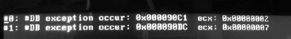
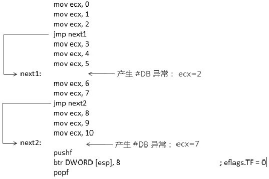

**IA32\_DEBUGCTL 寄存器**的**BTF 位**, 可以帮助我们**快速地跳过不必要的指令级 single\-step**, 而基于在**每个 branch 间的 single\-step**. 当**BTF=1 并且 TF=1**时, 将启用 single\-step on branch 功能.

即设置后, **只有发生 branch(！！！**)才会**进入\#DB handler(！！！**).

在**进入\#DB handler**时, 处理器会:

1) **清 TF 标志位**, 在**退出\#DB handler 后**, 处理器会**从 stack 中的 eflags 寄存器映像恢复 eflags 寄存器值(自动恢复 IF 标志！！！**).

2) **清 IA32\_DEBUG 寄存器的 BTF 位**, 退出\#DB handler 后, 处理器**不会恢复 BTF 位(！！！**). 如果需要, **软件必须重新置 BTF 位**来重启 single\-step on branch 功能.

>实验 14\-8: 测试 single\-step on branch

我们通过实验来认识 single\-step on branch 功能, 在代码中我们需要:

1) **开启 IA32\_DEBUGCTL**寄存器的**BTF 位**.

2) **开启 Eflags**寄存器的**TF**位.

3) \#DB handler 里, 在**退出\#DB handler 之前**重新**开启 BTF 位**, 继续监控下一个 branch

实验的代码在 topic14\ex14-8\protected.asm 文件里.

代码清单 14\-13(topic14\ex14-8\protected.asm):

```assembly
;  1) 设置 debug control
      mov ecx, IA32_DEBUGCTL
      mov edx, 0
      mov eax, 2                ; BTF=1
      wrmsr
;  2) 开启 single-step
      pushf
      bts DWORD [esp], 8        ; eflags.TF=1
      popf
;  3) 测试 single-step
      mov ecx, 0
      mov ecx, 1
      mov ecx, 2
      jmp next1                 ; branch 1
      mov ecx, 3
      mov ecx, 4
      mov ecx, 5
next1:
      mov ecx, 6
      mov ecx, 7
      jmp next2                 ; branch 2
      mov ecx, 8
      mov ecx, 9
      mov ecx, 10
next2:
      pushf
      btr DWORD [esp], 8        ; eflags.TF=0
      popf
;  清 BTF
      mov ecx, IA32_DEBUGCTL
      mov edx, 0
      mov eax, 0
      wrmsr
```

在代码中测试了**两个由 jmp 指令产生的 branch**, 下面是测试的结果.



这个结果中产生了**两次\#DB 异常(只有发生 branch 时候才会\#DB 异常！！！**), 分别发生在 0x90C1 和 0x90DC, 下面是简要的分析.



从上面的示意图中, 我们可以了解到 single\-step on branch 的功能, **branch 产生后(！！！**)的**第 1 条指令执行前(！！！**)发生\#**DB 异常**. 也就是在**执行完分支后发生\#DB 异常**.