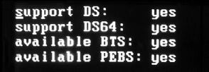

<!-- @import "[TOC]" {cmd="toc" depthFrom=1 depthTo=6 orderedList=false} -->

<!-- code_chunk_output -->

- [1. BTS 机制](#1-bts-机制)
  - [1.1. DS 区域](#11-ds-区域)
    - [1.1.1. 三个组成](#111-三个组成)
    - [1.1.2. 两类信息](#112-两类信息)
- [2. 检测 DS(Debug Store)是否支持](#2-检测-dsdebug-store是否支持)
  - [2.1. 两个寄存器](#21-两个寄存器)
- [3. Debug store 64 存储格式](#3-debug-store-64-存储格式)
  - [3.1. 检测是否支持 DS 64 位格式](#31-检测是否支持-ds-64-位格式)
- [4. 检测 BTS(Branch Trace Store)机制是否可用](#4-检测-btsbranch-trace-store机制是否可用)
- [5. 检测 PEBS(Precise Event Based Sampling)机制是否可用](#5-检测-pebsprecise-event-based-sampling机制是否可用)
- [6. Debug Store 存储区域](#6-debug-store-存储区域)
  - [6.1. DS 基地址](#61-ds-基地址)
  - [6.2. DS 组成](#62-ds-组成)
  - [6.3. DS 格式](#63-ds-格式)
  - [6.4. DS 区域基地址与 BTS 域地址](#64-ds-区域基地址与-bts-域地址)
  - [6.5. DS 管理区域](#65-ds-管理区域)
    - [6.5.1. BTS 与 PEBS buffer base](#651-bts-与-pebs-buffer-base)
    - [6.5.2. BTS 与 PEBS index](#652-bts-与-pebs-index)
    - [6.5.3. BTS 与 PEBS maximum](#653-bts-与-pebs-maximum)
    - [6.5.4. BTS 与 PEBS threshold](#654-bts-与-pebs-threshold)
    - [6.5.5. maximum 值的设置](#655-maximum-值的设置)
    - [6.5.6. threshold 值的设置](#656-threshold-值的设置)
    - [6.5.7. PEBS counter](#657-pebs-counter)
  - [6.6. BTS 记录格式](#66-bts-记录格式)
  - [6.7. PEBS 记录格式](#67-pebs-记录格式)
    - [6.7.1. 检测 PEBS 记录的长度](#671-检测-pebs-记录的长度)
- [7. 设置 DS 存储区域](#7-设置-ds-存储区域)
- [8. 使用环形回路 BTS buffer](#8-使用环形回路-bts-buffer)
  - [8.1. BTS threshold 值的设置](#81-bts-threshold-值的设置)
  - [8.2. 值得注意](#82-值得注意)
- [9. 使 BTS buffer 产生 DS 中断](#9-使-bts-buffer-产生-ds-中断)
  - [9.1. 判断中断触发的原因](#91-判断中断触发的原因)
    - [9.1.1. 确定 PMI 触发](#911-确定-pmi-触发)
    - [9.1.2. 确定 BTS buffer 满的 DS 中断触发](#912-确定-bts-buffer-满的-ds-中断触发)
    - [9.1.3. 确定 PEBS buffer 满时 DS 中断触发](#913-确定-pebs-buffer-满时-ds-中断触发)
    - [9.1.4. 确定 PEBS 中断触发](#914-确定-pebs-中断触发)
  - [9.2. 编写 DS 中断 handler](#92-编写-ds-中断-handler)
    - [9.2.1. 关闭功能](#921-关闭功能)
    - [9.2.2. PEBS buffer 满时](#922-pebs-buffer-满时)
    - [9.2.3. Counter 溢出时](#923-counter-溢出时)
    - [9.2.4. BTS buffer 满时](#924-bts-buffer-满时)
    - [9.2.5. PEBS 中断](#925-pebs-中断)
    - [9.2.6. 恢复原有的功能设置](#926-恢复原有的功能设置)
    - [9.2.7. 清 LVT performance monitor 寄存器 mask 位](#927-清-lvt-performance-monitor-寄存器-mask-位)
- [10. 过滤 BTS 记录](#10-过滤-bts-记录)
  - [10.1. BTS_OFF_OS](#101-bts_off_os)
  - [10.2. BTS_OFF_USR](#102-bts_off_usr)
  - [10.3. 注册中断服务例程](#103-注册中断服务例程)
  - [10.4. 在用户代码里测试](#104-在用户代码里测试)
- [11. 64 位模式下的 BTS 机制](#11-64-位模式下的-bts-机制)

<!-- /code_chunk_output -->

# 1. BTS 机制

BTS 机制允许**BTM(Branch Trace Message**)存储在**内存 DS(Debug Store)save 区域**里.

我们从 14.3.1 节里的表 14\-1 知道:


当 IA32\_DEBUGCTL 寄存器的**TR=1**并且**BTS=1**时, **BTM**将存放在**DS save 区域**内的**BTS buffer**里, 并且由**BTINT 位**可以配置为**环状的 buffer**或者**buffer 满时产生 DS(debug store)interrupt**.

## 1.1. DS 区域

### 1.1.1. 三个组成

在**内存 DS save 区域**里包括**三部分**.

1) **DS 管理配置区域**: 用来配置和管理**BTS buffer**和**PEBS buffer**区域.

2) **BTS buffer**区域: 这是**BTM 记录**存放在内存中的 buffer 区域.

3) **PEBS buffer 区域**: **PEBS(Precise Event Based Sampling！！！**)允许处理器在**某个事件(中断)发生**后**产生 PEBS 记录(记录处理器状态**), PEBS 记录存放在内存中的 buffer 区域.

### 1.1.2. 两类信息

因此, **DS(debug store**)save 区域可以收集**两类信息**.

1) **BTS 信息**: 在 BTS buffer 区域存储**branch 记录信息**.

2) **PEBS 信息**: 在 PEBS buffer 区域存储**处理器状态信息(！！！**), PEBS 机制是**Performace monitoring(性能监控)机制里的一部分(！！！**).

**PEBS 机制**允许当**某个事件监控中的 counter(计数器)溢出**时, 处理器在**debug store 区域**的**PEBS buffer**保存处理器的**相关状态信息(典型地如寄存器的值**). 关于 PEBS 机制, 我们会在第 15 章里详细探讨.

# 2. 检测 DS(Debug Store)是否支持

Debug Store 存储区域是**BTS 机制的基石**, 因此在**软件使用前**, 必须通过`CPUID.01: EDX[21]`查询处理器**是否支持 Debug Store 机制**.

代码清单 14-14(lib\debug.asm):

```assembly
; ------------------------
; support_deubg_store(): 查询是否支持 DS 区域
;  output:
;   1-support, 0-no support
; ------------------------
support_deubg_store:
      mov eax, 1
      cpuid
      bt edx, 21    ;  DS 位
      setc al
      movzx eax, al
      ret
```

## 2.1. 两个寄存器

当**支持 Debug Store 区域**时, 处理器可以使用下面的功能.

1) 使用`IA32_MISC_ENABLE`寄存器**来检测**当前 BTS 机制是否可用**.

2) 使用`IA32_DS_AREA`寄存器**来设置**debug store 区域**.

值得注意的是, Intel 特别注明, 在**SMM 模式下 DS 机制是不可用(！！！**)的.

# 3. Debug store 64 存储格式

Intel 已经**增强了 DS(debug store**)功能, 使得**无论是否开启 IA\-32e 模式**(longmode)都支持**64 位的 debug store 格式**, 我们将在稍后了解 64 位的 DS 格式.

## 3.1. 检测是否支持 DS 64 位格式

软件可以使用**CPUID.01: ECX\[2\].DTES64 位**检测**是否支持 DS64 格式**, 代码如下.

代码清单 14-15(lib\debug.asm):

```assembly
; ------------------------------------
;  support_ds64: 查询是否支持 DS save 64 位格式
;  output:
;   1-support, 0-no support
; -----------------------------------
support_ds64:
      mov eax, 1
      cpuid
      bt ecx, 2    ;  DEST64 位
      setc al
      movzx eax, al
      ret
```

当**DTES64 位为 1**时, 表明处理器支持 debug store 64 位格式, 而**不依赖于 IA\-32e 模式的开启(！！！**), 这一点非常重要, 它决定了**debug store 存储区域的格式**, 包括:

1) **64 位**的**DS 管理记录格式**.

2) **64 位**的**BTS 记录格式**.

3) **64 位**的**PEBS 记录格式**.

# 4. 检测 BTS(Branch Trace Store)机制是否可用

**IA32\_MISC\_ENABLE 寄存器**的 bit 11 位指示 BTS 是否可用, 代码如下.

代码清单 14-16(lib\debug.asm):

```assembly
; ---------------------------------
;  available_branch_trace_store():
;  output:
;   1-available, 0-unavailable
; ---------------------------------
available_branch_trace_store:
      mov eax, 1
      cpuid
      bt edx, 21
      setc al
      jnc available_branch_trace_store_done  ;  no-support
      mov ecx, IA32_MISC_ENABLE
      rdmsr
      bt eax, 11         ;  BTS unavailable 位
      setnc al
available_branch_trace_store_done:
      movzx eax, al
      ret
```

这个函数先测试**是否支持 DS 功能**, 然后通过**IA32\_MISC\_ENABL 寄存器**来测试 BTS 功能软件是否可用. 注意, 当 IA32\_MISC\_ENABLE[11]=1 时, 指示 BTS 机制是不可用的; 为 0 时 BTS 可用.

# 5. 检测 PEBS(Precise Event Based Sampling)机制是否可用

`IA32_MISC_ENABLE`寄存器的 bit 12 位还指示**PEBS 功能是否可用**, 代码如下.

代码清单 14-17(lib\debug.asm):

```assembly
; ---------------------------------
;  avaiable_pebs(): 是否支持 PEBS 机制
;  output:
;   1-available, 0-unavailable
; --------------------------------------
available_pebs:
      mov eax, 1
      cpuid
      bt edx, 21
      setc al
      jnc available_pebs_done
      mov ecx, IA32_MISC_ENABLE
      rdmsr
      bt eax, 12     ;  PEBS unavailable 位
      setnc al
available_pebs_done:
      movzx eax, al
      ret
```

这个测试函数与上面的 available\_branch\_trace\_store()函数原理完全一样, 只不过它是测试 bit 12 位的 PEBS unavailable 标志位.

上面的 4 个测试将**影响到整个 DS 机制**, 我们可以写一个测试函数来检查处理器是否支持这些功能, 在笔者的 Westmere 架构的 Corei5 处理器上测试的结果为.



在这个结果里, 可以看到 Westmere 架构上支持 DTES64 功能, 在 Nehalem 架构上也应该支持. 而 BTS 与 PEBS 机制是可用的. 这个功能是调用 dump\_support\_ds()来打印的, 实现在 lib\debug.asm 文件里, 调用了上面的 4 个测试函数来得到结果.

# 6. Debug Store 存储区域

BTS 记录存放在 DS(debug store)区域的 BTS buffer 里.

## 6.1. DS 基地址

由**IA32\_DS\_AREA 寄存器**设置**整个 DS save area 区域的 base 地址值**, 如下面代码所示.

```assembly
mov ecx, IA32_DS_AREA
mov eax, DS_SAVE_BASE     ;  DS 区域基地址
mov edx, 0
wrmsr         ;  写入 DS 地址
```

## 6.2. DS 组成

整个 Debug Store 区域分为三个部分.

1) DS management area(**DS 管理区域**): 它包含了 BTS 管理区与 PEBS 管理区, 提供对 BTS buffer 与 PEBS buffer 的管理和设置.

2) BTS buffer: 这是**BTS 记录**存放的区域.

3) PEBS buffer: 这是**PEBS 记录**存放的区域.

## 6.3. DS 格式

从前面我们知道**DS 区域**可以分为**32 位**与**64 位**格式, 我们在设置前必须**首先检查是否支持 DTES64 格式**(否则 DS 区域的设置将是错误的), 处理器在下面的情况下使用 DS64 格式.


下图分别是 32 位与 64 位格式的 DS 区域.


在 32 位与 64 位中的 DS 区域结构是一致的, 所不同的是**32 位格式**的 DS 区域的**记录宽度是 32 位**的, 而**64 位的 DS 区域(！！！**)是**64 位宽**.

在 IA\-32e 模式开启(无论是否支持 DTES64 功能)时或者在支持 DTES64(64 位的 DS 格式)功能的处理器上, 使用的都是 64 位的 DS 区域. 在不支持 DTES64 功能的处理器处于 legacy 模式时, 使用的是 32 位的 DS 区域.

## 6.4. DS 区域基地址与 BTS 域地址

IA32\_DS\_AREA 寄存器存放的值就是**DS 区域地址**, 因此 IA32\_DS\_AREA 寄存器将指向 BTS 管理区地址. 如上所示, **BTS 管理区的地址**就是**整个 DS 管理区域的基地址(相等**).

在 64 位模式下 IA32\_DS\_AREA 寄存器可以设置 64 位**线性地址(！！！**)值, 32 位模式下设置 32 位的线性地址值, 高 32 位被保留.

## 6.5. DS 管理区域

**整个 DS 管理区域**包括了对**BTS buffer**与**PEBS buffer**的**管理和设置**, BTS buffer 与 PEBS buffer 具有相同的设置值(除了**PEBS 管理区多了 4 个 counter reset 值**).

处理器会**自动动态地维护 DS 管理区域**中的**BTS buffer**与**PEBS buffer 管理记录**. 这些管理记录值都是**线性地址值(！！！**).

### 6.5.1. BTS 与 PEBS buffer base

BTS buffer base 提供**BTS buffer 的线性基地址**, 而 PEBS buffer base 提供**PEBS buffer 线性基地址**.

这些地址需要**在 double word 边界**上对齐.

### 6.5.2. BTS 与 PEBS index

**BTS 与 PEBS**的**index 值**是指向**下一条 BTS 记录**与**PEBS 记录存放的线性地址**.

当处理器在 index 指向的位置写入 BTS 与 PEBS 记录后, **index 的值**将更新为**下一条记录的地址**. 处理器**自动维护这个 index 值(！！！**).

BTS 与 PEBS 的 index 值和 LBR stack 中的 TOP 指针是有区别的: **TOP 指针**指向**当前已写记录的位置**, 而**index 值**指向**下一条记录将要写的位置**.

### 6.5.3. BTS 与 PEBS maximum

maximum 值决定 BTS buffer 与 PEBS buffer 的**大小**, 它指向 BTS buffer 与 PEBS buffer**最后的记录(最大可容纳记录数**)**下一个字节**的**线性地址值**.

假设在**32 位 DS 区域**下, BTS buffer 与 PEBS buffer 最大可容纳 10 条记录, 那么:

1) **BTS** maximun 值应为`BTS buffer base + 10×12`(注: **每条 BTS 记录是 12 个字节！！！**)

2) **PEBS** maximum 值应为`PEBS buffer base + 10×40`(注: **每条 PEBS 记录是 40 个字节！！！**)

假设在**64 位 DS 区域**下, 同样 BTS 与 PEBS buffer 最大容纳 10 条记录, 那么:

1) **BTS** maximum 值应为`BTS buffer base + 10×24`(注: **每条 BTS 记录是 24 个字节**)

2) **PEBS** maximum 值应为`PEBS buffer base + 10×144`(注: **每条 PEBS 记录为 144 个字节**, 在**增强 PEBS 记录下是 176 个字节**).

对于 BTS 与 PEBS 记录, maximum 是有一些区别的.

1) 当**BTS buffer**配置为**环形的 buffer(BTINT=0**)时, index 达到 maximum 时重置为 base 值, 这将会**回到 base 处重新继续写记录**. (前提是**threshold 值大于 maximum 值**. )

2) 当**PEBS index**达到 PEBS maximum 值时, **index 不会被重置为 base 值**, 需要软件进行重置.

我们将在后面了解到 BTS 与 PEBS 记录的结构与增强 PEBS 记录结构.

### 6.5.4. BTS 与 PEBS threshold

**Threshold 值**是个**产生 DS interrupt 的临界值**, 当 BTS **index**或 PEBS index 的值达到 BTS **threshold**值或 PEBS threshold 值时(等于或大于), 将产生**DS interrupt(debug store 中断！！！**)来提示跨越了 buffer maximum 边界(也就是 buffer 溢出了).

threshold 值必须是**记录字节的倍数**, 例如: **threshold=buffer base\+11×24**(第 11 条记录是 threshold 值). maximum 与 threshold 值的设置很关键, 将直接影响 buffer 区域的工作.

BTS threshold 值的设置基于**两种 BTS buffer 的配置**而不同.

1) 当**BTINT=0**时, BTS buffer 配置为**环形回路 buffer**, BTS buffer 满时从头开始继续写.

2) 当**BTINT=1**时, 当**BTS buffer 满**时**产生 DS 中断(！！！**)来提醒软件 BTS buffer 已满, 软件需要进行相应的处理.

下图是一个 BTS buffer 区域设置的示例.


在这个示例里, BTS buffer 可以容纳 10 条记录(编号从 0 到 9), **每条记录**是**24 个字节(18H 宽**), 那么**整个 BTS buffer 的大小**为 10×24=240 个字节, 即**F0H(偏移量从 0H 到 0EFH**).

BTS maximum 的值设置为 base\+10×24(即 F0H 位置), BTS threshold 的值必须大于 BTS maximum 值, 示例里设置为 BTS maximum 记录的下一条记录起始处(即 108H 位置).

### 6.5.5. maximum 值的设置

在上面的示例里, 由于 buffer 的大小是 10 条记录. 那么记录 10 的起始边界 F0H(记录 9 下一条记录的起始字节)就可以设为 BTS maximum 值.

在 Intel64 手册里, 对 maximum 值的一段话如下:

BTS absolute maximum—Linear address of the next byte past the end of the BTS buffer. This address should be a multiple of the BTS record size (12 bytes) plus 1.

这段话的前一句比较容易理解, 而后一句话似乎表明 maximum 的值为记录字节倍数加上 1 值, 实际上在笔者的测试中并不需要加上 1 值(即下一条记录的起始字节就可以了).

值得注意的是, **即使进入 PMI handler**(如果**threshold 小于 maximum**, 由于遇到 threshold 而**产生 DS 中断**), **BTS buffer 仍然被写满**, 直到 BTS maximum 值.

### 6.5.6. threshold 值的设置

当 BTS buffer 配置为环形回路 buffer 时, BTS threshold 的值必须大于 BTS maximum, 避免 index 达到 threshold 值而产生 DS 中断. 如上图中的环形 BTS buffer 配置示例所示.

当 BTS buffer 配置为满产生 DS 中断时, BTS threshold 的值应该等于 BTS maximum 值, 确保 index 达到 maximum(BTS buffer 写满时)产生 DS 中断.


如上所示, 这是一个**非环形 BTS buffer**的配置示例, BTS threshold 的值设置等于 BTS maximum 值. 当 index 写满记录 9, 达到 BTS maximum(BTS threshold)时产生 DS 中断.

BTS buffer 无论配置为**circular(环形**)还是**non\-circular(threshold 中断**), BTS threshold 的值都**不应该小于 BTS maximum 值**.

因此, **正确的方案**是, BTS **threshold 要么大于 maximum(环形回路！！！**), 要么**等于 maximum 值(threshold 中断或者说 BTS buffer 溢出中断！！！**).

当 BTS threshold 小于 BTS maximum 时, index 达到 threshold 值时产生 DS 中断(此时 buffer 未满), 而不依赖于是否配置为"满时产生中断"(即使环形的 buffer 也产生 DS 中断). 如果确实需要在 buffer 未满时就产生 DS 中断来提醒, 那么在这种情况下可以设置 BTS threshold 值小于 BTS maximum 值.

### 6.5.7. PEBS counter

当**每个 IA32\_PMC counter(通用计数器**)配置为, 因**counter(计数器**)溢出产生**PEBS 中断**而**不是 PMI(performance monitoring interrupt)中断**(尽管都使用**同一个中断 vector**)时.

当**产生 PEBS 中断**时, 相应的**IA32\_PMC(通用计数器寄存器**)值可以**从 PEBS 管理区中的 counter 值(！！！**)来得到**重置**.

Nehalem 微架构及后续架构支持 4 个 IA32\_PMC0 到 IA32\_PMC3 计数器**产生 PEBS 中断**, 因此在 PEBS 管理区里需要设置**4 个 counter 值**(对应于 IA32\_PMC0 到 IA32\_PMC3).

## 6.6. BTS 记录格式

**每条 BTS 记录**分为**3 个部分**.

1) last branch from: 记录分支的**源地址**.

2) last branch to: 记录分支的**目标地址**.

3) branch predicted: 这部分的**bit 4 位**指示分支是属于**predicted(预测的**), 还是**non\-predicted(非预测的**).

在**32 位格式**里, **每部分为 4 字节**, **每条记录**为**12 字节**. 在 64 位格式里, 每部分为 8 字节, 每条记录共为**24 个字节**.


与 LBR stack 中的 from/to 地址一样, 这些 BTS 记录中的 from 和 to 地址都是**线性地址值**, 当 BTS buffer 能容纳 10 条记录时, 那么最多有 10 条这样的记录, **每条记录**按**先后顺序**存放在 BTS buffer 区域(**由低往高地址存放**)中.

## 6.7. PEBS 记录格式

PEBS 是指**Precise Event Based Sampling**(直译为**基于抽样的精确事件！！！**), PEBS 记录实际上保存着**处理器的 context(上下文)状态**, 也就是包括: **EFLAGS 寄存器**, **EIP 值**, 以及**GPR(通用寄存器**)值.


在**32 位**格式里, PEBS 记录的**每个部分**是**32 位宽**, 保存**32 位的寄存器值**, 于是将**保存 8 个通用寄存器**. **每条 PEBS 记录**共**40 个字节**.


上面是**64 位**的 PEBS 记录格式, PEBS 记录**每个部分**是**8 字节**宽. 最初的 Core 架构 64 位 PEBS 记录是**144 个字节**, 保存**RFLAGS 寄存器**、**RIP 值**, 以及**16**个**64 位通用寄存器(从 RAX 到 R15**).

从 Nehalem 微架构开始, PEBS 机制得到增强, **每条 PEBS**记录扩展到**176 个字节**, 除了保存上述的寄存器外, 新增了**4 个部分**. 这些增强的功能, 我们将在 15.4.1 节与 15.4.8 节里进行探讨.

### 6.7.1. 检测 PEBS 记录的长度

综合前面所述, 最终确定 PEBS 记录的长度由下面两个因素决定.

1) 检测是否支持 DTES64 格式(即 64 位 DS 区域).

2) 检测 64 位 PEBS 记录的格式是否属于增强格式.

在不支持 DTES64 格式的情况下, 它属于 32 位的 PEBS 记录格式, PEBS 记录为 40 个字节宽. 否则, 如果不支持增强记录格式, PEBS 记录为 144 个字节(64 位 PEBS 记录).

而在增强 PEBS 记录格式下, 每个 PEBS 记录变成了 176 个字节(增加了 4 个部分).

在支持 DTES64 格式的情况下, 软件需要从 IA32\_PERF\_CAPABILITIES 寄存器的[11: 8]域来查询是否支持增强格式, 如下面的 support\_enhancement\_pebs()检测函数所示.

代码清单 14-18(lib\debug.asm):

```assembly
; ------------------------------------------------------------
;  support_enhancement_pebs(): 检测是否支持增强的 PEBS 记录
;  output:
;  1-support, 0-no support
; -----------------------------------------------------------
support_enhancement_pebs:
      mov ecx, IA32_PERF_CAPABILITIES
      rdmsr
      shr eax, 8
      and eax, 0Fh    ;  得到 IA32_PREF_CAPABILITIES[11: 8]
      cmp eax, 0001B    ;  测试是否支持增强的 PEBS 格式
      sete al
      movzx eax, al
      ret
```

当 IA32\_PERF\_CAPABILITIES[11: 8]=0001B 时, 处理器将支持增强的 PEBS 记录格式. 否则 PEBS 记录只保存 RFLAGS 寄存器、RIP 寄存器, 以及通用寄存器.

那么, 在 DS 管理区设置时, 必须检测 PEBS 记录长度, 做出正确的设置.

# 7. 设置 DS 存储区域

对于**DS 存储区域的设置**, **Intel**有它推荐和建议, 例如下面几条.

1) 对于**OS**来讲, **DS 区域**应分配在**non\-paged(不可换页)的区域**, 系统**不应将它换出内存(！！！**). 并且系统应**保持 DS 区域属于 dirty(脏)页(！！！**), 即已经被写的页.

2) DS 区域**可以大于 4K 页**, 但**必须使用相临的页(即线性地址上必须是连续的！！！**). **物理地址并没有要求**(但是出于性能的考虑, 建议不使用跨页的物理地址).

3) 出于性能的考虑, DS 区域及管理区记录应该设置在**double word 边界(！！！**)上.

4) **BTS buffer**和**PEBS buffer 大小**应该使用**记录字节的倍数(例如 10 个记录**), 并且应确保设置的 PEBS 记录宽度能够容纳下整条 PEBS 记录(例如前面所述的检测 PEBS 记录宽度).

5) 在**MP 系统**里, 对于**所有的处理器**, 系统应该将**DS 区域**映射到**同一个物理地址区域(！！！**)上. 保持**切换 CR3 寄存器时**, **DS 区域地址不变**.

在设置 DS 存储区域后, 还必须**确保 local APIC 是开启(！！！**)的, 并且**对 LVT performance monitor 寄存器进行正确的设置(！！！**), **编写相应的 PMI(performance monitor interrupt)中断处理程序(！！！**).

下面是笔者对 DS 存储区域的设置代码.

代码清单 14-19(lib\debug.asm):

```assembly
; ----------------------------------------------------------------
;  set_ds_management_record() 设置管理区记录基于 DS_SAVE_BASE
;  input:
;   esi - BTS buffer base
;   edi - PEBS buffer base
;  description:
;   默认情况下, 配置为环形回路 buffer 形式,
;   threshold 值大于 maximum, 避免产生 DS buffer 溢出中断
; --------------------------------------------------------------------
set_ds_management_record:
      push ebp
      mov ebp, esp
      push ecx
      push edx
      push ebx
; ;  测试是否支持 64 位的 DS save 格式
      mov eax, 1
      cpuid
      bt ecx, 2         ;  DEST64 位
      jc set_ds_management_record64
      mov DWORD [ds64_flag], 0     ;  DS64 不支持, ds64_flags 标志清 0
      mov DWORD [enhancement_pebs_flag], 0  ;  不支持, enhancement_pebs_flag
标志清 0
      ; ;  设置 32 位的 BTS 格式
      mov DWORD [DS_SAVE_BASE + BTS_BASE], esi
      mov DWORD [DS_SAVE_BASE + BTS_INDEX], esi
      lea eax, [esi + BTS_RECORD_MAXIMUM * 12]
      mov DWORD [DS_SAVE_BASE + BTS_MAXIMUM], eax ;  最大记录数为
BTS_RECORD_MAXIMUM 值
      ;  设置为环形回路 BTS buffer
      lea eax, [esi + BTS_RECORD_CIRCULAR_THRESHOLD * 12]
      mov DWORD [DS_SAVE_BASE + BTS_THRESHOLD], eax
      ; ;  设置 32 位的 PEBS 格式
      mov DWORD [DS_SAVE_BASE + PEBS_BASE], edi   ;  pebs buffer base
      mov DWORD [DS_SAVE_BASE + PEBS_INDEX], edi  ;  pebs buffer index
      mov DWORD [pebs_buffer_index], edi               ;  保存 index 值
      lea eax, [edi + PEBS_RECORD_MAXIMUM * 40]   ;  base + m * 40
      mov DWORD [DS_SAVE_BASE + PEBS_MAXIMUM], eax  ;  pebs buffer maximum
      lea eax, [edi + PEBS_RECORD_THRESHOLD * 40]  ;  base + t * 40
      mov DWORD [DS_SAVE_BASE + PEBS_THRESHOLD], eax ;  pebs buffer threshold
      mov DWORD [DS_SAVE_BASE + PEBS_COUNTER0], 0
      mov DWORD [DS_SAVE_BASE + PEBS_COUNTER1], 0
      mov DWORD [DS_SAVE_BASE + PEBS_COUNTER2], 0
      mov DWORD [DS_SAVE_BASE + PEBS_COUNTER3], 0
      ; ;  下面存放 BTS 管理区的 pointer 值
      mov DWORD [bts_base_pointer], DS_SAVE_BASE + BTS_BASE
      mov DWORD [bts_index_pointer], DS_SAVE_BASE + BTS_INDEX
      mov DWORD [bts_maximum_pointer], DS_SAVE_BASE + BTS_MAXIMUM
      mov DWORD [bts_threshold_pointer], DS_SAVE_BASE + BTS_THRESHOLD
      ; ;  下面存放 PEBS 管理区 pointer
      mov DWORD [pebs_base_pointer], DS_SAVE_BASE + PEBS_BASE
      mov DWORD [pebs_index_pointer], DS_SAVE_BASE + PEBS_INDEX
      mov DWORD [pebs_maximum_pointer], DS_SAVE_BASE + PEBS_MAXIMUM
      mov DWORD [pebs_threshold_pointer], DS_SAVE_BASE + PEBS_THRESHOLD
      mov DWORD [pebs_counter0_pointer], DS_SAVE_BASE + PEBS_COUNTER0
      mov DWORD [pebs_counter1_pointer], DS_SAVE_BASE + PEBS_COUNTER1
      mov DWORD [pebs_counter2_pointer], DS_SAVE_BASE + PEBS_COUNTER2
      mov DWORD [pebs_counter3_pointer], DS_SAVE_BASE + PEBS_COUNTER3
      jmp set_ds_management_record_done
set_ds_management_record64:
      mov DWORD [ds64_flag], 1     ;  DS64 支持, ds64_flags 标志置 1
      ; ;  设置 64 位 BTS 管理区
      mov DWORD [DS_SAVE_BASE + BTS64_BASE], esi
      mov DWORD [DS_SAVE_BASE + BTS64_BASE + 4], 0
      mov DWORD [DS_SAVE_BASE + BTS64_INDEX], esi
      mov DWORD [DS_SAVE_BASE + BTS64_INDEX + 4], 0
      lea eax, [esi + BTS_RECORD_MAXIMUM * 24]
      mov DWORD [DS_SAVE_BASE + BTS64_MAXIMUM], eax
      mov DWORD [DS_SAVE_BASE + BTS64_MAXIMUM + 4], 0
      ; ;  配置为环形回路 BTS buffer
      lea eax, [esi + BTS_RECORD_CIRCULAR_THRESHOLD * 24]
      mov DWORD [DS_SAVE_BASE + BTS64_THRESHOLD], eax
      mov DWORD [DS_SAVE_BASE + BTS64_THRESHOLD + 4], 0
      ; ;  下面存放 BTS 管理区的 pointer 值
      mov DWORD [bts_base_pointer], DS_SAVE_BASE + BTS64_BASE
      mov DWORD [bts_index_pointer], DS_SAVE_BASE + BTS64_INDEX
      mov DWORD [bts_maximum_pointer], DS_SAVE_BASE + BTS64_MAXIMUM
      mov DWORD [bts_threshold_pointer], DS_SAVE_BASE + BTS64_THRESHOLD
      ; ;  设置 64 位 PEBS 管理区
      mov ecx, IA32_PERF_CAPABILITIES
      rdmsr
      shr eax, 8
      and eax, 0Fh        ;  得到
      IA32_PREF_CAPABILITIES[11: 8]
      cmp eax, 0001B        ;  测试是否支持增强的 PEBS 格式
      je enhancement_pebs64
      mov DWORD [enhancement_pebs_flag], 0  ;  不支持, enhancement_pebs_flag 标志清 0
      mov DWORD [pebs_record_length], 144
      lea eax, [edi + PEBS_RECORD_MAXIMUM * 144]   ;  maximum 值
      lea edx, [edi + PEBS_RECORD_THRESHOLD * 144]
      jmp set_pebs64
enhancement_pebs64:
      ; *
      ; * 增强的 PEBS 格式, 每条记录共 176 个字节 *
      ; *
      mov DWORD [enhancement_pebs_flag], 1 ;  支持, enhancement_pebs_flag 标志置 1
      mov DWORD [pebs_record_length], 176
      lea eax, [edi + PEBS_RECORD_MAXIMUM * 176]  ;  maximum 值
      lea edx, [edi + PEBS_RECORD_THRESHOLD * 176]   ;  threshold 值
set_pebs64:
      mov DWORD [DS_SAVE_BASE + PEBS64_BASE], edi   ;  pebs buffer base
      mov DWORD [DS_SAVE_BASE + PEBS64_BASE + 4], 0
      mov DWORD [DS_SAVE_BASE + PEBS64_INDEX], edi   ;  pebs buffer index
      mov DWORD [DS_SAVE_BASE + PEBS64_INDEX + 4], 0
      mov DWORD [DS_SAVE_BASE + PEBS64_MAXIMUM], eax  ;  pebs buffer maximum
      mov DWORD [DS_SAVE_BASE + PEBS64_MAXIMUM + 4], 0
      mov DWORD [DS_SAVE_BASE + PEBS64_THRESHOLD], edx  ;  pebs buffer threshold
      mov DWORD [DS_SAVE_BASE + PEBS64_THRESHOLD + 4], 0
      ; *
      ; * 保存 pebs index 值
      ; * 作为判断 PEBS 中断条件
      ; *
      mov DWORD [pebs_buffer_index], edi
      mov DWORD [pebs_buffer_index + 4], 0
      ; ;  设置 counter reset
      mov DWORD [DS_SAVE_BASE + PEBS64_COUNTER0], 0
      mov DWORD [DS_SAVE_BASE + PEBS64_COUNTER0 + 4], 0
      mov DWORD [DS_SAVE_BASE + PEBS64_COUNTER1], 0
      mov DWORD [DS_SAVE_BASE + PEBS64_COUNTER1 + 4], 0
      mov DWORD [DS_SAVE_BASE + PEBS64_COUNTER2], 0
      mov DWORD [DS_SAVE_BASE + PEBS64_COUNTER2 + 4], 0
      mov DWORD [DS_SAVE_BASE + PEBS64_COUNTER3], 0
      mov DWORD [DS_SAVE_BASE + PEBS64_COUNTER3 + 4], 0
      ; ;  下面存放 PEBS 管理区 pointer
      mov DWORD [pebs_base_pointer], DS_SAVE_BASE + PEBS64_BASE
      mov DWORD [pebs_index_pointer], DS_SAVE_BASE + PEBS64_INDEX
      mov DWORD [pebs_maximum_pointer], DS_SAVE_BASE + PEBS64_MAXIMUM
      mov DWORD [pebs_threshold_pointer], DS_SAVE_BASE + PEBS64_THRESHOLD
      mov DWORD [pebs_counter0_pointer], DS_SAVE_BASE + PEBS64_COUNTER0
      mov DWORD [pebs_counter1_pointer], DS_SAVE_BASE + PEBS64_COUNTER1
      mov DWORD [pebs_counter2_pointer], DS_SAVE_BASE + PEBS64_COUNTER2
      mov DWORD [pebs_counter3_pointer], DS_SAVE_BASE + PEBS64_COUNTER3
set_ds_management_record_done:
      ;  清 PEBS buffer 溢出指示位 OvfBuffer
      RESET_PEBS_BUFFER_OVERFLOW
      pop ebx
      pop edx
      pop ecx
      mov esp, ebp
      pop ebp
      ret
```

这个 set\_ds\_management\_record()函数用来设置 DS 管理区的 BTS buffer 与 PEBS buffer, 实现在 lib\debug.asm 文件里, 稍有些长, 但结构是清晰的. 它的工作是先判断是否支持 DTES64 格式, 根据检测的结果来选择设置 32 位与 64 位 DS 区域.

在设置 PEBS buffer 时, 先检测是否支持扩展的格式(通过前面所述的 IA32\_PERF\_CAPABILITIES 寄存器来检测), 根据测试的结果来设置 PEBS maximum 与 threshold 值.

函数需要提供两个输入参数: esi 传递 BTS buffer base 值, edi 传递 PEBS buffer base 值.

代码清单 14-20(lib\debug.asm):

```assembly
; -------------------------------------------
;  set_debug_store_area(): 设置 DS 区域基地址
; -------------------------------------------
set_debug_store_area:
      mov esi, DS_SAVE_BASE
      call clear_4K_page   ;  先清空 debug store area
;  设置 IA32_DS_AERA 寄存器
      mov ecx, IA32_DS_AREA
      mov eax, DS_SAVE_BASE  ;  DS 区域基地址
      mov edx, 0
      wrmsr
      ret
```

这个 set\_debug\_store\_area()函数将设置 DS 存储区域的基地址, 通过**写 IA32\_DS\_AREA 寄存器**, 基地址固定为 DS\_SAVE\_BASE 值, 这是个常量值, 定义在 inc\debug.inc 文件里. 这个文件也定义了 BTS\_BUFFER\_BASE 与 PEBS\_BUFFER\_BASE 常量值, 对应于 BTS 的 base 与 PEBS 的 base 值. 也定义了 BTS\_RECORD\_MAXIMUM 与 BTS\_RECORD\_CIRCULAR\_THRESHOLD 值, 对应于环形 BTS buffer 的最大记录数与 threshold 值. 定义了 PEBS\_RECORD\_MAXIMUM 与 PEBS\_RECORD_THRESHOLD 值, 对应于 PEBS 的最大记录数与 threshold 值.

函数开头使用 clear\_4K\_page()函数来清空 DS 区域, 这个函数实现在 lib\page32.asm 文件里. 在 inc\debug.inc 文件里定义了一个宏, 来设置完整的 DS 存储区域.

代码清单 14-21(inc\debug.inc):

```assembly
; ---------------------------------------------------
;  宏 SET_DS_AREA()
;  描述:
;  用来设置完整的 DS 区域(环形回路 buffer 类型)
; ----------------------------------------------------
%macro SET_DS_AREA 0
      ; ; ;  设置 IA32_DS_AERA 寄存器
      call set_debug_store_area
      ; ; ;  设置 DS 管理区域
      SET_DS_MANAGEMENT
%endmacro
```

这个 SET\_DS\_AREA 宏只是依次调用 set\_debug\_store\_area()和 set\_ds\_management\_record()函数来设置环形的 BTS buffer.

当 BTS buffer 配置为满产生 DS 中断时, 需要做一些修改, 代码如下所示.

代码清单 14-22(inc\debug.inc):

```assembly
; ------------------------------------------------
;  宏 SET_INT_DS_AREA()
;  描述:
;  用来设置当 buffer 满时产生 DS buffer 中断
; ------------------------------------------------
%macro SET_INT_DS_AREA 0
      SET_DS_AREA        ;  先设置为环形回路 buffer 类型
      ;  接下来设置 threshold 值等于 maximum 值
      ;  来达到 buffer 满时产生 DS 中断
      mov esi, [bts_maximum_pointer]  ;  读 BTS maximum 地址
      mov esi, [esi]       ;  读 BTS maximum 值
      mov edi, [bts_threshold_pointer]  ;  读 BTS threshold 地址
      mov [edi], esi       ;  设 BTS threshold 等于 BTS maximum 值
%endmacro
```

这个宏 SET\_INT\_DS\_AREA 调用前面的宏 SET\_DS\_AREA 来配置一个环形的 BTS buffer, 接着将 BTS thershold 值设置为 BTS maximum 值, 来达到配置 BTS buffer 满时产生 DS 中断.

# 8. 使用环形回路 BTS buffer

使用下面的 IA32_DEBUGCTL 寄存器设置, 将开启 circular(状形)回路 BTS buffer.


当 IA32\_DEBUGCTL.TR=1, IA32\_DEBUGCTL.BTS=1, 而 BTINT 值为 0 时, branch 记录将写在内存的 BTS buffer 区域, 这个 BTS buffer 是循环使用. 当 BTSbuffer 的 index 到达 maximum 时, index 将被重置为 base 值, 继续从头开始记录.

这个工作原理和 LBR stack 是一样的, 值得注意的是, index 是指向下一条记录将要写的地址. 在初始设置里, base 是第 1 条记录的位置, 而 index 一般设为与 base 值一样.

## 8.1. BTS threshold 值的设置

如前面所述, 对于**circular(环形)的 BTS buffer**来说, **BTS threshold 值必须大于 BTS maximum 值**. 否则(小于或等于 BTS maximum), 当 index 遇到 threshold 值时会触发 DS 中断, 在 LVT performance monitor 未屏蔽时会进入 PMI handler.

并且在进入 PMI handler, 可能由于新的分支引起 BTS buffer 继续写满后, 会重新从 base 位置开始进行新的记录.

显然这是个错误的行为. 假设, BTS buffer 最多能容纳 10 条记录, 对环形 BTS buffer 的 64 位格式下, 下面是对 BTS maximum 与 BTS threshold 的设置.

```assembly
mov DWORD [DS_AREA_BASE + BTS_MAXIMUM], 10 * 24 ;  maximum 值为 10 个 BTS 记录
mov DWORD [DS_AREA_BASE + BTS_THRESHOLD], 11 * 24;  threshold 值为 11 个 BTS 记录
```

BTS threshold 值应设置为大于 BTS maximum 值的 BTS 记录整数倍位置上, 上面的代码设在记录 11 的位置(当然还可以设为更后的位置上).

在正确设置 BTS buffer 的情况下, 环形回路 BTS buffer 的使用不会因为 BTS buffer 溢出产生 DS 中断而调用 PMI 中断 handler. 但是在一个完整的 OS 环境里, 必须把 LVT performance monitor 寄存器设置好, 并组织好 PMI handler 及 IDT.

>实验 14\-9: 测试环形回路 BTS buffer 的工作

按照惯例, 我们将对 BTS 机制进行一些实验测试. 在这里我们测试使用和观察环形回路的 BTS buffer. 下面是测试的主体代码.

代码清单 14-23(topic14\ex14-9\protected.asm):

```assembly
      call available_bts     ;  测试 bts 机制是否可用
      test eax, eax
      jz next        ;  不可用
;  设置 IA32_DS_AERA 寄存器
      call set_debug_store_area
;  设置 DS 管理区记录
      mov esi, BTS_BUFFER_BASE   ;  BTS buffer 基址
      mov edi, PEBS_BUFFER_BASE   ;  PEBS buffer 基址
      call set_ds_management_record
;  开启 BTS
      ENABLE_BTS       ;  TR=1, BTS=1
; ;  下面测试 11 条 branch
jmp l1
l1: jmp l2
l2: jmp l3
l3: jmp l4
l4: jmp l5
l5: jmp l6
l6: jmp l7
l7: jmp l8
l8: jmp l9
l9: jmp l10
l10: jmp l11
l11:
;  关闭 BTS
      DISABLE_BTS       ;  TR=0, BTS=0
      DUMP_BTS       ;  打印 BTS buffer 信息
next:
      jmp $
```

实验代码里, 先检则 BTS 机制是否可用, 在可用的情况下继续下面的设置. 代码先设置 DS 存储区域的基地址, 再调用前面代码清单 14-20 中的 set\_ds\_management\_record()函数设置 DS 管理区的记录(BTS 与 PEBS buffer 的相关设置).

接着开启 BTS 机制, ENABLE\_BTS 是宏, 实现在 inc\debug.inc 文件里, 对 IA32\_DEBUGCTL 寄存器进行设置(TR=1 并且 BTS=1).

代码清单 14-24(inc\debug.inc):

```assembly
; -----------------------------------
;  ENABLE_BTS() 宏: 开启 bts, 环状回路
; -----------------------------------
%macro ENABLE_BTS 0
      mov ecx, IA32_DEBUGCTL
      mov edx, 0
      mov eax, 0C0h     ;  TR=1, BTS=1
      wrmsr
%endmacro
```

在开启 BTS 后, 后续代码连续使用 11 条 jmp 指令来产生分支记录. 采用这种方式比较直观, 容易观察 BTS 记录. 最后使用宏 DISABLE\_BTS 关闭 BTS 机制, 并使用 DUMP\_BTS 宏来打印 BTS buffer 的信息, 这些宏都实现在 inc\debug.inc 文件里.

下面是在 Westmere 架构 Core i5 处理器笔记本式计算机上的运行结果.


在这个测试里, 笔者特意产生了 11 条分支记录, 在结果里我们看到: BTS buffer 已经被写满, index 指向记录 1(下一条记录将要写的地方), 下表是这 11 条分支记录的描述.


在 BTS maximum 的位置上不是有效的 buffer 区域, 记录不能写在这个位置上. 最后一条记录由于 index 回绕后写在 base 位置(记录 0)上, 接着 index 指向记录 1 的位置.

处理器动态地维护 BTS index 值, 在 BTS 管理区里 BTS index 的值为 00400118h(记录 1 地址), 记录 0 已经被重写(被最后一条记录覆盖了). 当然, 这个 BTS buffer 我们可以设得更大, 但在笔者的测试实验里, BTS 和 PEBS buffer 最多只能容纳 10 条记录.

## 8.2. 值得注意

在实验代码里, 笔者使用了宏 DISABLE_BTS 来关闭 BTS 机制, 而不使用函数的调用. 这是基于在未关闭 BTS 机制下, 函数调用又会产生更多的分支记录.

代码清单 14-25(inc\debug.inc):

```assembly
; ------------------------------------------------------------
;  宏 DUMP_BTS() 用来打印 DS 管理区与 BTS buffer 记录
;  使用这个宏先关闭 BTS 避免记录函数分支
; ------------------------------------------------------------
%macro DUMP_BTS 0
      mov ecx, IA32_DEBUGCTL
      rdmsr
      mov esi, 0FF3Fh    ;  BTS=0, TR=0
      mov edi, eax
      push eax
      bt eax, 7      ;  测试 BTS 位, BTS 机制是否开启
      cmovc edi, esi     ;  如果开启就关闭它
      and eax, edi
      wrmsr
      call dump_ds_management  ;  打印 DS 管理区记录
      call dump_bts_record   ;  打印 BTS buffer 记录信息
      ;  恢复原设置
      pop eax
      mov edx, 0
      mov ecx, IA32_DEBUGCTL
      wrmsr       ;  写回原设置
%endmacro
```

宏 DUMP\_BTS 的编写原理是, 如果 BTS 是开启的, 就先关闭 BTS 再打印, 打印完毕后再恢复 BTS 的开启状态. 打印功能最终是调用 dump\_ds\_management()和 dump\_bts\_record()函数来实现. 这个宏的好处是在打印 BTS buffer 信息时, 不会产生额外的分支记录.

# 9. 使 BTS buffer 产生 DS 中断

在开启 BTS 机制的同时, 设置 IA32_DEBUGCTL.BTINT=1 时, 将使用非环状回路的 BTS buffer, 如下表的设置.


**BTS threshold 值的设置**

为了达到 BTS buffer 写满时产生 DS 中断, 如前面所述: 此时**BTS threshold 值**应该设置为**等于 BTS maximum 值**, 如下是一个正确的设置示例.


对于 BTS buffer 满时产生 DS 中断这个需求来说, 无论是 threshold 值小于 maximum 值(未满就产生中断), 或者是 threshold 值大于 maximum 值都是不正确的.


在笔者的测试里, 如上所示: 配置为**非环形 BTS buffer 时**, 当设置**threshold 值大于 maximum**时, 在**写满 BTS buffer**, **还有分支记录时**, 将引发数次的**DS 中断请求(连续调用 PMI handler**).

在**非环形 BTS buffer(BTINT=1**)里, 当 BTS **threshold 值大于 maximum 值二个 BTS 记录以上**时, 写满 Buffer 后, DS 中断将不会触发.

这是在笔者的测试里的另一类情况, threshold 大于 maximum 并且相隔不止一个记录时, index 将无法达到 threshold 值, DS 中断也不可能会发生.

**DS 中断与 PMI 中断**

产生 DS(Debug Store)中断的根本原因是 index 达到了 threshold 值(无论是环形还是非环形 BTS buffer). BTS buffer 写满时回绕或者是产生中断, 这是软件的需求问题. 系统根据需求而设置合理的 threshold 值. BTS index 达到 BTS threshold 或者 PEBS index 达到 PEBS threshold 值都会产生 DS 中断.

而 DS 中断 handler 的 vector 就是 LVT performance monitor 寄存器里设置的 vector 值. 因此, DS 中断 handler 与 PMI handler 使用同一个中断服务程序.

可是, 它们的触发原因不同.

1) PMI(performance monitor interrupt)的触发, 是由于在监控事件时 counter(计数器)发生了溢出.

2) DS(Debug Store)中断(或者称 BTS/PEBS buffer 溢出中断)的触发, 是由于 BTS 或 PEBS 的 index 达到了各自的 threshold 值.

实际上, PEBS 和 PMI 都使用 perfmon 中断 handler 进行处理(我们将在第 15 章里对 PEBS 机制进行详细的探讨). perfmon 中断 handler 需要接管这些中断处理.

## 9.1. 判断中断触发的原因

由前面所述, DS 中断和 PMI 都使用同一个中断服务程序, 因此在 DS 和 PMI handler 里必须判断由哪种原因产生. 在 OS 完善的 perfmon handler 里还需要判断 PEBS 中断触发的原因, 如下表所示.


由上表可以看到, 引发调用 LVT performance monitor 寄存器设置的中断 handler, 总共有 4 个触发原因. 其中 BTS buffer 满和 PEBS buffer 满可以归纳为 DS(debug store)中断. PEBS 中断在 PMI 的基础上配置(IA32\_PEBS\_ENABLE 寄存器设置 PEBS 中断).

### 9.1.1. 确定 PMI 触发

在 PMI handler 里, 可以通过 IA32\_PERF\_GLOBAL_STATUS 寄存器来判断是否由于 counter 溢出而产生中断.


在上面的 IA32\_PERF\_GLOBAL\_STATUS 寄存器里, bit 0 到 bit 3 置位时指示相应的 IA32\_PMC 计数器发生了溢出. bit 32 到 bit 35 置位时指示相应的 IA32\_FIXED\_CTR 计数器发生了溢出. 如下面的 test\_counter\_overflow()函数所示, 实现在 lib\perfmon.asm 文件里.

代码清单 14-26(lib\perfmon.asm):

```assembly
; ---------------------------------------------------
;  test_counter_overflow(): 测试是否 counter 发生溢出
;  output:
;   1-yes, 0-no
; ---------------------------------------------------
test_counter_overflow:
      mov ecx, IA32_PERF_GLOBAL_STATUS
      rdmsr
      test edx, 7    ;  测试 IA32_FIXED_CTRx 寄存器
      setnz dl
      jnz test_counter_overflow_done
      test eax, 0Fh   ;  测试 IA32_PMCx 寄存器
      setnz dl
test_counter_overflow_done:
      movzx eax, dl
      ret
```

在 Nehalem 与 Westmere 架构里支持 4 个 IA32\_PMC 寄存器, 在 Sandy Bridge 架构里将支持更多的 IA32\_PMC 寄存器.

那么, perfmon 中断 handler 可以通过读取 IA32\_PERF\_GLOBAL\_STATUS 寄存器溢出标志位来判断是由于 counter 溢出而产生中断. 而在 perfmon 中断 handler 里需要对溢出标志位进行清位工作.

### 9.1.2. 确定 BTS buffer 满的 DS 中断触发

那么, 如何确定产生了 DS 中断呢?DS 中断由于 BTS Buffer 满或者 PEBS buffer 满而产生, 因此对 BTS buffer 可以通过 index 值判断.

当 BTS index 等于或大于 thresould 值时触发 BTS buffer 满时中断, 因此我们可以使用下面的 test\_bts\_buffer\_overflow()函数进行判断.

代码清单 14-27(lib\debug.asm):

```assembly
; --------------------------------------------------------------
;  test_bts_buffer_overflow(): 测试是否发生 BTS buffer 溢出中断
; --------------------------------------------------------------
test_bts_buffer_overflow:
      mov eax, [bts_index_pointer]
      mov eax, [eax]                          ;  读 BTS index 值
      mov esi, [bts_threshold_pointer]
      cmp eax, [esi]                          ;  比较 index >= threshold ?
      setae al
      movzx eax, al
      ret
```

在正确设置 buffer 的前提下, 使用环状回路 buffer 时(BTINT=0), index 指向 maximum 时会回绕到 base(第 1 条记录)重新开始写记录而不会产生 DS 中断. 而在 BTS buffer 满而产生中断时, perfmon 中断 handler 里需要对 index 值重新设置为 BTS base 值, 避免重复产生 DS 中断. 后续的分支记录可以继续写入.

### 9.1.3. 确定 PEBS buffer 满时 DS 中断触发

对于 PEBS buffer 满而引发的 DS 中断触发, 中断 handler 可以通过一个简便的方式, 而不需要通过 index 值.

在上面的 IA32\_PERF\_GLOBAL\_STATUS 寄存器中, bit 62 位是 OvfBuffer 位, 当置位时指示发生了 PEBS buffer 溢出. 因此, 可以通过 OvfBuffer 标志位来判断, 代码如下所示.

代码清单 14-28(lib\perfmon.asm):

```assembly
; -------------------------------------------------------
;  test_pebs_buffer_overflow(): 测试 PEBS buffer 是否溢出
;  output:
;  1-yes, 0-no
; -------------------------------------------------------
test_pebs_buffer_overflow:
      mov ecx, IA32_PERF_GLOBAL_STATUS
      rdmsr
      bt edx, 30       ;  测试 OvfBuffer 位
      setc al
      movzx eax, al
      ret
```

同样, 当判断为这个原因引起的 DS 中断, perfmon 中断 handler 需要对 OvfBuffer 标志位进行清位工作, 并且需要对 PEBS index 重新设置为 PEBS base 值, 避免重复产生 DS 中断.

### 9.1.4. 确定 PEBS 中断触发

在排除上面的三种触发原因后, 就可以认为最后产生的是 PEBS 中断. 基本上没有特别的方法去判断 PEBS 中断. 因为 counter(计数器)配置为溢出产生 PEBS 中断时, PEBS 中断发生后并不会在 IA32\_PERF\_GLOBAL\_STATUS 寄存器里记录溢出的发生.

而 PMI 中断会在 IA32\_PERF\_GLOBAL\_STATUS 寄存器里记录发生溢出. 软件可以通过 PEBS index 值来做判断, 代码逻辑如下.

```c
if (new_pebs_index > old_pebs_index)
{
      /* 产生 PEBS 中断 */
}
```

软件需要记录旧的 PEBS index 值是多少, 然后在中断 handler 判断新的 PEBS index 是否大于旧的 PEBS index, 如果大于则说明产生了 PEBS 中断. 因为 PEBS 记录写在 PEBS buffer 时, PEBS index 值会增加. (我们将在第 15 章里实现测试 PEBS 中断触发函数. )

## 9.2. 编写 DS 中断 handler

DS 中断 handler(即 perfmon 中断 handler)的编写应该遵循下面几个原则.

1) 先关闭相应的功能, 例如: BTS 机制, PEBS 机制, performance counter.

2) 判断中断引发的原因, 做相应的处理.

3) 退出前恢复原来的设置.

4) 清 LVT performance montior 寄存器的 mask 位.

5) 发送 EOI 命令.

perfmon 中断 handler 需使用 Fixed delivery 模式, Intel 特别说明 perfmon 中断 handler 的 vector 在 IDT 里对应的描述符需要使用 Interrupt-gate(中断门)描述符.

代码清单 14-29(topic14\ex14-10\protected.asm):

```assembly
; -------------------------------
;  perfmon handler
; ------------------------------
apic_perfmon_handler:
      jmp do_apic_perfmon_handler
ph_msg1 db '>>> now: enter PMI handler, occur at 0x', 0
ph_msg2 db 'exit the PMI handler <<<', 10, 0
ph_msg3 db '****** DS interrupt occur with BTS buffer full！ *******', 10, 0
ph_msg4 db '****** PMI interrupt occur *******', 10, 0
ph_msg5 db '****** DS interrupt occur with PEBS buffer full！ *******', 10, 0
ph_msg6 db '****** PEBS interrupt occur *******', 10, 0
do_apic_perfmon_handler:
      ; ;  保存处理器上下文
      STORE_CONTEXT
; *
; * 下面在 handler 里关闭功能
; *
      ; ;  关闭 TR
      mov ecx, IA32_DEBUGCTL
      rdmsr
      mov [debugctl_value], eax        ;  保存原 IA32_DEBUGCTL 寄存器值, 以便恢复
      mov [debugctl_value + 4], edx
      mov eax, 0
      mov edx, 0
      wrmsr
      ; ;  关闭 pebs enable
      mov ecx, IA32_PEBS_ENABLE
      rdmsr
      mov [pebs_enable_value], eax
      mov [pebs_enable_value + 4], edx
      mov eax, 0
      mov edx, 0
      wrmsr
      ;  关闭 performance counter
      mov ecx, IA32_PERF_GLOBAL_CTRL
      rdmsr
      mov [perf_global_ctrl_value], eax
      mov [perf_global_ctrl_value + 4], edx
      mov eax, 0
      mov edx, 0
      wrmsr
      mov esi, ph_msg1
      call puts
      mov esi, [esp]
      call print_dword_value
      call println
; *
; * 接下来判断 PMI 引发原因
; *
check_pebs_interrupt:
      ;  是否 PEBS 中断
      call test_pebs_interrupt
      test eax, eax
      jz check_counter_overflow
      ;  打印信息
      mov esi, ph_msg6
      call puts
      call dump_ds_management
      call update_pebs_index_track   ;  更新 PEBS index 的轨迹, 保持对 PEBS 中断的检测
check_counter_overflow:
      ;  检测是否发生 PMI
      call test_counter_overflow
      test eax, eax
      jz check_pebs_buffer_overflow
      ;  打印信息
      mov esi, ph_msg4
      call puts
      call dump_perf_global_status
      RESET_COUNTER_OVERFLOW                  ;  清溢出标志
check_pebs_buffer_overflow:
      ;  检测是否发生 PEBS buffer 溢出中断
      call test_pebs_buffer_overflow
      test eax, eax
      jz check_bts_buffer_overflow
      ;  打印信息
      mov esi, ph_msg5
      call puts
      call dump_perf_global_status
      RESET_PEBS_BUFFER_OVERFLOW             ;  清 OvfBuffer 溢出标志
      call reset_pebs_index                   ;  重置 PEBS 值
check_bts_buffer_overflow:
      ;  检则是否发生 BTS buffer 溢出中断
      call test_bts_buffer_overflow
      test eax, eax
      jz apic_perfmon_handler_done
      ;  打印信息
      mov esi, ph_msg3
      call puts
      call dump_ds_mangement
      call dump_bts_record
      call reset_bts_index                    ;  重置 BTS index 值
apic_perfmon_handler_done:
      mov esi, ph_msg2
      call puts
; *
; * 下面恢复功能原设置！
; *
      ;  恢复原 IA32_PERF_GLOBAL_CTRL 寄存器值
      mov ecx, IA32_PERF_GLOBAL_CTRL
      mov eax, [perf_global_ctrl_value]
      mov edx, [perf_global_ctrl_value + 4]
      wrmsr
      ;  恢复原 IA32_DEBUGCTL 设置
      mov ecx, IA32_DEBUGCTL
      mov eax, [debugctl_value]
      mov edx, [debugctl_value + 4]
      wrmsr
      ; ;  恢复 IA32_PEBS_ENABLE 寄存器
      mov ecx, IA32_PEBS_ENABLE
      mov eax, [pebs_enable_value]
      mov edx, [pebs_enable_value + 4]
      wrmsr
      RESTORE_CONTEXT                                 ;  恢复 context
      btr DWORD [APIC_BASE + LVT_PERFMON], 16    ;  清 LVT_PERFMON 寄存器 mask 位
      mov DWORD [APIC_BASE + EOI], 0               ;  写 EOI 命令
      iret
```

上面的代码清单 14-30 是笔者为下面的实验 14-10 所编写的 perfmon 中断 handler, 这个中断 handler 所做的工作遵循了前面所讲的原则(我们将在 15.4.6 节以及 15.4.7 节里进行详细的探讨).

开头的 STORE\_CONTEXT 与结尾的 RESOTRE_CONTEXT 宏用来保存和恢复处理器的上下文环境信息(8 个通用寄存器的值). 它们实现在 inc\lib.inc 文件里.

### 9.2.1. 关闭功能

在 perfmon handler 开头, 关闭了 BTS 机制、PEBS 机制, 以及 counter. 在关闭功能之前, 应先保存原有的设置, 以便于中断返回前进行恢复工作.

关闭 BTS 机制, 实际上只需要清 IA32\_DEBUGCTL 寄存器的 TR 标志位就可以了, 这里统一将 IA32\_DEBUG 寄存器清 0. IA32\_PEBS\_ENABLE 寄存器清为 0 将关闭所有的 IA32\_PMC 计数器的 PEBS 功能.

而关闭性能监控中的 counter, 需要清 IA32\_PERF\_GLOBAL\_CTRL 寄存器的 enable 位(在这里将关闭所有的 counter).

注意: 在下面的中断触发条件判断中每个条件使用了单独的 if()逻辑判断, 避免使用 if-else if()逻辑进行判断. 我们将在 PEBS 机制里对多个中断同时触发时进行详细的探讨.

### 9.2.2. PEBS buffer 满时

代码接着判断是否由 PEBS buffer 满而产生 DS 中断, 如下.

```assembly
check_pebs_buffer_overflow:
      ;  检测是否发生 PEBS buffer 溢出中断
      call test_pebs_buffer_overflow
      test eax, eax
      jz check_bts_buffer_overflow
      ;  打印信息
      mov esi, ph_msg5
      call puts
      call dump_perf_global_status
      RESET_PEBS_BUFFER_OVERFLOW             ;  清 OvfBuffer 溢出标志
      call reset_pebs_index                   ;  重置 PEBS 值
```

通过调用前面所述的 test\_pebs\_buffer\_overflow()函数来判断. 如果是产生了 PEBS buffer 满时中断, 则通过宏 RESET\_PEBS\_BUFFER\_OVERFLOW 来清 OvfBuffer 溢出标志.

这个宏实现在 inc\perfmon.inc 头文件里, 它是通过向 IA32\_PERF\_GLOBAL\_OVF\_CTRL 寄存器的 bit 62 位写入 1 值来清 OvfBuffer 标志位. 关于 PEBS 与性能监控方面的知识, 请参考第 15 章.

代码清单 14-30(lib\debug.asm):

```assembly
; ----------------------------------------------
;  reset_pebs_index(): 重置 PEBS index 值为 base
; ----------------------------------------------
reset_pebs_index:
      mov edi, [pebs_index_pointer]
      mov esi, [pebs_base_pointer]
      mov esi, [esi]                                  ;  读取 PEBS base 值
      mov [edi], esi                                  ;  PEBS index=PEBS base
      mov [pebs_buffer_index], esi                 ;  更新保存的 PEBS index 值
      ret
```

除了清 OvfBuffer 标志位, 还必须对 PEBS index 进行重置. 上面的 reset\_pebs\_index()函数实现将 PEBS index 重新置为 PEBS base 值, 以便于 PEBS 记录从头开始继续写.

### 9.2.3. Counter 溢出时

如果 counter 溢出, 则表示产生了 PMI, 如下.

```assembly
check_counter_overflow:
      ;  检测是否发生 PMI
      call test_counter_overflow
      test eax, eax
      jz check_pebs_buffer_overflow
      ;  打印信息
      mov esi, ph_msg4
      call puts
      call dump_perf_global_status
      RESET_COUNTER_OVERFLOW                  ;  清溢出标志
```

通过调用前面介绍的 test\_counter\_overflow()函数来判断 counter 是否溢出. 如果是, 打印全局状态寄存器的值, 接着使用宏 RESET\_COUNTER\_OVERFLOW 来清 counter 的溢出标志位. 也是通过写 IA32\_PERF\_GLOBAL\_OVF\_CTRL 寄存器的相应位来清位.

### 9.2.4. BTS buffer 满时

对 BTS buffer 满的判断, 通过前面所说的 test\_bts\_buffer\_overflow()函数进行.

```assembly
check_bts_buffer_overflow:
      ;  检则是否发生 BTS buffer 溢出中断
      call test_bts_buffer_overflow
      test eax, eax
      jz apic_perfmon_handler_done
      ;  打印信息
      mov esi, ph_msg3
      call puts
      call dump_ds_management
      call dump_bts_record
      call reset_bts_index                    ;  重置 BTS index 值
```

当属于 BTS buffer 满时产生中断, handler 必须要将 index 值重新设置, 如下面代码所示.

代码清单 14-31(lib\debug.asm):

```assembly
; ----------------------------------------------
;  reset_bts_index(): 重置 BTS index 为 base 值
; ----------------------------------------------
reset_bts_index:
      mov edi, [bts_index_pointer]
      mov esi, [bts_base_pointer]
      mov esi, [esi]                           ;  读取 BTS base 值
      mov [edi], esi                           ;  BTS index=BTS base
      ret
```

reset\_bts\_index()函数将 index 重设为 base 值, 让 BTS 记录从头开始继续写.

### 9.2.5. PEBS 中断

在这个中断 handler 里, 使用 test\_pebs\_interrupt()函数来判断 PEBS 中断的发生.

```assembly
check_pebs_interrupt:
      ;  是否 PEBS 中断
      call test_pebs_interrupt
      test eax, eax
      jz check_counter_overflow
      ;  打印信息
      mov esi, ph_msg6
      call puts
      call dump_ds_management
      call update_pebs_index_track   ;  更新 PEBS index 的轨迹, 保持对 PEBS 中断的检测
```

test\_pebs\_interrupt()函数(实现在 lib\perfmon.asm)的原理是: 设置一个值记录原 PEBS index 值, 当检测到新的 BTS index 大于原 PEBS index 值, 则表明产生了 PEBS 中断.

当发生 PEBS 中断时, perfmon handler 里可以不必进行相应的处理. 处理器会在 PEBS buffer 写入相应的 PEBS 记录. 在这里需要做的是使用 updata_pebs_index_track()函数来更新原 PEBS index 值, 保持对 PEBS 中断的监控. 这个函数实现在 lib\perfmon.asm 文件里.

### 9.2.6. 恢复原有的功能设置

由于在关闭前, 我们已经保存了原有的设置, 因此在恢复时逻辑就比较简单了: 通过读取原有的值写回相应的寄存器即可.

### 9.2.7. 清 LVT performance monitor 寄存器 mask 位

由于进入 PMI handler 时, 处理器会对 LVT performance monitor 寄存器进行自动 masked 处理, 并且不会自动恢复 non-masked 状态, 因此在中断返回前需要清 mask 位, 使 PMI handler 能够响应下次的调用.

```assembly
btr DWORD [APIC_BASE + LVT_PERFMON], 16  ;  清 LVT_PERFMON 寄存器 mask 位
mov DWORD [APIC_BASE + EOI], 0    ;  写 EOI 命令
```

除了清 mask 位, 最后一项工作是向 local APIC 发送 EOI 命令, 这是 Fixed delivery(交付)模式 local 中断源所必须做的一项工作.

关于 local APIC 的知识, 请参考第 18 章的相关探讨.

>实验 14-10: 测试 BTS buffer 满时的 DS 中断

经过前面的探讨, 现在我们需要测试 DS 中断, 这将会使用到前面提到过的函数代码, 实验的目录是 topic14\ex14-10, 主体代码在 protected.asm 下.

代码清单 14-32(topic14\ex14-10\protected.asm):

```assembly
;  1) 开启 APIC
      call enable_xapic
;  2) 设置 APIC performance monitor counter handler
      mov esi, APIC_PERFMON_VECTOR
      mov edi, apic_perfmon_handler
      call set_interrupt_handler
;  设置 LVT performance monitor counter
      mov DWORD [APIC_BASE + LVT_PERFMON], FIXED_DELIVERY | APIC_PERFMON_VECTOR
      call available_bts      ;  测试 bts 是否可用
      test eax, eax
      jz next         ;  不可用
;  设置 IA32_PERF_GLOBAL_CTRL
      mov ecx, IA32_PERF_GLOBAL_CTRL
      rdmsr
      bts eax, 0        ;  PMC0 enable
      wrmsr
;  设置 counter 计数值
      mov eax, 0xffffffff - 7
      mov edx, 0        ; 写入最大值-7
      mov ecx, IA32_PMC0
      wrmsr
;  设置完整的 DS 区域
      SET_INT_DS_AREA
;  开启 BTS 并使用 BTINT
      ENABLE_BTS_BTINT      ;  TR=1, BTS=1, BTINT=1
;  设置 IA32_PERFEVTSEL0 寄存器, 开启计数
      mov ecx, IA32_PERFEVTSEL0
      mov eax, 5300c0H ;  EN=1, INT=1, USR=OS=1, umask=0, event select=c0
      mov edx, 0
      wrmsr
      jmp l1
l1: jmp l2
l2: jmp l3
l3: jmp l4
l4: jmp l5
l5: jmp l6
l6: jmp l7
l7: jmp l8
l8: jmp l9
l9: jmp l10
l10: jmp l11
l11:
;  关闭计数器
      mov ecx, IA32_PERFEVTSEL0
      rdmsr
      btr eax, 22  ;  EN=0
      wrmsr
;  关闭 BTS
      DISABLE_BTS_BTINT ;  TR=0, BTS=0, BTINT=0
next:
      jmp $
```

在这个测试实验里开启了两个功能: BTS 机制与性能监控.

1) 使用 ENABLE\_BTS\_BTINT 宏开启 BTS 记录功能, BTS buffer 满时产生 DS 中断.

2) 使用 IA32\_PMC0 计数器对执行指令数进行监控, IA32\_PMC0 的值已经置为

```assembly
;  设置 counter 计数值
      mov eax, 0xffffffff - 7
      mov edx, 0        ; 写入最大值-7
      mov ecx, IA32_PMC0
      wrmsr
```

由于 PMC0 计数器的值为 0FFFFFFFFh–7, 那么 IA32\_PMC0 计数器中差 7 条指令就会产生 counter 溢出.

接着下面设置监控事件, 开启计数器. 这个监控事件是对执行的指令数进行统计.

```assembly
;  设置 IA32_PERFEVTSEL0 寄存器, 开启计数
      mov ecx, IA32_PERFEVTSEL0
      mov eax, 5300c0H ;  EN=1, INT=1, USR=OS=1, umask=0, event select=c0
      mov edx, 0
      wrmsr
```

实验里, 同样是使用 jmp 指令产生了 11 条分支记录. 这 11 条分支记录如下表所示.


由于这些分支指令的执行, 在这个测试实验里, 将会产生两次中断.

1) 第 1 次中断由于 IA32_PMC0 溢出而产生 PMI.

2) 第 2 次中断由于 BTS buffer 满时产生 DS 中断.

下图是在笔者的 Westmere 架构 Core i5 处理器笔记本式计算机上的测试结果.


在结果里, 我们看到: 第 1 次产生 PMI, 发生在 0x00009141 位置上. 由于 IA32_PMC0 计数器溢出而引发. 第 2 次产生 DS 中断, 也发生在 0x00009141 位置上, 由于 BTS buffer 满时引发.

为什么两次中断在同一个位置上引发, 下面我们来看看两个中断产生的示意图.


我们先看看 PMI 是怎样产生的: 在执行到第 8 条 jmp 指令时, 会使得 IA32_PMC0 计数器溢出(由最大值转变为 0 值).

当设置 PMC0 计数器时(值为 0FFFFFFFFh-7), IA32\_PMC0 的初始值为 0000FFFF\_FFFFFFF8h(32 位值符号扩展为 48 位的值), 再加上 8 条指令后

```assembly
IA32_PMC0=0000FFFF_FFFFFFF8h + 8=0    ;  IA32_PMC0 值变为 0
```

当 IA32\_PMC0 的值由最大值转变为 0 值时, 产生了溢出, 于是产生了 PMI, 转而执行 PMI handler.

我们再来看看 DS 中断为什么会在同一个位置上引发: 这是由于发生 PMI 时, BTS buffer 仍在继续记录分支情况. 由于执行到第 8 条 jmp 指令产生了 PMI, BTS 记录的第 8 条记录将从 0x00009141 位置转到 PMI handler 的入口 0x0000979c 地址上, 如上面的示意图所示.

那么第 9 条 BTS 记录是一条 jmp 指令, 第 10 条 BTS 记录则是从 PMI handler 返回到引发 PMI 的地址. 当 PMI 返回时, 由于处理器检测到 BTS buffer 已满(index 达到了 threshold 值)从而再次产生中断, 进入 PMI handler 里.

在 PMI handler 里判断中断引发的原因是非常重要的.

由于软件在开启 BTS、performon monitor, 以及 PEBS 功能后, 可能产生多个中断, 或者同时产生多个中断. 在这个测试实验里, 可以看到判断中断引发的原因是多么重要.

在同时由不同的原因引发多个 PMI 的产生, 这就产生了 PMI 中断优先级的问题, 我们将在第 15 章里探讨 PEBS 机制后再进行阐述.

# 10. 过滤 BTS 记录

在 IA32\_DEBUGCTL 寄存器里, 为 BTS 机制提供了 CPL-qualified branch record(受 CPL 限制的分支记录)功能, 允许软件设置哪类分支可以被记录, 由 BTS\_OFF\_OS 与 BTS\_OFF\_USR 标志位实现(标志位置位时, 关闭记录). 如下表所示.


BTS\_OFF\_OS 与 BTS\_OFF\_USR 同时置位, 这是一个极端的应用, BTS buffer 将不会记录任何的 BTM(branch trace message)记录.

## 10.1. BTS_OFF_OS

当分支的目标地址属于 kernel 层(CPL=0)时, 关闭 BTS 记录. 典型地, 当用户层里调用系统服务例程时, 目标地址位于 CPL=0 运行权限. 启用 BTS_OFF_OS 功能时, 将忽略这条分支记录.

## 10.2. BTS_OFF_USR

当分支的目标地址属于 user 层(CPL！=0)时, 关闭 BTS 记录. 典型地, 从系统服务例程返回到用户代码时, 目标地址位于 CPL！=0 运行权限. 启用 BTS_OFF_USR 功能, 将忽略这条分支记录.

因此, 在开启 BTS 记录机制时, 合理地利用这两个功能, 将有效地降低性能的损耗.

CPL\-qualified branch record 功能只能用于 BTS 机制, 对于 LBR stack 可以使用 MSR\_LBR\_SELECT 寄存器提供的过滤功能, 参考前面的 14.5.1 节描述.

假设, 一个 debugger(调试软件)只需记录用户层(即 CPL！=0)软件的分支情况, 那么可以将 BTS\_OFF\_OS 置位来关闭 OS kernel 层的分支情况.

>实验 14-11: 测试 BTS buffer 的过滤功能

这个实验将在用户层里开启 BTS 机制, 然后测试关闭所有 kernel 层的分支记录, 为了在用户层(CPL=3 权限)里能够开启 BTS 功能和关闭 BTS 功能, 以及打印 BTS buffer 记录. 下面实现了 3 个中断服务例程(在用户层里调用系统服务).

代码清单 14-33(topic14\ex14-11\protected.asm):

```assembly
; ;  3 个用户自定义系统服务例程号
; ;  分别对应于 user_enable_bts(), user_disable_bts(), 以及 user_dump_bts() 函数
USER_ENABLE_BTS  equ USER_SYSTEM_SERVICE_0
USER_DISABLE_BTS  equ USER_SYSTEM_SERVICE_1
USER_DUMP_BTS   equ USER_SYSTEM_SERVICE_2
; ------------------------
;  在用户层里开启 BTS 功能
; -------------------------
user_enable_bts:
      ; *
      ; * 关闭在 OS kernel 层的 BTS 记录
      ; * 使用环形 BTS buffer
      ; *
      mov ecx, IA32_DEBUGCTL
      mov edx, 0
      mov eax, 2C0h   ;  TR=1, BTS=1, BTS_OFF_OS=1
      wrmsr
      ret
; --------------------------
;  在用户层里关闭 BTS 功能
; -------------------------
user_disable_bts:
      mov ecx, IA32_DEBUGCTL
      rdmsr
      btr eax, TR_BIT  ;  TR=0
      wrmsr
      ret
; --------------------------
;  在用户层打印 BTS buffer
; --------------------------
user_dump_bts:
      call dump_ds_management
      call dump_bts_record
      ret
```

使用中断服务例程的方式调用这些函数, 是因为 wrmsr 指令必须在 0 级权限下使用. 中断服务例程(中断调用)使用在 3 级权限下也可以实现上面的函数功能.

## 10.3. 注册中断服务例程

我们需要在 kernel 层里注册挂接上这 3 个用户自定义的中断服务例程, 这些服务例程将使用中断 0x40(符号定义 SYSTEM\_SERVICE\_VECTOR)来调用.

代码清单 14-34(topic14\ex14-11\protected.asm):

```assembly
;  * 注册用户中断服务例程
;  * 挂接在 system_service_table 表上
      mov esi, USER_ENABLE_BTS   ;  功能号
      mov edi, user_enable_bts   ;  自定义例程
      call set_system_service_table
      mov esi, USER_DISABLE_BTS   ;  功能号
      mov edi, user_disable_bts   ;  自定义例程
      call set_system_service_table
      mov esi, USER_DUMP_BTS    ;  功能号
      mov edi, user_dump_bts    ;  自定义例程
      call set_system_service_table
```

set\_system\_service\_table()和 system\_service\_table 表结构实现在 lib\lib32.asm 文件里. 实际上, 这里并没有做权限控制, 在用户层里也可以调用 set\_system\_service\_table()函数来添加任意的自定义服务例程. 从严格逻辑上来看, set\_system\_service\_table()函数必须控制在 0 层里调用. 这里只是作为演示目的, 并没有进行控制.

## 10.4. 在用户代码里测试

实验的目的是在用户层里测试过滤 kernel 层分支记录, 因此需要从 0 层转到用户层里.

代码清单 14-35(topic14\ex14-11\protected.asm):

```assembly
;  ** 进入 ring 3 代码 **
       push DWORD user_data32_sel | 0x3
       push DWORD USER_ESP
       push DWORD user_code32_sel | 0x3
       push DWORD user_entry
       retf
; ;  **********************************
; ;  下面是用户代码(CPL=3)
; ;  **********************************
user_entry:
       mov ax, user_data32_sel
       mov ds, ax
       mov es, ax
user_start:
       ;  开启 BTS
       mov eax, USER_ENABLE_BTS   ;  功能号
       int SYSTEM_SERVICE_VECTOR   ;  中断调用
       ;  调用中断来打印测试信息 "hi, message from user.."
       mov esi, msg
       mov eax, SYS_PUTS
       int SYSTEM_SERVICE_VECTOR
       ;  关闭 BTS
       mov eax, USER_DISABLE_BTS
       int SYSTEM_SERVICE_VECTOR
       ;  打印 BTS
       mov eax, USER_DUMP_BTS
       int SYSTEM_SERVICE_VECTOR
next:
       jmp $
```

在用户代码里, 使用中断来调用我们注册的自定义服务例程, 开启 BTS 并且 BTS_OFF_OS=1, 然后通过中断调用来打印字符串信息. 接着关闭 BTS, 最后打印 BTS buffer 信息.

下面是在 Westmere 架构 Core i5 处理器笔记本式计算机上运行的结果.


在这个运行结果里, 由于关闭了 kernel 层的记录, 只捕捉到两条分支记录, 如下表所示.


这两条记录的源地址都是 0000E883h, 这是中断服务例程中 IRET 指令的地址, 它返回的目标地址是用户代码地址.

我们可以看到, 从中断返回到用户层可以被捕捉, 而从用户经中断调用进入系统服务例程的所有分支都被忽略了(包括 INT 指令).

# 11. 64 位模式下的 BTS 机制

前面关于 BTS 的探讨都是在 legacy 模式下进行的, 实际上在 64 位模式下 BTS 的工作原理是完全一样的. 只是需要注意的是, 在 64 位模式下固定使用 64 位的 DS 格式, 而不用检测是否支持 DTES64(64 位 DS 格式)功能.

前面 legacy 模式下的 BTS 测试实验, 我们也可以编写一个 64 位的版本. 下面我们同样来测试一下 64 位模式下的 BTS 机制.

>实验 14-12: 测试 64 位模式下的 BTS 机制

现在, 我们的测试代码将来到 long.asm 模块里, 下面是测试的主体代码.

代码清单 14-36(topic14\ex14-12\long.asm):

```assembly
;  复制测试函数到 0FFFFFFF8_10000000h 地址里
mov rsi, test_func
mov rdi, 0FFFFFFF810000000h
mov rcx, test_func_end - test_func
rep movsb
SET_DS_AREA64       ;  设置 DS 存储区域
ENABLE_BTS        ;  开启 BTS, 使用环形的 BTS buffer
; * 调用测试函数
; * 函数的地址在 0FFFFFFF8_10000000h 位置上
mov rax, 0FFFFFFF810000000h
call rax
DISABLE_BTS        ;  关闭 BTS
DUMP_BTS64        ;  打印 BTS buffer 信息
jmp $
```

为了直观显示 64 位的地址值, 笔者将测试函数复制到 0FFFFFFF8\_10000000h 位置上, 然后调用测试函数. 那么将会产生到地址 0FFFFFFF8\_10000000h 的分支记录.

使用 SET\_DS\_AREA64 宏和 ENABLE\_BTS 宏来设置 DS 区域和开启 BTS 功能, 它们的原理与前面例子是一样的, 实现在 inc\debug.inc 文件里.

代码清单 14-37(topic14\ex14-12\long.asm):

```assembly
; *
; ** 下面是测试函数 test_func()
; *
test_func:
      ;  产生 6 条分支记录
jmp l1
l1: jmp l2
l2: jmp l3
l3: jmp l4
l4: jmp l5
l5: jmp l6
l6:
      ret
test_func_end:
```

这个测试函数只是执行 6 条 JMP 指令来产生 6 条分支记录, 然后返回调用者. 那么现在我们可以推测共有 8 条记录被捕捉到 BTS buffer 里. 下面是在 Westmere 架构处理器上的运行结果.


我们看到, 捕捉到的 8 条分支记录如下.


第 1 条是从 000102C0h 地址跳转到 FFFFFFF8\_10000000h, 这是调用测试函数时产生的. 最后一条从 FFFFFFF8\_1000000Ch 地址返回到 000102C2h, 这是测试函数返回产生的分支记录.

我们看到, BTS 机制的工作原理在 64 位模式下是完全一样的. DUMP_BTS 宏是调用 dump\_ds\_management()函数和 dump\_bts\_record()函数, 这两个 64 位版本的打印函数实现在 lib\debug64.asm 文件里.

>实验 14-13: 在 64 位模式下统计 PMI handler 调用次数

现在, 我们再来测试一下 64 位模式下的非环形回路 BTS buffer, 这个实验的原理和实验 14-10 是一致的. 但是这个实验的目的是, 打印一条测试信息, 统计这个打印信息过程里发生过多少次 DS 中断(BTS buffer 满时产生的 DS 中断).

这个实验也是在 64 位模式下进行的, 主体代码在 topic14\ex14-13\long.asm 文件里.

代码清单 14-38(topic14\ex14-13\long.asm):

```assembly
;
; * 实验 14-13: 统计 64 位 模式下 PMI handler 调用的次数
; *
      ;  设置 IDT
      mov rsi, APIC_PERFMON_VECTOR
      mov rdi, apic_perfmon_handler
      call set_interrupt_descriptor
;  设置 performance monitor 寄存器
      mov DWORD [APIC_BASE + LVT_PERFMON], FIXED | APIC_PERFMON_VECTOR
      SET_INT_DS_AREA64      ;  设置 64 位 模式下的 DS 存储区域
      ENABLE_BTS_BTINT      ;  开启 BTS, 使用中断型 BTS buffer
; ;  下面打印测试信息, 统计这个打印产生了多少分支
      mov esi, test_msg
      LIB32_PUTS_CALL
;  关闭 BTS
      DISABLE_BTS
;  打印结果
      mov esi, pmi_msg
      LIB32_PUTS_CALL
      mov esi, [pmi_counter]     ;  读 PMI counter 结果值
      LIB32_PRINT_DWORD_DECIMAL_CALL
      LIB32_PRINTLN_CALL
      LIB32_PRINTLN_CALL
; ;  打印 BTS buffer 信息
      DUMP_BTS64
      jmp $
test_msg  db 'this is a test message...', 10, 0
pmi_msg  db 'call PMI handler count is: ', 0
pmi_counter dq 0
```

在上面的代码里, 通过宏 LIB32\_PUTS\_CALL 来打印一个字符串信息, LIB32\_PUTS\_CALL 宏实现在 inc\lib.inc 文件里, 这个文件定义了若干个调用 32 位 lib32 库的宏.

```assembly
;  puts() 函数
%macro LIB32_PUTS_CALL 0
      mov eax, LIB32_PUTS
      call lib32_service
%endmacro
```

LIB32\_PUTS\_CALL 宏实际上就是调用 lib32.asm 模块里的 puts()函数来打印信息. pmi\_counter 是一个变量, 用来记录 PMI handler 被调用的次数. 这个 pmi_counter 值将在 PMI handler 里每调用一次值递加一次.

代码清单 14-39(topic14\ex14-13\long.asm):

```assembly
; -------------------------------
;  perfmon handler
; ------------------------------
apic_perfmon_handler:
   jmp do_apic_perfmon_handler
ph_msg1 db '>>> now: enter PMI handler, occur at 0x', 0
ph_msg2 db 'exit the PMI handler <<<', 10, 0
ph_msg3 db '****** DS interrupt occur with BTS buffer full！ *******', 10, 0
ph_msg4 db '****** PMI interrupt occur *******', 10, 0
ph_msg5 db '****** DS interrupt occur with PEBS buffer full！ *******', 10, 0
ph_msg6 db '****** PEBS interrupt occur *******', 10, 0
do_apic_perfmon_handler:
      ; ;  保存处理器上下文
      STORE_CONTEXT64
; *
; * 下面在 handler 里关闭功能
; *
      ; ;  关闭 TR
      mov ecx, IA32_DEBUGCTL
      rdmsr
      mov [debugctl_value], eax   ;  保存原 IA32_DEBUGCTL 寄存器值, 以便恢复
      mov [debugctl_value + 4], edx
      btr eax, 6       ;  TR=0
      wrmsr
      ; ;  关闭 pebs enable
      mov ecx, IA32_PEBS_ENABLE
      rdmsr
      mov [pebs_enable_value], eax
      mov [pebs_enable_value + 4], edx
      mov eax, 0
      mov edx, 0
      wrmsr
      ;  关闭 performance counter
      mov ecx, IA32_PERF_GLOBAL_CTRL
      rdmsr
      mov [perf_global_ctrl_value], eax
      mov [perf_global_ctrl_value + 4], edx
      mov eax, 0
      mov edx, 0
      wrmsr
; *
; * 接下来判断 PMI 引发原因
; *
check_pebs_buffer_overflow:
      ;  是否 PEBS buffer 满
      call test_pebs_buffer_overflow
      test eax, eax
      jz check_counter_overflow
      ;  清 OvfBuffer 位
      RESET_PEBS_BUFFER_OVERFLOW
      call reset_pebs_index
check_counter_overflow:
      ;  是否 counter 产生溢出
      call test_counter_overflow
      test eax, eax
      jz check_bts_buffer_overflow
      ; ;  清 overflow 标志
      RESET_COUNTER_OVERFLOW
check_bts_buffer_overflow:
      call test_bts_buffer_overflow
      test eax, eax
      jz check_pebs_interrupt
      ;
      ;  增调用 PMI handler 的 count 值
      ;
      mov rax, pmi_counter
      inc QWORD [rax]
      ;  重设 index 值
      call reset_bts_index
check_pebs_interrupt:
      call test_pebs_interrupt
      test eax, eax
      jz apic_perfmon_handler_done
      call update_pebs_index_track
apic_perfmon_handler_done:
; *
; * 下面恢复功能原设置！
; *
      ;  恢复原 IA32_PERF_GLOBAL_CTRL 寄存器值
      mov ecx, IA32_PERF_GLOBAL_CTRL
      mov eax, [perf_global_ctrl_value]
      mov edx, [perf_global_ctrl_value + 4]
      wrmsr
      ;  恢复原 IA32_DEBUGCTL 设置
      mov ecx, IA32_DEBUGCTL
      mov eax, [debugctl_value]
      mov edx, [debugctl_value + 4]
      wrmsr
      ; ;  恢复 IA32_PEBS_ENABLE 寄存器
      mov ecx, IA32_PEBS_ENABLE
      mov eax, [pebs_enable_value]
      mov edx, [pebs_enable_value + 4]
      wrmsr
      RESTORE_CONTEXT64        ;  恢复 context
      btr DWORD [APIC_BASE + LVT_PERFMON], 16  ;  清 LVT_PERFMON 寄存器 mask 位
      mov DWORD [APIC_BASE + EOI], 0    ;  写 EOI 命令
      iret64
```

上面的 PMI handler 实际上就是实验 14\-10 里的 PMI handler 代码的 64 位版本, 结构和原理是完全一样的. 除了是 64 位版本外, 所不同的是:

1) 将 PMI handler 里所有的打印信息都注释掉了, 让这个 PMI handler 安静地运行, 外部代码根本觉察不到它在 BTS buffer 满时触发了 DS 中断.

2) 在 PMI handler 里对 pmi\_counter 值进行递增, 每进入 PMI handler 一次都增加计数值.

下面是在 Westmere 架构 Core i5 处理器上的运行结果.


在这个运行结果里, 打印一条测试信息"this is a test message...", 导致产生了 19 次 DS 中断, 最后一条分支记录在记录 1 里. 那么我们可以得出, 一共捕捉了 192 条分支记录(包括中断调用和中断返回).

图中的 BTS buffer 写满后从头开始重新记录, 并不是因为我们使用了环形回路的 BTS buffer, 而是由于 DS 中断发生后, 在 PMI handler 里对 BTS index 进行重新设置, 使它从头开始记录.

图中的 BTS buffer 信息是在关闭 BTS 机制后打印出来的, 由于中断 handler 的这些工作都是在默默地进行着, 看起来并没有产生过任何中断. 感觉和使用了环形回路的 BTS buffer 效果一样.