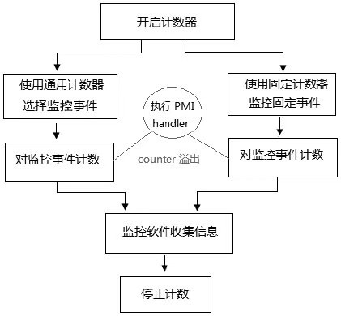

<!-- @import "[TOC]" {cmd="toc" depthFrom=1 depthTo=6 orderedList=false} -->

<!-- code_chunk_output -->

- [1. 以事件监控为核心](#1-以事件监控为核心)
  - [1.1. 事件监控流程](#11-事件监控流程)
  - [计数器](#计数器)
- [2. 性能监控事件分类](#2-性能监控事件分类)
- [3. 确定处理器的 Model](#3-确定处理器的-model)

<!-- /code_chunk_output -->

# 1. 以事件监控为核心

**性能监控机制**中以**事件监控机制**为**核心**, 对发生的事件进行统计.

## 1.1. 事件监控流程

典型的, **性能分析软件**可以使用**监控事件机制**, 对**目标软件**在执行过程中的**某些事件**进行监控. 性能分析软件**收集和分析目标软件**的**事件发生次数**.

如上所示: 对**发生事件统计前**, 要**开启计数器！！！** 和**选择监控的事件！！！**, Intel 为不同架构的处理器定义了**多种多样的监控事件**.

## 计数器

在 Intel 平台上, 使用**两种 counter(计数器**).

1) `general-purpose PMC`(Performance Monitor Counter): **通用的性能监控计数器**

2) `Fixed-function counter`(**固定用途的性能监控计数器**): Fixed-function 计数器**功能有限**, 但使用非常简单.

**软件中可以设定**, 当 **counter 发生溢出**时产生 **PMI！！！(Performance Monitoring Interrupt**)或者 **PEBS！！！中断**来进行相应处理. **PMI 中断**和 **PEBS 中断**都使用 **PMI handler** 进行处理.

**PMI**是**可屏蔽的 local APIC 中的本地中断源(LVT！！！**), 在 **LVT Performance monitor 寄存器**中设置.

# 2. 性能监控事件分类

在 Intel 处理器上, **performance monitoring 机制**分为**两大类**.

1) `non-architectural`(**非架构化**): 从 Pentium 处理器开始引入, 包括早期的 P6 家族、Pentium4 家族和 Xeon 处理器.

2) `architectural`(**架构化**): 由 Core 微架构开始支持 architectural 化的 performance monitoring 机制. 从最初的 Core Sole 和 Core Duo 处理器开始支持.

**non\-architectural**的**性能监控机制**是**与处理器 Model 相关**的, 也就是说**不同的处理器 Model**可能会**不一致(！！！**). 而 **architectural 的性能监控机制**在**各个处理器 Model**中保持**向下兼容**.

而在**越往后**的微架构处理器中, **architectural 化**的**性能监控机制都得到增强**, 越新的处理器所支持的功能可能会越强大.

可以推广至其他的处理器机制, 例如: **non\-architectural 化**的**MSR 寄存器**在各个处理器 Model 中**地址是不同的**(或者不同 Model 的处理器提供不同的 MSR 寄存器), 而 architectural 化的 MSR 寄存器是保持向下兼容的, 后续的处理器将增强.

# 3. 确定处理器的 Model

我们在之前已经多次提及确定处理器的 Model, 必须从 `DisplayFamily_DisplayModel` 的值来确定, 请参考 4.4 节所述.

在本章中主要围绕 `06_25H`(即 **Westmere 架构**)模型进行探讨, Westmere 架构继承于 Nehalem 架构, 因此关于 Nehalem 架构的所有探讨均适合于 Westmere 架构, 同时**大部分也适合于 Sandy Bridge 架构**.