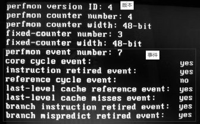
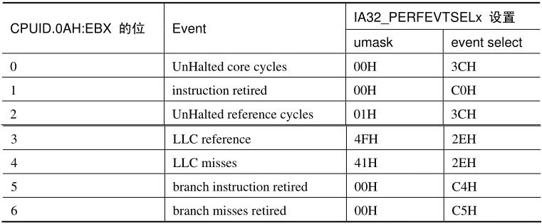

<!-- @import "[TOC]" {cmd="toc" depthFrom=1 depthTo=6 orderedList=false} -->

<!-- code_chunk_output -->

- [1. 性能监控的多个版本](#1-性能监控的多个版本)
- [2. 确定处理器所支持的功能: 0ah](#2-确定处理器所支持的功能-0ah)
  - [2.1. Linux 下查看](#21-linux-下查看)
  - [2.2. 简单实验](#22-简单实验)
- [3. IA32_PMCx 寄存器在各版本中的数量: general-purpose counter 寄存器](#3-ia32_pmcx-寄存器在各版本中的数量-general-purpose-counter-寄存器)
- [4. IA32_PMCx 寄存器的宽度](#4-ia32_pmcx-寄存器的宽度)
  - [4.1. IA32_PMCx 寄存器 full-width 值](#41-ia32_pmcx-寄存器-full-width-值)
- [5. 架构化的事件(architectural event)](#5-架构化的事件architectural-event)

<!-- /code_chunk_output -->

下面内容都是**基于 architectural 的性能监控机制**.

# 1. 性能监控的多个版本

在**architectural 化**的**性能监控机制**中, 由于后续的处理器得到增强. 因此产生了**数个版本**的**performance monitoring 机制**.

Intel64 手册上介绍了**3 个版本**.

1) **版本 1**: 由 **Core solo** 和 **Core duo** 处理器开始.

2) **版本 2**: 由基于**Core 微架构**的**T7700 处理器**开始.

3) **版本 3**: 似乎是由 Atom 处理器开始支持.

不肯定这三个版本是从何时开始引入, 可以肯定的是版本一是由 Core Sole 和 Core Duo 处理器开始引入的.

# 2. 确定处理器所支持的功能: 0ah

**CPUID 指令**的 **0AH leaf** 可以查询处理器所支持的 performance monitoring 机制的总体功能, `CPUID.0AH` 叶返回包括下面的细节.

```
# cpuid -l 0ah -1 -r
Disclaimer: cpuid may not support decoding of all cpuid registers.
CPU:
   0x00000000 0x00: eax=0x0000000f ebx=0x756e6547 ecx=0x6c65746e edx=0x49656e69
```

1) `EAX[7: 0]`: 处理器所支持 performance monitoring 的**版本 ID**.

2) `EAX[15: 8]`: **每个 logical processor(逻辑处理器！！！**)包含 **general\-purpose counter 寄存器的数量**, 也就是有多少个 **IA32\_PMCx 寄存器(！！！**).

3) `EAX[23: 16]`: **general\-purpose counter 寄存器**的**有效宽度**. **通用监控计数器**.

4) `EAX[31: 24]`: 所支持的**预定义的 event 的数量！！！**(见后面的 15.2.5 节描述).

5) `EDX[4: 0]`: 所支持的 **fixed\-function counter 寄存器**的**数量**. **固定用途计数器**.

6) `EDX[12: 5]`: **fixed\-function counter 寄存器**的**有效宽度**.

7) 在**EBX 寄存器**中**指示预定义的 event 是否为效**.

其中 `EAX[15: 8]` 得到 `IA32_PMCx` 寄存器的数量, 也意味着 **IA32\_PERFEVTSELx 寄存器的数量**, 它们是**配套出现**的. CPUID 0AH leaf 的具体信息可以查看 Intel64 手册中关于 CPUID 指令的介绍.

## 2.1. Linux 下查看

```
# dmesg | grep "Performance Events"
[    0.107979] Performance Events: XSAVE Architectural LBR, PEBS fmt4+-baseline,  AnyThread deprecated, Alderlake Hybrid events, 32-deep LBR, full-width counters, Intel PMU driver.
```

## 2.2. 简单实验

>实验 15-1: 枚举 CPUID 0A leaf 信息

在继续往下之前, 我们先来确定处理器的以上信息, 在这个实验里使用 CPUID 0A leaf 来输出上述的这些信息.

这里不再贴出代码, 实验的代码在 topic15\ex15-1\protected.asm 里, 代码里只是简单地调用 dump\_CPUID\_leaf\_0a()函数来打印信息, 这个函数实现在 lib\cpuid.asm 文件里.

下面是在笔者的 Westmere 微架构 Core i5 处理器上所得到的信息.



版本 ID 为 4(实际上属于**版本 3**), 支持 4 个 IA32\_PMC 和 IA32\_PERFEVTSEL 寄存器, 分别为`IA32_PMC0`到`IA32_PMC3`, IA32\_PERFEVTSEL0 到 IA32\_PERFEVTSEL3.

每个 IA32\_PMC 寄存器有效的宽度为 48 位, 还有 3 个 fixed\-function counter 寄存器, 它们的宽度也是 48 位的.

下面还打印出所支持的**7 个 event**数量, 其中 reference cycle event 是不可用的, 这些事件是**pre\-defined(预定义**)architectural 化的 event.

# 3. IA32_PMCx 寄存器在各版本中的数量: general-purpose counter 寄存器

在 Intel64 手册的**MSR 寄存器表**中列举了 architectural 化的数个 `IA32_PMCx` 寄存器, 它们所需要支持的条件如下.

>支持**编号 x**的**PMC 寄存器**必须`CPUID.0AH: EAX[7: 0]`>x(！！！这是版本 ID).

举例来说, 如果需要支持**编号为 3 的 PMC 寄存器**(即 IA32\_PMC3 寄存器), 那么`EAX[7: 0]`>3. 因此我们看到**版本 ID 为 4**, 支持 4 个 IA32\_PMC 寄存器.

下面是 IA32\_PMC 寄存器在各版本中的数量.

1) 在**Core Solo 和 Core Duo**处理器的**版本 1**中, 只有**1 个 IA32\_PMC 寄存器**, 即**IA32\_PMC0**.

2) 在**T7700**处理器的**版本 2**中有**2 个**, 即**IA32\_PMC0**和**IA32\_PMC1**.

3) 在**Atom 处理器**的版本 3 中也只支持 2 个, 即 IA32\_PMC0 和 IA32\_PMC1.

4) 在**Core i7**处理器版本 3 中支持 4 个, 即 IA32\_PMC0 到 IA32\_PMC3.

`CPUID.0A: EAX[7: 0]`的值决定支持多少个`IA32_PMCx`寄存器, `EAX[7: 0]`>3 表示**最少可支持 4 个**, 因此实际上`EAX[7: 0]`=4 时(如上所示)并**不意味**着有版本 4 的出现, 它只是表示**支持 4 个 PMC 寄存器**.

因此上面的 Core i7 处理器的版本 3, 它所返回的 version ID 值应该为 4(支持 4 个 PMC 寄存器).

# 4. IA32_PMCx 寄存器的宽度

在上面的结果里, 显示`IA32_PMCx`寄存器的**宽度为 48 位**, 可是这里却并**不意味着一定可以使用 48 位值**, 有以下的情形.

1) 当**读 IA32\_PMCx 寄存器**时(使用**RDMSR 指令！！！**), 读出来的值是 full\-width, 这里是 48 位值.

2) 当**写 IA32\_PMCx 寄存器**时(使用**WRMSR 指令！！！**), 只能写入低 32 位值, 高 32 位是符号扩展位.

这个 full\-width 就是从`CPUID.0AH: EAX[23: 16]`里获得的值, 在本例里是 48 位值.

## 4.1. IA32_PMCx 寄存器 full-width 值

虽然在`CPUID.0AH: EAX[23: 16]`获得的值显示 IA32\_PMC 寄存器支持**48 位**的宽度, 然而 Intel 明确指出:

- 当`IA32_PERF_CAPABILITIES[13]`=1 时, 才可以写入 full\-width 宽度的值(如本例中的 48 位宽度).

IA32\_PERF\_CAPABILITIES 寄存器的 bit 13 位是 FW\_WRITE(full\-width write)标志位.

由于 IA32\_PREF\_CAPABILITIES 寄存器是只读(only\-read)寄存器, 因此最终可写入的宽度由这个 FW\_WRITE 位来决定.

在 Sandy Bridge 之前的微架构(包括 Westmere 架构)并不支持 full\-width 写入(即 FW_WRITE 位为 0 值).

当`IA32_PERF_CAPABILITIES[13]`=1 时(以 full\-width 是 48 为例).

1) `IA32_PMCx`寄存器的`[47: 0]`可以写入 48 位的值.

2) `IA32_PMCx`寄存器的`[63: 48]`是 0 值.

当`IA32_PERF_CAPABILITIES[13]`=0 时(以 full\-width 是 48 位为例).

1) `IA32_PMCx`寄存器的`[31: 0]`可以写入 32 位值.

2) `IA32_PMCx`寄存器的`[47: 32]`位是符号扩展位, `[63: 48]`位为 0 值.

当`IA32_PERF_CAPABILITIES[13]`=1 时, 软件也可以写入 IA32\_PMCx 寄存器的 full\-width 值的别名寄存器 IA32\_A\_PMCx(地址从 4C1H 开始), 关于 IA32\_PERF\_CAPABILITIES 寄存器的结构请看 14.4.1 节.

# 5. 架构化的事件(architectural event)

从`CPUID.0AH: EAX[31: 24]`获得所支持的**pre\-defined(预定义**)的**architectural(架构化的)event 数量**.

**每个事件**对应于`EBX[6: 0]`域的**每个位**, 因此可以从 EBX 低 7 位查询到预定义的 event 对于处理器是否 available(可用).

在上面的运行结果中, 可看到在笔者的 Westmere 微架构 Core i5 移动处理器**reference cycle event 是无效**的.

在**性能监控**中, 对**预定义的事件**进行**监控**需要在**相应的 IA32\_PERFEVTSELx 寄存器(！！！**)里做出设置, 例如: 需要在**IA32\_PMC1 寄存器**中**监控 core cycle 事件**, 那么我们需要在**IA32\_PERFEVTSEL1 寄存器**中设置对 core cycle 事件的监控.



reference cycle 事件用来测量 bus clock cycle, 据 Intel64 手册说, 仅实现在 Core 2 家族及 Core Solo 和 Core Duo 处理器, 因此在笔者的处理器上并不支持.

上表中的**umask**和**event select**是在**IA32\_PERFEVTSELx 寄存器**中的设置.

