<!-- @import "[TOC]" {cmd="toc" depthFrom=1 depthTo=6 orderedList=false} -->

<!-- code_chunk_output -->

- [1. 概述](#1-概述)
- [2. 相关的物理寄存器](#2-相关的物理寄存器)
- [3. counter(计数器)](#3-counter计数器)
  - [3.1. 通用 IA32_PMCx 与固定 IA32_FIXED_CTRx 计数寄存器](#31-通用-ia32_pmcx-与固定-ia32_fixed_ctrx-计数寄存器)
  - [3.2. 触发 PMI: 通用和固定](#32-触发-pmi-通用和固定)
  - [3.3. 触发 PEBS 中断: 通用计数器](#33-触发-pebs-中断-通用计数器)
- [4. 开启计数器](#4-开启计数器)
  - [4.1. 全局控制器](#41-全局控制器)
  - [4.2. 计数器对应的控制器](#42-计数器对应的控制器)
    - [4.2.1. 通用计数器控制器(其实是事件选择寄存器)](#421-通用计数器控制器其实是事件选择寄存器)
    - [4.2.2. 固定用途计数器控制器](#422-固定用途计数器控制器)
- [5. 全局控制器](#5-全局控制器)
- [6. 通用计数控制器(事件选择寄存器)](#6-通用计数控制器事件选择寄存器)
  - [6.1. Event Select(bit7~bit0)](#61-event-selectbit7bit0)
  - [6.2. Unit mask(bit15~bit8)](#62-unit-maskbit15bit8)
  - [6.3. USR(bit16)](#63-usrbit16)
  - [6.4. OS(bit17)](#64-osbit17)
  - [6.5. E(bit18)](#65-ebit18)
  - [6.6. PC(bit19)](#66-pcbit19)
  - [6.7. INT(bit20)](#67-intbit20)
  - [6.8. ANY(bit21)](#68-anybit21)
  - [6.9. EN(bit22)](#69-enbit22)
  - [6.10. INV(bit23)](#610-invbit23)
  - [6.11. Counter mask(bit31~bit24)](#611-counter-maskbit31bit24)
  - [6.12. 启用通用计数器代码](#612-启用通用计数器代码)
- [7. 固定用途计数控制器](#7-固定用途计数控制器)
  - [7.1. EN 域](#71-en-域)
  - [7.2. ANY 位](#72-any-位)
  - [7.3. PMI 位](#73-pmi-位)
  - [7.4. 启用固定用途计数器代码](#74-启用固定用途计数器代码)
  - [7.5. 同时开启多个计数器](#75-同时开启多个计数器)
- [8. 全局状态寄存器](#8-全局状态寄存器)
  - [8.1. OvfBuffer 位(bit62)](#81-ovfbuffer-位bit62)
  - [8.2. CondChgd 位(bit63)](#82-condchgd-位bit63)
  - [8.3. 值得注意](#83-值得注意)
- [9. 全局溢出控制器](#9-全局溢出控制器)
- [10. 使用 Performance monitoring 的例子](#10-使用-performance-monitoring-的例子)
  - [10.1. 统计函数执行了多少条指令](#101-统计函数执行了多少条指令)
    - [10.1.1. 开启 IA32_PMC0 计数器](#1011-开启-ia32_pmc0-计数器)
    - [10.1.2. 收集信息](#1012-收集信息)
  - [10.2. 测试 counter 溢出时的 PMI handler](#102-测试-counter-溢出时的-pmi-handler)
    - [10.2.1. 设置 PMI handler](#1021-设置-pmi-handler)
    - [10.2.2. 编写 PMI handler](#1022-编写-pmi-handler)
    - [10.2.3. 清 counter 溢出标志位](#1023-清-counter-溢出标志位)
    - [10.2.4. 设置 counter 溢出条件: 计数器写入最大值](#1024-设置-counter-溢出条件-计数器写入最大值)
  - [10.3. 设置的事件](#103-设置的事件)
- [11. 在 PMI 中冻结计数器](#11-在-pmi-中冻结计数器)
  - [11.1. IA32_DEUBGCTL 寄存器](#111-ia32_deubgctl-寄存器)
  - [11.2. 清 LVT Performance monitoring 寄存器 mask](#112-清-lvt-performance-monitoring-寄存器-mask)
  - [11.3. 设置 IA32_DEBUGCTL 寄存器](#113-设置-ia32_debugctl-寄存器)

<!-- /code_chunk_output -->

# 1. 概述

在这一节里, 我们重点关注在**Nehalem 架构**的**性能监控机制**, 也适用于**后续的 Westmere 架构**及**SandyBridge 架构**. 而在**SandyBridge 架构**和**IvyBridge 架构**里, performance monitor 机制进一步得到增强.

在**Nehalem 架构**下, 处理器支持**版本 3**的**性能监控**, 从`CPUID.0AH: EAX[7: 0]`返回的**ID 值是 4**, 表明支持**4 个 PMC 寄存器**(即`general-purpose counter`).

# 2. 相关的物理寄存器

在**版本 3**下, 支持下面的物理资源(需要从`CPUID 0A leaf`里确认).

1) **4 个 PMC 通用！！！性能监控计数器寄存器**: 从`IA32_PMC0`到`IA32_PMC3`.

2) 4 个**对应的 PERFEVTSEL 事件选择寄存器**: 从`IA32_PERFEVTSEL0`到`IA32_PERFEVTSEL3`.

3) **3 个 Fixed\-function(固定用途！！！)计数器寄存器**: 从`IA32_FIXED_CTR0`到`IA32_FIXED_CTR2`.

还有**4 个相应的配置控制寄存器(！！！**).

1) **Fixed\-function 计数器的控制器**: IA32\_FIXED\_CTR\_CTRL 寄存器.

2) 性能监控机制的**全局控制器**: IA32\_PERF\_GLOBAL\_CTRL 寄存器.

3) 性能监控机制的**全局状态器**: IA32\_PERF\_GLOBAL\_STATUS 寄存器.

4) 性能监控机制的**全局溢出控制器**: IA32\_PERF\_GLOBAL\_OVF\_CTRL 寄存器.

在 Nehalem 架构下**每个 PMC(通用性能监控计数器**)已经被扩展为 48 位(由`CPUID.0AH: EAX[23: 16]`查询可得).

**PMC 寄存器**可以用于**architectural 化**的**性能监控事件(！！！**)和**非 architectural 化的性能监控事件(！！！**), 而**Fixed\-function 的 counter**仅用于**architectural 的性能监控事件(！！！**).

# 3. counter(计数器)

在**版本 3**的性能监控机制里支持**两种 counter**.

1) general\-purpose PMC(Performance Monitoring Counter): **通用的性能监控计数器**

2) Fixed\-function counter: **固定用途的性能监控计数器**.

## 3.1. 通用 IA32_PMCx 与固定 IA32_FIXED_CTRx 计数寄存器

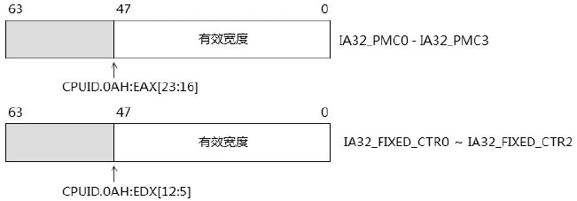

在 Nehalem 和 Westmere 架构中, IA32\_PMC 和 IA32\_FIXED\_CTR 寄存器的宽度都是 48 位, 分别由`CPUID.0AH: EAX[23: 16]`和`CPUID.0AH: EDX[12: 5]`中查询得到.

## 3.2. 触发 PMI: 通用和固定

**48 位宽**的`IA32_PMC`和`IA32_FIXED_CTR`寄存器**最大计数值**是**0x0000FFFF\_FFFFFFFF**, 当达到它们的**最大计数值**, 并且从**最大值回绕到 0 值**时(即**counter 产生溢出**), 就会**引发 PMI(Performance monitoring interrupt)中断**的产生.

注: 只有到达**最大计数值溢出**才产生中断.

**通用计数器**和**固定用途计数器**都支持 PMI 中断.

当**counter 溢出**后, **CPU 自动(！！！**)通过**Local APIC 的 LVT 寄存器中的 LVT Performance Counter 寄存器**产生**本地中断(local interrupt**), 该寄存器提供中断相关信息, 包括中断向量等, 再通过中断向量查找 IDT, 从而找到代码入口.

所以**软件**需要设置**LVT Performance Counter 寄存器**以及**IDT 中相应描述符**, **向量号是自己定义**的, 向量号定义不能使用 Intel 保留的, 给 LVT 设置时候会产生异常.

## 3.3. 触发 PEBS 中断: 通用计数器

在 Nehalem 和 Westmere 架构下的**4 个通用计数器**`IA32_PMC0`到`IA32_PMC3`可以设置**当计数器溢出**时**触发 PEBS 中断**, 由**IA32\_PEBS\_ENABLE 寄存器设置(！！！**), 如下所示.

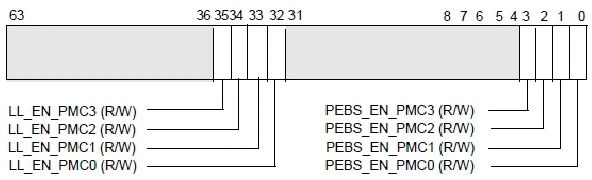

触发 PEBS 中断的计数器**只使用在通用计数器(！！！**)上, 由**IA32\_PEBS\_ENABLE 寄存器**的**bit3 到 bit0 设置**, 对应于**相应的 IA32\_PMCx 寄存器**.

注: 只有到达最大计数值溢出才产生中断.

**固定用途**的 IA32\_FIXED\_CTR 计数器**不支持 PEBS 中断**.

当**PEBS\_EN\_PMCx 位置位(！！！**)时, IA32\_PMCx 溢出时**产生 PEBS 中断而不是 PMI(！！！**).

# 4. 开启计数器

在**使用这些计数器之前**, 需要通过`IA32_PERF_GLOBAL_CTRL`寄存器和**各自对应的控制器(！！！**)来设置开启, 如下所示.

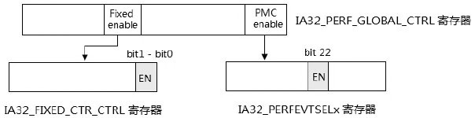

## 4.1. 全局控制器

**IA32\_PERF\_GLOBAL\_CTRL**寄存器是性能监控机制的**全局总控制器**.

## 4.2. 计数器对应的控制器

### 4.2.1. 通用计数器控制器(其实是事件选择寄存器)

**IA32\_PMC 计数器**的开启需**IA32\_PERF\_GLOBAL\_CTRL**配合**IA32\_PERFEVTSELx 寄存器(事件选择寄存器！！！**)的**EN 位(bit 22**)同时置位.

### 4.2.2. 固定用途计数器控制器

同样, **IA32\_FIXED\_CTRx 寄存器**的**开启**需要**IA32\_PERF\_GLOBAL\_CTRL 寄存器**配合**IA32\_FIXED\_CTR\_CTRL 寄存器的 EN 位**同时置位.

# 5. 全局控制器

在 performance monitor 机制里, 全局控制器 IA32\_PERF\_GLOBAL\_CTRL 寄存器起了**总开关的作用**.

它控制着**IA32\_PMCx 计数器**与**IA32\_FIXED\_CTRx 计数器**的**开启**.

它的结构如下所示.

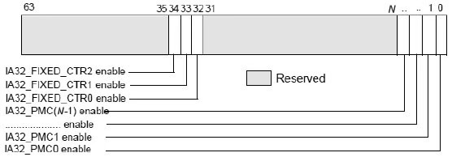

IA32\_PERF\_GLOBAL_CTRL 寄存器中的**每一位都是 enable 位**.

1) 寄存器的 bit0 到 bit (N\-1)位对应于 IA32\_PMC0 至 IA32\_PMC(N\-1)寄存器, 这个 N 值是与架构相关的, 需要通过 CPUID 0A leaf 来查询所支持的 PMC 寄存器数量.

2) **bit 32 到 bit 34 位**对应于**IA32\_FIXED\_CTR0 到 IA32\_FIXED\_CTR2 寄存器**.

在 Nehalem 和 Westmere 架构上, 这个 N 值是 3(支持 0 到 3 号的 PMC 寄存器). 当这些位为 0 时, 对应于 counter(计数器)寄存器是 disable(关闭)的. 当这些位为 1 时, counter 的开启**还依赖于各自的控制器**.

# 6. 通用计数控制器(事件选择寄存器)

**每个 IA32\_PMCx 寄存器**都有**对应的一个 IA32\_PERFEVTSELx 寄存器**, 这些寄存器控制着 IA32\_PMCx 寄存器**如何计数**. 它的结构如下.

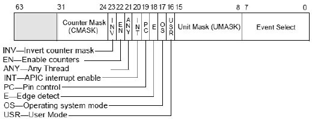

## 6.1. Event Select(bit7~bit0)

这个 8 位值设置**需要监控的事件号**, 这个事件可以是前面表里所列举的**预定义 architectural 化事件**或者是**non\-architectural 化的事件(与处理器 Model 有关, 不同处理器 model 可能会不一致！！！**).

## 6.2. Unit mask(bit15~bit8)

这个域用来选择在**监控 Event 下的监控条件**, 一个事件下会对应**多个监控条件(或子事件**), 每个条件对应一个 umask 值. **Event select**配合**Umask 域**确定**唯一的监控事件编号(！！！**).

## 6.3. USR(bit16)

设置这个位使得处理器**仅运行在 1、2 或 3 级权限**下进行监控.

## 6.4. OS(bit17)

设置这个位使得处理器仅运行在**0 级权限**下进行监控.

## 6.5. E(bit18)

当设置这个位时, 允许处理器对**监控事件进行计数**基于**edge 触发模式(从断开到接通**).

## 6.6. PC(bit19)

置位时, 当被监控的事件发生, 处理器增加计数时进行 toggle(拴紧)PMi pin 的操作. 为 0 时, 在事件 counter(计数器)发生溢出时进行拴紧 PMi pin 操作.

## 6.7. INT(bit20)

当**置位**时, 发生**counter 溢出**时产生**local APIC**的**Performance monitor counter 中断(！！！**).

## 6.8. ANY(bit21)

这个位的设置, 允许**发生事件后**共享**一个 processor core**的**所有 logical processor 进行计数**. 为 0 时, 仅在**相应的 logical processor 进行计数**(关于 multi\-threading 的内容, 请参考 18.4.2 节).

## 6.9. EN(bit22)

为 1 时, **开启事件监控的计数器**, 为 0 时关闭计数器.

## 6.10. INV(bit23)

为 1 时, **使用相反的 counter mask 条件**.

## 6.11. Counter mask(bit31~bit24)

计数**条件域**, 当这个域不为 0 时(设置一个条件值), 当**事件发生的次数大于等于这个条件值**时, counter(计数器)加 1, 否则不增加.

## 6.12. 启用通用计数器代码

当我们需要开启 IA32\_PMC0 寄存器时, 如下面的代码所示.

```assembly
;  设置 IA32_PERF_GLOBAL_CTRL
       mov ecx, IA32_PERF_GLOBAL_CTRL
       rdmsr
       bts eax, 0       ;  开启 IA32_PMC0
       wrmsr
;  设置 IA32_PERFEVTSEL0 寄存器
       mov ecx, IA32_PERFEVTSEL0
       mov eax, 5300c0H     ;  EN=1, INT=1, USR=OS=1, umask=0, event select=c0
       mov edx, 0
       wrmsr
```

代码里分别置**IA32\_PERF\_GLOBAL\_CTRL 寄存器的 bit 0 位**, 以及设置**IA32\_PERFEVTSEL0 寄存器的 EN 位**. 只有当这两个位**同时为 1**时, **IA32\_PMC0 计数器**才可以开启.

当然, 如果先设置 IA32\_PERFEVTSEL0 寄存器, 然后再设置 IA32\_PERF\_GLOBAL\_CTRL 寄存器, 效果是完全一样的. 并且这样做有更大的弹性(这是 Intel 推荐的步骤).

这个**Event select 值为 C0H**, **umask 为 00H**, 这是**指令执行完毕退出的事件**(也就是**监控执行了多少条指令**).

# 7. 固定用途计数控制器

**3 个 fixed\-function 计数器** `IA32\_FIXED\_CTR0` 到`IA32\_FIXED\_CTR2` 的开启还需要`IA32\_FIXED\_CTR\_CTRL`寄存器来控制, 如下所示.

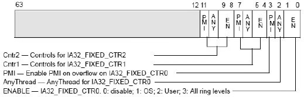

在 IA32\_FIXED\_CTR\_CTRL 寄存器里分为**三个部分**, 分别控制 0、1 及 2 号 Fixed function 计数器.

1) `bit [3:0]`: 控制 IA32\_FIXED\_CTR0 寄存器.

2) `bit [7:4]`: 控制 IA32\_FIXED\_CTR1 寄存器.

3) `bit [11:8]`: 控制 IA32\_FIXED\_CTR2 寄存器.

## 7.1. EN 域

**EN 域为 0**时, **关闭**Fixed\-function 计数器. EN 域为**1**时, 当**监控事件**发生在**0 级**权限时, **counter 加 1**. EN 域为**2**时, 当**监控事件**发生在**1、2 及 3 权限**时, counter 加 1. EN 域为**3**时, 发生监控事件, counter 加 1(也就是**CPL 被忽略**).

## 7.2. ANY 位

ANY 置位时, 当**发生符合的监控事件**时, 共享**同一个 processor core**的**所有 logical processor**的**counter 加 1**. 否则**只在一个 logical processor**上的 counter 加 1.

## 7.3. PMI 位

PMI 置位时, 当发生**counter 溢出**时, 产生**PMI(Performance monitor interrupt**), 这个中断由**local APIC**的**LVT Performance counter 寄存器设置(！！！**).

## 7.4. 启用固定用途计数器代码

当我们需要开启 IA32\_FIXED\_CTR0 寄存器时, 如下面代码所示.

```assembly
;  设置 IA32_PERF_GLOBAL_CTRL
      mov ecx, IA32_PERF_GLOBAL_CTRL
       rdmsr
       bts edx, 0        ;  开启 IA32_FIXED_CTR0
       wrmsr
;  设置 IA32_FIXED_CTR_CTRL 寄存器
       mov ecx, IA32_FIXED_CTR_CTRL
       rdmsr
       or eax, 0BH        ;  EN=1, all level
       wrmsr
```

置 IA32\_PERF\_GLOBAL\_CTRL 寄存器的 bit32 位(`edx[0]`), 以及 IA32\_FIXED\_CTR\_CTRL 寄存器的 bit4 位(IA32\_FIXED\_CTR0 的 enable 位).

## 7.5. 同时开启多个计数器

利用**IA32\_PERF\_GLOBAL\_CTRL 寄存器的总开关**的特色, 可以同时**开启多个计数器**, 如下代码是**同时开启 IA32\_PMC0**与**IA32\_FIXED\_CTR0**的示例.

```assembly
;  设置 IA32_PERFEVTSEL0 寄存器
      mov ecx, IA32_PERFEVTSEL0
      mov eax, 5300c0H       ;  EN =1
      mov edx, 0
      wrmsr
;  设置 IA32_FIXED_CTR_CTRL 寄存器
      mov ecx, IA32_FIXED_CTR_CTRL
      rdmsr
      or eax, 0BH         ;  EN=1, all level
      wrmsr
;  同时开启 IA32_PMC 与 IA32_FIXED_CTR 计数器
      mov ecx IA32_PERF_GLOBAL_CTRL
      rmdmsr
      bts eax, 0         ;  IA32_PMC0
      bts edx, 0         ;  IA32_FIXED_CTR0
      Wrmsr          ;  同时开启
```

这样做的前提条件是 IA32\_PERF\_GLOBAL\_CTR 寄存器在初始化时全被清 0(关闭所有计数器). 否则在每个计数器控制器设置时已经开启计数了.

# 8. 全局状态寄存器

IA32\_PERF\_GLOBAL\_STATUS 寄存器能反映**所有 counter 的状态(是否溢出**), 如下所示.

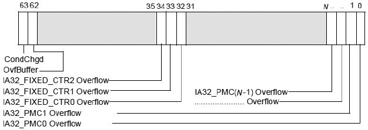

IA32\_PERF\_GLOBAL\_STATUS 寄存器的**每一位为 1**时, 指示对应的 counter 产生了溢出. 这个寄存器还有两个额外的位.

## 8.1. OvfBuffer 位(bit62)

当**开启 PEBS(Precise Event Based Sampling**)机制时, 由**counter 溢出**而**触发 PEBS 中断**, 处理器在**DS 区域**的**PEBS buffer**写入**PEBS 记录**. DS 区域的 PEBS buffer 溢出时 OvfBuffer 标志位将会被置位(关于 PEBS buffer 另参考 14.9 节 BTS 机制的相关描述).

例如: 在 IA32\_PEBS\_ENABLE[0]=1 时, IA32\_PMC0 发生溢出则会产生 PEBS 中断, 如果 PEBS buffer 产生溢出会使 OvfBuffer 位被置位, 而 IA32\_PMC0 Overflow 位则被清位.

## 8.2. CondChgd 位(bit63)

这个位为 1 时, 指示性能监控的状态已经被改变.

由于 counter 的溢出会产生 PMI(Performance monitoring interrupt)或者 PEBS 中断(在开启的时候), PMI 和 PEBS 中断使用同一个 vector, 因此在 handler 里需要判断是为 PMI 服务还是为 PEBS 服务.

根据 IA32\_PERF\_GLOBAL\_STATUS 的溢出标志位进行判断.

1) 当 IA32\_PMC 或 IA32\_FIXED\_CTR 的 Overflow 标志置位, 则产生 PMI.

2) 当 OvfBuffer 标志置位, 则表示由于 PEBS buffer 溢出而产生 DS 中断.

## 8.3. 值得注意

IA32\_PERF\_GLOBAL\_STATUS 是只读寄存器, 处理器从不会清这些标志位, 溢出标志的清位是软件的职责.

# 9. 全局溢出控制器

当发生**counter 溢出**进入**PMI**后, 软件可以使用**IA32\_PERF\_GLOBAL\_OVF\_CTRL(全局溢出控制器**)寄存器来**清理这些溢出标志**.

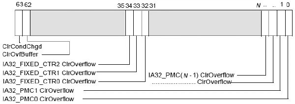

`IA32_PERF_GLOBAL_OVF_CTRL`寄存器的每一位对应于`IA32_PERF_GLOBAL_STATUS`寄存器的一个 Overflow 位. 当向`IA32_PERF_GLOBAL_OVF_CTRL`寄存器的某位写入 1 时, 处理器将清`IA32_PERF_GLOBAL_STATUS`寄存器的对应溢出位.

```assembly
mov ecx, IA32_PERF_GLOBAL_OVF_CTRL
rdmsr
bts eax, 0     ;  置 1, 清 IA32_PMC0 溢出标志位
wrmsr
```

在上面这段代码里, 向 IA32\_PERF\_GLOBAL\_OVF\_CTRL 寄存器的 bit 0 位写入 1 值, 那么处理器将清对应的 IA32\_PMC0 溢出标志.

在 Intel64 手册里, 推荐在下面的情况下**清溢出标志**.

1) 选择**新的监控事件**.

2) 重新设置 counter 值继续监控或抽样(PEBS).

3) 关闭 counter, 停止监控或抽样(PEBS).

# 10. 使用 Performance monitoring 的例子

我们已经对 Intel 的性能监控机制有了初步的认识, 这里我们将有**两个实验**.

1) 使用**counter**来统计函数**执行了多少条指令**.

2) 测试**counter 溢出**时调用**PMI(Performance monitoring interrupt)handler**.

我们使用这两个实验测试来了解性能监控是如何运作的.

## 10.1. 统计函数执行了多少条指令

>实验 15\-2: 测试 IA32\_PMC0 计数器

在这个实验里, 我们使用 IA32\_PMC0 计数器统计一个函数执行了多少条指令, 这个测试函数如下.

代码清单 15-1(topic15\ex15-2\protected.asm):

```assembly
; ;  测试函数:
Foo:
      mov esi, msg
      call puts   ;  打印一条信息
      ret
```

这个测试函数只是用来简单地打印一条信息.

### 10.1.1. 开启 IA32_PMC0 计数器

我们需要对`IA32_PERF_GLOBAL_CTRL`寄存器和`IA32_PERFEVTSEL0`寄存器进行设置.

代码清单 15-2(topic15\ex15-2\protected.asm):

```assembly
; 设置 IA32_PERF_GLOBAL_CTRL 寄存器
      mov ecx, IA32_PERF_GLOBAL_CTRL
      rdmsr
      bts eax, 0     ; PMC0 enable, 开启 PMC0
      wrmsr
      call dump_pmc    ; 打印 PMC 计数器
; 设置 IA32_PERFEVTSEL0 寄存器
      mov ecx, IA32_PERFEVTSEL0
      mov eax, 5300c0H   ; EN=1, INT=1, USR=OS=1, umask=0, event select=c0H
      mov edx, 0
      wrmsr
```

在**IA32\_PERFEVTSEL0 寄存器**里设置的**监控事件是 Event select 为 C0H(指令退出事件**)和**umask 值为 0**, **USR**和**OS 标志**都为**1(监控所有的权限级别**), 最重要的是**Enable 位为 1**.

当对`IA32_PERFEVTSEL0`寄存器**执行完 WRMSR！！！指令**后, 事件监控将**立即生效！！！**.

### 10.1.2. 收集信息

接下来, 我们就调用测试的函数.

代码清单 15\-3(topic15\ex15\-2\protected.asm):

```assembly
call foo      ;  调用测试函数
mov ecx, IA32_PERFEVTSEL0
rdmsr
btr eax, 22     ;  关闭 counter
wrmsr
call dump_pmc     ;  打印 PMC 计数器
```

调用完**测试函数**后, 将**IA32\_PMC0 计数器关闭**, 再**输出 PMC 计数器的值**.

下面是在笔者的 Westmere 架构 Core i5 处理器上的运行结果.

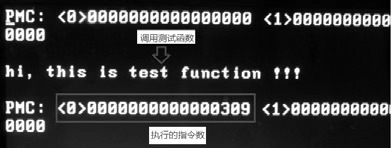

结果显示, **PMC0 的值为 0x309**, 这个值就是**执行的指令数！！！**, 包括了代码清单 15-3 中的**关闭 counter 计数器的 4 条指令**, 因此**foo()函数正确的执行指令数应该是 0x305(即 773 条指令**).

我们可以使用**Bochs 的调试功能**来**验证是否正确**, 下面是 Bochs 里的调试输出.

```
(0) [0x000000000000910f] 0018: 000000000000910f (unk. ctxt):
wrmsr                     ;  0f30
<Bochs: 27>
Next at t=156693000
(0) [0x0000000000009111] 0018: 0000000000009111 (unk. ctxt): call .+50
(0x00009148)    ;  e832000000
<Bochs: 28>
Next at t=156693773
(0) [0x0000000000009116] 0018: 0000000000009116 (unk. ctxt): mov ecx,
0x00000186       ;  b986010000
<Bochs: 29> ?156693773-156693000
0x305 773
<Bochs: 30>
```

我们看到在 Bochs 里显示, 执行完 WRMSR 指令后, 指令数是 156693000. 当执行完 foo()函数后, 指令数是 156693773. 它们的差刚好是 0x305 条.

没错！这个 counter 的值是正确的, 同时我们也注意到, 对于这个监控事件来说, 在**开启和关闭之间**的**任何指令都被统计**了(我们将在后面进行更详细的事件探讨).

## 10.2. 测试 counter 溢出时的 PMI handler

>实验 15-3: 测试 counter 溢出时的 PMI

下面, 我们来进行另一个实验测试, 我们需要人为地使 counter 产生溢出, 从而调用 PMI handler.

### 10.2.1. 设置 PMI handler

我们需要对 PMI 的**中断服务例程进行设置**, 如下.

代码清单 15-4(topic15\ex15-3\protected.asm):

```x86asm
    ;设置 APIC PMI handler
    ;这里定义的 APIC_PERFMON_VECTOR 是 0x33, 在文件 inc\protected.inc
    mov esi, APIC_PERFMON_VECTOR
    ; 中断处理函数
    mov edi, perfmon_handler
    call set_interrupt_handler    ;设置中断服务例程的 vector
```

**与一般的中断服务例程设置是相同**的, 使用`set_interrupt_handler()`函数在**IDT**里设置**相应的 interrupt 描述符！！！**(这个 set\_interrupt\_handler()函数实现在**lib\lib32.asm 库代码**里).

### 10.2.2. 编写 PMI handler

当然, 我们需要编写对应的中断服务例程, 下面是这个实验里使用的 PMI handler 代码.

代码清单 15-5(topic15\ex15-3\protected.asm):

```x86asm
; -------------------------------
;  perfmon handler
; ------------------------------
perfmon_handler:
      jmp do_perfmon_handler
pfh_msg1 db '>>> now: enter PMI handler', 10, 0
pfh_msg2 db 'exit the PMI handler <<<', 10, 0
do_perfmon_handler:
      STORE_CONTEXT                                ;  保存 context
      mov esi, pfh_msg1
      call puts
      call dump_perfmon       ;  打印 perfmon 所有寄存器
      RESET_COUNTER_OVERFLOW      ;  清 overflow 标志位
      mov esi, pfh_msg2
      call puts
do_perfmon_handler_done:
      RESTORE_CONTEXT                               ;  恢复 context
      btr DWORD [APIC_BASE + LVT_PERFMON], 16  ;  清 mask 位
      mov DWORD [APIC_BASE + EOI], 0            ;  发送 EOI 命令
      iret
```

作为示例, 这个 PMI handler 主要做下面几个工作.

1) **打印信息**: 为了便于观察打印了一些辅助信息, 也包括性能监控的寄存器.

2) 清`IA32_PMC0`**溢出标志位**: 通过宏`RESET_COUNTER_OVERFLOW`来实现清溢出标志.

3) 在退出前清 LVT performance monitor 寄存器的 mask 位, 允许下次 PMI handler 调用.

4) 发送**EOI 命令**: 通过**写 local APIC 的 EOI 寄存器**.

dump\_perfmon()函数实现在 lib\perfmon.asm 文件里. 关于 local APIC 的知识, 请参考第 18 章.

### 10.2.3. 清 counter 溢出标志位

当发生 counter 溢出产生 PMI 时, 在 PMI handler 里一项重要的工作是需要清计数器相对应的溢出标志位, 在实验 15\-3 中的 PMI handler 使用宏 RESET\_COUNTER\_OVERFLOW 来清位.

代码清单 15-6(inc\perfmon.inc):

```x86asm
; --------------------------------------------------------------
;  宏 RESET_COUNTER_OVERFLOW()
;  描述:
;        清 IA32_PERF_GLOBAL_STATUS 寄存器所有 overflow 标志位
; -------------------------------------------------------------
%macro RESET_COUNTER_OVERFLOW 0
      mov ecx, IA32_PERF_GLOBAL_OVF_CTRL
      mov eax, 0Fh      ;  IA32_PMCx overflow
      mov edx, 03h      ;  IA32_FIXED_CTRx overflow
      wrmsr
%endmacro
```

这个宏定义在 inc\perfmon.inc 头文件里, 将清 IA32\_PERF\_GLOBAL\_STATUS 寄存器的所有溢出标志位, 通过向 IA32\_PERF\_GLOBAL\_OVF\_CTRL 寄存器的相应位写入 1 值来达到.

### 10.2.4. 设置 counter 溢出条件: 计数器写入最大值

在实验设置里, 我们可以通过对**IA32\_PMC0 计数器**写入**最大值**来达到****快速触发 PMI****的目的, 这个写入最大值通过调用 write\_counter\_maximum()函数来实现.

代码清单 15-7(lib\perfmon.asm):

```assembly
; ----------------------------------------------
;  write_counter_maximum(): 写入 counter 的最大值
;  input:
;        esi-counter
; -----------------------------------------------
write_counter_maximum:
      call support_full_write         ;  是否支持写入最大值
      mov edi, 0FFFFh
      mov edx, 0
      test eax, eax
      cmovnz edx, edi
      mov eax, 0FFFFFFFFh
      mov ecx, esi
      wrmsr
      ret
```

在 Nehalem 和 Westmere 架构上, 我们使用 CPUID.0AH: EAX[23: 16]得到的 PMC 宽度为 48 位, 因此 counter 可接受的最大值是 0x0000FFFF\_FFFFFFFF(这个 48 位的最大值).

然而, 在不支持 full\-write 的情况下, 我们没办法直接写入 48 位值. 因此, 这个函数先检测处理器是否支持 full\-write 功能, 在不支持时只能写入 32 位值(最大值为 0FFFFFFFFh).

当然, 我们可以在代码里直接写入 32 位值, 代码如下所示.

```assembly
mov eax, 0FFFFFFFFh    ;  32 位最大值
mov edx, 0
mov ecx, IA32_PMC0
wrmsr
```

实际上 IA32\_PMC0[47: 32]是 bit31 位的符号扩展位, 因此写入 0FFFFFFFFh(32 位值), 结果同样是得到 48 位的最大值 0000FFFF\_FFFFFFFFh.

当**写入这个最大值**后, 后续的**任何一条指令执行完毕后都会产生 counter 的溢出**(当然需要在开启 counter 后).

## 10.3. 设置的事件

在这个实验里, 我们还是使用和实验 15\-2 相同的监控事件, 同样使用 IA32\_PMC0 计数器.

下面是在 Westmere 架构 Core i5 处理器上得到的运行结果.

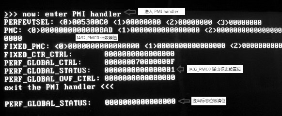

结果的输出信息来源于 PMI handler 里调用 dump\_perfmon()函数打印信息, 在 PMI handler 退出后, 打印 IA32\_PERF\_GLOBAL\_STATUS 寄存器的值.

我们看到(留意图中的几个标注):

1) 由于 counter 溢出, 进入了 PMI handler, 这个 counter 重新回到 0 值开始计数. 所显示的 IA32\_PMC0 的值是打印信息当前的计数值(除非使用 PMI 冻结计数功能).

2) 在 IA32\_PERF\_GLOBAL\_STATUS 寄存器里显示 bit 0 被置位, 指示 IA32\_PMC0 产生了溢出.

3) 由于我们在 PMI handler 里对溢出标志进行了清位工作(见代码清单 15-5), 因此在退出打印时, IA32\_PERF\_GLOBAL\_STATUS 寄存器已经被清位. 现在, 通过上面两个实验, 我们基本了解了性能监控中的运作情况.

# 11. 在 PMI 中冻结计数器

在**正常情况**下, 当**counter 产生溢出**, 在**开启 PMI enable 位**时处理器转去执行 PMI 中断 handler, 那么在**PMI handler 里(！！！执行 PMI handler 过程中也是一直在计数！！！**), counter 会继续**不断地计数**, 除非关闭 counter.

Intel 提供了一个在**PMI handler 里冻结 counter(即停止继续计数)的机制**, 这个机制允许处理器在**进入 PMI handler 后**, **自动将 IA32\_PERF\_GLOBAL\_CTRL 寄存器值清 0(！！！**), 关闭所有的 IA32\_PMC 和 IA32\_FIXED\_CTR 计数器. 它的逻辑如下面代码所示.

```c
pmi_handler()  /* 进入 PMI handler */
{
  if (IA32_DEBUGCTL[12] == 1)  /* FREEZE_PERFMON_ON_PMI 位为 1 */
  {
      IA32_PERF_GLOBAL_CTRL=0;   /* 处理器清所有的 counter enable 位*/
  }
  ... ...
  /* PMI 执行完毕, 软件设置 IA32_PERF_GLOBAL_CTRL 重新开启 counter */
}
```

当处理器检测到**IA32\_DEUBGCTL 寄存器的 bit 12 置位**时, 将清 IA32\_PERF\_GLOBAL\_CTRL 为 0 值(包括通用和固定用途的 counter 全部关闭).

## 11.1. IA32_DEUBGCTL 寄存器

在**IA32\_DEBUGCTL**寄存器提供了一个**控制位实现 PMI handler 冻结计数**, 如下所示.

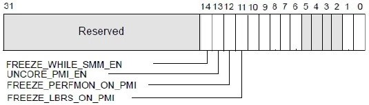

在上图中, 我们看到 IA32\_DEBUGCTL 寄存器的 bit 12 是 FREEZE\_PERFMON\_ON\_PMI, 这个位的设置将开启在 PMI 中冻结 counter 计数的机制.

当 PMI handler 执行完毕退出后, 处理器不会自动恢复计数功能. 如果继续使用 counter, 那么软件必须重新设置 IA32\_PERF\_GLOBAL\_CTRL 寄存器相应位开启 counter 进行计数.

>实验 15\-4: 测试在 PMI 中冻结 counter 机制

这个实验接着前面的实验 15\-3 来进行, 使用同样的监控事件和溢出条件. 在这个实验里, 我们将让代码产生两次 PMI: 第 1 次 PMI 没有使用冻结 counter 机制, 而第 2 次 PMI 使用了冻结 counter 机制. 通过对比, 我们可以清楚地了解冻结 counter 机制.

代码清单 15-8(topic15\ex15-4\protected.asm):

```assembly
; -------------------------------
;  perfmon handler
; ------------------------------
perfmon_handler:
      jmp do_perfmon_handler
pfh_msg1 db '>>> now: enter PMI handler', 10, 0
pfh_msg2 db 'exit the PMI handler <<<', 10, 0
pfh_msg3 db '**** test message ****', 10, 0
do_perfmon_handler:
      STORE_CONTEXT                                   ;  保存 context
      mov esi, pfh_msg1
      call puts
      ; * 第 1 次打印 PMC 值
      call dump_pmc
      ; * 执行一些指令, 用于收集 PMC 计数
      mov esi, pfh_msg3
      call puts
      ; * 再次打印 PMC 值
      call dump_pmc
      RESET_COUNTER_OVERFLOW                          ;  清出标志
      mov esi, pfh_msg2
      call puts
do_perfmon_handler_done:
      RESTORE_CONTEXT                                   ;  恢复 context
      btr DWORD [APIC_BASE + LVT_PERFMON], 16      ;  清 mask 位
      mov DWORD [APIC_BASE + EOI], 0                 ;  发送 EOI 命令
      iret
```

为了更好地观察, 在这个 PMI handler 里将做一些修改, 分别打印两次 PMC 寄存器的值, 中间还调用函数进行测试.

## 11.2. 清 LVT Performance monitoring 寄存器 mask

当**产生 PMI**时, 处理器会**自动将 LVT Perfmon 寄存器的 mask 置位**, 从而**屏蔽 PMI**产生. 因此在**第 1 次 PMI 执行完**毕后, 我们可以在**PMI handler 退出前清 LVT perfmon 寄存器的 mask 位**, 重新开启允许 PMI handler 被调用.

```assembly
btr DWORD [APIC_BASE + LVT_PERFMON], 16  ;  清 LVT perfmon 寄存器 mask 位
```

local APIC 的 LVT perfmon 寄存器 bit 16 位是 mask 位, 通过清 0, 取消 PMI handler 的屏蔽.

## 11.3. 设置 IA32_DEBUGCTL 寄存器

接着, 将 IA32\_DEBUGCTL 寄存器的 bit 12 位置位, 开启 PMI 冻结 counter 机制.

代码清单 15-9(topic15\ex15-4\protected.asm):

```assembly
;  设置 FREEZE_PERFMON_ON_PMI 位
      mov ecx, IA32_DEBUGCTL
      rdmsr
      bts eax, 12     ;  FREEZE_PERFMON_ON_PMI=1
      wrmsr
```

在这个实验里产生了两次 PMI, 这两次 PMI 产生如下所示.

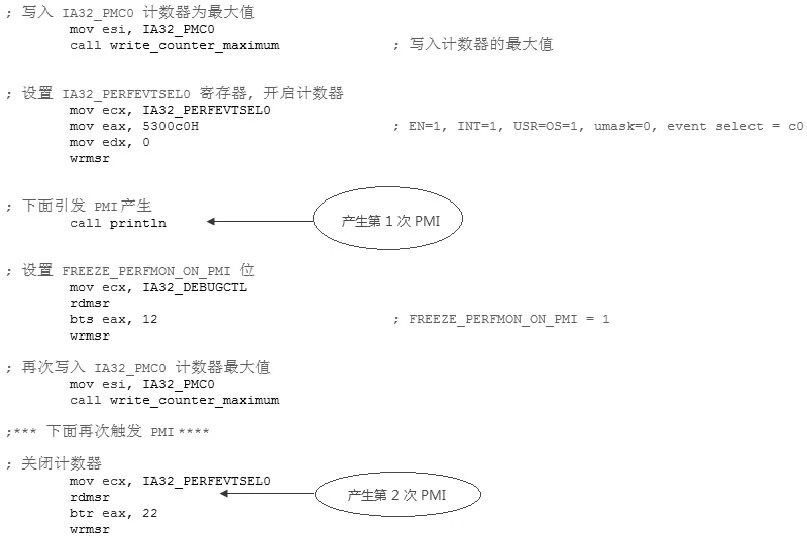

在第 1 次 PMI 执行完毕后, 重新将 IA32\_PMC0 值设为最大值, 又引发第 2 次 PMI 的产生. 下图是在 Core i5 机器上运行的结果.

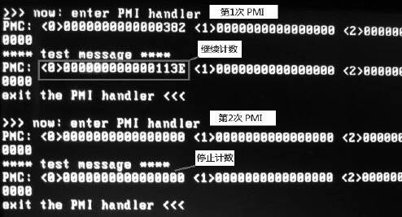

从这个结果可以清楚看到, 在第 1 次未启用冻结 counter 机制时, 在 PMI handler 里继续计数. 而在第 2 次启用冻结 counter 机制后, 在 PMI handler 里 IA32\_PMC0 的值为 0(**没有进行计数**).