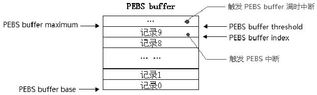
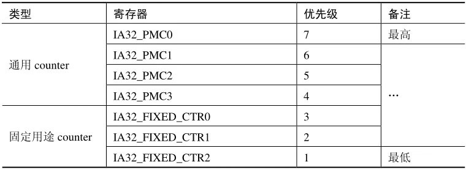

<!-- @import "[TOC]" {cmd="toc" depthFrom=1 depthTo=6 orderedList=false} -->

<!-- code_chunk_output -->

- [1. 概述](#1-概述)
  - [1.1. PMI 中断和 PEBS 中断的区别](#11-pmi-中断和-pebs-中断的区别)
  - [1.2. PEBS](#12-pebs)
  - [1.3. 检测 PEBS 机制是否可用](#13-检测-pebs-机制是否可用)
- [2. PEBS buffer](#2-pebs-buffer)
  - [2.1. 64 位的 PEBS 记录格式](#21-64-位的-pebs-记录格式)
  - [2.2. 增强的 PEBS 记录格式](#22-增强的-pebs-记录格式)
  - [2.3. IA32_PERF_CAPABILITIES 寄存器](#23-ia32_perf_capabilities-寄存器)
  - [2.4. PEBS buffer 区域](#24-pebs-buffer-区域)
  - [2.5. PEBS buffer 的 maximum 与 threshold 值](#25-pebs-buffer-的-maximum-与-threshold-值)
  - [2.6. PEBS reset counter 值](#26-pebs-reset-counter-值)
- [3. PEBS 中断](#3-pebs-中断)
  - [3.1. 开启 PEBS 计数器代码](#31-开启-pebs-计数器代码)
  - [3.2. PEBS 中断的 overflow 标志位](#32-pebs-中断的-overflow-标志位)
  - [3.3. PEBS 中断的抑制](#33-pebs-中断的抑制)
  - [3.4. PEBS buffer 的溢出: 另外的 DS 中断](#34-pebs-buffer-的溢出-另外的-ds-中断)
- [4. PEBS 事件](#4-pebs-事件)
- [5. PEBS 的触发](#5-pebs-的触发)
- [6. PEBS 记录的两种报告形式](#6-pebs-记录的两种报告形式)
- [7. 测试 PEBS 中断](#7-测试-pebs-中断)
  - [7.1. 值得注意](#71-值得注意)
  - [7.2. 64 位的 PEBS 记录](#72-64-位的-pebs-记录)
- [8. PEBS buffer 满时中断](#8-pebs-buffer-满时中断)
  - [8.1. 检测中断触发条件](#81-检测中断触发条件)
    - [8.1.1. 检测 PEBS 中断发生: 没有标志位](#811-检测-pebs-中断发生-没有标志位)
    - [8.1.2. 检测 PEBS buffer 满时中断发生](#812-检测-pebs-buffer-满时中断发生)
  - [8.2. PEBS buffer 满时中断优先级](#82-pebs-buffer-满时中断优先级)
- [9. 多个 PMI 触发](#9-多个-pmi-触发)
  - [9.1. APIC performance handler 负责的 4 类中断](#91-apic-performance-handler-负责的-4-类中断)
  - [9.2. counter 的优先级](#92-counter-的优先级)
  - [9.3. PMI 与 PEBS 中断: 不会同时](#93-pmi-与-pebs-中断-不会同时)
    - [9.3.1. perfmon 中断 handler 的处理](#931-perfmon-中断-handler-的处理)
  - [9.4. PEBS 中断, PEBS buffer 与 BTS buffer 溢出中断](#94-pebs-中断-pebs-buffer-与-bts-buffer-溢出中断)
    - [9.4.1. 检测触发条件的逻辑](#941-检测触发条件的逻辑)
    - [9.4.2. 推荐所有中断触发条件都检测处理](#942-推荐所有中断触发条件都检测处理)
- [10. Load latency 监控机制](#10-load-latency-监控机制)
  - [10.1. Load latency 监控事件](#101-load-latency-监控事件)
  - [10.2. Threshold 值](#102-threshold-值)
  - [10.3. 开启 load latency 监控许可](#103-开启-load-latency-监控许可)
  - [10.4. Load latency 的 data source 信息](#104-load-latency-的-data-source-信息)

<!-- /code_chunk_output -->

# 1. 概述

## 1.1. PMI 中断和 PEBS 中断的区别

**硬件性能事件**由处理器的 PMU 提供支持.

如前文所述, perf 会对 PMI 中断发生时的 PC 寄存器进行采样. 由于现代处理器的主频非常高, 在加上深度流水线机制, 从**性能事件被触发**, 到处理器**响应 PMI 中断**, 流水线上可能已处理过百条指令. 那么**PMI 中断**采到的**指令地址**就不再是触发性能事件的那条指令的地址了, 而可能具有**非常严重的偏差**.

为了解决这个问题, intel 处理器通过**PEBS**(Precise Event Based Sampling)机制实现了**高精度事件采样**. PEBS 通过硬件在**计数器溢出**时将处理器现场直接保存到内存(而**不是在相应中断时**才保存寄存器现场), 从而使得 perf 能够真正触发性能事件的那条指令的地址, 提高了采样精度.

## 1.2. PEBS

PEBS 直译为**基于抽样的精确事件**.

开启 PEBS 机制允许**当发生 PEBS 中断时**在**内存 DS 存储区域**的**PEBS buffer**里**保存处理器的 context 环境**.

## 1.3. 检测 PEBS 机制是否可用

由于**PEBS 机制**是建立在**DS(Debug Store)存储区域**之上的.

1. **先检测处理器是否支持 DS 机制**, CPUID
2. 再检测**PEBS 是否可用**时, RDMSR

在`lib\debug.asm`文件里实现了一个检测函数`available_pebs()`, 如下.

代码清单 15-10(lib\debug.asm):

```x86asm
; ---------------------------------
;  available_pebs(): 是否支持 PEBS 机制
;  output:
;   1-available, 0-unavailable
; --------------------------------------
available_pebs:
      mov eax, 1
      cpuid
      bt edx, 21     ;  Debug Store 支持位
      setc al
      jnc available_pebs_done
      mov ecx, IA32_MISC_ENABLE
      rdmsr
      bt eax, 12     ;  PEBS unavailable 位
      setnc al
available_pebs_done:
      movzx eax, al
      ret
```

代码先通过`CPUID.01: EDX[21]`位来检测**是否支持 DS(Debug Store**)功能, **IA32\_MISC\_ENABLE 寄存器**的**bit 12 位是 PEBS unavailable 位**, 置位时表示 unavailable(不可用的), 为 0 时表示 available(可用的).

# 2. PEBS buffer

**PEBS buffer**与**BTS buffer**共同组成`DS(Debug Store)`存储区域里的**buffer 记录**区, 因此与 BTS buffer 一样, 在设置 PEBS buffer 结构前需要**检测 PEBS 记录的格式**.

## 2.1. 64 位的 PEBS 记录格式

当软件检测到**CPUID.01: ECX[2].DTES64 位为 1**时, 表示固定使用 64 位的 PEBS 记录格式, 而无论是否开启 64 位模式.

代码清单 15-11(lib\debug.asm):

```assembly
; ------------------------------------
;  support_ds64: 查询是否支持 DS save 64 位格式
;  output:
;   1-support, 0-no support
; -----------------------------------
support_ds64:
      mov eax, 1
      cpuid
      bt ecx, 2    ;  DEST64 位
      setc al
      movzx eax, al
      ret
```

这个函数在 14.9.2 节我们已经见过. 当**支持 DS64 格式**时, BTS 记录与 PEBS 记录都使用 64 位格式.

## 2.2. 增强的 PEBS 记录格式

从 Nehalem 架构开始, 处理器支持增强的 PEBS 记录格式, 因此我们可以认为这个是增强的 64 位记录格式, 因为它已经支持 DS64 格式了.


上图已经归纳了三种 PEBS 记录格式: 32 位与 64 位的 PEBS 记录格式, 以及增强的 64 位 PEBS 记录格式. 增强的 PEBS 记录格式里额外增加了 4 个域.


这些域在普通的 PEBS 记录格式里是保留位. 偏移量 90H 的 IA32_PERF_GLOBAL_STATUS 寄存器值是发生 PMI 前的值, 其余 3 个值使用在增强功能里.

## 2.3. IA32_PERF_CAPABILITIES 寄存器

PEBS 机制的一些**额外功能**可以从**IA32\_PERF\_CAPABILITIES 寄存器**里获得, 这个寄存器需要通过`CPUID.01: ECX[15].PDCM`位来获得支持, 代码如下.

```assembly
      mov eax, 1
      cupid
      bt ecx, 15    ;  PDCM 位
      jnc no_support
      ...      ;  支持
no_support:
      ... ...      ;  不支持
```

**IA32\_PERF\_CAPABILITIES 寄存器**中一些**标志位**指示了**LBR 与 PEBS 的格式**, 这个寄存器的结构如下所示.


IA32\_PERF\_CAPABILITES 寄存器是**只读寄存器**, 这表示寄存器读出来的值就固定了 PEBS 的某些功能不能更改.

这个寄存器的 FW\_WRITE(bit13)位指示了 IA32\_PMCx 与 IA32\_FIXED\_CTRx 计数器是否可写入全部宽度, 详情请参考前面的 15.2.3 节所述. 在 SandyBridge 架构之前处理器不允许写入全部 full\-width(例如: 48 位值).

LBR_FMT 域(bit5 到 bit0)指示了 LBR stack 中 LBR 记录的格式. 详情请参考 14.4 节的相关描述.

**PEBS\_REC\_FMT(bit11 到 bit8**)指示了**PEBS 记录的额外格式**, 目前该域只有两个值供选择.

1) 0000B: 使用普通的格式, 保存 EFLAGS 寄存器, EIP/RIP 寄存器, 以及 8 个通用寄存器或者 16 个通用寄存器(64 位模式下).

2) 0001B: 使用增强的 PEBS 记录格式, 在原 PEBS 记录格式的基础上增加额外的 4 个域.

软件通过检测 IA32\_PEF\_CAPABILITIES 寄存器的 PEBS\_REC\_FMT 域来确定是否支持增强 PEBS 记录格式, 如下面代码所示.

代码清单 15-12(lib\debug.asm):

```assembly
; ------------------------------------------------------------
;  support_enhancement_pebs(): 检测是否支持增强的 PEBS 记录
;  output:
;  1-support, 0-no support
; -----------------------------------------------------------
support_enhancement_pebs:
      mov ecx, IA32_PERF_CAPABILITIES
      rdmsr
      shr eax, 8
      and eax, 0Fh    ;  得到 IA32_PREF_CAPABILITIES[11: 8]
      cmp eax, 0001B    ;  测试是否支持增强的 PEBS 格式
      sete al
      movzx eax, al
      ret
```

确定 PEBS 记录格式是非常重要的, 这将影响到 PEBS buffer 设置是否正确. 否则会引起意想不到的错误.

## 2.4. PEBS buffer 区域

在 DS 的管理区里设置 PEBS buffer 区域的位置与大小, 如下所示.


上图是 64 位的 PEBS buffer 格式, PEBS 管理区紧接着 BTS 管理区, 使用 PEBS 机制前, 软件需要设置下面的域.


## 2.5. PEBS buffer 的 maximum 与 threshold 值

不像**BTS buffer**区域可以使用**环形回路**的工作方式, PEBS buffer 的工作相对简单些: 当**PEBS index**达到**threshold 值**时就会引发**DS(Debug Store)中断**的产生, 从而调用 local APIC 的 perfmon 中断 handler.

因此, PEBS threshold 的值应该设为等于 PEBS maximum 值.

## 2.6. PEBS reset counter 值

PEBS 管理区包括**4 个 counter 重置值**, 当**由于 counter 溢出而产生 PEBS 中断**时, 处理器将从这些域里**读取相应的值**, 写入对应的**IA32\_PMCx 寄存器**里.

**PEBS 机制**只允许使用在**4 个通用计数器(！！！**)上: `IA32_PMC0`到`IA32_PMC3`. 即使处理器支持更多的通用计数器, 也只能使用这 4 个计数器. `IA32_FIXED_CTRx`计数器不支持 PEBS 机制.

例如: 当`IA32_PMC3`寄存器的**溢出**被作为**PEBS 中断触发条件**时, 发生 PEBS 中断后, **reset counter3 值**将被读取写入到`IA32_PMC3`寄存器.

关于 DS 区域结构及 DS 区域设置更详细的描述, 请参考 14.9 节所述.

# 3. PEBS 中断

当 IA32\_PMCx 寄存器被开启支持使用 PEBS 机制时, **IA32\_PMCx 寄存器溢出**时将产生**PEBS 中断**而**不是 counter 溢出中断**, 即**PMI**(performance monitor interrupt), 如下所示.


**IA32\_PEBS\_ENABLE 寄存器**将**开启 PEBS 机制**, 它的结构如 15.3.2 节所示, **允许设置 4 个 IA32\_PMCx 寄存器**作为监控 PEBS 事件的**计数器**.

触发**PMI 和 PEBS 中断(！！！**)最后都使用**local APIC LVT performance monitor 寄存器(！！！**)所**设置的 vector 指向的中断处理程序(！！！**).

当**触发 PEBS 中断**时, **处理器自动！！！** 将在**PEBS buffer**里写入**一条 PEBS 记录**, 这个 PEBS 记录按前面所述检测的 PEBS 格式进行写入.

## 3.1. 开启 PEBS 计数器代码

在`inc\perfmon.inc`文件里, 实现了 4 个宏, 分别对应开启`IA32_PMC0`到`IA32_PMC3`寄存器的**PEBS 中断许可**.

代码清单 15-13(inc\perfmon.inc):

```assembly
; -----------------------------------------------------
;  宏 ENABLE_PEBS_COUNTER: 开启 counter PEBS 中断许可
;  input:
;        %1 - 参数 1: 需要开启的 IA32_PMCx 计数器
;        %2 - 参数 2: 需要开启的 load latency 计数器许可
;  示例:
;        ENABLE_PEBS_COUNTER (PEBS_PMC0_EN), 0
; -------------------------------------------------------
%macro ENABLE_PEBS_COUNTER 2
      mov ecx, IA32_PEBS_ENABLE
      rdmsr
      or eax, %1                      ;  PEBS_PMCx_EN
      or edx, %2                      ;  LL_PMCx_EN
      wrmsr
%endmacro
%macro ENABLE_PEBS_PMC0 0
      ENABLE_PEBS_COUNTER (PEBS_PMC0_EN), 0
%endmacro
%macro ENABLE_PEBS_PMC1 0
      ENABLE_PEBS_COUNTER (PEBS_PMC1_EN), 0
%endmacro
%macro ENABLE_PEBS_PMC2 0
      ENABLE_PEBS_COUNTER (PEBS_PMC2_EN), 0
%endmacro
%macro ENABLE_PEBS_PMC3 0
      ENABLE_PEBS_COUNTER (PEBS_PMC3_EN), 0
%endmacro
```

宏 ENABLE\_PEBS\_COUNTER 是一个功能设置开关, 而 4 个计数器开启宏 ENABLE\_PEBS\_PMC0 到 ENABLE\_PEBS\_PMC3 将调用 ENABLE\_PEBS\_COUNTER 来进行设置.

## 3.2. PEBS 中断的 overflow 标志位

当由于**counter 溢出产生 PMI**时, **IA32\_PERF\_GLOBAL\_STATUS 寄存器**的**overflow 标志位**将**记录着发生溢出的计数器**.

然而, **触发 PEBS 中断时**, 这些**overflow 标志位将被清位**.

当 PEBS 中断被抑制时(PEBS 中断未触发), IA32\_PERF\_GLOBAL_STATUS 寄存器相应的 overflow 标志位将置位, 指示 counter 产生溢出.

PEBS 设备就绪(counter 溢出)后检查到第 1 条 PEBS 事件的到来(counter 从 0 递增到 1 值), 这时候应该会触发 PEBS 中断, 由于某些原因 PEBS 中断被抑制并没有触发. 那么 counter 的 overflow 标志位仍然会被记录.


如上所示, 在增强型的 PEBS 记录(见前面所述)里, 位于 PEBS 记录的 90H 位置上的 IA32\_PERF\_GLOBAL\_STATUS 映像值记录着**触发 PEBS 中断**时由**哪个 IA32_PMC 计数器**产生溢出. 软件可以利用这个值判断由哪个 counter 溢出而触发 PEBS 中断.

因此, 在**触发 PEBS 中断前**, `IA32_PERF_GLOBAL_STATUS`寄存器是指示着哪个 counter 溢出的. 在 PEBS 中断被触发的那一刻, 处理器将 overflow 位进行清位.

## 3.3. PEBS 中断的抑制

在 PEBS 中断触发条件满足时, 可能会因为某些原因被抑制未能触发. 典型地有下面的原因.

1) 由于**local APIC**的**PMI**(perfmonance monitoring interrupt)**被屏蔽**, 或者**eflags 的 IF 标志位**为 0(可屏蔽中断被屏蔽).

2) 当同时产生**多个 PMI**时, 处理器由于优先级别的原因而没有响应 PEBS 中断.

在第 1 种情形里, 当进入 PMI handler 时, 由于 PMI handler 使用 Interrupt-gate(中断门)来进行调用处理程序. 在 PMI handler 里 IF 标志会被清位, 如果此时在 PMI handler 里达到了 PEBS 中断触发的条件. 那么这个 PEBS 中断会被抑制.

在第 2 种情形里, 如果 PEBS 中断使用的 counter 优先级别低于其他监控事件的 counter, 处理器会响应优先级别高的 counter 的监控事件, 而这个 PEBS 中断也会被抑制. 当进入 PMI handler 后, local APIC 将自动屏蔽 PMI(performance monitor 寄存器的 bit 16 位被置位).

## 3.4. PEBS buffer 的溢出: 另外的 DS 中断

当产生**多次 PEBS 中断**, 以至于 PEBS buffer 写满而产生**PEBS buffer 溢出**时, 在这种情况下将触发**另一个 DS(Debug Store)中断**. `IA32_PERF_GLOBAL_STATUS`寄存器的 OvfBuffer 标志位被置位, 指示 PEBS buffer 溢出(如下所示).


如同 BTS buffer 溢出一样, 当发生**PEBS buffer 溢出**时, local APIC perfmon 中断 handler 通过判断发生**PEBS buffer 溢出**, 并需要重置 PEBS index 值, 允许下一条 PEBS 记录被重新写入.

# 4. PEBS 事件

在处理器所支持的 performance monitor 事件里, 并**不是所有监控事件**都支持产生**PEBS 中断**, 并且这些事件都是属于**non\-architectural(非架构化)的 PEBS 事件**, 在**其他架构上可能会有不同(！！！**).

而 Core 微架构上是相同的, 下表是在 Nehalem 与 Westmere 架构上支持 PEBS 的监控事件.


在 SandyBridge 及后续架构上将支持更多的 PEBS 事件, 并且这些事件的 Event Select 码和 UMask 码可能会不同, 我们以前所做的实验都是对 INSTR\_RETIRED.ANY\_P 事件进行监控.

在 inc\perfmon.inc 头文件里定义了这些 PEBS 事件, 如下.

代码清单 15-14(inc\perfmon.inc):

```
; *
; * 定义 Westmere 架构上的 PEBS 事件
; *
%define PEBS_INST_COUNT_EVENT                     5300C0h
%define PEBS_X87_OPS_COUNT_EVENT                  53FEC1h
%define PEBS_BR_MISS_COUNT_EVENT                  5300C5h
%define PEBS_SIMD_INST_COUNT_EVENT                531FC7h
%define PEBS_MEM_LOAD_L1D_MISS_EVENT             5301CBh
%define EPBS_MEM_LOAD_L1D_LINE_MISS_EVENT       5302CBh
%define PEBS_MEM_LOAD_L2_MISS_EVENT              5304CBh
%define PEBS_MEM_LOAD_L2_LINE_MISS_EVENT        5308CBh
%define PEBS_MEM_LOAD_DTLB_MISS_EVENT            5310CBh
```

这些常量值对应上表中所列出的**PEBS 事件**, 使用这些常量值来设置监控事件, 如下所示.

```
mov ecx, IA32_PERFEVTSEL0     ;  IA32_PMC0 的控制器
mov eax, PEBS_MEM_LOAD_L2_MISS_EVENT  ;  统计 L2 cache load miss 事件
mov edx, 0
wrmsr
```

Intel 特别说明, 对于**使用 PEBS 事件**, 在 IA32\_PERFEVTSELx 寄存器的设置里, ANY 位(bit 20)、INV 位(bit 23)、CMASK 域(bit31 到 bit24), 以及 Edge 位(bit 18)都必须为 0 值, 否则将是无效的事件.

关于**IA32\_PERFEVTSELx 寄存器的结构**, 请参考 15.3.5 节.

当使用**不支持 PEBS 的事件**时, **counter 溢出**产生的是**PMI**.

# 5. PEBS 的触发

关于 PEBS 触发的描述, 在 Intel64 手册里有这么一段话:

"Performance monitoring interrupts are triggered by a counter transitioning from maximum count to zero (assuming IA32_PerfEvtSelX.INT is set). This same transition will cause PEBS hardware to arm, but not trigger. PEBS hardware triggers upon detection of the first PEBS event after the PEBS hardware has been armed(a 0 to 1 transition of the counter)."

这里应当理解为: 当**counter 溢出**后(从最大值返回到 0 值), PEBS 设备准备就绪, 但 PEBS assist(PEBS 中断)**不触发**. 直到 PEBS 设备检测到第 1 条 PEBS 事件的到来.

Intel 明确说明了, 在 counter 溢出后的第 1 个 PEBS 事件, 也就是**counter 从 0 值转变到 1 值**, PEBS 中断**被触发**.

然而, 这个"第 1 个 PEBS 事件"的到来, 有时令笔者捉摸不透.

在"**counter 从 0 值转变到 1 值**"的角度上看, 在**counter 溢出**(**PEBS 设备就绪**)后, counter 从 0 达到 1 值时说明第 1 个 PEBS 事件已经产生, 从而触发 PEBS 中断. 但是, 对于不同的指令所触发的 PEBS 事件, 它们的到达似乎有所不同, 并且相同的指令在不同的情形下也有所不同.

笔者无法准确地测量出 counter 从 0 到 1 的转变(PEBS 设备就绪后的第 1 个 PEBS 事件)发生在什么时候. 在下面的情形里:

```
mov esi, IA32_PMC0       ;  IA32_PMC0
call write_counter_maximum     ;  写入 counter 最大值
mov ecx, IA32_PERFEVTSEL0
mov eax, PEBS_INST_COUNT_EVNET   ;  统计指令数事件
mov edx, 0
wrmsr          ;  设置 PEBS 事件
ENABLE_PEBS_PMC0       ;  开启 PMC0 PEBS 机制
ENABLE_IA32_PMC0       ;  开启 IA32_PMC0 开始计数
mov eax, 1         ;  counter 溢出, PEBS 在此触发
mov eax, 2         ;  此处被 PEBS 报告
mov eax, 3
```

在上面的代码里, 当开启 IA32\_PMC0 开始计数时, 第 1 条 mov 指令位置被触发 PEBS 中断. 然而此时 counter 应该为 0 值(并不是 1 值). 在 PEBS 记录里, EAX 寄存器将是 1 值(第 1 条 MOV 指令产生).

```
      mov ecx, IA32_PMC0       ;  IA32_PMC0
      mov eax, 0FFFFFFFFh – 2     ;  最大值减 2(0FFFFFFFDh)
      mov edx, 0
      wrmsr          ;  设置初始 counter 值
      mov ecx, IA32_PERFEVTSEL0
      mov eax, PEBS_INST_COUNT_EVNET   ;  统计指令数
      mov edx, 0
      wrmsr          ;  设置 PEBS 事件
      ENABLE_PEBS_PMC0       ;  开启 PMC0 PEBS 机制
      ENABLE_IA32_PMC0       ;  开启 IA32_PMC0 开始计数
      mov eax, 1         ;  IA32_PMC0=0FFFFFFFEh
      mov eax, 2         ;  IA32_PMC0=0FFFFFFFFh
      mov eax, 3         ;  counter=0 溢出, PEBS 没有触发
      mov eax, 4         ;  PEBS 没有触发
      mov eax, 5         ;  PEBS 没有触发
      mov eax, 6
      mov eax, 7
      mov eax, 8
      mov eax, 9
      mov eax, 10
;  关闭计数器
      DISABLE_IA32_PMC0       ;  PEBS 在此处触发, PEBS 被报告
```

在上面的情形里, 当 counter 的计数器设置为 0FFFF_FFFFFFFDh(48 位)值, 当开启计数器时, 在执行第 3 条 mov 指令 counter 溢出, 然而 PEBS 没有触发. 直到继续执行后面的 7 条 mov 指令后, PEBS 才被触发. 因此在这个情形下, 笔者无法测量出第 1 个 PEBS 事件什么时候到来.

# 6. PEBS 记录的两种报告形式

PEBS 记录有**两种报告形式**: **trap**和**fault**.

软件通过读取`IA32_PERF_CAPABILITIES`寄存器的`PEBS_TRAP`(bit 6)标志位可以知道:

1) `PEBS_TRAP`为 1 时, 使用**trap**类型, **EIP**指向触发 PEBS 中断指令的**下一条指令地址**

2) `PEBS_TRAP`为 0 时, 使用**fault**类型, EIP 指向**触发 PEBS 中断指令的地址**

IA32\_PERF\_CAPABILITIES 寄存器是**只读寄存器**, 软件无法决定 PEBS 使用哪种类型的报告形式.

当使用**trap**类型时, PEBS 记录中的**处理器状态**是执行完引发 PEBS 中断的**指令后**的**处理器状态**. 如下面代码所示.

```
mov eax, 1     ;  触发 PEBS 中断
mov eax, 2     ;  被报告的位置
mov eax, 3
```

当在第 1 条 mov 指令触发 PEBS 时, 那么**EAX 寄存器**的值是**1**, 而 EIP 值将是第 2 条 mov 指令的地址值.

而使用**fault**类型时, PEBS 记录状态是触发 PEBS 中断**指令前**的**处理器状态**.

值得注意的是, 若**触发 PEBS 中断**是**分支指令**(jmp/call/ret, int/iret 等指令), PEBS 记录可能会在**PMI handler 入口里被报告**.

# 7. 测试 PEBS 中断

>实验 15-5: 测试 PEBS 中断

现在, 我们来测试 PEBS 中断, 在实验 15-3 的基础上开启 PEBS 中断许可, 代码的结构和实验 15-3 是一致的.

代码清单 15-15(topic15\ex15-5\protected.asm):

```x86asm
; *
; * 实验 ex15-5: 测试 PEBS 中断
; *
      call available_pebs                           ;  测试 pebs 是否可用
      test eax, eax
      jz next                                         ;  不可用
      ; *
      ; * perfmon 初始设置
      ; * 关闭所有 counter 和 PEBS
      ; * 清 overflow 标志位
      ; *
      DISABLE_GLOBAL_COUNTER
      DISABLE_PEBS
      RESET_COUNTER_OVERFLOW
;  设置完整的 DS 区域
      SET_DS_AREA
; *
; * 开启 BTS, 并使用在 PMI handler 里冻结 counter 功能
; *
      ENABLE_BTS_FREEZE_PERFMON_ON_PMI
;  设置 counter 计数值
      mov esi, IA32_PMC0
      call write_counter_maximum     ;  最大值
;  设置监控事件
      mov ecx, IA32_PERFEVTSEL0
      mov eax, PEBS_INST_COUNT_EVENT           ;  指令计数事件
      mov edx, 0
      wrmsr
;  开启 PEBS
      ENABLE_PEBS_PMC0
;  开启 IA32_PMC0, 开始计数
      ENABLE_IA32_PMC0
;  执行一些指令观察
      mov eax, 1
      mov eax, 2
      mov eax, 3
      mov eax, 4
      mov eax, 5
      mov eax, 6
      mov eax, 7
      mov eax, 8
      mov eax, 9
      mov eax, 10
;  关闭计数器
      DISABLE_IA32_PMC0
;  关闭 PEBS 机制
      DISABLE_PEBS_PMC0
;  关闭 BTS
      DISABLE_BTS                                    ;  TR=0, BTS=0, BTINT=0
next:
      jmp $
```

在开启计数之前, 代码需要做的设置工作如下.

1) 设置完整可用的 DS 区域, 这里的设置包括 BTS 与 PEBS 环境, 并开启 PMI 冻结 counter 计数功能.

2) 设置 counter 初始值为最大值.

3) 设置监控事件.

4) 开启 PEBS.

5) 开启计数器, 开始计数.

代码中所使用的几个宏都定义在 inc\perfmon.inc 头文件里.

1) ENABLE_PEBS_PMC0 与 DISABLE_PEBS_PMC0 宏用来开启和关闭 IA32_PMC0 的 PEBS 中断许可.

2) ENABLE_IA32_PMC0 与 DISABLE_IA32_PMC0 宏用来开启和关闭 IA32_PMC0 计数器.

这个实验使用 PEBS_INST_COUNT_EVENT 事件来监控执行指令数, 这个事件常量值定义在 inc\perfmon.inc 头文件里.

```assembly
;  执行一些指令观察
      mov eax, 1
      mov eax, 2
      mov eax, 3
```

在开始计数后, 执行几条 mov 指令, 对 eax 寄存器进行一些赋值操作, 目的是观察 PEBS 中断在哪个位置触发.

在我们的 PEBS 中断里主要的逻辑是: 关闭/开启功能, 显示与 PEBS 相关的信息.

代码清单 15-16(topic15\ex15-5\protected.asm):

```x86asm
; -------------------------------
;  perfmon handler
; ------------------------------
perfmon_handler:
      jmp do_perfmon_handler
pfh_msg1  db '>>> now: enter PMI handler, occur at 0x', 0
pfh_msg2 db 'exit the PMI handler <<<', 10, 0
do_perfmon_handler:
      STORE_CONTEXT                       ;  保存 context
      ; ;  关闭 BTS
      mov ecx, IA32_DEBUGCTL
      rdmsr
      mov [debugctl_value], eax    ;  保存原 IA32_DEBUGCTL 寄存器值, 以便恢复
      mov [debugctl_value + 4], edx
      mov eax, 0
      mov edx, 0
      wrmsr
      ; ;  关闭 pebs enable
      mov ecx, IA32_PEBS_ENABLE
      rdmsr
      mov [pebs_enable_value], eax
      mov [pebs_enable_value + 4], edx
      mov eax, 0
      mov edx, 0
      wrmsr
      mov esi, pfh_msg1
      call puts
      mov esi, [esp]
      call print_dword_value
      call println
      call dump_perf_global_status
      call dump_pmc
      call dump_ds_management
      call dump_pebs_record
      mov esi, pfh_msg2
      call puts
do_perfmon_handler_done:
      ;  恢复原 IA32_DEBUGCTL 设置
      mov ecx, IA32_DEBUGCTL
      mov eax, [debugctl_value]
      mov edx, [debugctl_value + 4]
      wrmsr
      ; ;  恢复 IA32_PEBS_ENABLE 寄存器
      mov ecx, IA32_PEBS_ENABLE
      mov eax, [pebs_enable_value]
      mov edx, [pebs_enable_value + 4]
      wrmsr
      RESTORE_CONTEXT                                    ;  恢复 context
      btr DWORD [APIC_BASE + LVT_PERFMON], 16       ;  清 mask 位
      mov DWORD [APIC_BASE + EOI], 0                  ;  发送 EOI 命令
      iret
```

在这个 PEBS 中断 handler 里, 除了关闭功能和恢复功能外, 主要通过打印 DS 管理区, 调用 dump\_pebs\_record()函数来打印最后一条 PEBS 记录, 这个函数实现在 lib\debug.asm 文件里; 以及通过打印 IA32\_PERF\_GLOBAL_STAUS 寄存器的值来观察 PEBS 中断.

由于使用了 FREEZE\_PERFMON\_ON\_PMI 功能(在 PMI handler 里冻结计数器), 这个功能会让处理器自动关闭所有 IA32\_PERF\_GLOBAL\_CTRL 寄存器里的 counter. 因此, 在这个 PMI handler 中并不需要编写代码关闭 counter. 在 PMI handler 里也没有主动去重新开启 counter.

下面是在 Westmere 架构 Core i5 处理器平台上的运行结果.


我们看到 PEBS index 当前的值为 004004B0H(下一条记录写入的地址), 说明已经写了一条记录, 记录长度为 0B0H(176 个字节). 同时, 我们也可以看到 BTS 记录也被写入(BTS index 值改变).


在实验里我们对 eax 寄存器进行了一些赋值, 从结果里我们看到: 被报告的 eax 寄存器值为 1, 是第 1 条 mov 指令执行完后触发了 PEBS 中断. 由于这个 PEBS 记录使用**TRAP 报告方式**, **EIP 值**是触发 PEBS 指令的**下一条指令地址**.

## 7.1. 值得注意

触发 PEBS 中断后, IA32\_PERF\_GLOBAL\_STATUS 寄存器的溢出标志位被清 0. 然而, 在下面的增强 PEBS 记录区里, IA32\_PERF\_GLOBAL\_STATUS 寄存器的 IA32\_PMC0 溢出标志位被置 1, 这指示在触发 PEBS 中断前, IA32\_PMC0 计数器是溢出的.

## 7.2. 64 位的 PEBS 记录

在打印出来的 64 位 PEBS 记录里, 我们看到在保护模式下也可以在 PEBS 记录里获取到扩展的 64 位寄存器值(寄存器 R8~R15), 并且我们看到这个 PEBS 使用增强的 PEBS 记录格式.

如前面所述, 在 legacy 模式下也可以通过 PEBS 记录得到 64 位的寄存器值. 在 64 位模式下, PEBS 机制与 legacy 模式是一致, 下面我们可以测试一下在 64 位模式的 PEBS 中断.

>实验 15-6: 测试 64 位模式下的 PEBS 中断

实验 15-5 的代码几乎不用怎么更改就可以复制到 long.asm 文件里进行重新编译, 变成 64 位代码的一部分.

代码清单 15-17(topic15\ex15-6\long.asm):

```
;  1) 开启 APIC
      call enable_xapic
;  2) 设置 APIC performance monitor counter handler
      mov esi, APIC_PERFMON_VECTOR
      mov edi, perfmon_handler
      call set_interrupt_handler
;  设置 LVT performance monitor counter
      mov DWORD [APIC_BASE + LVT_PERFMON], FIXED_DELIVERY | APIC_PERFMON_VECTOR
; *
; * 实验 ex15-6: 测试 64 位 模式下的 PEBS 中断
; *
      ; *
      ; * perfmon 初始设置
      ; * 关闭所有 counter 和 PEBS
      ; * 清 overflow 标志位
      ; *
      DISABLE_GLOBAL_COUNTER
      DISABLE_PEBS
      RESET_COUNTER_OVERFLOW
;  设置完整的 DS 区域
      SET_DS_AREA64
; *
; * 开启 BTS, 并使用在 PMI handler 里冻结 counter 功能
; *
      ENABLE_BTS_FREEZE_PERFMON_ON_PMI
;  设置 counter 计数值
      mov esi, IA32_PMC0
      call write_counter_maximum
;  设置 IA32_PERFEVTSEL0 寄存器, 开启计数
      mov ecx, IA32_PERFEVTSEL0
      mov eax, PEBS_INST_COUNT_EVENT           ;  指令计数事件
      mov edx, 0
      wrmsr
;  开启 PEBS
      ENABLE_PEBS_PMC0                            ;  开启 IA32_PMC0 PEBS 中断允许
;  开启 counter, 开始计数
      ENABLE_IA32_PMC0
;  执行一些指令观察
      mov eax, 1
      mov eax, 2
      mov eax, 3
;  关闭计数器
      DISABLE_IA32_PMC0
;  关闭 PEBS 机制
      DISABLE_PEBS_PMC0
;  关闭 BTS, FREEZE_PERFMON_ON_PMI
      DISABLE_BTS_FREEZE_PERFMON_ON_PMI
```

对比一下前面的代码清单 15-14, 上面的代码虽然在 long.asm 模块里, 几乎是完全一样的. 这是因为这些代码都是读/写 MSR 寄存器, 在 32 位和 64 位下都是一样的.


这个在 64 位模式下的运行结果与实验 15-5 是一样的, 明显不同的是 RSP 值为 64 位. 这时 eax 寄存器的值也是 1, PEBS 中断在第 1 条 mov 指令处触发.

# 8. PEBS buffer 满时中断

当**PEBS index 值**达到**PEBS threshold 时(等于或大于**), 意味着 PEBS buffer 写满将会**产生 DS(Debug Store)中断**.

对于 PEBS buffer 的设置, 在正确的逻辑下, PEBS threshold 应等于 PEBS maximum 值(保证只能存放最大数量为 maximum).

PEBS buffer 满时中断也是**使用 local APIC performance monitor 寄存器所设置的中断 handler**.

## 8.1. 检测中断触发条件

当因为 PEBS buffer 满时触发中断, 往往会伴随着 PEBS 中断的同时触发, 如下所示.



上图揭示了一个容纳**10 条**PEBS 记录的 PEBS buffer, 当 PEBS **index**值指向**记录 9**(**最后一条**可写记录)时, 发生了 PEBS 中断, 处理器在**记录 9 的位置**上写入 PEBS 记录.

然而, **也**由于 PEBS index 达到了 PEBS **threshold 值**, 同时触发了**PEBS buffer 满时中断**.

那么处理器也将响应**2 个 PMI**, 因此在 PMI handler 里**必须检测中断产生的原因**, 做出相应的处理.

### 8.1.1. 检测 PEBS 中断发生: 没有标志位

可惜的是, 并**没有什么标志位**可以用来**判断 PEBS 中断的发生**, 软件可以通过逻辑设计达到检测 PEBS 中断的发生.

如下面的逻辑所示.

```c
pmi_handler()  /* 在 PMI handler 里 */
{ ... ...
  if (current_pebs_index > old_pebs_index)
  {
      /*** 发生 PEBS 中断 ****/
      old_pebs_index=current_pebs_index;   /* 更新 pebs index 轨迹 */
  }
  ... ...
}
```

在**软件**里, 设置一个 old\_pebs\_index 值, 用来保存**上一个**"当前"的 PEBS **index**值, 记录 PEBS index 的轨迹. 当发生**PEBS 中断**时, 处理器自动增加 PEBS index 值指向**下一个记录位置**.

在 PMI handler 里通过比对 old\_pebs\_index 值与当前的 PEBS index 值来达到检测 PEBS 中断发生的目的, 这里很重要的一步是需要更新 old\_pebs\_index 值, 确保下次发生 PEBS 中断时仍能正常检测到. 下面的 test\_pebs\_interrupt()函数用来完成这个任务, 实现在 lib\perfmon.asm 文件里.

代码清单 15-18(lib\perfmon.asm):

```assembly
; -----------------------------------------------
;  test_pebs_interrupt(): 测试是否产生 PEBS 中断
;  output:
;        1-yes, 0-no
; ----------------------------------------------
test_pebs_interrupt:
      mov eax, [pebs_buffer_index]     ;  原 PEBS index 值
      mov esi, [pebs_index_pointer]
      mov esi, [esi]                    ;  读当前 PEBS index 值
      cmp esi, eax
      seta al        ;  当前 PEBS index 大于原值, 就置 1
      movzx eax, al
      ret
```

代码里的 pebs\_buffer\_index 值在进行 PEBS buffer 设置的时候已经设置, 初始值为 PEBS base 值, 随着每次 PEBS 中断的发生而改变.

从 pebs\_index\_pointer 指针值读出来的是当前的 PEBS index 值, 这个 pebs\_index_pointer 指向 PEBS 管理区记录中的 PEBS index 位置, 这个指针值是不变的.

### 8.1.2. 检测 PEBS buffer 满时中断发生

**软件**很容易通过`IA32_PERF_GLOBAL_STATUS`寄存器的 OvfBuffer 标志位来检则 PEBS buffer 满时产生的 PMI.

如下面的逻辑所示.

```cpp
pmi_handler()  /* 在 PMI handler 里 */
{
  ... ...
  if (current_pebs_index > old_pebs_index)
  {
      /*** 发生 PEBS 中断 ****/
      old_pebs_index=current_pebs_index;   /* 更新 pebs index 轨迹 */
  }
  else if (IA32_PERF_GLOBAL_STATUS.OvfBuffer=1)
  {
      /*** 发生 PEBS buffer 溢出中断 ****/
      IA32_PERF_GLOBAL_OVF_CTRL.OvfBuffer=1;  /* 清 OvfBuffer 位 */
      current_pebs_index=pebs_base;    /* 重置 pebs index 值 */
      old_pebs_index=current_pebs_index;   /* 更新 pebs index 轨迹 */
  }
  ... ...
}
```

当 OvfBuffer 位置位时指示由 PEBS buffer 满时产生中断, 这时 IA32\_PERF\_GLOBAL\_STATUS 寄存器的其他 counter(包括 IA32\_PMCx 与 IA32\_FIXED\_CTRx 计数器)的溢出位被清位.

在 PMI handler 里, 必须对 OvfBuffer 位进行清位, 以及重置 PEBS index 处理. 这上面的逻辑里还需要更新 old\_pebs\_index 值为 current\_pebs\_index 值, 保持监控 PEBS index 的轨迹.

代码清单 15-19(lib\perfmon.asm):

```assembly
; -------------------------------------------------------
;  test_pebs_buffer_overflow(): 测试 PEBS buffer 是否溢出
;  output:
;         1-yes, 0-no
; -------------------------------------------------------
test_pebs_buffer_overflow:
      mov ecx, IA32_PERF_GLOBAL_STATUS
      rdmsr
      bt edx, 30                        ;  测试 OvfBuffer 位
      setc al
      movzx eax, al
      ret
```

这个 test\_pebs_buffer_overflow()函数用来检测 PEBS buffer 是否溢出, 实现在 lib\perfmon.asm 文件里, 检测 IA32_PERF_GLOBAL_STATUS 寄存器的 bit 62 位(edx 寄存器的 bit 30).

## 8.2. PEBS buffer 满时中断优先级

在**同一个 IA32_PMC 计数器的溢出**, 当 PEBS 中断伴随着 PEBS buffer 满时中断同时产生时(如上所示), Intel 明确指出: **PEBS 中断优先于 PEBS buffer 溢出中断！！！**.

**只有**当**PEBS 中断发生**后, **才可能**产生 PEBS **buffer 溢出中断**. 因为**只有写完 PEBS 记录**后 PEBS index 指向下一条记录位置才可能达到 PEBS threshold 值.

实际上对于**PEBS 中断**, 在 perfmon 中断 handler 里可以对这个触发条件忽略处理, 处理器会自动处理 PEBS 中断(即写入 PEBS 记录). 如果在 perfmon 中断 handler 里需要自行处理 PEBS 中断, 那么, 需要在 perfmon handler 先判断是否发生 PEBS 中断, 然后再判断是否产生 PEBS buffer 满时中断. 如下面逻辑所示.

```c
pmi_handler()  /* 在 PMI handler 里 */
{
       if (test_pebs_interrupt())
       {
           /* 先判断 PEBS 中断 */
       }
       else if(test_pebs_buffer_overflow())
       {
           /* 再判断 PEBS buffer 满时中断 */
       }
}
```

在同时触发 PEBS 中断和 PEBS buffer 溢出中断时, 第 1 次进入 PMI handler 时, OvfBuffer 被置位并且已产生 PEBS 中断, 说明这两个中断触发条件都满足. 在这种情况下, 对什么触发条件先进行判断就显得非常重要了.

>实验 15-7: 测试 PEBS buffer 满时中断

在这个实验里, 我们还可以看到同时产生的 PEBS 中断, 因此这个实验的 PMI handler 进行了修改, 使之能够检测两个中断触发的条件.

下面是修改后的 PMI handler 代码.

代码清单 15-20(topic15\ex15-7\protected.asm):

```assembly
; -------------------------------
;  perfmon handler
; ------------------------------
perfmon_handler:
jmp do_perfmon_handler
pfh_msg1 db '>>> now: enter PMI handler, occur at 0x', 0
pfh_msg2 db 'exit the PMI handler <<<', 10, 0
pfh_msg3 db '*** DS interrupt with PEBS buffer full！ ***', 10, 0
pfh_msg4 db '*** PEBS interrupt ***', 10, 0
do_perfmon_handler:
      STORE_CONTEXT                     ;  保存 context
      ; ;  关闭 BTS
      mov ecx, IA32_DEBUGCTL
      rdmsr
      mov [debugctl_value], eax        ;  保存原 IA32_DEBUGCTL 寄存器值, 以便恢复
      mov [debugctl_value + 4], edx
      mov eax, 0
      mov edx, 0
      wrmsr
      ; ;  关闭 pebs enable
      mov ecx, IA32_PEBS_ENABLE
      rdmsr
      mov [pebs_enable_value], eax
      mov [pebs_enable_value + 4], edx
      mov eax, 0
      mov edx, 0
      wrmsr
      mov esi, pfh_msg1
      call puts
      mov esi, [esp]
      call print_dword_value
      call println
      ;  测试 PEBS 中断触发条件
check_pebs_interrupt:
      call test_pebs_interrupt
      test eax, eax
      jz check_pebs_buffer_overflow
      mov esi, pfh_msg4
      call puts
      call update_pebs_index_track   ;  更新 PEBS index 的轨迹, 保持对 PEBS 中断的检测
      jmp do_perfmon_handler_done
check_pebs_buffer_overflow:
      ;  检查是否发生 PEBS buffer 溢出中断
      call test_pebs_buffer_overflow
      test eax, eax
      jz do_perfmon_handler_done
      mov esi, pfh_msg3
      call puts
      call dump_perf_global_status           ;  打印溢出状态
      call dump_ds_management                 ;  打印 DS 管理区信息
      RESET_PEBS_BUFFER_OVERFLOW             ;  清 OvfBuffer 溢出标志
      call reset_pebs_index                   ;  重置 PEBS
do_perfmon_handler_done:
      mov esi, pfh_msg2
      call puts
      ;  恢复原 IA32_DEBUGCTL 设置
      mov ecx, IA32_DEBUGCTL
      mov eax, [debugctl_value]
      mov edx, [debugctl_value + 4]
      wrmsr
      ; ;  恢复 IA32_PEBS_ENABLE 寄存器
      mov ecx, IA32_PEBS_ENABLE
      mov eax, [pebs_enable_value]
      mov edx, [pebs_enable_value + 4]
      wrmsr
      RESTORE_CONTEXT                                    ;  恢复 context
      btr DWORD [APIC_BASE + LVT_PERFMON], 16         ;  清 mask 位
      mov DWORD [APIC_BASE + EOI], 0                    ;  发送 EOI 命令
      iret
```

在 PMI handler 里调用前面所说的 test\_pebs\_interrupt()来检测是否发生 PEBS 中断, 如果是则使用 update\_pebs\_index\_track()函数来更新 pebs\_buffer\_index 值, 这个函数实现在 lib\debug.asm 文件里. 接着使用 test\_pebs\_buffer\_overflow()来检测是否发生 PEBS buffer 满时中断.

如果是产生 PEBS buffer 满时中断, 打印相关信息, 并使用 RESET\_PEBS\_BUFFER\_OVERFLOW 宏来清 OvfBuffer 标志位, 调用 reset\_pebs\_index()函数来重置 PEBS index 值.

代码清单 15-21(topic15\ex15-7\protected.asm):

```assembly
; *
; * 实验 ex15-7: 测试 PEBS buffer 满时产生中断
; *
      call available_pebs                          ;  测试 pebs 是否可用
      test eax, eax
      jz next                                         ;  不可用
      ; *
      ; * perfmon 初始设置
      ; * 关闭所有 counter 和 PEBS
      ; * 清 overflow 标志位
      ; *
      DISABLE_GLOBAL_COUNTER
      DISABLE_PEBS
      RESET_COUNTER_OVERFLOW
;  设置完整的 DS 区域
      SET_DS_AREA
;  开启 BTS
      ENABLE_BTS_FREEZE_PERFMON_ON_PMI
;  设置 counter 计数值
      mov esi, IA32_PMC0
      call write_counter_maximum
;  重置 PEBS buffer size
      mov esi, 1                                      ;  只容纳 1 条 PEBS 记录
      call set_pebs_buffer_size
;  设置 IA32_PERFEVTSEL0 寄存器, 开启计数
      mov ecx, IA32_PERFEVTSEL0
      mov eax, PEBS_INST_COUNT_EVENT             ;  指令计数事件
      mov edx, 0
      wrmsr
;  开启 PEBS 与计数器
      ENABLE_PEBS_PMC0                              ;  开启 IA32_PMC0 PEBS 中断允许
      ENABLE_IA32_PMC0
;  执行一些指令观察
      mov eax, 1
      mov eax, 2
      mov eax, 3
;  关闭计数器
      DISABLE_IA32_PMC0
;  关闭 PEBS 机制
      DISABLE_PEBS_PMC0
;  关闭 BTS
      DISABLE_BTS_FREEZE_PERFMON_ON_PMI
next:
      jmp $
上面是实验 15-7 的主体代码, 为了便于测试 PEBS buffer 满时中断, 代码里将 PEBS buffer 可容纳的记录数设为 1.

;  重置 PEBS buffer size
      mov esi, 1                                      ;  只容纳 1 条 PEBS 记录
      call set_pebs_buffer_size
```

set\_pebs\_buffer\_size()实现在 lib\debug.asm 文件里. 将 PEBS 记录数设为 1 值, 只要产生 1 次 PEBS 中断就可以同时产生 PEBS buffer 满时中断了.


两个中断是在同一地方同时产生的. 处理器响应第 1 次中断是 PEBS 中断, 第 2 次中断是 PEBS buffer 满时中断. 我们看到第 2 次响应的中断打印的信息, OvfBuffer 位被置位(bit 62).

PEBS index 的值等于 PEBS threshold 和 maximum 值, 表示 PEBS buffer 已经写满了. PEBS buffer 里只有一个记录大小的空间(B0H 也就是 176 个字节).

# 9. 多个 PMI 触发

## 9.1. APIC performance handler 负责的 4 类中断

**local APIC perfmon 中断 handler**需要负责管理**4 类中断**的处理.

1) **PMI(Performance monitoring interrupt**): 由于**counter 溢出**而触发.

2) **PEBS(Precise Event Based Sampling)中断**: 由于监控**PEBS 事件的 counter 溢出**而触发.

3) **PEBS buffer 溢出**中断: 由于 PEBS buffer 满而触发**DS(Debug Store)中断**.

4) **BTS buffer 溢出**中断: 由于 BTS buffer 满而触发另一个 DS(Debug Store)中断.

在一个极端的情形下, 可能会**同时触发上面 4 个中断条件**.

## 9.2. counter 的优先级

在版本 3 的性能监控机制里, 支持**4 个通用 counter(计数器**)和**3 个固定用途的 counter**, 如果它们的**监控事件同时达到触发 PMI 条件**时, 按下表的**优先级**响应.



4 个通用 counter 优先于 3 个固定用途 counter, 并且它们的优先级以寄存器的序号排序.

IA32\_PMC0 优先于 IA32\_PMC1, 以此类推, 那么**IA32\_PMC0**是**优先级最高的 counter**, 而优先级最低的是 IA32\_FIXED\_CTR2 计数器.

## 9.3. PMI 与 PEBS 中断: 不会同时

**同一个 counter 不会**同时产生**PMI(指 counter 溢出而产生的中断)和 PEBS 中断(！！！**), 而是依赖于**IA32\_PEBS\_ENABLE 寄存器**的设置开启或关闭 PEBS 机制.

在下面有两个测试, 在触发的条件下: IA32\_PMC0 与 IA32\_PMC1 分别使用 PMI 事件和 PEBS 事件进行监控.


当**两个事件的触发条件同时满足(！！！**)时, 处理器按照**counter 的优先级别响应其中一个中断**, 而另一个中断则被抑制, 没法触发.


当 IA32\_PMC0 使用 PMI 事件时, 处理器会响应 PMI. 在上面的图里显示, 此时 IA32\_PMC0 与 IA32\_PMC1 计数器都达到了溢出(IA32\_PERF\_GLOBAL\_STATUS 的值为 3), 然而 PEBS 中断没办法触发(PEBS 记录没有写入). 那是因为 local APIC perfmon 中断 handler 正在服务于 PMI.
同样, 当 IA32\_PMC0 使用 PEBS 事件时, 处理器会响应 PEBS 中断(PEBS 记录已经写入).


在 PEBS 中断触发前(PEBS 中断触发条件已满足, PEBS 设备就绪), 两个 counter 都是溢出的. 直到第 1 个 PEBS 事件到来, 由于 counter 优先级触发 PEBS 中断. IA32\_PMC0 的溢出标志位被清位, 此时 IA32\_PERF\_GLOAL\_STATUS 的值为 2(IA32\_PMC1 溢出标志).

在上面两个触发条件满足时: 当 PMI 服务完毕, 而 PEBS 中断已经失去了触发的条件. 或者当 PEBS 中断服务完毕, 而 PMI 也已经失去了触发的可能.

这**两个中断不能同时触发**的原因, 我想是由于**它们都使用 local APIC 的 perfmon 中断 handler**进行处理, 而**local APIC 的 IRR(interrupt request register, 中断请求寄存器)对同一个 vector 的中断请求只能接受一次. ！！！**以致于另一个中断请求在被触发的那一刻被忽略, 而处理器在这种情况下不会对另一个中断请求重新提交请求, 从而**失去了触发的机会**.

### 9.3.1. perfmon 中断 handler 的处理

在这种情况下, **另一个中断无法得到响应**, 而**它的 counter 溢出位已经被置位**, 那么 perfmon 中断 handler 的处理逻辑应该如下.

```c
perfmon_handler()
{
   if (test_pebs_interrupt())
   {
       /* 如果是 PEBS 中断 */
   }
   if (test_counter_overflow())
   {
       /* 如果是 PMI, 通过判断 counter 是否溢出 */
   }
}
```

对两个条件同时判断, 使用**独立的 if()结构**, 而**不是使用 if()-else if()结构**. 如果使用 if-else if()的处理方式, 在同时满足触发条件下, 不能对另一个触发条件进行清理工作.

```
apic_perfmon_handler:       ;  perfmon 中断 handler
      ... ...
check_pebs_interrupt:
      ;  是否 PEBS 中断
      call test_pebs_interrupt
      test eax, eax
      jz check_counter_overflow
      ;  打印信息
      mov esi, ph_msg6
      call puts
      call dump_pebs_record
      call update_pebs_index_track   ;  更新 PEBS index 的轨迹, 保持对 PEBS 中断的检测
check_counter_overflow:
      ;  检测是否发生 PMI
      call test_counter_overflow
      test eax, eax
      jz check_pebs_buffer_overflow
      ;  打印信息
      mov esi, ph_msg4
      call puts
      call dump_perf_global_status
      call dump_pmc
      RESET_COUNTER_OVERFLOW                  ;  清溢出标志
check_pebs_buffer_overflow:
      ;  检测是否发生 PEBS buffer 溢出中断
      call test_pebs_buffer_overflow
      test eax, eax
      jz check_bts_buffer_overflow
      ......
```

这段代码先进行 PEBS 中断判断, 再进行 PMI 判断, 进行两次处理. 当 counter 溢出时, 使用 RESET\_COUNTER\_OVERFLOW 宏对所有的 counter 溢出标志进行清位.

代码清单 15-22(inc\perfmon.inc):

```assembly
; --------------------------------------------------------------
;  宏 RESET_COUNTER_OVERFLOW()
;  描述:
;        清 IA32_PERF_GLOBAL_STATUS 寄存器所有 overflow 标志位
; -------------------------------------------------------------
%macro RESET_COUNTER_OVERFLOW 0
      mov ecx, IA32_PERF_GLOBAL_OVF_CTRL
      mov eax, 0Fh                      ;  IA32_PMCx overflow
      mov edx, 07h                      ;  IA32_FIXED_CTRx overflow
      wrmsr
%endmacro
```

这个宏实现在 inc\perfmon.inc 头文件里, 使用这个宏对所有的 counter 溢出标志清位, 无论是 PEBS 中断未触发还是 PMI 未触发, 都统一进行清位(效果如上面测试 2 里的运行结果).

>实验 15-8: 测试 PMI 与 PEBS 中断同时触发

这个实验是对上面的两个中断条件同时触发的测试.

代码清单 15-23(topic15\ex15-8\protected.asm):

```assembly
; *
; * 实验 ex15-8: 测试 PMI 与 PEBS 中断同时触发
; *
        call available_pebs                          ;  测试 pebs 是否可用
        test eax, eax
        jz next                                         ;  不可用
        ; *
        ; * perfmon 初始设置
        ; * 关闭所有 counter 和 PEBS
        ; * 清 overflow 标志位
        ; *
        DISABLE_GLOBAL_COUNTER
        DISABLE_PEBS
        RESET_COUNTER_OVERFLOW
;  设置完整的 DS 区域, BTS buffer 满时中断
      SET_DS_AREA
;  开启 BTS 并使用 PMI 冻结功能
      ENABLE_BTS_FREEZE_PERFMON_ON_PMI             ;  TR=1, BTS=1, BTINT=1
;  设置两个 counter 计数值
        mov esi, IA32_PMC0                              ;  设置 IA32_PMC0
        call write_counter_maximum
        mov esi, IA32_PMC1                              ;  设置 IA32_PMC1
        call write_counter_maximum
;  设置两个 IA32_PERFEVTSEL0 寄存器, 开启计数
        mov ecx, IA32_PERFEVTSEL0                       ;  counter 0
        mov eax, INST_COUNT_EVENT
        mov edx, 0
        wrmsr
        mov ecx, IA32_PERFEVTSEL1                       ;  counter 1
        mov eax, PEBS_INST_COUNT_EVENT
        mov edx, 0
        wrmsr
;  开启 PEBS
        ; *
        ; * 测试一: IA32_PMC0 使用 PMI 计数, IA32_PMC1 使用 PEBS 计数
        ; *
;         ENABLE_PEBS_PMC1
        ; *
        ; * 测试二: IA32_PMC0 使用 PEBS 计数, IA32_PMC1 使用 PMI 计数
        ; *
        ENABLE_PEBS_PMC0
;  同时开启两个计数器, 开始计数
        ENABLE_COUNTER (IA32_PMC0_EN | IA32_PMC1_EN), 0
        jmp l1
l1:     jmp l2
l2:     jmp l3
l3:     jmp l4
l4:     jmp l5
l5:     jmp l6
l6:     jmp l7
l7:     jmp l8
l8:     jmp l9
l9:     jmp l10
l10:    jmp l11
l11:
;  关闭两个计数器
        DISABLE_COUNTER (IA32_PMC0_EN | IA32_PMC1_EN), 0
;  关闭 PEBS 机制
        DISABLE_PEBS_PMC1
;  关闭 BTS
        DISABLE_BTS_FREEZE_PERFMON_ON_PMI                ;  TR=0, BTS=0
next:
        jmp $
```

IA32\_PMC0 和 IA32\_PMC1 的初始值都设置为 maximum(最大值), 它们的监控事件都是一样的(执行指令数). 注意: 对两个 counter 必须同时开启, 如果有先后次序之分会造成 counter 不同步, 达不到同时触发的要求.

ENABLE\_COUNTER 宏实现在 inc\perfmon.inc 头文件里, 要求输入两个参数, 分别是 IA32\_PMCx 和 IA32\_FIXED\_CTRx 的开启位. 在这里同时开启了 IA32\_PMC0 与 IA32\_PMC1 计数器.

实验的 perfmon handler 使用了 common\handler32.asm 文件里的 apic_perfmon_handler 例程进行处理, 两个测试的运行结果就是上面两个图.

## 9.4. PEBS 中断, PEBS buffer 与 BTS buffer 溢出中断

从前面的 15.4.6 节我们了解到当 PEBS 中断伴随着 PEBS buffer 溢出中断同时触发时, 处理器会响应两次 perfmon 中断处理.

在一种情形下, 当触发最后一条 PEBS 记录是分支指令, 如果恰好 BTS buffer 写满溢出时, 那么此时会同时满足三种中断触发条件.

1) PEBS 中断触发.

2) PEBS buffer 溢出中断触发.

3) BTS buffer 溢出中断触发.

我们知道, PEBS 中断会优先于 PEBS buffer 溢出中断. 那么 BTS buffer 中断会怎样呢?

在上面三个触发条件同时产生时, 处理器只响应两次 perfmon 中断.

事实上, 这两次 perfmon 中断响应是由 PEBS 中断和 PEBS buffer 溢出中断产生的. BTS buffer 溢出中断并没有得到响应.

那么, BTS buffer 溢出没有得到处理, 怎么办?

因此, 在 perfmon 中断 handler 里必须对所有中断触发条件进行分析判断, 做出相应处理. 或许我们可以选择下表的处理逻辑.


当 PEBS 设备就绪后, PEBS 事件到来产生 PEBS 中断. 处理器会在 PEBS buffer 写入抽样的处理器状态数据(PEBS 记录). 软件有需求及时读取 PEBS 记录进行分析时, 有必要在 PEBS 中断事件里进行处理. 否则可以在事后对 PEBS 记录进行分析.

其他三种触发事件是必须及时处理的. 否则可能会让 perfmon 机制处于不正确的运作中.

### 9.4.1. 检测触发条件的逻辑

对于 PMI, BTS buffer 溢出中断, PEBS buffer 溢出中断可以使用 if()-else if()逻辑这种多选一的判断形式.

而对于 PEBS 溢出中断条件可以使用单独的 if()逻辑判断, 这样 PEBS 中断可以额外判断得到处理. 当同时触发多个条件时, 必须确保能检测到 BTS buffer 的溢出.

下面是 perfmon handler 的处理逻辑.

```
apic_perfmon_handler()
{
   if (test_pebs_interrupt())
   {
       /* 属于 PEBS 中断 */
       ... ...
   }
   if(test_counter_overflow())
   {
       /* 属于 counter 溢出, 产生 PMI */
       ... ...
   }
   else if (test_bts_buffer_overflow())
   {
       /* 属于 BTS buffer 溢出, 产生 DS 中断 */
       ... ...
   }
   else if (test_pebs_buffer_overflow())
   {
       /* 属于 PEBS buffer 溢出, 产生 DS 中断 */
       ... ...
   }
}
```

注意: 检测 PEBS 中断并处理, 与其他三个触发条件是独立的. 使用两个 if()代码结构进行处理, PEBS 中断得到额外处理, 其他三个中断情形也得到处理.

### 9.4.2. 推荐所有中断触发条件都检测处理

笔者认为**在 perfmon handler**里**一次性对多个中断触发条件进行判断(！！！**)处理, 这种处理方法是最稳妥的, 避免有触发条件遗漏, 如下面的代码所示.

```c
apic_perfmon_handler()
{
   if (test_pebs_interrupt())
   {
       /* 属于 PEBS 中断 */
       ... ...
   }
   if(test_counter_overflow())
   {
       /* 属于 counter 溢出, 产生 PMI */
       ... ...
   }
   if (test_bts_buffer_overflow())
   {
       /* 属于 BTS buffer 溢出, 产生 DS 中断 */
       ... ...
   }
   if (test_pebs_buffer_overflow())
   {
       /* 属于 PEBS buffer 溢出, 产生 DS 中断 */
       ... ...
   }
}
```

注意: 这里使用了 4 个独立的 if()结构, 也就是在 perfmon handler 对 4 个触发条件都进行检测, 分别做出处理.

对于 BTS buffer 溢出和 PEBS buffer 溢出, 都可以选择让 perfmon 中断 handler 默默地处理, 无须与外部交换数据(有需求除外), 而 PMI 触发条件, 可能会被外部性能分析软件读取数据, 或给外部传递信息.

>实验 15-9: 多个 PMI 同时触发时的处理

在这个实验里, 我们将产生前面所述的三个 perfmon 中断触发条件, prefmon_handler 应该能正确判断所有触发条件并处理, 我们将使用全部判断处理的逻辑.

在实验代码里使用了 common\handler32.asm 文件里的 apic_perfmon_handler()作为 perfmon 中断 handler.

代码清单 15-24(common\handler32.asm):

```assembly
; -------------------------------
;  perfmon handler
; ------------------------------
apic_perfmon_handler:
       jmp do_apic_perfmon_handler
ph_msg1 db '>>> now: enter PMI handler, occur at 0x', 0
ph_msg2 db 'exit the PMI handler <<<', 10, 0
ph_msg3 db '****** DS interrupt occur with BTS buffer full！ *******', 10, 0
ph_msg4 db '****** PMI interrupt occur *******', 10, 0
ph_msg5 db '****** DS interrupt occur with PEBS buffer full！ *******', 10, 0
ph_msg6 db '****** PEBS interrupt occur *******', 10, 0
do_apic_perfmon_handler:
      ; ;  保存处理器上下文
      STORE_CONTEXT
; *
; * 下面在 handler 里关闭功能
      ; *
      ; ;  当 TR 开启时, 就关闭 TR
      mov ecx, IA32_DEBUGCTL
      rdmsr
      mov [debugctl_value], eax        ;  保存原 IA32_DEBUGCTL 寄存器值, 以便恢复
      mov [debugctl_value + 4], edx
      mov eax, 0
      mov edx, 0
      wrmsr
      ; ;  关闭 pebs enable
      mov ecx, IA32_PEBS_ENABLE
      rdmsr
      mov [pebs_enable_value], eax
      mov [pebs_enable_value + 4], edx
      mov eax, 0
      mov edx, 0
      wrmsr
      ;  关闭 performance counter
      mov ecx, IA32_PERF_GLOBAL_CTRL
      rdmsr
      mov [perf_global_ctrl_value], eax
      mov [perf_global_ctrl_value + 4], edx
      mov eax, 0
      mov edx, 0
      wrmsr
      mov esi, ph_msg1
      call puts
      mov esi, [esp]
      call print_dword_value
      call println
; *
; * 接下来 PMI 引发原因
; *
checK_pebs_interrupt:
      ;  是否 PEBS
      call test_pebs_interrupt
      test eax, eax
      jz check_counter_overflow
      ;  打印信息
      mov esi, ph_msg6
      call puts
      call dump_ds_management
      call update_pebs_index_track            ;  更新 PEBS index 的轨迹, 保持对 PEBS 中断的检测
check_counter_overflow:
      ;  检测是否发生 PMI
      call test_counter_overflow
      test eax, eax
      jz check_pebs_buffer_overflow
      ;  打印信息
      mov esi, ph_msg4
      call puts
      call dump_perf_global_status
      RESET_COUNTER_OVERFLOW                  ;  清溢出标志
check_pebs_buffer_overflow:
      ;  检测是否发生 PEBS buffer 溢出中断
      call test_pebs_buffer_overflow
      test eax, eax
      jz check_bts_buffer_overflow
      ;  打印信息
      mov esi, ph_msg5
      call puts
      call dump_perf_global_status
      RESET_PEBS_BUFFER_OVERFLOW             ;  清 OvfBuffer 溢出标志
      call reset_pebs_index                   ;  重置 PEBS 值
check_bts_buffer_overflow:
      ;  检则是否发生 BTS buffer 溢出中断
      call test_bts_buffer_overflow
      test eax, eax
      jz apic_perfmon_handler_done
      ;  打印信息
      mov esi, ph_msg3
      call puts
      call reset_bts_index                    ;  重置 BTS index 值
apic_perfmon_handler_done:
      mov esi, ph_msg2
      call puts
; *
; * 下面恢复功能原设置！
; *
      ;  恢复原 IA32_PERF_GLOBAL_CTRL 寄存器值
      mov ecx, IA32_PERF_GLOBAL_CTRL
      mov eax, [perf_global_ctrl_value]
      mov edx, [perf_global_ctrl_value + 4]
      wrmsr
      ;  恢复原 IA32_DEBUGCTL 设置
      mov ecx, IA32_DEBUGCTL
      mov eax, [debugctl_value]
      mov edx, [debugctl_value + 4]
      wrmsr
      ;  恢复 IA32_PEBS_ENABLE 寄存器
      mov ecx, IA32_PEBS_ENABLE
      mov eax, [pebs_enable_value]
      mov edx, [pebs_enable_value + 4]
      wrmsr
      RESTORE_CONTEXT                                    ;  恢复 context
      btr DWORD [APIC_BASE + LVT_PERFMON], 16       ;  清 LVT_PERFMON 寄存器
      mask 位
      mov DWORD [APIC_BASE + EOI], 0                  ;  写 EOI 命令
      iret
```

下面是实验的主体代码, 在这段代码里设置同时满足三个中断的触发条件.

代码清单 15-25(topic15\ex15-9.asm):

```assembly
; *
; * 实验 ex15-9: 多个 PMI 触发的处理
; *
        call available_pebs                          ;  测试 pebs 是否可用
        test eax, eax
        jz next                                         ;  不可用
        ; *
        ; * perfmon 初始设置
        ; * 关闭所有 counter 和 PEBS
        ; * 清 overflow 标志位
        ; *
        DISABLE_GLOBAL_COUNTER
        DISABLE_PEBS
        RESET_COUNTER_OVERFLOW
;  设置完整的 DS 区域, BTS buffer 满时中断
        SET_INT_DS_AREA
; *
; * 重设 PEBS buffer
; * 只能容纳 1 条 PEBS 记录
; *
        mov esi, 1
        call set_pebs_buffer_size
;  设置 counter 计数值
        mov ecx, IA32_PMC0
        mov eax, 0FFFFFFFFh – 9       ;  counter 初始值为: 0FFFFFFF6h
        mov edx, 0
        wrmsr
;  设置 IA32_PERFEVTSEL0 寄存器, 开启计数
        mov ecx, IA32_PERFEVTSEL0
        mov eax, PEBS_INST_COUNT_EVENT                       ;  统计指令数
        mov edx, 0
        wrmsr
; * 开启 BTS, PEBS 及 counter
        ENABLE_BTS_BTINT_FREEZE_PERFMON_ON_PMI   ;  开启 BTS
        ENABLE_PEBS_PMC0         ;  开启 PEBS
        ENABLE_IA32_PMC0         ;  开启 counter
        jmp l1
l1:     jmp l2
l2:     jmp l3
l3:     jmp l4
l4:     jmp l5
l5:     jmp l6
l6:     jmp l7
l7:     jmp l8
l8:     jmp l9
l9:     jmp l10
l10:    jmp l11
l11:
;  关闭 counter, PEBS 及 BTS
        DISABLE_IA32_PMC0
        DISABLE_PEBS_PMC0
        DISABLE_BTS_BTINT_FREEZE_PERFMON_ON_PMI
next:
        jmp $
```

PEBS buffer 重新设置为只能容纳一条 PEBS 记录, 以便于产生 PEBS buffer 溢出中断. Counter 的初始值设置为 0FFFF\_FFFFFFF6h(0FFFF\_FFFFFFFFh\–9), 接着执行到第 10 条 jmp 指令时会产生 PEBS 中断, 同时也使得 BTS buffer 产生溢出中断.

下面是在 Westmere 架构 Core i5 处理器平台上的运行结果.


我们可以看到, 在三个条件同时触发时, 处理器响应了两次 perfmon 中断, 在第 1 次响应的 perfmon 中断里, 已经可以检测到三个条件同时满足.

1) PEBS 中断条件: PEBS 记录被写入, PEBS index 此时的值为 004004B0h(写入一条记录).

2) PEBS buffer 溢出: PEBS index 的值等于 PEBS threshold 值(由于只能容纳一条 PEBS 记录).

3) BTS buffer 溢出: PEBS index 的值等于 PEBS threshold 值, BTS buffer 已写满.

在第 1 次 perfmon 中断 handler 已经对这些触发情形进行处理, 在第 2 次 perfmon 中断响应时, 这些触发条件已经被清理.

# 10. Load latency 监控机制

从 Nehalem 架构开始增强了 PEBS 机制, 使用增强的 PEBS 记录, 扩展了 PEBS 记录, 增加了 4 个 PEBS 记录域.


后三个域记录了 load latency 监控机制产生 PEBS 中断时的 load latency 信息.
Load latency 监控机制允许处理器: 对内存进行 load 操作的指令产生的 latency(潜伏时间, 解为指令执行时钟周期数), 当这个 latency 数超过某个值的时候进行统计.

```
if (get_latency(load_instruction) > threshold) /* 当指令的 latency 值大于 thresold 值时 */
{
        Counter++;          /* 计数器进行统计 */
}
```

当进行统计的计数器(IA32\_PMC0 到 IA32\_PMC3)发生溢出时产生 PEBS 中断, 处理器将在 PEBS 记录里写入上表中的 3 个记录值.

## 10.1. Load latency 监控事件

为了对 load 指令的 latency 数进行监控, 应该使用对应的 load latency 事件, 该类事件只有一个, 如下表所示.


因此, 在 IA32\_PERFEVTSELx 寄存器的`[15: 0]`值设置为 100BH, 在 inc\perfmon.inc 头文件里定义了该值.

代码清单 15\-26(inc\perfmon.inc):

```
; * 定义 load latency 事件
%define PEBS_MEM_INST_COUNT_EVENT               53100BH
```

这个事件需要配合设置一个**threshold 值**, 当 load 指令的**latency 数**大于这个 threshold 值时进行统计. threshold 值的设置在`MSR_PEBS_LD_LAT`寄存器里.

## 10.2. Threshold 值

MSR\_PEBS\_LD\_LAT 寄存器是 non-architectural 寄存器, 在 Nehalem 架构前不支持. 结构如下.


MSR\_PEBS\_LD\_LAT 寄存器的 bit15 到 bit0 域设置 latency 的 threshold 值, threshold 值最小可以设置的值为 3. 使用 3 值意味着, 当 load 指令的 latency 为 4 或大于 4 时, 将被计数.

## 10.3. 开启 load latency 监控许可

需要开启对 load latency 的监控, IA32\_PEBS\_ENABLE 寄存器相应的 LL\_EN\_PMCx(bit 35 到 bit 32)控制位也需要被打开.

代码清单 15-27(inc\perfmon.inc):

```
; -----------------------------------------------------
;  宏 ENABLE_PEBS_COUNTER: 开启 counter PEBS 中断许可
;  input:
;        %1 - 参数 1: 需要开启的 IA32_PMCx 计数器
;        %2 - 参数 2: 需要开启的 load latency 计数器许可
;  示例:
;        ENABLE_PEBS_COUNTER (PEBS_PMC0_EN), 0
; -------------------------------------------------------
%macro ENABLE_PEBS_COUNTER 2
      mov ecx, IA32_PEBS_ENABLE
      rdmsr
      or eax, %1                      ;  PEBS_PMCx_EN
      or edx, %2                      ;  LL_PMCx_EN
      wrmsr
%endmacro
; *
; * 开启 PEBS 并使用 load latency 机制
; *
%macro ENABLE_PEBS_WITH_LL_PMC0 0
      ENABLE_PEBS_COUNTER (PEBS_PMC0_EN), (LL_PMC0_EN)
%endmacro
%macro ENABLE_PEBS_WITH_LL_PMC1 0
      ENABLE_PEBS_COUNTER (PEBS_PMC1_EN), (LL_PMC1_EN)
%endmacro
%macro ENABLE_PEBS_WITH_LL_PMC2 0
      ENABLE_PEBS_COUNTER (PEBS_PMC2_EN), (LL_PMC2_EN)
%endmacro
%macro ENABLE_PEBS_WITH_LL_PMC3 0
      ENABLE_PEBS_COUNTER (PEBS_PMC3_EN), (LL_PMC3_EN)
%endmacro
```

上面代码中的 ENABLE\_PEBS\_WITH\_LL\_PMC0 宏用来开启 IA32\_PMC0 计数器支持 load latency 事件的监控. 当完成设置后 IA32\_PEBS\_ENABLE 寄存器的值将是 00000001\_00000001H.

实验 15-10: 测试 load latency 监控事件

在这个实验里, 我们将通过 puts()函数打印一些测试信息, 来观察 PEBS 中断的 load latency 事件, 下面是实验的主体代码.

代码清单 15-28(topic15\ex15-10\protected.asm):

```
; *
; * 实验 15-10: 测试 load latency 机制
; *
        call available_pebs                          ;  测试 pebs 是否可用
        test eax, eax
        jz next                                         ;  不可用
        ; *
        ; * perfmon 初始设置
        ; * 关闭所有 counter 和 PEBS
        ; * 清 overflow 标志位
        ; *
        DISABLE_GLOBAL_COUNTER
        DISABLE_PEBS
        RESET_COUNTER_OVERFLOW
;  设置完整的 DS 区域
        SET_DS_AREA
        ENABLE_BTS                                     ;  TR=1, BTS=1
;  设置 counter 计数值
        mov esi, IA32_PMC0
        call write_counter_maximum
;  写入 load latency 监控值
        mov ecx, MSR_PEBS_LD_LAT
        mov eax, 03h                                   ;  监控值为 3
        mov edx, 0
        wrmsr
;  设置监控事件, 开启计数器
        mov ecx, IA32_PERFEVTSEL0
        mov eax, PEBS_MEM_INST_COUNT_EVENT         ;  使用 MEM load 事件
        mov edx, 0
        wrmsr
;  开启 IA32_PMC0 计数器的 PEBS 机制, 并使用 load latency 功能
        ENABLE_PEBS_WITH_LL_PMC0
        ENABLE_IA32_PMC0
;  测试函数
        call test_func
;  关闭 IA32_PMC0 计数器
        DISABLE_IA32_PMC0
        DISABLE_PEBS_PMC0
        DISABLE_BTS
next:
        jmp $
; ***** 下面是测试函数 ******
test_func:
        jmp do_test_func
test_msg db 'this is a test message', 10, 0
do_test_func:
        mov esi, test_msg
        call puts
        ret
```

在这里, 我们使用了 PEBS\_MEM\_INST\_COUNT\_EVENT 事件(UMask 码为 10H, event select 码为 0BH), 在为 IA32\_PMC0 计数器开启 PEBS 的同时, 也开启 load latency 功能.

```
;  写入 load latency 监控值
        mov ecx, MSR_PEBS_LD_LAT
        mov eax, 03h                                    ;  监控值为 3
        mov edx, 0
        wrmsr
```

load latency 事件监控 threshold 值为 03H, 这是最小的可写值, 指令执行的 latency 值超过这个 threshold 值就会被计数器统计.

最后开启 IA32\_PMC0 计数器后, 调用 call\_func()函数来打印一条测试信息"this is a test message", 目的是产生 load latency 事件.

下面是在 Westmere 架构处理器平台上的运行结果.


我们注意观察, 当这条测试信息打印一部分时触发了 PEBS 中断而被打断. 直到 perfmon 中断 handler 处理完毕返回后, 余下的信息才得以继续打印.

在 PEBS 增强记录部分的 load latency 信息写入了有意义的值, 对比前面的实验, load latency 信息是 0 值或随机的值.

指令发生 load latency 值超过 threshold 值(03H)所读的线性地址(data linear address 域所示)位置在 000091BEH 上. 而这个 latency 值为 6(latency value 域所示).


引发这次 load latency 事件的指令其实发生在 puts()函数的 mov al, [ebx]指令上. mov 指令读取由 ebx 寄存器所指向的内存线性地址.

因此, 我们看到在运行结果图里, EBX 寄存器的值等于 PEBS 记录 data linear address 域的值.

有趣的是, 并不是每次打印测试信息都会产生 load latency 事件的 PEBS 中断.

这样似乎可以理解为, 读内存操作时 latency 值似乎是可变的.

## 10.4. Load latency 的 data source 信息

PEBS 的增强记录部分中的 data source encoding 值定义了一些发生 load latency 事件的原因编码值, 而实验中的 0 值, 代表的意义是"unknown L3 cache miss". 在 Intel 手册里, 描述 Westmere 架构里 64 位的 data source 域组成部分如下.


Source 域提供 4 位的编码值, 对于在 lock 域指示的 locked transaction 是什么, 笔者并没有了解过.