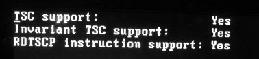
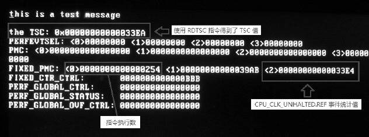
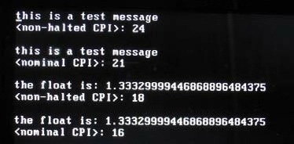

<!-- @import "[TOC]" {cmd="toc" depthFrom=1 depthTo=6 orderedList=false} -->

<!-- code_chunk_output -->

- [1. clock cycle](#1-clock-cycle)
  - [1.1. 检测 TSC 是否可用](#11-检测-tsc-是否可用)
  - [1.2. TSC 计数器的计数频率](#12-tsc-计数器的计数频率)
- [2. Invariant TSC](#2-invariant-tsc)
  - [2.1. 检测 invariant TSC 是否可用](#21-检测-invariant-tsc-是否可用)
- [3. 读取 TSC 值](#3-读取-tsc-值)
  - [3.1. RDTSCP 指令](#31-rdtscp-指令)
- [4. clock per instruction](#4-clock-per-instruction)
  - [4.1. Non-halted CPI](#41-non-halted-cpi)
  - [4.2. nominal CPI](#42-nominal-cpi)

<!-- /code_chunk_output -->

# 1. clock cycle

Intel 从 Pentium 处理器开始提供了 **TSC(time\-stamp counter)机制**, 直译为**时间戳记计数器**, 这个 **counter** 用来统计: 处理器在**POWER\-UP** 或 **RESET 后**所经过的 **clock cycle(时钟周期)数**.

**clock cycle**有时也被称为**clock tick**. 而处理器**每秒钟产生的 tick 数**, 是叫做处理器的**运行频率**, 以 2G 频率的处理器来说, 它每秒产生`2×10^9`(**1G 为 10 的 9 次方！！！**)个 clock 信号. 在**同一个处理器架构**下, 处理器运行的频率越高则表示处理器**每秒能做更多的事件**.

然而, 另一个指标也对**处理器的性能**起决定性的作用: **CPI(clock per instruction**), 执行**每条指令所需要的 clock cycle 数**.


所谓的**CPU 周期**是指 CPU 所能识别的**最小时间单元！！！**, 通常为亿分之几秒, 是 CPU 执行最简单的指令时所需要的时间, 例如读取寄存器中的内容, 也叫做`clock tick`.


## 1.1. 检测 TSC 是否可用

除非在**古老的机器**上, 软件需要使用 `CPUID.01:EDX[4]` 来检则**是否支持 TSC 计数器**, 以及 **CR4.TSD 控制位**是否可用. 在 Pentium 后的处理器上都无须进行检测.

## 1.2. TSC 计数器的计数频率

处理器在 **halted** 及 **non\-deep sleep(非深度睡眠**) 状态下**仍可用 time\-stamp counter 进行统计**, Intel 说明了在外部的 `DPSLP# pin` 信号有效时会使`time-stamp counter`**停止计数**.

与之相反的是, 在前面所述的**Fixed 监控事件**里, **IA32\_FIXED\_CTR1**与**IA32\_FIXED\_CTR2**计数器所使用的**CPU\_CLK\_UNHALTED.CORE**与**CPU\_CLK\_UNHALTED.REF 事件**只能统计处理器在**非 halted 非 sleep 状态(！！！**)下的 clock 值.

TSC 的**计数频率**是恒定的, 事实上与 `CPU_CLK_UNHALTED.REF` 事件的**计数频率是一致**的.

# 2. Invariant TSC

在处理器支持**Invariant TSC(不变的 TSC**)增强功能下, Intel 说明在 **ACPI** 的`Pstate`、`C-state`, 以及`T-states`状态下, 也将**保持恒定的计数频率**.

在**OS 定时器组件**里, 可以使用这个**invariant TSC 功能**来**代替 ACPI 或 HPET(高精度)定时器(！！！**).

## 2.1. 检测 invariant TSC 是否可用

在新近的处理器上, 软件可以使用 `CPUID.80000007H: EDX[8]` 位来检测**是否支持 Invariant TSC 功能**. 下图是在 Westmere 架构 Core i5 处理器上检测 invariant TSC 功能的结果.



这个显示结果是调用 lib\cpuid.asm 文件里的 dump\_tsc_support()函数打印出的, 我们看到, Invariant TSC 功能和 RDTSCP 指令是支持的.

# 3. 读取 TSC 值

对于处理器运行所经过的 clock 数, 软件可以使用 **RDTSC 指令进行读取**, RDTSC 指令将读取 64 位的 `IA32_TIMER_STAMP_COUNTER` **寄存器值**放到`EDX:EAX`寄存器. **效果等同于**使用**RDMSR 指令**直接读取 `IA32_TIMER_STAMP_COUNTER` 寄存器.

```assembly
mov ecx, IA32_TIMER_STAMP_COUNTER
rdmsr        ;  直接读 IA32_TIMER_STAMP_COUNTER 寄存器
```

当**CR4 寄存器**的**TSD(time stamp disable**)控制位**置 1**时, RDTSC 指令只能执行在**0 级**权限下, 为**0**时, **RDTSC 指令**可以执行在**任意权限**下.

## 3.1. RDTSCP 指令

**RDTSCP 指令**允许**软件提供 processor ID 值**放在**IA32\_TSC\_AUX 寄存器**里, 对**提供的 processor ID 读取 TSC 值**. 因此, 可以对提供的**thread 级(logial proceesor**)的 clock 进行统计. 而**RDTSC 指令**只能基于**当前的 physical processor**进行统计.

处理器是否支持 RDTSCP 指令, 使用 `CPUID.80000001H: EDX[27]` 位来检测, 为**1**时表示支持**RDTSCP 指令**和**IA32\_TSC\_AUX 寄存器**.

```assembly
mov ecx, IA32_TSC_AUX
mov eax, 01000000H      ;  local APIC ID=01000000H
mov edx, 0
wrmsr
rdtscp
```

这段代码将读取 logical processor ID 为 01000000H 的 TSC 值(关于 local APIC ID 详见 18.4.1 节所述).

>实验 15-12: 对比 TSC 与 CPU\_CLK\_UNHALTED.REF 事件

前面说过, **TSC**与**IA32\_FIXED\_CTR2 计数器**所使用**CPU\_CLK\_UNHALTED.REF 事件**的**计数频率是一致的**. 现在, 我们可以测试一下它们得到的值是否一致.

除了可以对比它们的差别外, 还有另外一个意义: **测量 CPI(cycle per instruction**)值, 我们将在下面进行探讨.

代码清单 15-30(topic15\ex15-12\protected.asm):

```assembly
;  设置所有的 fixed 计数器控制器
      mov ecx, IA32_FIXED_CTR_CTRL
      mov eax, 0BBBh                           ;  En=3(all ring levels), ANY=0, PMI=1
      mov edx, 0
      wrmsr
;  同时开启 3 个 IA32_PMCx 计数器及 3 个 IA32_FIXED_CTRx 计数器
      ENABLE_COUNTER 0, 7
      rdtsc
      mov [start_tsc], eax
      mov [start_tsc + 4], edx
;  测试函数
      call test_func
;  关闭所有计数器
      DISABLE_GLOBAL_COUNTER
      rdtsc
      mov [end_tsc], eax
      mov [end_tsc + 4], edx
      mov esi, msg1
      call puts
      ; * 求间隔: end_tsc - start_tsc
      mov esi, end_tsc
      mov edi, start_tsc
      call subtract64
      mov esi, eax
      mov edi, edx
      call print_qword_value
      call println
;  打印 perfmon 单元相关信息
      call dump_perfmon
```

在这段实验的主体代码里, 开启了 3 个 Fixed 计数器, 调用一段打印测试信息的子过程, 在子过程的前后分别使用 RDTSC 指令来读取启动(start\_tsc)值和结束(end\_tsc)值.

使用 64 位的减法 subtract64()函数用 end\_tsc 值减 start\_tsc 值得到子过程执行所用的 TSC 值, 对比一下 IA32\_FIXED\_CTR2 的监控事件所得到的计数值. 下面是实验的运行结果.



在这个结果图里我们看到, `IA32_FIXED_CTR0` 使用的 `INST_RETIRED`.ANY 监控事件得到的执行指令数是 00000254H(即 596 条指令). 使用 TSC 计数器得到的统计范围内的 clock 数为 000033EAH.

而 `IA32_FIXED_CTR2` 使用的 `CPU_CLK_UNHALTED.REF` 事件得到的 clock 数为 000033E4H, 去除了 RDTSC 指令多测量的 1 条指令的 clock 值, 它们测量出来的值是相等的.

# 4. clock per instruction

CPI(clock per instruction)反映了**处理器架构效率**. 显然, 这个**值越少**, 表示处理器的**效率更高**, 执行一条指令能使用更少的 clock cycle. 在 Intel 里提供了两种测量 CPI 指标的方法, 如下表所示.


这两个方法都是测量一条指令的执行需要多少 clock. 显然, 每条指令所需要的 clock 数是不相同的. 那么**CPI 值将是一个平均值**. 它是测量一个**软件**、一个**函数**或者**一段代码内所需的 clock 总和**, 再**除以一共执行的指令条数**.

测量执行的指令数需要使用**INST\_RETIRED.ANY 监控事件**, 我们可以使用 IA32\_FIXED\_CTR0 计数器, 也可以使用 IA32\_PMCx 计数器来统计.

## 4.1. Non-halted CPI

这个方法是测量 non\-halted 的 clock 数量, 使用 CPU\_CLK\_UNHALTED.CORE 监控事件来测量处理器核的 clock 数. 我们需要使用 IA32\_FIXED\_CTR1 计数器进行测量.

代码清单 15-31(lib\prefmon.asm):

```assembly
; --------------------------------------------
;  get_unhalted_cpi(): 测量 non-halted CPI 值
;  input:
;        esi - 需测量的函数代码
;  outpu:
;        eax - CPI 值
;  描述:
;        使用 CPU_CLK_UNHALTED.CORE 事件
; -------------------------------------------
get_unhalted_cpi:
      push ecx
      push edx
      ; *
      ; * 先关闭 Fixed 计数器, 并清为 0 值
      ; *
      DISABLE_COUNTER 0, (IA32_FIXED_CTR0_EN | IA32_FIXED_CTR1_EN)
      RESET_FIXED_PMC
      ; *
      ; * 开启 Fixed 计数器, 开始计数
      ; *
      mov ecx, IA32_FIXED_CTR_CTRL
      mov eax, 0BBh
      mov edx, 0
      wrmsr
      ENABLE_COUNTER 0, (IA32_FIXED_CTR0_EN | IA32_FIXED_CTR1_EN)
      call esi                ;  调用被测量函数
      ; *
      ; * 关闭 Fxied 计数器, 停止计数
      DISABLE_COUNTER 0, (IA32_FIXED_CTR0_EN | IA32_FIXED_CTR1_EN)
      mov ecx, IA32_FIXED_CTR0
      rdmsr
      push eax
      push edx
      mov ecx, IA32_FIXED_CTR1
      rdmsr
      push eax
      push edx
      RESET_FIXED_PMC
      pop edx
      pop eax
      pop edi
      pop esi
      div esi
      pop edx
      pop ecx
      ret
```

上面的 get\_unhalted\_cpi()函数通过运行一段函数或子过程来测量出 non\-halted CPI 值. 使用了 IA32\_FIXED\_CTR0 与 IA32\_FIXED\_CTR1 计数器来测量. IA32\_FIXED\_CTR0 计数器得到执行指令数, 而 IA32\_FIXED\_CTR1 计数器得到 unhalted clock 数量.

## 4.2. nominal CPI

这个方法使用 time\-stamp counter 的值, 也可以使用 IA32\_FIXED\_CTR2 计数器进行测量. 它们的值是相等的.

代码清单 15-32(lib\prefmon.asm):

```assembly
; --------------------------------------------
;  get_nominal_cpi(): 测量 non-nominal CPI 值
;  input:
;        esi - 需测量的函数代码
;  outpu:
;        eax - CPI 值
;  描述:
;        使用 CPU_CLK_UNHALTED.REF 事件
; -------------------------------------------
get_nominal_cpi:
      push ecx
      push edx
      ; *
      ; * 先关闭 Fixed 计数器, 并清为 0 值
      ; *
      DISABLE_COUNTER 0, (IA32_FIXED_CTR0_EN | IA32_FIXED_CTR2_EN)
      RESET_FIXED_PMC
      ; *
      ; * 开启 Fixed 计数器, 开始计数
      mov ecx, IA32_FIXED_CTR_CTRL
      mov eax, 0B0Bh
      mov edx, 0
      wrmsr
      ENABLE_COUNTER 0, (IA32_FIXED_CTR0_EN | IA32_FIXED_CTR2_EN)
      call esi                ;  调用测试函数
      ; *
      ; * 关闭 Fxied 计数器, 停止计数
      DISABLE_COUNTER 0, (IA32_FIXED_CTR0_EN | IA32_FIXED_CTR2_EN)
      mov ecx, IA32_FIXED_CTR0
      rdmsr
      push eax
      push edx
      mov ecx, IA32_FIXED_CTR2
      rdmsr
      push eax
      push edx
      RESET_FIXED_PMC
      pop edx
      pop eax
      pop edi
      pop esi
      div esi
      pop edx
      pop ecx
      ret
```

这个 get\_nominal\_cpi()函数和 get\_unhalted\_cpi()原理是一样的, 所使用的 clock cycle 监控事件不同. 这个函数使用了 CPU\_CLK\_UNHALTED.REF 事件和 IA32\_FIXED\_CTR2 计数器(结果等同于 time-stamp counter 计数器).

这两个函数都实现在 lib\perfmon.asm 文件里, 可作为库函数使用.

>实验 15\-13: 测量 CPI 值

在这个实验里, 分别执行两个测试函数来测量 non-halted CPI 与 nominal CPI 值, 这两个测试函数一个是打印测试信息, 一个是调用 lib32.asm 库的 print_dword_float()函数来打印浮点数.

代码清单 15-33(topic15\ex15-13\protected.asm):

```assembly
; *
; * 测试 float 单元
; *
test_print_float:
       jmp do_test_print_float
f1      dd 1.333
tpf_msg db 'the float is: ', 0
do_test_print_float:
       finit
       mov esi, tpf_msg
       call puts
       mov esi, f1
       call print_dword_float
       call println
       ret
; *
; * 测试字符串
; *
test_func:
       jmp do_test_func
test_msg db 'this is a test message', 10, 0
do_test_func:
       mov esi, test_msg
       mov eax, SYS_PUTS
       int SYSTEM_SERVICE_VECTOR
       ret
```

这个 test\_print\_flat()测试函数可以测量一个部分浮点指令的运算, 我们可以使用下面的形式进行调用.

代码清单 15-34(topic15\ex15-13\protected.asm):

```assembly
;  1) 得到 non-halted CPI 值
       mov esi, test_func                      ;  被测量的函数
       call get_unhalted_cpi                  ;  得到 CPI 值
       mov ebx, eax
       mov esi, msg1
       call puts
       mov esi, ebx
       call print_dword_decimal              ;  打印 CPI 值
       call println
       call println
```

获得 CPI 值的方法, 就是调用前面的 get\_unhalted\_cpi()函数或 get\_nominal\_cpi()函数. 下面是在笔者的 Westmere 架构 Core i5 移动处理器上运行的结果, 这个结果可能会让人感到有些意外.



实验里进行了 4 次的 CPI 值测量, 前两次是调用 test\_func()函数打印测试信息, 后两次是调用 test\_print\_float()来测试浮点数打印.

我们看到结果里的 4 个 CPI 值如下.

1) 执行 test\_func()得到的 Non\-halted CPI 值为 24.

2) 执行 test\_func()得到的 Nomial CPI 值为 21.

3) 执行 test\_print\_flat()得到的 non\-halted CPI 值为 18.

4) 执行 test\_print\_flat())得到的 nominal CPI 值为 16.

对于执行 test\_func()函数得到的 CPI 值, 我们可以参考前面实验 15\-12 的结果所显示的数据来计算一下.

1) Non\-halted CPI 等于 IA32\_FIXED\_CTR1 的值除以 IA32\_FIXED\_CTR0 的值, 也就是 39ABH/254H=18H(也就是十进制数 24).

2) Nominal CPI 等于 IA32\_FIXED\_CTR2 的值除以 IA32\_FIXED\_CTR0 的值, 33E4H/254H=16H(也就是十进制数 22).

这两个值和 get\_unhalted\_cpi()与 get\_nomial\_cpi()函数得到的是相等或约等的. 值得奇怪的是, 执行浮点数所得到的 CPI 数居然低于打印字符串信息, 实际上, 打印 1.3333 这个浮点数的信息量反而比打印一条字符串信息要多要长.

另一个让笔者感到意外的是, 每条指令执行居然需要 21 个 clock clyce(以 nomial CPI 值 21 为例).

笔者有些不敢相信这个结果(CPI 为 21), 然而这个测量方法是在 Intel 手册上提供的, 应该没错.

如果以一个具有 2GHz 频率的处理器来计算每秒大约可以执行多少条指令.

每秒执行指令数=(2×109)÷24≈83333333

那么计算出来的值超过 8300 万条指令, 这个值应该算是很可观的. 如果有 3GHz 以上的频率那么将会近 1 亿 3 千万条指令.