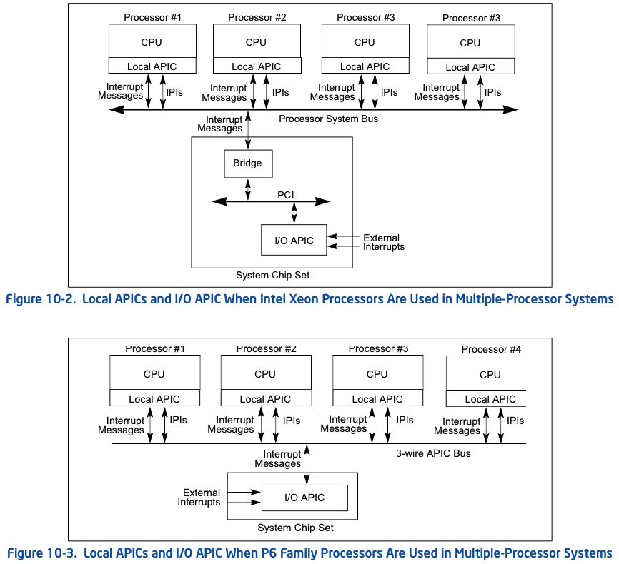
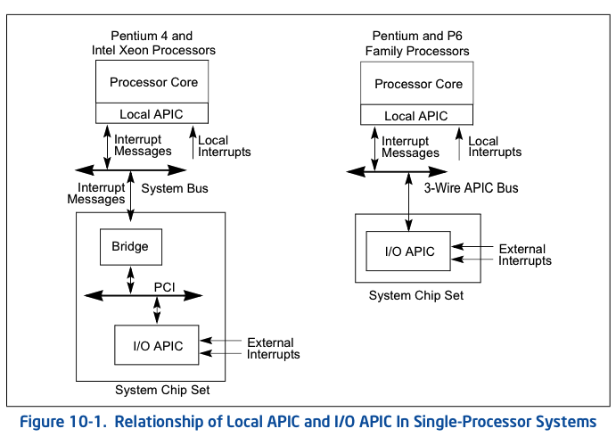

<!-- @import "[TOC]" {cmd="toc" depthFrom=1 depthTo=6 orderedList=false} -->

<!-- code_chunk_output -->

- [1. 中断源](#1-中断源)
- [2. 硬件中断(外部中断): External Interrupts](#2-硬件中断外部中断-external-interrupts)
  - [2.1. 引脚(pins): LINT](#21-引脚pins-lint)
    - [2.1.1. 早期处理器的引脚](#211-早期处理器的引脚)
    - [2.1.2. 其他引脚](#212-其他引脚)
  - [2.2. I/O APIC](#22-io-apic)
- [3. 软件中断](#3-软件中断)

<!-- /code_chunk_output -->

# 1. 中断源

两种:

1. External (hardware generated) interrupts: **硬件上产生**的中断, 也称为**外部中断！！！**

> 这里的外部指的 CPU 处理流程之外

2. Software-generated interrupts: **软件上**发起的中断

# 2. 硬件中断(外部中断): External Interrupts

APIC 架构的图.

图 1, Xeon 和 P6 系列的多处理器系统



单处理器系统



图 2:


**硬件中断**是通过**处理器**上的**引脚**(pins)或**local APIC**接收. 又可以分为**处理器外部**和**处理器内部**.

* **处理器外部硬件中断**来自**各种引脚 pin 信号接口**和 **Local APIC** 的**LINT0**和**LINT1 引脚**, 以及由**外部 I/O APIC 发送过来的中断消息**.

* **处理器内部硬件中断**来自一组 **LVT**(local vector table) 寄存器和 **IPI** 处理器间的中断, 本质上还是 local APIC 接收.

所有通过 **INTR PIN 引脚**和 **local APIC 的外部中断**都是可屏蔽中断. 参见"中断的屏蔽".

Non-Maskable Interrupt: NMI, 不可屏蔽中断. 通过**处理器 NMI pin 接收的中断请求**是不可屏蔽的, 在**支持 APIC 的处理器**上 **LINT1 pin 如果被作为 NMI pin**使用, 接收来自**外部的 NMI 信号**.

## 2.1. 引脚(pins): LINT

> LINT [1:0]

Pentium 4, Intel Xeon, P6 系列和 Pentium 处理器上的**主要中断引脚**是 `LINT [1:0]` 引脚, 它们会连接到**local APIC**.

* 当**启用 local APIC** 后, 可以通过 APIC 的**本地向量表**(**LVT**, `local vector table`)对 `LINT [1: 0]` 引脚**进行编程**, 使其与处理器的**任何异常或中断向量**相关联.

* 当 **local APIC** 被全局/硬件**禁用**, 这些引脚分别被配置为 **INTR** 和 **NMI 引脚**:

  * 当**外部中断发生**, 会通过 **INTR 引脚**向处理器发出信号. **处理器**从**系统总线**上**读取**由**外部中断控制**器提供的**中断向量**, 例如 8259A.

  * **NMI pin** 会有一个不可屏蔽的中断(NMI)信号, 它被分配到**中断向量号 2**.

### 2.1.1. 早期处理器的引脚

`LINT [1: 0]` 引脚在**不包含 local APIC** 的 **Intel486** 处理器和**较早的 Pentium 处理器**上**不可用**.

这些处理器里面没有 on-chip local APIC. 而是具有**专用**的 **NMI** 和 **INTR 引脚**.

对于这些处理器, 外部中断通常由基于系统的**中断控制器**(8259A) 生成, 并通过 **INTR 引脚发出中断信号**.

### 2.1.2. 其他引脚

请注意, 处理器上的**其他几个引脚**可能会导致**处理器中断**. 但是, 这些中断**不会**由本章介绍的**中断和异常机制处理**. 这些引脚包括 `RESET＃`, `FLUSH＃`, `STPCLK＃`, `SMI＃`, `R/S＃` 和 `INIT＃`引脚. 它们是否包括在特定处理器中取决于实现. 引脚功能在各个处理器的数据手册中进行了描述. 第 34 章"系统管理模式"中介绍了 `SMI＃` 引脚.

## 2.2. I/O APIC

处理器的 local APIC 通常连接到 I/O APIC. 此时, 在 I/O APIC **引脚**处接收到的外部中断可以通过**系统总线**或**APIC 串行总线**重定向**到 local APIC**.

**I/O APIC**会**决定**这个中断的**向量号**, 并将**该数字**发送到 local APIC. 当系统包含**多个处理器**时, 处理器还可以通过**系统总线**或**APIC 串行总线**.

# 3. 软件中断

在软件上可以使用**INT 指令主动发起中断**, 从而会强制且隐式调用中断处理程序, 如下.

```
int 0x40        ; 执行 0x40 号中断服务例程
```

**INT 指令**可以使用**0 ~ 255(！！！**)中任何值作为中断向量进行调用.

当时使用 NMI 向量(即 2), 则会调用 NMI 中断处理程序, 但是不会激活处理器的 NMI 硬件处理. 这也意味着这时, 由**硬件产生的 NMI 将不能被响应**.

使用 `INT n` 指令在软件中产生的中断不能被 EFLAGS 寄存器中的 IF 标志屏蔽.
