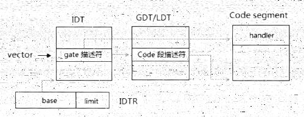
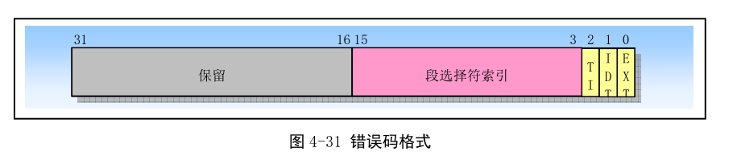

<!-- @import "[TOC]" {cmd="toc" depthFrom=1 depthTo=6 orderedList=false} -->

<!-- code_chunk_output -->

- [1. 处理器对 gate 描述符和 code 描述符的检查](#1-处理器对-gate-描述符和-code-描述符的检查)
  - [1.1. 检查 IDT limit](#11-检查-idt-limit)
  - [1.2. gate 描述符的检查](#12-gate-描述符的检查)
  - [1.3. 目标代码段 selector 的检查](#13-目标代码段-selector-的检查)
  - [1.4. 目标代码段描述符的检查](#14-目标代码段描述符的检查)
- [2. 权限的检查](#2-权限的检查)
- [3. 权限处理的三种情形](#3-权限处理的三种情形)
- [4. 第 1 种情形: 同级调用](#4-第-1-种情形-同级调用)
- [5. 第 2 种情形: 权限及 stack 的切换](#5-第-2-种情形-权限及-stack-的切换)
  - [5.1. 读取 stack 指针](#51-读取-stack-指针)
  - [5.2. SS selector 及 descriptor 的检查](#52-ss-selector-及-descriptor-的检查)
  - [5.3. 对 ESP 值的检查](#53-对-esp-值的检查)
  - [5.4. 检查 EIP 值](#54-检查-eip-值)
  - [5.5. 加载 SS 和 ESP 寄存器](#55-加载-ss-和-esp-寄存器)
  - [5.6. 加载 CS 和 EIP 寄存器](#56-加载-cs-和-eip-寄存器)
  - [5.7. 权限的改变](#57-权限的改变)
  - [5.8. 保存处理器状态](#58-保存处理器状态)
- [6. 第 3 种情形: conforming 代码段](#6-第-3-种情形-conforming-代码段)
- [7. Eflags 标志位的处理](#7-eflags-标志位的处理)
- [8. 执行中断/异常处理程序](#8-执行中断异常处理程序)

<!-- /code_chunk_output -->

当中断或异常发生, 处理器最终目的将是调用相应的中断/异常处理程序进行处理, 看下面的**中断/异常服务例程调用流程**(**保护模式**下)



下面看在保护模式和 IA\-32e 模式下, 处理器需要经过什么步骤达到执行处理程序

# 1. 处理器对 gate 描述符和 code 描述符的检查

成功加载**CS**和**EIP**寄存器之前, 处理器会对 gate 描述符和 code 描述符、vector、以及 selector 进行检查

## 1.1. 检查 IDT limit

读取 gate 描述符时, 处理器将检查**vector**是否超出**IDT 的 limit**

```c
if(IA32_EFER.LMA == 1)      /* 是否处于 long mode */
{
    descriptor_size = 16;   /* 16 个字节 */
}else
    descriptor_size = 8;    /* 8 个字节 */

if (IDTR.limit >= vector * descriptor_size + (descriptor_size -1))
{
    /* 通过 */
}else{
    /* 失败, 产生 #GP 异常(一般保护错误)
}
```

若处理器当前处于**IA\-32e 模式**(long mode), 那么**gate 描述符**大小是**16 字节**, 保护模式是 8 字节

**IDTR.limit(该值是以字节为单位计算的！！！**)值必须**大于等于**:

- **legacy 模式**下, `vector * 8 + 7`
- **IA-32e 模式**下, `vector * 16 + 15`

加上 7 或 15 是为了确保一个完整的 gate 描述符不超过 limit 值, 这样才能被通过. 否则失败产生`#GP`异常. **而\#GP 异常必然导致\#DF(Double fault)异常**的发生, 最后结果是**机器遭到 RESET**.

## 1.2. gate 描述符的检查

处理器对 gate 描述符进行一系列的合规检查, 如下:

```c
if(IA32_EFER.LMA == 1)      /* IA-32e 模式下
{
    if (gate_descriptor.type == interrupt_gate_64
            || gate_descriptor.type == trap_gate_64)
    {
        /* 通过 */
    }else{
        /* 失败: 产生#GP 异常
    }
}else{                      /* legacy 保护模式下 */
    if(gate_descriptor.type == INTERRUPT_GATE
            || gate_descriptor.type == TRAP_GATE
            || gate_descriptor.type == TASK_GATE)
    {
        /* pass */
    }else{
        /* 失败: 产生#GP 异常 */
    }
}

if (gate_descriptor.S == 1)
{
    /* 失败: 产生#GP 异常 */
}

if (gate_descriptor.P == 0)
{
    /* 失败: 产生#NP 异常 */
}
```

处理器检查下面几个方面

1) 在**legacy 保护模式**下, **描述符类型**是否为**Interrupt\-gate**, **Trap\-gate**或**Task\-gate**

2) 在**IA\-32e 模式**下, **描述符类型**是否为**64 位的 Interrupt\-gate**, **Trap\-gate**

3) 描述符的**S 标志位需为 0**, 是**System descriptor**, 否则产生\#GP 异常

4) 描述符**P 标志位**需为 1, 是 present, 否则**产生\#NP 异常**

实际情况更复杂, 在**legacy 保护模式**下, **Interrupt\-gate 和 Trap\-gate 可以是为 32 位和 16 位(D 位表示！！！**); 而**IA\-32e 模式**下, Interrupt\-gate 和 Trap\-gate**固定是 64 位**.

## 1.3. 目标代码段 selector 的检查

处理器将从 gate 描述符中读取**selector**, 处理器会对这个 selector 检查

```c
selector = gate_descriptor.selector;            /* 读取 gate 描述符的 selector */

/* 下面检查是否属于 NULL selector
if (selector == 0 || selector == 1 || selector == 2 || selector == 3)
{
    /* 失败: 产生#GP 异常 */
}

/* 检查 selector 是否超限 */
if (selector.TI == 0)
{
    limit = GDTR.limit;     /* GDT */
}else{
    limit = LDTR.limit
}

if (IA32_EFER.LMA == 0)
{
    if (limit >= (selector & 0xFFF8) + 7)
    {
        /* 通过 */
    }else{
        /* 失败: 产生#GP 异常
    }

}
```

检查两个方面.

1) 是否为 Null selector

2) **selector**是否超过**descriptor table**的**limit**

当 selector 值为 0, 1, 2 或 3 时, 这个 selector 属于 Null selector, 处理器将\#GP 异常

selector 的**TI 标志**决定**code segment descriptor**在**GDT 还是 LDT**内,这个描述符表的 limit 必须大于等于:

>selector & 0xFFF8 + 7, 也就是(selector>>3) \* 8 +7

无论是**legacy 模式还是在 IA\-32e 的 64 位模式**下, **code segment descriptor**依然是**8 个字节宽**. 而**64 位模式**下处理器**不会检测 CS selector 是否超出 limit**.

## 1.4. 目标代码段描述符的检查

处理器使用**selector**在**GDT/LDT**里读取**目标代码段描述符**.目标代码段描述符的检查如下

```c
if (code_descriptor.C_D == 0        /* 属于 Data 段 */
        || code_descriptor.S == 0)  /* 属于 System 段 */
{
    /* 失败, 产生#GP 异常 */
}

if (code_descriptor.P == 0)
{
    /* 失败, 产生#NP 异常 */
}

if (IA32_EFER.LMA == 1)
{
    if (code_descriptor.L == 1 && code_descriptor.D == 0)
    {
        /* 通过: L = 1, D = 0 */
    }else{
        /* 失败: 不是 64 位代码, 产生#GP 异常 */
    }
}
```

处理器检查:

1) 目标**描述符类型**是否为**Code segment descriptor**, 否则将产生\#GP 异常

2) 描述符的 S 标志是否为 1, 否则产生\#GP 异常. **S 为 0**表明是**系统段描述符**, **S 为 1**表明是**代码或数据段描述符**

3) 描述符的 P 标志是否为 1, 否则产生\#NP 异常

4) 在**IA\-32e 模式**下**目标代码**必须是**64 位代码**, Code segment descriptor 的**L 标志位为 1**并且**D 标志位为 0**(指示**中断/异常处理程序运行在 64 位模式！！！**)

由于在**IA\-32e 模式**下, **中断/异常处理程序**是运行在**64 位模式**下, 因此**目标代码段描述符**的**L=1 并且 D=0**.

而**legacy 保护模式**下, **目标代码**可以是**32 位或 16 位**的代码, 具体**取决于 D 标志位(！！！**).

# 2. 权限的检查

如下:

```c
if (IA32_EFER.LMA == 1)     /* IA-32e 模式下 */
{
    if ((opcode == 0xCE) && (CS.L == 1))
    {
        /* 失败: 在 64 位模式下不支持 INTO 指令, 产生#UD 异常 */
    }
}

if (opcode == 0xCD || opcode == 0xCC || opcode == 0xCE)
{
    /* 属于 INT, INT3 或者 INT0 指令, 则需要权限检查 */
    if ((CPL <= gate_descriptor.DPL) && (CPL >= code_descriptor.DPL))
    {
        /* 通过 */
    }else{
        /* 失败, 产生#GP 异常 */
    }
}
```

然而处理器**只会对使用下面的指令(！！！**)调用**中断/异常处理程序**时进行**权限检查**.

1) **INT 指令**: 提供一个 vector, 由**int 指令**(**opcode 码为 0xCD**)**主动**发起调用中断处理程序

2) **INT3**指令: 这是**断点异常指令**(opcode 码为**0xCC**), 由这条指令**调用\#BP 异常处理程序**

3) **INTO**指令: 这是**溢出异常调用指令**(opcode 码为**0xCE**), 由这条指令**调用\#OF 异常处理程序**

上面由**软件调用**的中断/异常, 处理器**才会进行权限检查**, 让软件对重要**代码及数据**进行**受限制的访问**

下面的中断/异常处理程序调用情形里, **处理器不会权限检查**

1) 处理器接收到**硬件中断请求**(例如: 由 INTR 和 NMI pin 接收的中断或 APIC 产生的中断)而调用中断处理程序

2) **软件发生异常(非指令主动触发！！！**)而调用相应的异常处理程序

```x86asm
mov eax, [eax]  ; 产生#PF 异常, 忽略权限检查
int 14          ; 直接调用 14 号 #PF 处理程序, 处理器将进行权限检查
```

如上面代码, 同样是对#PF 异常处理程序调用, 使用**INT 指令直接调用**, 处理器会进行**权限检查**

>另一个不同之处, 使用**int 指令**调用异常处理程序, 处理器**不会压入 error code**

这个权限检查中, 所需要的权限必须如下.

1) CPL <= gate 描述符的 DPL

2) CPL >= 目标 code 段描述符的 DPL

这里说明了**中断/异常处理程序**运行在**高权限级别**里, **不同于 call\-gate 的调用**, 中断调用不适用 selector, 因此没有 RPL 需要检查.

# 3. 权限处理的三种情形

在调用中断或异常的处理程序时, 会遇到三种权限情形需要处理

```c
if (code_descriptor.C == 0)         /* non-conforming 代码段 */
{
    if (CPL == code_descriptor.DPL)
    {
        /* 同级调用: 代码段, 权限和 stack 都不改变 */
    }else if (CPL > code_descriptor.DPL){
        /* 代码段, 权限和 stack 都会切换 */
    }else{
        /* 失败: 产生#GP 异常 */
    }
}else{                              /* conforming 代码段 */
    /* 同级调用: 切换到目标代码段, 权限和 stack 不改变 */
}
```

三种情形如下.

1) 目标代码段是 non\-conforming 类型, 当**CPL 的值等于目标 Code 段的 DPL 值**时, 这是**同级调用**, **代码段、权限和 stack 都不改变**

2) 目标代码段是 non\-conforming 类型, 当**CPL 的值大于目标 Code 段的 DPL 值(数值大于, 级别小！！！**)时: 将切换到**高权限代码, stack 也会发生切换**

3) 目标代码段是 conforming 类型, 会发生**代码段的切换**, 可是**权限和 stack 不会改变**

第 1 种和第 3 种情形虽然权限和 stack 都不改变, 但它们是有区别的, conforming 类型的段会发生代码的切换(即 CS 会被刷新, 加载目标代码段描述符)

# 4. 第 1 种情形: 同级调用

当 CPL = code segment descriptor DPL 时, 指示当前运行代码和中断/异常处理程序运行在**相同的权限级别**中. 因此无须进行 stack 切换.

**处理器**会在**当前的 stack**中依次压入下面的状态

1) **eflags**: 对于 INT 指令调用来说, 是 INT 指令执行前的值. 对于异常来说取决于其类型属于 fault 还是 trap.

2) **CS**

3) **EIP**: 对于**INT 指令调用**来说, 是 INT 指令的**下一条指令地址**. 对于**异常**取决于其类型属于 fault 还是 trap

4) 发生异常时, **某些异常需要压入 error code**.

实际情况要更复杂

```c
if (CPL == code_descriptor.DPL)                 /* 同级调用 */
{
    switch (gate_descriptor.type)
    {
        case Interrupt_gata_16:                 /* 16 位中断门 */
        case Trap_gate_16:                      /* 16 位陷阱门 */
            push(flags);                        /* 16 位的 flags 寄存器 */
            push(cs);
            push(ip);                           /* 16 位的 IP 值 */
            push(error_code);                   /* 某些异常 */
            break;
        case Interrupt_gate_32:                 /* 32 位中断门 */
        case Trap_gate_32:                      /* 32 位陷阱门 */
            push(eflags);                       /* 32 位的 eflags 寄存器 */
            push(cs);
            push(eip);                          /* 32 位 EIP 值 */
            push(error_code);                   /* 某些异常 */
            break;
        case Interrupt_gate_64:                 /* 在 IA-32e 模式下 */
        case Trap_gate_64:
            rsp = rsp & 0xFFFFFFFF_FFFFFFF0;    /* 调整到 16 字节对齐 */
            push(ss);                           /* 必须压入 SS 和 RSP 值 */
            push(rsp);
            push(rflags);                       /* 64 位的 rflags 值 */
            push(cs);
            push(rip);                          /* 64 位 RIP 值 */
            push(error_code);                   /* 某些异常 */
            break;
    }
}
```

注意: 32 位和 64 位模式的 CS 寄存器和 SS 寄存器都是 16 位, IP 寄存器、flags 寄存器、SP 寄存器等位数不一样

由于**legacy 模式**下, **Interrupt\-gate 和 Trap\-gate**可以是**32 位或 16 位(D 标志**), 因而导致复杂情况

1) 使用 16 位的 Interrupt/Trap\-gate 时, 压入的是**16 位**的值

2) 使用 32 位的 Interrupt/Trap\-gate 时, 压入的是**32 位**的值

在**IA\-32e 模式**下进入 64 位的中断服务例程, 只存在 64 位的 Interrupt/Trap\-gate, 处理器将:

1) 固定压入**SS 和 RSP 值**, 无论**是否权限发生变化**

2) 在压栈前, RSP 会被调整到 16 字节的边界上

# 5. 第 2 种情形: 权限及 stack 的切换

当 CPL > code segment descriptor DPL(值大于, 权限低)时, 意味着**目标处理程序**的运行权限**高于当前代码**的权限, 这时就会发生**权限及 stack 的切换**. 情况更复杂.

## 5.1. 读取 stack 指针

处理器将根据目标 Code 段描述符的 DPL 值, 在**当前 TSS 段**中读取**对应权限级别的 stack 指针(！！！**).

1) 在**legacy 模式**下, 包括**SS 和 ESP 值**

2) 在**IA\-32e 模式**下, 读取**RSP 值**

同样, 实际情况更复杂

```c
if (CPL > code_descriptor.DPL)
{
    if (IA32_EFER.LMA == 0)                 /* legacy 模式 */
    {
        switch(TR.attribute.type)
        {
            case TSS_16:
                stack_pointer = TR.base + code_descriptor.DPL * 4 + 2;
                if (stack_pointer + 3 > TR.limit)
                {
                    /* 失败: 产生#TS 异常 */
                }
                new_ss = stack_pointer + 2; /* 读取 16 位的 SS 临时保存 */
                new_sp = stack_pointer;     /* 读取 16 位的 SP 临时保存 */
                break;
            case TSS_32:
                stack_pointer = TR.base + code_descriptor.DPL * 8 + 4;
                if (stack_pointer + 5 > TR.limit)
                {
                    /* 失败: 产生#TS 异常 */
                }
                new_ss = stack_pointer + 4; /* 读取 16 位的 SS 临时保存 */
                new_esp = stack_pointer;    /* 读取 32 位的 SP 临时保存 */
                break;
        }
    }else if (IA32_EFER.LMA == 1)           /* IA-32e 模式 */
    {
        if (gate_descriptor.IST != 0)       /* 使用 gate 描述符的 IST 指针 */
        {
            /* 找到 TSS 的 IST 域 */
            stack_pointer = TR.base + gate_descriptor.IST * 8 + 36;
        }else
            stack_pointer = TR.base + gate_descriptor.IST * 8 + 4;

        if (stack_pointer + 7 > TR.limit)
        {
            /* 失败: 产生#TS 异常 */
        }
        new_rsp = stack_pointer;            /* 读取 64 位的 RSP 值 */
        new_ss = code_descriptor.DPL;       /* 新的 SS 被加载到为 NULL selector */
    }
}
```

由于**legacy 模式**下, **TSS**被分为**16 位和 32 位**, 而在**IA-32e 模式**下的中断/异常调用使用**64 位的 TSS 段**.(值得注意的是, 在**compatibility 模式**下 TSS 和 legacy 模式一致, 可是在中断/异常调用情况下使用**64 位的 TSS**).

有关**TSS 详细见 10.5.4.4.4**.

由于 TSS 的不同寻找 stack pointer 的地址也不同.

1) 在**16 位的 TSS 段**下,

stack\_pointer = TR.base + code\_descriptor.DPL \* 4 + 2;

每个**stack pointer**是**4 字节**宽, 包括: **16 位的 SP**和**16 位的 SS**值, 由当前的 TSS 段基地址加上 2(跳过两个字节的 task link 域)而来.

2) 在**32 位的 TSS 段**下,

stack\_pointer = TR.base + code\_descriptor.DPL \* 8 + 2;

每个 stack pointer 是 8 字节宽, 包括: **32 位的 SP 和 32 位的 SS 值**(高 16 位为 0), 由当前的**TSS 段基地址**加上 4(跳过 4 个字节的**task link 域**)而来.

3) 在**IA\-32e 模式**下, 就很不同了

- 如**使用 gate 描述符的 IST 域**, 就从**IST 域里获得 stack pointer**: 每个 IST 域都是**8 字节宽**, 加上当前的 TSS 段基地址, 然后**跳过 36 个字节(RSP 及保留域**).
- 否则**从 RSP 域里获得 stack pointer**: 每个 RSP 域是 8 字节, 加上当前的 TSS 段基地址, 然后跳过 4 个字节的 task link 域.

在 IA\-32e 模式下, 若发生权限改变, 目标代码段的 DPL 不为 3, 处理器将为 SS 加载一个 Null\-selector.

new\_ss = code\_descriptor.DPL;       /* 新的 SS 被加载到为 NULL selector */

这个 Null selector 是目标代码的 DPL 值, 即: 0, 1 或者 2(不能为 3)

关于 Null selector 的加载, 参考 10.5.1.2.

当读取到 TSS 段里的 SS 和 SP/ESP/RSP 值后, 将临时保存起来, 用于处理器的检查(当加载到 SS 和 SP/ESP/RSP 寄存器时, 原 SS 和 SS/ESP/RSP 也将临时保存起来, 用于压入 stack 中).

我们看到处理器会对 TSS 的 limit 进行检查.

1) 在 16 位 TSS 段下, 每个 stack pointer 是 4 个字节, 因此 stack pointer 需加上 3 来检查一个完整的 stack pointer 边界, 通过和 TR.limit 进行比较(当前 TSS 的 limit)

2) 在 32 位 TSS 段下, 每个 stack pointer 是 8 个字节, 可是 SS 域的高 16 是保留的, 处理器会读取 6 个字节. 因此, stack pointer 只需加上 5 来检查一个完整的 stack pointer 边界(16 位的 SS 和 32 位的 ESP 值)

3) 在 64 位模式下, 每个 stack pointer 是 8 个字节, 因此需要加上 7 来检查一个完整的 stack pointer 边界.

注意: 在 IA\-32e 模式下(包括 64 位和 compatibility 模式), 在调用 64 位的 interrupt/exception 处理程序中, 因此都使用 64 位的 TSS 段. 可是 TSS 在 compatibility 模式下和 legacy 模式一样, 可以为 16 位和 32 位.

与 TSS 相关而引发的异常, 处理器将产生\#TS(invalid TSS)异常, 如: 当处理器检查到 stack pointer 超过 TSS 段的 limit 时, 会产生\#TS 异常.

## 5.2. SS selector 及 descriptor 的检查

在将**TSS 段的 SS 和 SP/ESP 值**加载到**SS 寄存器和 SP/ESP 寄存器**前, 处理器也将进行一系列非常复杂的检查, 如下.

## 5.3. 对 ESP 值的检查

处理器也会对**TSS 段内的 ESP 值**进行检查

## 5.4. 检查 EIP 值

处理器会对 gate 描述符内的**目标代码 offset 值**进行检查

## 5.5. 加载 SS 和 ESP 寄存器

上面所有检查后,处理器会加载 TSS 段的 SS 和 SP/ESP/RSP 值到寄存器中, 代码如下:

## 5.6. 加载 CS 和 EIP 寄存器

## 5.7. 权限的改变

## 5.8. 保存处理器状态

上面完成, 意味着权限和 stack 已经完成切换, 处理器将在**新的 stack**里依次压入**原来的状态**.



代码如下:


依次压入的状态值包括: **原来的 SS, ESP, Eflags, CS, EIP**, 以及**必要时压入 error code**值. 这些**状态值的宽度**取决于**gate 描述符的类型**.

1) 当为 16 位的 Interrupt/Trap\-gate 时, 压入**16 位的状态值**

2) 当为 32 位 Interrupt/Trap\-gate 时, 压入 32 位的状态值

3) 在 IA\-32e 模式下, 使用 64 位的 Interrupt/Trap\-gate, 将压入 64 位状态值.

# 6. 第 3 种情形: conforming 代码段

当**目标代码段**属于**conforming 类型**时, 处理器加载 CS 寄存器, 代码如下.

```c
if (code_descriptor.C == 1)
{
    ... ...
    cs = gate_descriptor.selector;  /* 加载 CS 寄存器 */
    cs.RPL = CPL;                   /* CS.RPL 更新为当前的 CPL 值 */
    ... ...
}
```

CS.RPL 值被更新为当前的 CPL, 切换到目标代码后, **权限并不会切换**(即保持原 CPL 值). 假设 selector 指为 0x78(selector.RPL=0), 当前 CPL=3(处于用户代码级别), 那么切换到目标代码后, CS 将变成 0x7b, CS.RPL=3(保持当前的 CPL 为 3 级)

由于**SS 和 ESP 值不会改变**, 因此在进行**压栈**处理时将使用**原 stack pointer**, 处理方法和**同级调用一致**.

# 7. Eflags 标志位的处理

在执行 Interrupt 和 Exception 的处理程序之前, 处理器做最后一步, 就是**清 Eflags 的某些标志位**.

```c
if (gate_descriptor.type == interrupt_gate_16
    || gate_descriptor.type == interrupt_gate_32
    || gate_descriptor.type == interrupt_gate_64)   /* 属于中断门类型 */
{
    eflags.IF = 0;
}

eflags.TF = 0;
eflags.VM = 0;
eflags.RF = 0;
eflags.NT = 0;
```

当 gate 描述符属于**Interrupt\-gate**时, 处理器将清 IF 标志位, **关闭可屏蔽中断(该标志位用于可屏蔽中断！！！)的响应**. 对于 Trap\-gate 类型, 处理器将保持 IF 标志位不变.

同时, TF、VM、RF, 以及 NT 标志位都被清 0.


# 8. 执行中断/异常处理程序

处理器已经加载完成 SS、ESP、CS 和 EIP 寄存器, 并在**新的 stack**上保存**原状态**. 处理器将从**CS:EIP**位置上开始**执行中断/异常的处理程序**.