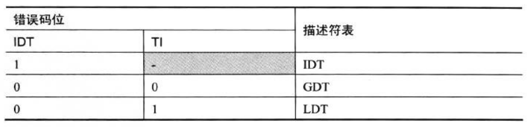
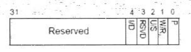

<!-- @import "[TOC]" {cmd="toc" depthFrom=1 depthTo=6 orderedList=false} -->

<!-- code_chunk_output -->

- [1. 确定 descriptor table](#1-确定-descriptor-table)
- [2. external event (外部事件)](#2-external-event-外部事件)
- [3. selector index](#3-selector-index)
- [4. #PF(Page Fault) 异常的错误码](#4-pfpage-fault-异常的错误码)

<!-- /code_chunk_output -->

在前面的**中断 vector 表**里列出了**哪些异常需要压入 error code**. 除了表中不产生 error code 的异常外, 下面情形**不会产生 error code**.

1) 由**INT、INT3 及 INTO 指令**调用中断/异常处理程序, **处理器不会产生 error code**.

2) 由**硬件产生的中断和异常**, 不会产生**error code**. 包括: 由 INTR 引脚和 NMI 引脚产生的中断, 以及由 APIC 产生的中断和异常.

error code 格式如下.

error code 和**segment selector**的结构很像, 包括 4 个部分.

1) **EXT 位(bit 0**): 当**置位**时, 指示异常发生于**处理器正在调用另一个事件的处理程序**中

2) **IDT 位**(bit 1): 当置位时, 指示 selector index(段选择符索引)指向**IDT 的 gate 描述符**

3) **TI 位**(bit 2): 当置位时, 指示 selector index(段选择符索引)指向**LDT 的描述符**

4) selector 的 index 域(bit 15 \~ bit 3): 这是 segment selector 的 index 部分

# 1. 确定 descriptor table

IDT 位和 TI 位用来确定 selector index 指向哪个 descriptor table(描述符表), 如下表

只有当 IDT 位为 0, TI 才有意义.

# 2. external event (外部事件)

当**一个程序产生一个 event**, 处理器在**这个 event 的提交过程(未处理！！！**)中**又发生了异常**时, **这个异常(新的异常！！！**)的**错误码的 EXT 位将被置位**, 指示异常发生在**另一个事件的处理过程**中.

典型地如前面所述的**有可能发生\#DF(double fault)异常**的情景下, 当处理器**正在准备调用中断或异常的处理程序**时发生了另一个异常.

例如, 在执行 int 0x40 指令来调用中断时:

1) 处理器在 IDT 中读取 gate 描述符

2) 可是这个 gate 描述符的 P=0(not present)(**会引发一个\#NP 异常**), 这时又引发**另一个\#NP 异常**. 那么**这个\#NP 异常的错误码中 EXT 位被置为 1**

上面例子**中\#NP 异常**发生在处理器正在调用 0x40 号中断处理程序时, 如前面, **若\#NP 异常**是发生在处理器**正准备调用\#GP 异常处理程序时(还没开始执行???**), 那最终会**产生\#DF(double fault)异常**.

# 3. selector index

错误码中的 selector index 是一个**中断 vector**或**segment selector 的 index 域**. 如前, 当使用 int 0x40 指令调用中断处理程序时, 由于 IDT 内的 gate 描述符 P=0 而**引发\#NP 异常**.

那么, \#NP 异常的**错误码**中:

1) EXT=1

2) IDT=1

3) TI=0 或 1(被忽略)

4) selector index 域为 0x40, 中断 vector 值

EXT 位为 1, 指示异常发生在处理器正准备调用中断服务例程中.

IDT 位为 1, 指示 selector index 将指向 IDT 的 gate 描述符

TI 位值无所谓

接上例, 假设**异常发生在 gate 描述符的 code segment selector 身上**, 当 selector 所引用的 segment descriptor 是**Data segment(数据段**)而非 Code segment(代码段)时, 会**产生\#GP 异常**.

那么, 这个\#GP 异常的错误码将是:

1) EXT=1

2) IDT=1

3) TI=0(在 GDT 表时), 或者 TI=1(在 LDT 表时)

4) selector index 域的值是 gate 描述符内的这个**code segment selector(代码段选择符**)的**index 域**

这时, IDT=0, 因为指向 GDT 或 LDT(依赖于 selector.TI 值), 而错误码的 selector index 则是 code segment selector 的 index 值.

# 4. #PF(Page Fault) 异常的错误码

在 `#PF` 异常中, 错误码格式又变得不一样.

错误码的 bit 4 到 bit 0 位指示引起\#PF 异常的条件

(1) P 位(bit 0):

1) P=0 时, 指示**异常由 not\-present 而引发**, 即 table entry 的 P 标志为 0

2) P=1 时, 指示异常由**其他条件引发**(如**访问权限或保留位**, 依赖于其他位)

(2) W/R 位(bit 1):

1) W/R=0 时, 指示异常由**读的时候**引发

2) W/R=1 时, 指示异常由**写的时候**引发

(3) U/S 位(bit 2):

1) U/S=0 时, 指示异常由当前运行在 supervisor 权限(0, 1 或 2 级)时引发

2) U/S=1 时, 指示异常由当前运行在 user 权限(3 级)时引发

(4) RSVD 位(bit 3):

1) RSVD=0 时, 指示**保留位正常**, 没引发异常

2) RSVD=1 时, 指示异常由保留位引发, 即保留位为 1 值

(5) I/D 位(bit 4):

1) I/D=0 时, **instruction fetch 时正常**, 没引发异常

2) I/D=1 时, 指示异常由 instruction fetch 时引发, 即 XD=1 时去执行 page, 或当前运行在 supervisor 权限时去执行 user 的 page(前提是 XD=0, 且 `CR4.SMEP=1`)