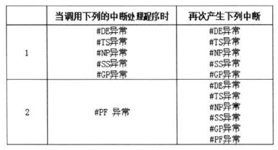
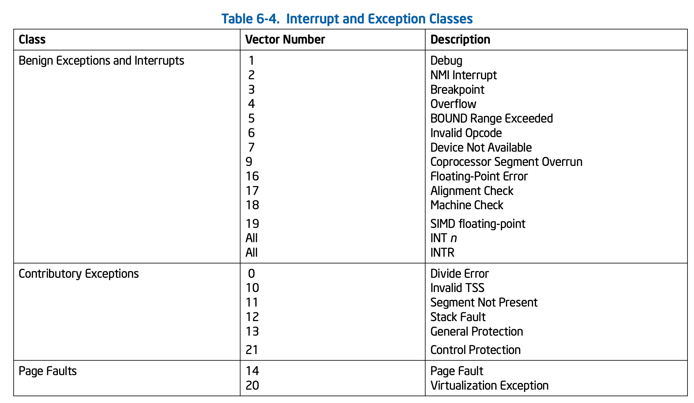
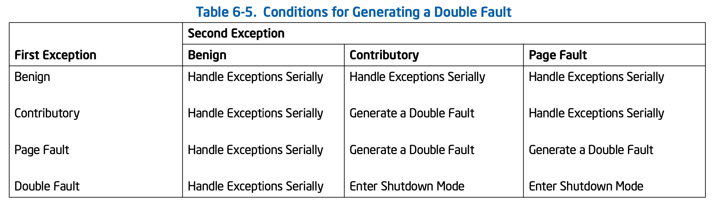

<!-- @import "[TOC]" {cmd="toc" depthFrom=1 depthTo=6 orderedList=false} -->

<!-- code_chunk_output -->

- [1. 异常的类型](#1-异常的类型)
- [2. Fault 类型的异常: 回到异常指令](#2-fault-类型的异常-回到异常指令)
- [3. Trap 类型的异常: 跳过异常指令](#3-trap-类型的异常-跳过异常指令)
- [4. Abort 类型的异常: shutdown 或 reset](#4-abort-类型的异常-shutdown-或-reset)
  - [4.1. #DF(Double Fault)异常](#41-dfdouble-fault异常)

<!-- /code_chunk_output -->

# 1. 异常的类型

当异常发生, 处理器将**进入异常处理程序**, 执行完毕后处理器**将回到被中断的代码流程里继续执行**. 而回到代码的**哪个位置执行**, 以及**哪些异常的产生处理器是不能恢复的**, 这些都**决定于异常的类型**.

在**x86/x64 体系中**, 有**三类异常**, 如下.

1) **Fault 类型**

2) **Trap 类型**

3) **Abort 类型**

# 2. Fault 类型的异常: 回到异常指令

当产生 fault 类型的异常时, 处理器允许(且必须)进入异常处理程序对这个错误进行修正后重新**回到产生异常的指令继续执行**.

因此, fault 类型的异常将:

1) 处理器保存**产生异常的指令执行之前的状态**, 包括: SS, ESP, EFLAGS, CS, 以及 EIP 值(当权限级别不变时为 EFLAGS, CS 及 EIP), 这个**EIP**(**返回地址**)是指向**产生异常的指令**.

2) 处理器将回到产生异常的指令继续执行

典型地像`#GP`和`#PF`异常是属于**fault 类型**. OS 的`#GP`处理程序里必须对这个错误进行改正, 以便处理器回到产生异常的指令继续执行, 否则只会继续引发异常.

对于**Fault 类型**的一些异常, 典型地, **OS**的处理是**强行终止进程的运行**或者说**杀死产生 Fault 类异常的进程**, 以这种方式来跳出异常处理！(从逻辑上来说是忽略异常)

# 3. Trap 类型的异常: 跳过异常指令

当产生**trap 类型的异常**时, 处理器允许**忽略异常继续往下执行**. 在**异常处理程序**里不必修正错误, 回到发生异常指令的下一条指令继续执行. 因此, trap 类型的异常将:

1) 处理器保存执行完产生异常指令后的状态, **返回地址**将**指向下一条指令**

2) 处理器将回到**发生异常指令**的**下一条指令**继续执行

注: 这里的返回地址是需要 trap 类型处理程序将 EIP 置为下一条指令地址??

事实上, 属于 trap 类型的**异常很少(！！！**), 如下:

1) `#BP`(Breakpoint)异常

2) `#OF`(Overflow)异常

3) **属于 trap 类型**的`#DB`(Debug)异常: 在\#**DB 异常中**有**部分是 Trap 类型**, 有部分是**Fault 类型**, 详情见**13 章内容**.

trap 类型的异常并不影响到后续的指令流的执行. 因此, trap 类型的异常错误并不重要, 甚至不能说是错误.

Intel 特别提出了一个事例: 如果一个 trap 类型的异常发生在**jmp 指令后**, 那么处理器从异常处理程序返回后, 将来到**jmp 指令的目标地址**去执行, 而**不是 jmp 指令的下一条指令(！！！**).

# 4. Abort 类型的异常: shutdown 或 reset

当 abort 类型的异常产生时, 意味着处理器遇到一个**非常严重的错误**.

abort 类型的异常将使处理器**无法回到正常的指令流**里继续执行.

有**两类异常**属于**Abort 类型**

1) `#DF`(Double Fault)异常

2) `#MC`(Machine Check)异常

当 abort 异常发生, 在**异常处理程序**中唯一能做的: **如果可以**就**报告当前处理器状态**, 然后对机器进行**shutdown**或**reset 之类的处理**

注: 在异常处理程序中进行

## 4.1. #DF(Double Fault)异常

当一个**fault 类型的异常**发生, 处理器**正在调用这个异常的处理程序**, 可是并**没有成功进入这个异常的处理程序执行**. 在这个**调用过程中**, **处理器**又检测到**另一个 fault 异常(！！！**)的产生. 于是**处理器无法继续执行这个双重的 fault 异常(！！！**), 从而**产生另一个异常\#DF(Double Fault**)

并不是每个异常都可以产生`#DF`异常, 以下是产生\#DF 异常的条件.



第 1 类里将**不包括\#PF(Page Fault)异常**. 也就是说, 当引发\#GP 异常, 处理器准备执行\#GP 处理程序时, 又发生了\#PF 异常, 这个\#PF 异常将得到正确处理, 不会引发\#DF 异常.





比如, 触发了一个 contributory 异常, 处理器开始检查 IDT limit, 发现 gate 描述符超过了 limit 值, 本来应该产生`#GP`异常. 而因为在这个 contributory 流程中, 而`#GP`异常也是 contributory 类型的, 所以导致`#DF`(Double fault)异常的发生, 最后结果是机器遭到 RESET.

>对于\#DF 异常. 第一次的异常处理程序并没有执行, 第二次的异常处理程序并没有执行. 最后处理器会进入到\#DF 处理程序里执行.

实际上, 很容易产生一个\#DF 异常, 测试的代码只有一条指令

```x86asm
; ex16-1\protected.asm
; 设置 #DF 处理程序
    mov esi, DF_HANDLER_VECTOR
    mov edi, df_handler
    call set_interrupt_handler

    mov eax, [0x410000]     ; 产生 #PF 异常