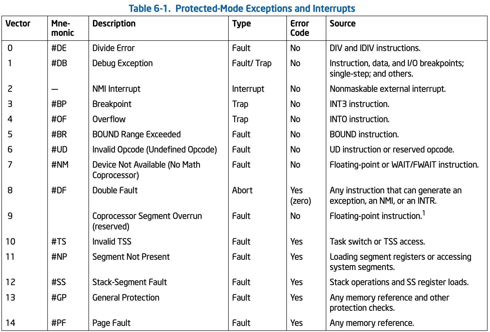
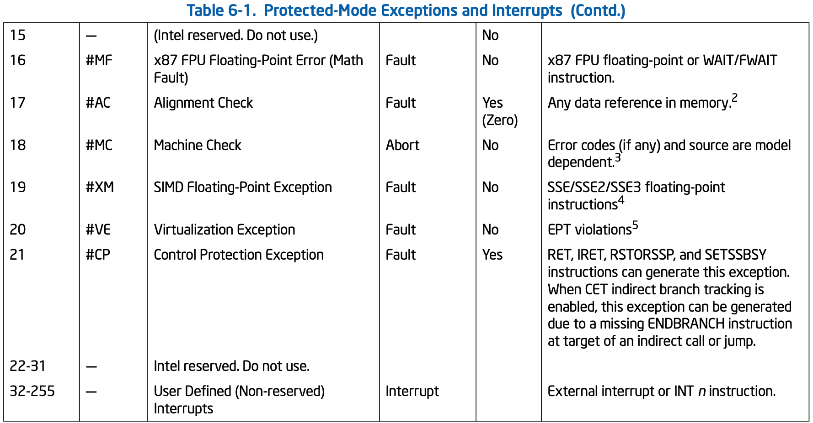

中断 vector 是**一个字节宽**, 意味着可以有**256 个中断 vector**, 从 0 到 255 号, 如下.

由 0 到 31 号的中断 vector 是 Intel 为中断/异常预定义使用或保留的. 从 32 到 255 的 vector 可以开放给用户为自己的中断服务例程定义使用.

用户不应使用 0 到 31 号作为自己的中断服务例程的 vector, 在 local APIC LVT 寄存器的 vector 若使用从 0 到 15 作为 vector, 将是非法的. local APIC 将作为错误记录下来.