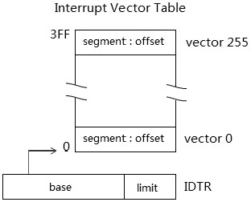

实模式下, 中断调用使用 IVT(中断向量表), 区别于保护模式的 IDT(Interrupt Descriptor Table).



在 IVT 里, 每一个 entry 都是 far pointer 形式 (16:16)​, 直接提供目标中断服务例程的 segment 和 offset 值 (低 16 位为 offset, 高 16 位为 segment)​. 典型地, IDTR.base 为 0, 因此 IVT 定位在地址 0 的位置上, 占据了 0～3FFH 共 1K 的区域. 这个 IDTR.base 是可以修改的, 使用 LIDT 指令进行重新定位.

# IVT 表的重定位

像 DOS 这类实模式操作系统使用初始化的 IDTR 值, 它的 base 为 0,limit 为 FFFFh.

```assembly
sidt [old_IVT]                        ; 保存原来的 IVT pointer
mov cx,[old_IVT]
mov [new_IVT],cx                    ; 读取原 IVT 的 limit 值
mov dword [new_IVT+2],0x1000     ; 新的 IVT 地址
mov si,[old_IVT+2]
mov di,[new_IVT+2]
rep movsb                          ; 复制原 IVT entry 到新的 IVT 上
lidt [new_IVT]                        ; IVT 的重定位
```

上面这段代码演示了在实模式下将 IVT 从 0 重新定位在 0x1000 位置上. 由于原 IVT 的内容已经被复制到新的 IVT 中, 因此新的 IVT 能被正确地使用.