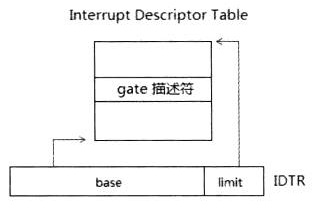

<!-- @import "[TOC]" {cmd="toc" depthFrom=1 depthTo=6 orderedList=false} -->

<!-- code_chunk_output -->

- [IDT base](#idt-base)
- [IDT limit](#idt-limit)

<!-- /code_chunk_output -->

**保护模式(包括 long mode**)下, 对中断/异常处理程序的调用通过 IDT(中断描述符表)进行, IDTR 寄存器的 base 提供 IDTR 的线性地址.

与 IVT 很大区别, IVT 表项直接提供目标代码的 far pointer, IDT 表项则是 gate 描述符, 再根据 gate 描述符得到目标代码入口点.

当执行**中断指令 int 0x40**时:

- 在**legacy 保护模式**下, IDT 中每个 entry 是**8 字节宽的 gate 描述符**, 从 IDTR.base + 0x40\*8 处读取 gate 描述符
- 在**IA\-32e(long mode)模式**下, IDT 中每个 entry 是**16 字节宽的 gate 描述符**. 从 IDTR.base + 0x40 \* 16 处读取 gate 描述符

# IDT base

IDT 可定位在 32 位线性地址空间中任何位置, IA\-32e 模式下(long mode)可定位在 64 位线性地址空间中任何位置.

**IA\-32e 模式**下, 这个 base 必须是**canonical 地址形式**, 因此实际上**64 位**的线性地址**只使用低 48 位**, **高 16 位为符号扩展**.

# IDT limit

这个 limit 值与其他的段 limit 有相同特性. 当**需要 IDT 内刚好只能容纳 32 个 gate 描述符**时, 也就是支持 0 \~ 31 号的 vector(共 32 个):

- **legacy 保护模式**下, limit 可设为**limit = 32 X 8 -1**
- **IA\-32e 模式**下, limit 可设为**limit = 32 X 16 -1**

> 为什么需要减1?

以保护模式下的 vector 0 为例, 这个 vector 有效的偏移是 0～7 (8 个字节), 实际上由于偏移是 0 开始到 N-1 为止的范围内, 有效的数量是 N (如: 4K 的范围是从 0 到 1023). 因此, 减 1 是任何段 limit 值最低的需求.

然而, limit = 32 * 8 – 1 是最为正确的 limit 设置值, 这个值刚好满足 legacy 保护模式下的 IDT 设置, 当超过这个值时, 意味着可以容纳超过 32 个 gate 描述符.

关于表 limit, 另请参考 10.5.2 节的相关描述.