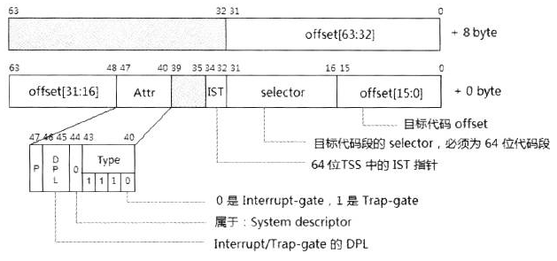

<!-- @import "[TOC]" {cmd="toc" depthFrom=1 depthTo=6 orderedList=false} -->

<!-- code_chunk_output -->

- [1. 概述](#1-概述)
- [2. legacy 保护模式下的 Interrupt-gate 与 Trap-gate 描述符](#2-legacy-保护模式下的-interrupt-gate-与-trap-gate-描述符)
- [3. IA-32e 模式下的 Interrupt-gate 和 Trap-gate 描述符](#3-ia-32e-模式下的-interrupt-gate-和-trap-gate-描述符)
- [4. Task-gate 描述符](#4-task-gate-描述符)

<!-- /code_chunk_output -->

# 1. 概述

在**legacy 保护模式下**, **IDT**可存放下面的 Gate Descriptor.

1) `Interrupt-gate descriptor`(**中断门描述符**)

2) `Trap-gate descriptor`(**陷阱门描述符**)

3) `Task-gate descriptor`(**任务门描述符**)

在**IA\-32e 模式(long mode**)下**不存在** `Task-gate descriptor`, 因此只存放:

1) `Interrupt-gate descriptor`(**中断门描述符**)

2) `Trap-gate descriptor`(**陷阱门描述符**)

* **legacy 保护模式**下, **每个 gate 描述符**是**8 字节宽**;

* **IA\-32e 模式**下, 每个**gate 描述符**被扩展到**16 字节宽**.

通过**中断门进入中断服务程序**时 cpu 会**自动将中断关闭**, 也就是将**cpu 中 eflags 寄存器中 IF 标志复位**, 防止嵌套中断的发生, 返回后恢复; 而通过**陷阱门进入服务程序**时则维持**IF 标志不变**.  这是**中断门与陷阱门的唯一区别(！！！**)

# 2. legacy 保护模式下的 Interrupt-gate 与 Trap-gate 描述符

**Interrupt-gate**和**Trap\-gate 描述符**的格式是安全一样的, 所**不同的是描述符类型**.

在描述符的 Type 域中:

1) 1110B 为 32 位的 Interrupt\-gate 描述符

2) 1111B 为 32 位的 Trap\-gate 描述符

更详细见 10.5.4.4 节内容

# 3. IA-32e 模式下的 Interrupt-gate 和 Trap-gate 描述符

在 IA\-32e 模式下(包括 64 位和 compatibility 模式), Interrupt\-gate 与 trap\-gate 描述符的结构如下

除了被扩展为**16 字节**外, 在**IA\-32e 模式**(包括 compatibility 模式)下的**Interrupt\-gate**和**Trap\-gate 描述符**增加了一个**3 位宽的 IST(Interrupt Stack Table)指针域**, 用来提供**额外的 Stack pointer**.

更详细见 10.5.4.4 节内容

# 4. Task-gate 描述符

Task\-gate 用来找到目标 TSS 描述符的位置, 再通过 TSS 描述符来定位 TSS 块, 使用 TSS 块里的数据进行任务切换

Task\-gate 描述符仅用于 legacy 模式, 更详细见 10.5.4.4 节内容