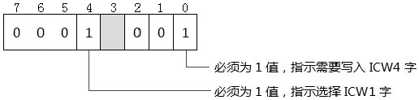
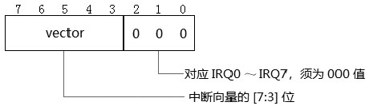
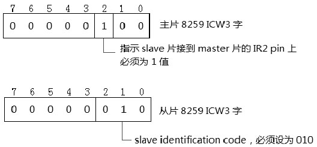
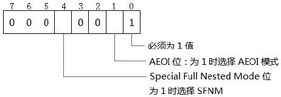
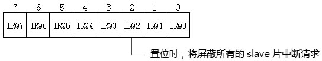
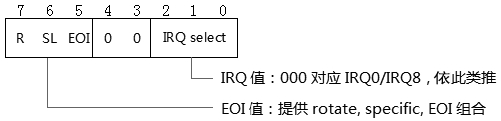
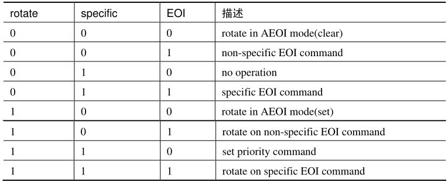
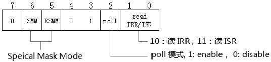
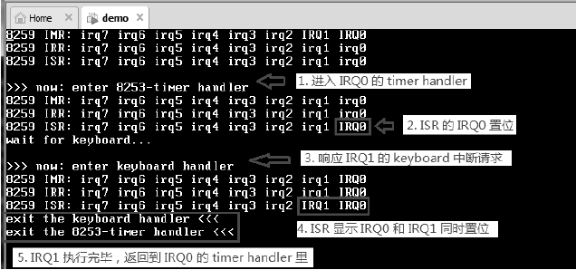
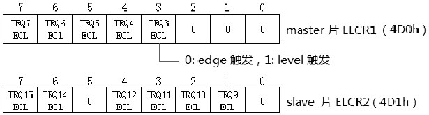

<!-- @import "[TOC]" {cmd="toc" depthFrom=1 depthTo=6 orderedList=false} -->

<!-- code_chunk_output -->

- [1. 8259 寄存器 I/O 地址](#1-8259-寄存器-io-地址)
- [2. 8259 初始化](#2-8259-初始化)
  - [2.1. ICW1 字](#21-icw1-字)
  - [2.2. 设置 Interrupt vector(写入 ICW2 字)](#22-设置-interrupt-vector写入-icw2-字)
  - [2.3. ICW3 字](#23-icw3-字)
    - [2.3.1. slave identification code](#231-slave-identification-code)
  - [2.4. ICW4 字](#24-icw4-字)
    - [2.4.1. AEOI(Automatic End Of Interrupt)模式](#241-aeoiautomatic-end-of-interrupt模式)
    - [2.4.2. 普通的 Full Nested Mode](#242-普通的-full-nested-mode)
    - [2.4.3. Special Full Nested Mode](#243-special-full-nested-mode)
- [3. 8259 的操作字](#3-8259-的操作字)
  - [3.1. 中断屏蔽(写入 OCW1 字)](#31-中断屏蔽写入-ocw1-字)
  - [3.2. EOI 命令(写入 OCW2 字)](#32-eoi-命令写入-ocw2-字)
    - [3.2.1. 提供 Specific 值](#321-提供-specific-值)
    - [3.2.2. 普通的 EOI 命令](#322-普通的-eoi-命令)
    - [3.2.3. 普通的 automatic rotate 模式](#323-普通的-automatic-rotate-模式)
    - [3.2.4. 特定的 automatic rotate 模式](#324-特定的-automatic-rotate-模式)
  - [3.3. OCW3 字](#33-ocw3-字)
    - [3.3.1. 普通 Mask Mode](#331-普通-mask-mode)
    - [3.3.2. Special Mask Mode](#332-special-mask-mode)
- [4. 设置 edge 和 level 触发模式](#4-设置-edge-和-level-触发模式)
  - [4.1. ELCR 寄存器](#41-elcr-寄存器)

<!-- /code_chunk_output -->

我们可以在 Intel 提供的 chipset datasheet 文档里找到关于 8259 中断控制器上编程的详细说明. 在笔者所了解的知识中, 不同的 chipset (芯片组) 中关于 PCI-to-ISA bridge 的 LPC 控制器功能大致上是一样的.

# 1. 8259 寄存器 I/O 地址

8259 中断控制器的寄存器实行 I/O 地址映射方式, 使用 IN 和 OUT 指令来访问 8259 中断控制器寄存器.

1) 端口 20h: 属于 master 8259 的 ICW1,OCW2 及 OCW3 寄存器.

2) 端口 21h: 属于 master 8259 的 ICW2 到 ICW4 寄存器, 以及 OCW1 寄存器.

3) 端口 A0h: 属于 slave 8259 的 ICW1,OCW2 及 OCW3 寄存器.

4) 端口 A1h: 属于 slave 8259 的 ICW2 到 ICW4 寄存器, 以及 OCW1 寄存器.

多个寄存器共用一个端口, 由写入的值来选择使用哪个寄存器.

# 2. 8259 初始化

在使用 8259 控制器前应分别对 master 和 slave 片进行初始化设置, 每个 8259 初始化设置流程是依次写入 4 个 ICW (Initialization Command Word, 初始化命令字): 从 ICW1 到 ICW4.

## 2.1. ICW1 字

master 片的 ICW1 寄存器在端口 20h,slave 片的 ICW1 寄存器在端口 A0h, 它们的格式是一样的.



ICW1 字所有位都需写入固定的值.

① bit 0(ICW4 write required)​: 这个位指示在后续的初始化字中需要写入 ICW4 字, 这个位必须写入 1.

② bit 1(single or cascade)​: 必须为 0 值, 指示使用两片 8259 的串联模式.

③ bit 2: 忽略, 必须为 0 值.

④ bit 3(edge/level select)​: 这个位设置 8259 的触发模式, 现已忽略, 必须为 0 值. 这个功能已经被 ELCR(edge/level triggered control register)所代替.

⑤ bit 4(ICW/OCW select)​: 这个位指示写入的是 ICW 还是 OCW, 对于 ICW1 来说, 必须写入 1 值.

⑥ bit 5～bit 7: 必须写入 000 值.

因此, 实际上 ICW1 字是固定的 00010001B 值(11h)​.

## 2.2. 设置 Interrupt vector(写入 ICW2 字)

8259 的 ICW2 寄存器用来设置主 / 从片的 interrupt vector, 它的结构如下.



ICW2 字的低 3 位 [2:0] 设置是 IRQ0 到 IRQ7 的值, ICW2[7:3]用来设置 Interrupt vector 值, 典型地:

① 对于 master 片来说, ICW2 字的值是 08h, 也就是 IRQ0 的中断向量是 08h,IRQ1 为 09h, 依此类推, IRQ7 为 0Fh.

② 对于 slave 片来说, ICW2 字的值是 70h, 也就是 IRQ9 的中断向量是 70h,IRQ10 为 71h, 依此类推, IRQ15 为 77h.

然而, 08h～0Fh 号中断向量属于 x86 体系预定义的 vector 号, 08h 是 #DF 异常使用的 vector 号. 显然在保护模式下不能使用 08h～0Fh 作为 IRQ0～IRQ7 的中断向量. 我们至少需要对主片的 ICW2 设置为其他的值.

## 2.3. ICW3 字

主片的 ICW3 字和从片的 ICW3 字的格式和意义是不同的.



主片和从片的 ICW3 字的值都是固定的.

① 主片 ICW3 字为 04h 值: bit 2 值须为 1, 指示 slave 片接到 master 片的 IR2 口上(或说 IRQ2)​. 其他位必须为 0 值.

② 从片 ICW3 字为 02h 值: ICW3[2:0]设置 slave 片的 slave identification code(从片标识码)​, 这个必须为 02h.​[7:3]域必须为 0 值.

### 2.3.1. slave identification code

在前面的 17.1.5 节所描述的中断响应过程里, 在接到第 1 个 INTA# 脉冲, slave 片有更高优先级的中断请求时, master 片会发送一个 slave identification code 给 slave 片, slave 片会使用它的 ICW3[2:0]域里的值, 和 master 片发送的 slave identification code 进行比较, 当相等时, slave 片必须回复一个 interrupt vector 给处理器, 处理器会使用这个 vector 调用相应的中断服务例程.

slave 片的 ICW3[2:0]定义的值必须为 02h, 因此我们可以判断, master 片广播的 slave 片标识码应该为 02h 值.

## 2.4. ICW4 字



ICW4 字除了 bit 1 和 bit 4 位外, 其余位都须是固定值.

① bit 0: 须为 1 值, 指示是基于 Intel 的体系.

② bit 1(AEOI 位)​: 当为 1 时选择 AEOI(Automatic End Of Interrupt)模式. 仅使用在 master 片上, 不能使用在 slave 片.

③ bit 2(master/slave in buffer mode)​: 必须为 0.

④ bit 3(buffer mode)​: 必须为 0, 使用 non-buffer 模式.

⑤ bit 4(SFNM 位)​: 当为 1 时使用 Special Full Nested Mode, 为 0 时使用普通的 Full Nested Mode.SFNM 模式使用在 master 片上.

⑥ ICW4[7:5]​: 必须为 000 值.

### 2.4.1. AEOI(Automatic End Of Interrupt)模式

在 AEOI 模式里, 在第 2 个 INTA# 脉冲时, 8259 自动发送一个 non-specific EOI 命令给 master 片, 因此 AEOI 模式使用在多个 8259 串联的 master 片上.

### 2.4.2. 普通的 Full Nested Mode

这个模式下, 中断请求的优先级次序是从 IRQ0 到 IRQ7(中断请求的优先级可以通过 OCW2 字改变)​,IRQ0 最高, IRQ7 最低.

当处理器响应执行中断, 8259 的 ISR 相应的位置位, 指示中断服务例程正在执行. 这个 ISR 的相应位直到下面情形被清位.

① AEOI 模式下: 在第 2 个 INTA# 脉冲时, 8259 自动清位.

② non-AEOI 模式下: 在中断服务例程返回前, 发送 EOI 命令给 8259 进行清位.

当 ISR 的某位置位时, 所有优先级相同及优先级较低的中断请求都会被抑制, 优先级更高的中断请求得到响应.

特别是, 当 slave 片的中断请求得到响应正在执行. 由于 slave 片连接到 master 片的 IR2 pin 上, 那么对应的 master 片 ISR 寄存器 bit 2 置位 (指示 slave 片的中断请求正在服务中)​, 这个时候所有 slave 片的后续中断请求(在 slave 片中有优先级更高的) 将被抑制.

### 2.4.3. Special Full Nested Mode

然而, 在 master 片设置为 Special Full Nested Mode 的情况下, 在 ISR 的 bit 2 置位时, master 片并不会锁定 IRQ2 中 slave 片其他的中断请求. 这时候, 当 slave 中还有更高优先级的中断请求发生, slave 中更高优先级的中断请求将会得到响应执行.

那么在这种情况下, 在 slave 片的中断服务例程里必须检查 slave 片的 ISR, 判断是否有多个中断服务例程在执行(高优先级服务例程中断低优先级服务例程的情况)​. 当中断服务例程通过读取 ISR 的位检查到只有一个服务例程在执行, 中断服务例程必须发送 EOI 命令给 slave 片, 然后也需要发送 EOI 命令给 master 片(通知 master 片 IRQ2 已经没有中断服务例程执行)​,master 片进行 ISR 的 bit 2 清位.

下面是典型的 master 和 slave 片 8259 初始化代码.

代码清单 17-1(lib\pic8259A.asm)​:

```asm
;----------------------------
; 初始化 8259A
;----------------------------
init_8259A:
;;; 初始化 master 8259A 芯片
; ①  先写 ICW1
      mov al,0x11                                ; ICW=1,ICW4-write required
      out MASTER_ICW1_PORT,al
      jmp m1
m1:
      nop
; ② 接着写 ICW2
      mov al,0x20                                 ; interrupt vector=0x20
      out MASTER_ICW2_PORT,al
      jmp m2
m2:
      nop
; ③ 接着写 ICW3
      mov al,0x04                                 ; bit2 must be 1
      out MASTER_ICW3_PORT,al
      jmp m3
m3:
      nop
; ④ 接着写 ICW4
      mov al,0x01                                 ; for Intel Architecture
      out MASTER_ICW4_PORT,al
      jmp slave
slave:
      nop
;; 初始化 slave 8259A 芯片
; ①  先写 ICW1
      mov al,0x11                                 ; ICW=1,ICW4-write required
      out SLAVE_ICW1_PORT,al
      jmp s1
s1:
      nop
; ② 接着写 ICW2
      mov al,0x28                                 ; interrupt vector=0x28
      out SLAVE_ICW2_PORT,al
      jmp s2
s2:
      nop
; ③ 接着写 ICW3
      mov al,0x02                                 ; bit2 must be 1
      out SLAVE_ICW3_PORT,al
      jmp s3
s3:
      nop
; ④ 接着写 ICW4
      mov al,0x01                                ; for Intel Architecture
      out SLAVE_ICW4_PORT,al
      ret
```

这个代码分别对 master 片和 slave 片依次写入 ICW1 到 ICW4 字.

# 3. 8259 的操作字

在 8259 中定义了三个 OCW(operational control word, 操作控制字)​, 用来操作 8259 的运行.

## 3.1. 中断屏蔽(写入 OCW1 字)

OCW1 寄存器的每一位对应一条 IRQ 线, 置位将屏蔽 IRQ 的中断请求.



特别是, 当 OCW1 寄存器 bit 2 置位时将屏蔽所 slave 片中的所有中断请求.

## 3.2. EOI 命令(写入 OCW2 字)

在 OCW2 寄存器里可以设置中断优先级, 以及给 8259 发送 EOI 命令.



OCW2 字分为三部分:

① OCW2[2:0]​: 设置一个 IRQ 值, 0～7 对应于主 / 从片的 IRQ0/IRQ8 到 IRQ7/IRQ15.

② OCW2[4:3]​: 对于 OCW2 字必须为 00 值, 指示选择 OCW2 字.

③ OCW2[7:5]​: 提供一个 Rotate,Specific, 以及 EOI 的组合值, 如下表所示.



### 3.2.1. 提供 Specific 值

如上表所示, 当 bit 6 置位时提供一个 specific IRQ 值, 这个值从 OCW2 字的 [2:0] 而来.

### 3.2.2. 普通的 EOI 命令

当 OCW2[7:5]域为 001 值 (non-specific EOI command) 时, 将发送一个普通的 EOI 命令.

### 3.2.3. 普通的 automatic rotate 模式

OCW2 字的 R=1 时使用 automatic rorate 模式, 例如: 当 R=1,SL=0,EOI=1 时, 发送一个 rorate on non-specific EOI(自动循环的普通 EOI)命令, 这个命令使用在数个优先级相同的设备上.

8259 使用一个 8 位的循环队列形式, 当一个中断服务例程完毕后 (发送这个 EOI 命令) 这个设备的优先级自动排在队列的后面(也就是降为最低优先级别)​.

### 3.2.4. 特定的 automatic rotate 模式

R=1,SL=1 时, 使用一个特定的 automatic rotate 模式, 例如: 当 R=1,SL=1,EOI=1 时, 发送一个 rorate on specific EOI(自动循环的指定 EOI)命令.

OCW2[2:0]域需提供一个 IRQ 值, 这个 IRQ 对应的设备将自动降到最低优先级别. 例如: 假设 IRQ5 设为最低优先级, 那么发送一个值为 E5h(R=SL=EOI=1,IRQ=5)的 OCW2 字给 8259,IRQ6 将变成最高优先级.

## 3.3. OCW3 字

OCW3 字的用途是多样的.



对于 OCW3 字来说,​[4:3]必须为 01 值, 指示选择 OCW3 字,​[1:0]指示读 IRR 或 ISR.

① 10B: 读 IRR.

② 11B: 读 ISR.

③ 00B 或 01B: 无操作.

bit 2 置位时, 使用 poll 模式, 下一个对 8259 的读操作被作为中断响应周期. bit 5 是 SMM enable 位, 为 1 时允许设置 SMM 位(bit 6)​.bit 5 为 0 时, bit 6 被忽略.

### 3.3.1. 普通 Mask Mode

在一般情况下, IRQ 的中断请求得到响应执行, ISR 相应位置位, 在中断服务例程发起 EOI 命令前, ISR 的位不会清位, 8259 会抑制优先级低的 IRQ.

例如: 当 IRQ0 的 timer 中断服务例程在执行, ISR 的 bit 0 置位, 在 timer handler 内 IRQ1～IRQ7 的中断请求被抑制, 直到 timer handler 发送 EOI 命令退出.

### 3.3.2. Special Mask Mode

然而, 在中断服务例程里可以使用 OCW3 字来设置 SMM(special mask mode)​, 当发送一个 OCW3 字命令使用 ESMM=1,SMM=1 时, 则使用 special mask mode.

special mask mode 允许在中断服务例程里动态依据 IMR 及 IRR 来响应中断请求, 而不需要理会 ISR.

回到上面的例子, 在 IRQ0 的 timer handler 里, 发送 OCW3 命令并使用 SMM, 那么 8259 动态根据 IRR 和 IMR 的情况来响应中断请求. 在这种情况下, 即使优先级别低的 IRQ1 也会得到响应并执行.

> 实验 17-2: 测试 special mask mode

下面是一个例子, 用来测试 special mask mode, 运行结果如下.



留意在运行截图上标注的 5 个地方.

① IRQ0 的 timer 中断请求得到响应, 进入 timer handler 执行.

② 在 timer handler 内部打印 IMR,IRR 和 ISR 的信息, ISR 的 bit 0 置位, 指示 timer handler 正在执行.

③ 值得注意的是, 在 timer handler 内部, 响应了 IRQ1 的 keyboard 中断请求, 进入 keyboard handler 执行. 此时 timer handler 还没有完成.

④ 在 keyboard handler 内部的 ISR 显示, IRQ0 和 IRQ1 同时置位, 上一个 timer handler 的执行还没退出.

⑤ 最后 keyboard handler 退出, 返回到上一个 timer handler 中, timer handler 也得到退出. 下面是实验中 timer handler 的代码.

下面是实验中 timer handler 的代码.

代码清单 17-2(common\handler32.asm)​:

```asm
;-------------------------------
; system timer handler
;-------------------------------
timer_handler:
      jmp do_timer_handler
t_msg                 db 10,'>>> now:enter 8253-timer handler',10,0
t_msg1                db 'exit the 8253-timer handler <<<',10,0
t_msg2                db 'wait for keyboard...',10,0
spin_lock             dd 0
keyboard_done        dd 0
do_timer_handler:
      mov esi,t_msg
      call puts
      call dump_8259_imr              ; 打印 IMR,IRR,ISR
      call dump_8259_irr
      call dump_8259_isr
; 使用一个 spin lock 结构
test_lock:
      bt DWORD [spin_lock],0                        ; 测试锁
      jnc get_lock
      pause
      jmp test_lock
get_lock:
      lock bts DWORD [spin_lock],0
      jc test_lock
; 发送 special mask mode 命令
      call send_smm_command       ; 发送 OCW3 字, 使用 spceial mask mode
      call enable_keyboard        ; 打开 keyboard
      call disable_timer                              ; 关闭 timer
      sti              ; 打开中断
      mov esi,t_msg2
      call puts
wait_for_keyboard:
      mov ecx,0xffff
delay:
      nop
      loop delay          ; 等待 keyboard 响应
      bt DWORD [keyboard_done],0
      jnc wait_for_keyboard
      btr DWORD [spin_lock],0                      ; 释放锁
      mov esi,t_msg1
      call puts
      call write_master_EOI
      call disable_timer
      iret
```

可以把 timer handler 想象成多线程环境中的主线程, 这里使用 spin lock(自旋锁)结构来执行关键代码(其实没必要使用 spin lock, 这里只是作为一个演示而已)​.

代码通过 send_smm_command(​)函数来发送一个 OCW3 的使用 SMM 的命令, 这个函数实现在 lib\pic8259A.asm 文件里, 只是简单地写入 OCW3 字.

代码清单 17-3(lib\pic8259A.asm)​:

```asm
;------------------------------
; send_smm_command
;------------------------------
send_smm_command:
      mov al,01101000B                        ; SMM=ESMM=1,OCW3 select
      out MASTER_OCW3_PORT,al
      ret
```

在写完 OCW3 字后, 通过清 IMR 的 bit 1 来开启 IRQ1 的中断请求, 并且关闭 IRQ0 的中断请求, 否则 IRQ0 将会抢在 IRQ1 前面.

最后, 在 timer handler 内等待 keyboard handler 执行完毕.

这个实验代码的关键是, 在 timer handler 内写入使用 special mask mode 的 OCW3 命令字, 从而可以在 IRQ0 的中断服务例程里响应 IRQ1 的中断请求, 使用普通的 mask 模式是不能做到的. 注意运行结果中在 keyboard handler 里 ISR 的 IRQ0 和 IRQ1 位都被置位.

# 4. 设置 edge 和 level 触发模式

在 8259 里, 可以设置 IRQ 的 trigger mode(触发模式)​, 在现在的 8259 里这个机制已经被增强.

## 4.1. ELCR 寄存器

在 ISA bus 时代的 ICW1 字里的 edge/level 选择位已经被两个专门的 ELCR(edge/level triggered control register)代替(ELCR1 和 ELCR2)​.



ELCR1 的 I/O 端口是 4D0h,ELCR2 的 I/O 端口是 4D1h, 每一位对应一个 IRQ 设置, 为 0 时属于 edge 触发模式, 为 1 时属于 level 触发模式.

然而, 主片的 IRQ0,IRQ1,IRQ2 必须为 0 值, 也就是必须为 edge 触发模式; 从片的 IRQ8 和 IRQ13 必须为 0 值, 也就是必须为 edge 触发模式.

因此, timer,RTC,keyboard 中断请求都必须以 edge 形式触发.

