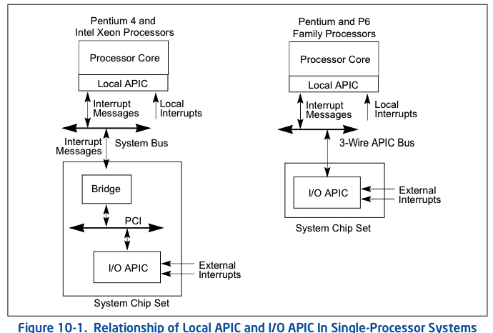
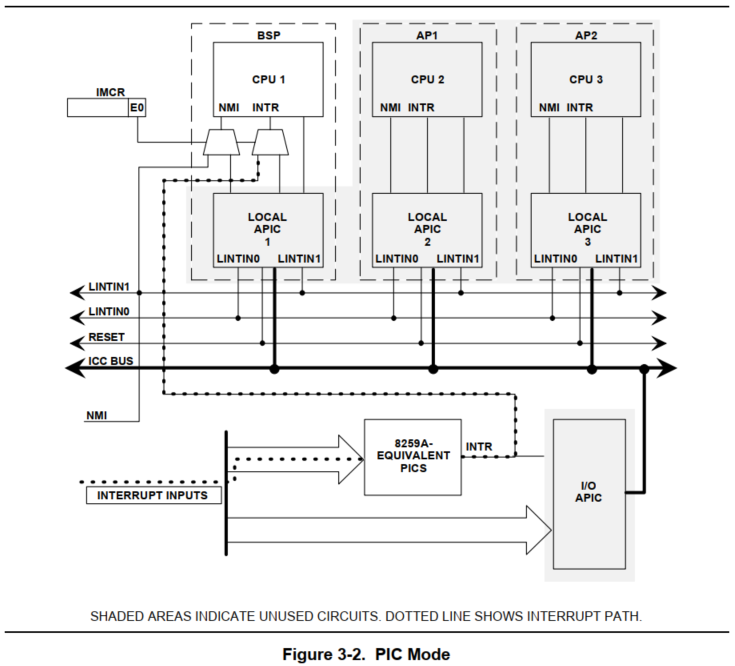
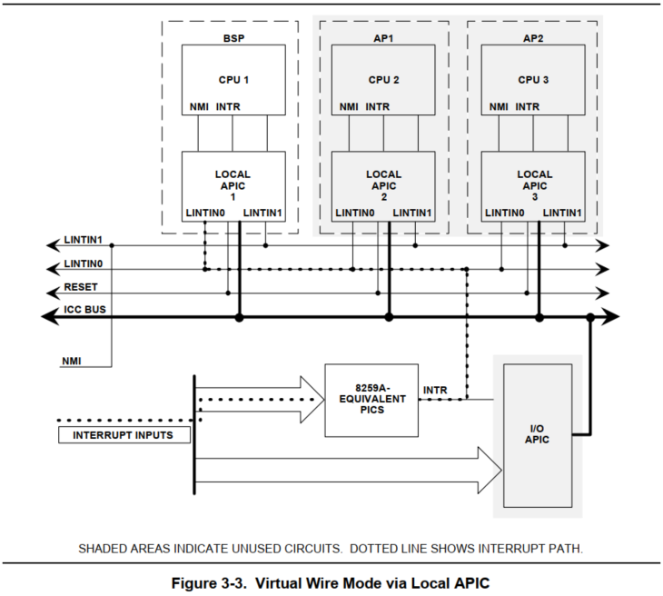
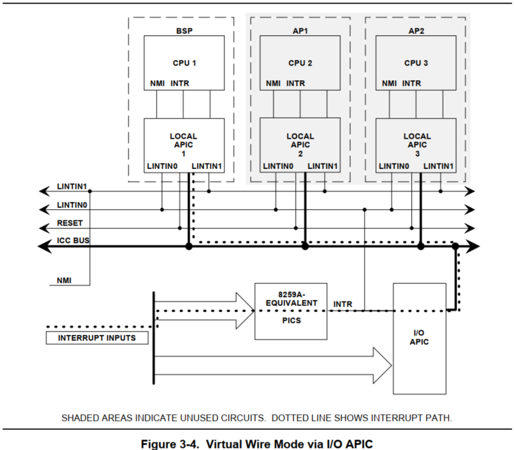
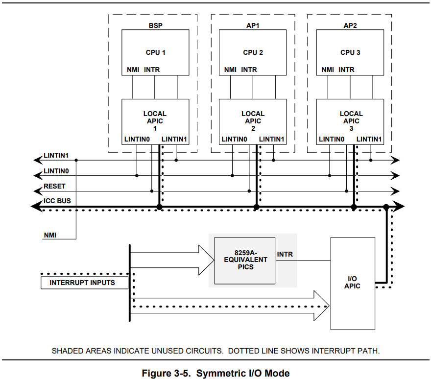

<!-- @import "[TOC]" {cmd="toc" depthFrom=1 depthTo=6 orderedList=false} -->

<!-- code_chunk_output -->

- [1. local 和 I/O APIC 概述](#1-local-和-io-apic-概述)
  - [1.1. Local APIC](#11-local-apic)
  - [1.2. I/O APIC](#12-io-apic)
- [2. 中断模式](#2-中断模式)
  - [2.1. 传统 PIC 模式](#21-传统-pic-模式)
  - [2.2. 虚拟线模式](#22-虚拟线模式)
  - [2.3. 对称 I/O 模式](#23-对称-io-模式)
- [3. 中断源](#3-中断源)
  - [3.1. 本地中断源 (LVT)](#31-本地中断源-lvt)
    - [3.1.1. LINT0/LINT1](#311-lint0lint1)
    - [3.1.2. CMCI 中断](#312-cmci-中断)
    - [3.1.3. APIC timer 中断](#313-apic-timer-中断)
    - [3.1.4. Thermal sensor 中断](#314-thermal-sensor-中断)
    - [3.1.5. Performance monitoring counter 中断](#315-performance-monitoring-counter-中断)
    - [3.1.6. ERROR 内部错误产生中断](#316-error-内部错误产生中断)
  - [3.2. I/O APIC](#32-io-apic)
  - [3.3. IPI](#33-ipi)
- [4. APIC 体系的版本](#4-apic-体系的版本)
  - [4.1. APIC 与 xAPIC](#41-apic-与-xapic)
  - [4.2. x2APIC](#42-x2apic)
- [5. 系统总线 VS. APIC 总线](#5-系统总线-vs-apic-总线)

<!-- /code_chunk_output -->

# 1. local 和 I/O APIC 概述

每个 local APIC 由一组 APIC 寄存器和相关的硬件组成, 这些硬件控制中断到处理器核心的传递和 IPI 消息的生成. APIC 寄存器是内存映射和可以读和写使用 MOV 指令.

**引入 APIC 机制**是为了**适应 multiple processor(MP, 多处理器**)环境.

**整个 APIC 体系**可以分为两大部分: **Local APIC** 和 **I/O APIC**

- **Local APIC 是整个 APIC 体系的核心**, 它在**处理器的内部**;

- **I/O APIC 是芯片组的一部分**, 它在 `PCI-to-ISA bridge`(或称 `PCI-to-LPC bridge`)的 **LPC 控制器内**.

Xeon 和 P6 系列的多处理器系统:


单处理器系统:



处理器内部的 **Local APIC** 通过 **system bus** 接受来自**处理器间的中断消息(IPI**)和**外部的中断消息(包括 I/O APIC 及外部设备**).

## 1.1. Local APIC

**local APIC** 为处理器执行两个主要功能:

* 它从处理器的**中断引脚**, **内部源**以及**外部 I/O APIC**(或其他外部中断控制器)**接收中断**. 它将这些发送到**处理器内核**进行处理.

* 在**多处理器**(MP)系统中, 它向**系统总线**上的**其他**逻辑处理器**发送和接收**处理器间中断(**IPI**)消息.  IPI 消息可用于在系统中的处理器之间分配中断或执行系统范围的功能(例如, **启动处理器**或在一组处理器之间分配工作).

**每个 logical processor(逻辑处理器**)都有自己的 **local APIC**, 每个 local APIC 包括了**一组 local APIC 寄存器**, 用来**控制 local 和 external 中断的产生、发送和接收**等, 也**产生和发送 IPI(处理器间的中断消息**).

**local APIC 寄存器**组以**内存映射形式(不是 I/O 映射方式**)映射到**物理地址空间**上, 因此软件可以使用**MOV 指令**进行访问.

然而在 **x2APIC 模式**上 local APIC **寄存器映射到 MSR 寄存器组**来**代替映射内存**, 软件使用 **RDMSR 和 WRMSR 指令**来**访问 local APIC 寄存器**.

如下所示, 这是在支持 **Intel Hyper-Threading Technology 的 MP 系统**上, **两个 logical processor(线程**)共享**一个 processor core** 执行单元.


**每个 local APIC** 有自己的 **local APIC ID**, 这个 ID 决定了 **logical processor** 在 **system bus 上的地址**, 可以用于**处理器间的消息接收和发送**, 也可用于**外部中断消息的接收**.

## 1.2. I/O APIC

外部 `I/O APIC` 是英特尔系统**芯片组**的一部分. 它的主要功能是从系统及其关联的 I/O 设备**接收外部中断事件**, 并将它们**作为中断消息**中继到 **local APIC**. 在 **MP 系统**中, I/O APIC 还提供了一种**机制**, 用于将**外部中断**分配给**系统总线**上**选定处理器**或**处理器组**的 local APIC.

典型地, **8259 兼容类**的**legacy 中断控制器**是在 `un-processor` (**单处理器**)系统上使用, 已**不能适应于多处理器环境**, 而 **I/O APIC** 能适用于 `multi-porcessor`(**多处理器**)环境上. **I/O APIC** 可以发送中断消息到**指向的 logical processor** 上.

**I/O APIC 属于芯片组的一部分**, 现称为 **PCH** (`Platform controller Hub`), 位于 `PCI-to-ISA bridge` (**南桥芯片**)的 **LPC 控制器上**. I/O APIC 也有自己的**寄存器**, 同样也以**内存映射形式**映射到**物理地址空间**上.

# 2. 中断模式

在最初的 MP 系统设计上(详细参见 1997 年 MultiProcessor Specification), 有 3 种中断模式, 分别是:

* `PIC Mode` (**传统 PIC 模式**): 有效地绕过所有 APIC 组件并强制系统在**单处理器模式**下运行.

* `Virtual Wire Mode` (**虚拟线模式**): 使用 APIC 作为虚拟线, 但其他操作方式与 PIC 模式相同.

* `Symmetric I/O Mode` (**对称 I/O 模式**): 使系统能够与多个处理器一起运行. 目前的主流连接方式.

## 2.1. 传统 PIC 模式

> PIC Mode

PIC 模式与 PC/AT 软件兼容, 因为它实际上采用**相同的硬件中断配置**. 如图 3-2 所示, PIC 模式的硬件通过使用**中断模式配置寄存器** (IMCR) 绕过 APIC 组件. 此寄存器控制到达 BSP 的中断信号是来自主 PIC 还是来自本地 APIC. 在进入 **对称 I/O 模式** (`Symmetric I/O Mode`) 之前, **BIOS** 或**操作系统**必须通过**更改 IMCR** 来**退出 PIC 模式**.



**IMCR** 由**两个 可读/写 或 只写** I/O 端口(22h 和 23h)支持, 分别接收地址和数据. 要访问 IMCR, 请将值 70h 写入 I/O 端口 22h, 这将选择 IMCR. 然后将数据写入 I/O 端口 23h. 开机默认值为零, 它将 NMI 和 8259 INTR 线路直接连接到 BSP. 写入值 01h 会强制 NMI 和 8259 INTR 信号通过 APIC.

在系统范围的 INIT 或 RESET 之后, 必须清除 IMCR 才能将 PIC 模式启用为默认模式.

如果未实施 PIC 模式, 则 IMCR 是可选的. MP 特征信息字节的 IMCRP 位(参见第 4 章)使操作系统能够检测是否实现了 IMCR.

## 2.2. 虚拟线模式

> Virtual Wire Mode

Virtual Wire Mode 提供了一个 **单处理器** (uniprocessor) 硬件环境, 能够引导和运行所有 DOS 收缩包装 (shrink-wrapped) 软件.

在**虚拟线模式**下, 如图 3-3 所示, **8259A 等效** (`8259A-equivalent`) 的 PIC 会发出所有中断, BSP 的 local APIC 变为虚拟线 (virtual wire), 通过 local APIC 的本地中断 0(LINTIN0)将中断从 PIC 传送到 BSP. local APIC 的 LINTIN0 引脚编程为 ExtINT, 向 APIC 指定 PIC 将用作外部中断控制器. 每当 local APIC 发现特定中断的类型为 ExtINT 时, 它就会将 ExtINTA 事务与 PINT 中断一起断言给处理器. 在这种情况下, 不使用 I/O APIC.



图 3-3 显示了如何通过 BSP 的 local APIC 实现虚拟有线模式. 还允许为 Virtual Wire Mode 对 I/O APIC 进行编程, 如图 3-4 所示. 在这种情况下, 中断信号同时通过 I/O APIC 和 BSP 的 local APIC.



## 2.3. 对称 I/O 模式

> Symmetric I/O Mode, 这是现代的连接方式

某些 MP 操作系统在对称 I/O 模式下运行. 此模式至少需要一个 I/O APIC 才能运行. 在此模式下, I/O 中断由 I/O APIC 生成. 所有 8259 中断线要么被屏蔽, 要么以混合模式与 I/O APIC 一起工作. 有关对称 I/O 模式的概述, 请参见图 3-5.



> 阴影区域表示未使用的电路. 虚线显示中断路径.

硬件必须支持一种操作模式, 在这种模式下, 系统可以轻松地从 PIC 或虚拟线模式切换到对称 I/O 模式. 当操作系统准备切换到 MP 操作时, 它会将 01H 写入 IMCR 寄存器(如果该寄存器已实现), 并启用 I/O APIC 重定向表条目. 硬件不得要求软件执行任何其他操作即可转换为 `Symmetric I/O Mode` (**对称 I/O 模式**).

* 如果 lapic 启用了, 可以屏蔽 I/O APIC 的 RTE0, 从而屏蔽整个 8259A.

* 可以编程 lapic 的 RTE0, 从而让 I/O APIC 统一处理.

# 3. 中断源


上图是一幅经典的 APIC 结构图, 典型地物理连接方式是:

* **LINT0** 作为处理器的 `INTR pin` 接着**外部 8259 类的中断控制器的 INTR 输出端**

* **LINT1** 作为处理器的 `NMI pin` 接着**外部设备的 NMI 请求**.

无论 local APIC 是否启用, 都是上面的连接方式

local APIC 可以接收的中断源有: `local interrupt`(**LVT**, **local APIC 本地中断**), `extern interrupt`(**local APIC 外部中断**), 以及 `inter-processor interrupt message`(**IPI, 处理器间的中断消息**). 详细来说:

1) **LINT0/LINT1**: 由 **Local APIC** 的 **LINT0 接口**和 **LINT1 接口**接收的外部中断请求. **处理器外部硬件中断**.

> 由 LVT 中的 LINT0/LINT1 进行处理

2) **LVT**: 在处理器**内部 Local APIC** 产生的中断事件, 例如: LVT timer 事件或 **performance monitoring 事件**等. **处理器内部硬件中断**.

3) **I/O APIC**: 处理器也接受来自**主板 Chipset(芯片组**)上的 **I/O APIC** 模块发送的 **Interrupt Message**. **处理器外部硬件中断**.

4) **IPI**: 在 **MP 环境**中, 处理器也响应**其他 processor code 发送过来的 IPI(Interprocessor Interrupt)处理器间的中断**. 这些**IPI 中断通过 system bus**进行传递, 或许并不能称为硬件中断, 称为内部中断较为合适. 处理器内部硬件中断.

## 3.1. 本地中断源 (LVT)

local APIC 有**一组 LVT(local vector table)寄存器**用来**产生和接收(！！！)local interrupt source**.

### 3.1.1. LINT0/LINT1

典型地物理连接方式是:

* **LINT0** 作为处理器的 `INTR pin` 接着**外部 8259 类的中断控制器的 INTR 输出端**

* **LINT1** 作为处理器的 `NMI pin` 接着**外部设备的 NMI 请求**.

无论 local APIC 是否启用, 都是上面的连接方式

由 **LVT 的 LINT0 和 LINT1 寄存器**对应着**处理器的 LINT0 和 LINT1 pin(Local APIC 在 CPU 内部**), 它们可以**直接接收外部 I/O 设备**或**连接 8259 兼容类的外部中断控制器**.

* 当**启用 local APIC** 后, 可以通过 APIC 的**本地向量表**(**LVT**, `local vector table`)对 `LINT [1:0]` 引脚**进行编程**, 使其与处理器的**任何异常或中断向量**相关联.

* 当 **local APIC** 被全局/硬件**禁用**, 这些引脚分别被配置为 **INTR** 和 **NMI 引脚**:

  * 当**外部中断发生**, 会通过 **INTR 引脚**向处理器发出信号. 处理器从**系统总线**上**读取**由**外部中断控制**器提供的**中断向量**, 例如 8259A.

  * **NMI pin** 会有一个不可屏蔽的中断(NMI)信号, 它被分配到**中断向量号 2**.

### 3.1.2. CMCI 中断

**CMCI(corrected machine\-check error interrupt**) 是 **machine\-check 机制**上的一个增强功能. 从**处理器模型**为 `06_1A` 的处理器开始支持. 允许在处理器的 `corrected machinecheck error`(**修正的机器检查错误**)的 **count 计数**达到一个**临界值**时, 产生一个 **CMCI 中断**来报告信息.

### 3.1.3. APIC timer 中断

local APIC 的 **LVT timer 寄存器**可以被编程来产生**APIC timer 中断**.

### 3.1.4. Thermal sensor 中断

LVT **thermal monitor 寄存器**可以被编程来产生由**温度传感器触发的中断**.

### 3.1.5. Performance monitoring counter 中断

**PMI(performance monitoring interrupt**) 由 LVT 的 **performance monitor 寄存器**编程支持, 在使用**性能监控**时由 **counter 溢出而产生中断**.

### 3.1.6. ERROR 内部错误产生中断

LVT **error 寄存器**记录着 **APIC 内部发生的错误**, 当检测到 LVT error 错误时**产生中断**.

## 3.2. I/O APIC

芯片组上的 **I/O APIC** 接收来自**连接到它的 IRQ 线**上的 **I/O 设备中断请求**后, 产生**中断消息**经过 **host bridge** 通过 **system bus** 发送到**目标 processor core 的 local APIC 处理**.

## 3.3. IPI

**system bus** 上的 **logical processor** 可以使用 **local APIC** 的 **ICR**(`interrupt command register`)发送一个**中断**给**自已**或**其他 logical processor**, 也可以发送中断到**一组 logical processor**.

IPI 机制通常用于 MP 系统, 用于向系统总线上的处理器发送固定中断(特定向量号的中断)和专用中断. 例如, local APIC 可以使用 IPI 将固定中断转发给另一个处理器进行服务. 专用 IPI(包括 NMI、INIT、SMI 和 SIPI IPI)允许系统总线上的一个或多个处理器执行系统范围的启动和控制功能.

# 4. APIC 体系的版本

APIC 经历了**4 个版本**, 如下表所示.


最初的 APIC 属于**外部设备**, 以外部的 82489DX 芯片形式存在. 在 P6 家族和 Pentium 处理器后, 以 **APIC on Chip 形式**存在, 引入了**处理器内部的 local APIC 架构**, 和 82489DX 外部 APIC 相比较功能得到了扩展和增强.

Pentium 4 和 Intel Xeon 处理器在 APIC 的基础上进一步扩展, 形成了 xAPIC 体系, 以及最后在 xAPIC 基础上再一次扩展的 x2APIC 体系.

## 4.1. APIC 与 xAPIC

在 P6 和 Pentium 处理器使用的 **APIC 版本**里, **处理器之间**以及**local APIC 与 I/O APIC 间**的通信通过 **APIC bus**.

而 Peutium 4 后续处理器基于扩展的 **xAPIC** 版本使用 **system bus 代替 APIC bus**, APIC 上的功能在 xAPIC 上得到扩展和修改. 现在常用的是 xAPIC 版本.

## 4.2. x2APIC

x2APIC是进一步扩展的版本, 并向下兼容xAPIC, 新增了一组MSR寄存器来代替内存映射的寄存器. 在x2APIC中处理器的ID地址被扩展为32位, 后面我们将讨论到x2APIC ID.

见 17

# 5. 系统总线 VS. APIC 总线

对于 **P6** 系列和 **Pentium** 处理器, I/O APIC 和 local APIC 通过 3 线 inter-APIC 总线进行通信(见图 11-3). local APIC 也使用 APIC 总线发送和接收 IPI. APIC 总线及其消息对软件不可见, 不属于架构类别.

* P6 family: `family = 06H`, `extended_model = 0`, `model <= 0DH`

* Pentium:

从 **Pentium 4** 和 Intel **Xeon** 处理器开始, I/O APIC 和local APIC(使用 xAPIC 架构)通过系统总线进行通信(见前面图 11-2). I/O APIC 通过桥接硬件(Intel 芯片组的一部分)向系统总线上的处理器发送中断请求. 桥接硬件生成发送到 local APIC 的中断消息. local APIC 之间的 IPI 直接在系统总线上传输.

* Pentium 4:

* Intel Xeon:


```
# cpuid -1 -l 1
CPU:
   version information (1/eax):
      processor type  = primary processor (0)
      family          = 0x6 (6)
      model           = 0x7 (7)
      stepping id     = 0x1 (1)
      extended family = 0x0 (0)
      extended model  = 0xb (11)
      (family synth)  = 0x6 (6)
      (model synth)   = 0xb7 (183)
```

这是 13th, 不知道算不算 P6 family
