<!-- @import "[TOC]" {cmd="toc" depthFrom=1 depthTo=6 orderedList=false} -->

<!-- code_chunk_output -->

- [1. IPI 消息目标地址](#1-ipi-消息目标地址)
  - [1.1. 固定目标地址](#11-固定目标地址)
  - [1.2. No shorthand 下的目标地址](#12-no-shorthand-下的目标地址)
- [2. physical 目标模式的目标地址](#2-physical-目标模式的目标地址)
  - [2.1. 广播 IPI 消息](#21-广播-ipi-消息)
  - [2.2. 使用其他交付模式](#22-使用其他交付模式)
- [3. logical 目标模式的目标地址](#3-logical-目标模式的目标地址)
  - [3.1. LDR](#31-ldr)
  - [3.2. DFR](#32-dfr)
- [4. 多处理器的初始化与编程](#4-多处理器的初始化与编程)
  - [4.1. Logical processor 的资源](#41-logical-processor-的资源)
  - [4.2. Logical processor 的初始化](#42-logical-processor-的初始化)
  - [4.3. 实例目标](#43-实例目标)
  - [4.4. 处理器的运行模式](#44-处理器的运行模式)
  - [4.5. 共用流程](#45-共用流程)
  - [4.6. BSP 的流程](#46-bsp-的流程)
  - [4.7. Lock 信号](#47-lock-信号)
  - [4.8. Startup routine](#48-startup-routine)
  - [4.9. BSP 广播 INIT-SIPI-SIPI 消息](#49-bsp-广播-init-sipi-sipi-消息)
  - [4.10. BSP 等待 AP 回复响应](#410-bsp-等待-ap-回复响应)
  - [4.11. AP 初始化工作](#411-ap-初始化工作)

<!-- /code_chunk_output -->

前面介绍的 **ICR**(`Interrupt Command Register`)用于产生 **IPI**(`Inter-processor interrupt`)消息, 当往 ICR 寄存器的**低 32 位**写入 **IPI 命令字**时, 处理器就产生了 **IPI 消息**发送到 **system bus** 上.

```x86asm
mov DWORD [APIC_BASE + ICR0], 000C4620H   ;  写 ICR 低 32 位
```

这条指令往**64 位 ICR 寄存器**的**低 32 位**写入**IPI 命令字 000C4620H**, 这个命令会向**所有的处理器**(除了自已)发送**SIPI 消息**.

写高 32 位不会产生 IPI, 所以当需要写完整的**64 位 ICR 命令字**时, 应**先写高 32 位字**, 再写低 32 位字.

# 1. IPI 消息目标地址

**ICR**的**destination shorthand 域**设置了总的**目标类型**, **只有 No Shorthand 目标类型**才需要**提供具体的 IPI 消息发送对象**.

## 1.1. 固定目标地址

在 **Self**、**All including self**, 以及 **All excluding self** 目标类型中使用**固定的目标对象**.

## 1.2. No shorthand 下的目标地址

在 No Shorthand 目标类型里, 最终的 IPI 消息目标依赖于下面几个设置.

1) **Destination mode**(目标模式): 选择 **physical 还是 logical 模式**, 提供**查找目标 processor 的方式**.

> 只是指定一个 lapic ID

2) **Destination field**(目标域): 这个值对于 physical 还是 logical 模式有不同的解释, **提供目标 processor 地址**.

> 可以指定 lapic ID 的集合

# 2. physical 目标模式的目标地址

> 单个 lapic

physical 目标模式需要在 **ICR 寄存器的 destination field 域**(高 32 位)里直接给出**目标处理器的 APIC ID 值**, 如下面的 IPI 命令字.

```x86asm
mov DWORD [APIC_BASE + ICR1], 01000000h  ;  目标处理器 APIC ID 为 01
mov DWORD [APIC_BASE + ICR0], 00004030h  ;  发送 IPI 消息
```

上面的代码分别写入 ICR 的高 32 位和低 32 位. 这个 IPI 消息使用了 Fixed 交付模式, 提供的中断 vector 是 30h, 发送的目标处理器 APIC ID 是 01.

由于使用 Fixed 交付模式, 目标处理器(APIC ID 为 01)在通过中断请求的仲裁后, 将执行 30h 号中断 vector 所对应的中断处理程序. 我们将在后面了解 local APIC 的中断请求与响应处理器流程.

>实验 18-7: 给 APIC ID 为 01 的处理器发送 IPI 消息.

在这里作为实验我们将使用 physical 目标模式, 在 BSP 处理器里发送一条 IPI 消息给 APIC ID 为 01 的处理器, 让目标处理器处理 30h 中断向量的中断处理程序.

在 system bus 上的所有处理器能处理 protected 模式下的中断处理程序, 前提是每个处理器已经得到初始化, 并切换到 protected 模式. 在前面的实验 18-6 代码的前提下(所有处理器已经初始化进入 protected 模式), 完整的代码在 topic18\ex18-7\protected.asm 文件里, 下面是发送 IPI 消息的代码节选.

代码清单 18-20(topic18\ex18-7\protected.asm):

```x86asm
; ;  现在发 IPI 到目标 processor
       mov esi, bp_msg1      ;  打印信息
       call puts
       mov esi, 01
       call print_dword_value
       call println
       ;  使用 physical 目标模式, 下面是发送 IPI
       mov DWORD [APIC_BASE + ICR1], 01000000h    ;  APIC ID=01
       mov DWORD [APIC_BASE + ICR0], PHYSICAL_ID | 30h  ;  vector 为 30h
```

正如前面所说, IPI 消息使用 no shorthand 目标类型, physical 模式, Fixed 交付模式, 提供的中断 vector 为 30h. 在这里应该写入 ICR 寄存器的高 32 位, 即先写入目标处理器的 APIC ID 值, 再写入 ICR 寄存器低 32 位. 注意: 在 AP 处理器里需要开启中断许可(执行 STI 指令), 如果执行 CLI 指令, 那么这个 IPI 中断将会被屏蔽, AP 处理器无法响应.

同时, 在这个实验里, IPI 中断处理程序可以在 BSP 处理器里设置, 也可以在 AP 处理器里设置, 因为所有处理器的 IDT 寄存器的设置是一样的, 也就是所有处理器都使用同一个中断描述符表.

代码清单 18-21(topic18\ex18-7\protected.asm):
```x86asm
; ---------------------------------------------
;  ap_ipi_handler(): 这是 AP IPI handler
; ---------------------------------------------
ap_ipi_handler:
       jmp do_ap_ipi_handler
at_msg2 db 10, 10, '>>>>>>> This is processor ID: ', 0
at_msg3 db '---------- extract APIC ID -----------', 10, 0
do_ap_ipi_handler:
       mov esi, at_msg2
       call puts
       mov edx, [APIC_BASE + APIC_ID]  ;  读 APIC ID
       shr edx, 24
       mov esi, edx
       call print_dword_value
       call println
       mov esi, at_msg3
       call puts
       mov esi, msg2       ;  打印 package ID
       call puts
       mov esi, [x2apic_package_id + edx * 4]
       call print_dword_value
       call printblank
       mov esi, msg3       ;  打印 core ID
       call puts
       mov esi, [x2apic_core_id + edx * 4]
       call print_dword_value
       call printblank
       mov esi, msg4       ;  打印 smt ID
       call puts
       mov esi, [x2apic_smt_id + edx * 4]
       call print_dword_value
       call println
       mov DWORD [APIC_BASE + EOI], 0
       iret
```

在这个目标处理器执行的中断处理程序里, 只是简单打印出提取出来的 Package/Core/SMT ID 值. 这些提取的 ID 值在处理器各自执行代码时, 调用前面所说的 extrac\_x2apic_id()函数来提取.

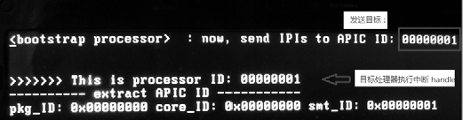

从上面的运行结果来看, BSP 处理器发送一条 IPI 消息到 APIC ID 为 01 的处理器上, 目标处理器正确地执行了 30h 中断处理程序.

我们看到, 使用 physical 模式是最为简单的一种给目标处理器发送 IPI 消息的形式. physical 模式当然也可以给所有的处理器发送消息.

## 2.1. 广播 IPI 消息

在**physical 模式**里, 当**destination field(目标域**)提供一个**FFh 值**时, IPI 消息将发送到**所有的处理器(广播 IPI 消息到 system bus 上的所有处理器), 也包括 self(自己**).

```x86asm
mov DWORD [APIC_BASE + ICR1], 0FF000000h   ;  发送 IPI 到所有处理器上
mov DWORD [APIC_BASE + ICR0], 00004030h   ;  所有处理器都执行 vector 30h 中断
```

上面的代码就是典型的使用 physical 模式广播 IPI 消息. 所有处理器都执行 vector 为 30h 的中断处理程序.

值得注意的是, 当广播 IPI 消息时, 所有处理器随机地执行中断处理程序, 此时应注意代码互斥问题, 避免所有处理器同时运行同一段程序(特别在有变量值修改的情况下), 这样会产生不可预测的问题.

因此, 在广播 IPI 消息的执行代码里加上互斥代码执行机制(正如实验 18-6 里所示), 典型地是加上 lock 信号, 限制两个处理器同时执行同一代码.

>实验 18-8: 广播 IPI 消息到 system bus 上所有处理器

下面, 我们来测试使用 physical 目标模式广播 IPI 消息, 在 IPI 的中断处理程序里, 打印出所有处理器的 APIC ID 提取出来的信息.

代码清单 18-22(topic18\ex18-8\protected.asm):

```x86asm
; ---------------------------------------------
;  ap_ipi_handler(): 这是 AP IPI handler
; ---------------------------------------------
ap_ipi_handler:
   jmp do_ap_ipi_handler
at_msg2 db 10, 10, '>>>>>>> This is processor ID: ', 0
at_msg3 db '---------- extract APIC ID -----------', 10, 0
do_ap_ipi_handler:
       ;  测试 lock
test_handler_lock:
       lock bts DWORD [vacant], 0
       jc get_handler_lock
       mov esi, at_msg2
       call puts
       mov edx, [APIC_BASE + APIC_ID]         ;  读 APIC ID
       shr edx, 24
       mov esi, edx
       call print_dword_value
       call println
       mov esi, at_msg3
       call puts
       mov esi, msg2                          ;  打印 package ID
       call puts
       mov esi, [x2apic_package_id + edx * 4]
       call print_dword_value
       call printblank
       mov esi, msg3                          ;  打印 core ID
       call puts
       mov esi, [x2apic_core_id + edx * 4]
       call print_dword_value
       call printblank
       mov esi, msg4                          ;  打印 smt ID
       call puts
       mov esi, [x2apic_smt_id + edx * 4]
       call print_dword_value
       call println
       mov DWORD [APIC_BASE + EOI], 0
       ;  释放 lock
       lock btr DWORD [vacant], 0
       iret
get_handler_lock:
       jmp test_handler_lock
       iret
```

由于这个实验里所有处理器都使用同一个 IDT, 所有处理器都同时执行同一个中断处理程序, 因此在这个 IPI 中断处理程序里加入了互斥机制代码, 每次进入 IPI handler 执行必须先获得 lock, 这样保证每个处理器都正确执行目标代码.

```x86asm
test_lock:
       lock bts DWORD [vacant], 0    ;  测试并上锁
       jc get_lock
       ; ;  执行某些代码
       Lock btr DWORD [vacant], 0    ;  释放 lock
       ; ;  其余处理
get_lock:
       jmp test_lock       ;  继续测试 lock
```

上面这段代码是简单的互斥执行机制示例. 同一时间只允许一个处理器进入执行某些代码.

当然, 你可以选择让所有处理器使用不同 IDT(在处理器初始化时设置不同的 IDT 基地址), 在这种情况下, 你可以使用相同的 vector 值, 而需要为每个处理器编写不同的中断处理程序. 这样并不存在需要互斥执行.

下面是在笔者的 Westmere 架构 Core i5 处理器上的运行结果.

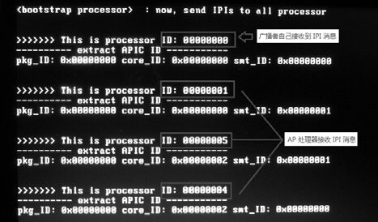

在上面的运行结果里, 我们看到, 所有的处理器都接收到 IPI 消息, 也包括广播者自己. 经过 IPI 中断处理程序的互斥操作, 所有处理器都正确地执行了 IPI 中断处理程序.

并且有一个现象是, 当广播消息包括自已在内, 那么显然广播者会最先得到中断消息(可能 system bus 仲裁时占优).

## 2.2. 使用其他交付模式

在上面的两个示例里, 我们使用的都是 Fixed 交付模式, 在**no shorthand 目标类型**里, 我们可以使用任何其他的交付模式: Fixed 模式(000B), SMI 模式(010B), NMI 模式(100B), INIT 模式(101B), 以及 Start\-up 模式(110B).

在**Fixed 模式**里, 需要提供**中断 vector**; **Start\-up 模式**里应**提供 Start\-up 代码地址**(如实验 18-6 所示); **其他的模式应保持 vector 为 0 值**. 在 NMI 模式里, 处理器自动使用 vector 为 2 值(即调用\#NMI 异常处理程序).

其余的这些 delivery mode 具有很高的优先级别, 它们不能被屏蔽, 不受 IRR、ISR, 以及 TPR 这些寄存器的中断仲裁影响. 我们将在后面进行探讨.

# 3. logical 目标模式的目标地址

> 多个 lapic

当使用 logical 目标模式时, 情况变得稍为复杂, **ICR 的 destination field(目标域**)并不是直接提供目标处理器的 APIC ID 值, 而是 **一个 mask 值**.

当 system bus 上的处理器符合(匹配)这个 mask 值时, 它们就是目标处理器, 并且可以一次发送**多个目标处理器**.

这个目标处理器的匹配过程, 受到 **LDR**(logical destination register)和 **DFR**(destination format register)的影响. 实际上, 它们定义了处理器的 **logical ID 值**, 其结构如下.

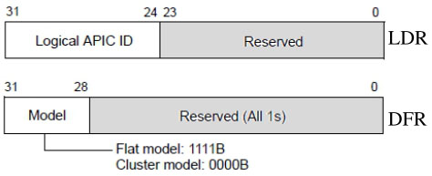

## 3.1. LDR

**每个 local APIC**可以**额外**自定义一个**逻辑 ID 值！！！**, 在 LDR(logical destination register)的 bit 24~bit 31 里提供. 8 位的 local APIC ID 值共可以为**8 个 local APIC**所使用(每个 local APIC 占用 1 位).

假设当前的 system bus 上有 4 个处理器, 那么每个处理器的 local APIC 里可以使用 LDR 定义一个逻辑 ID 值, 如下所示.

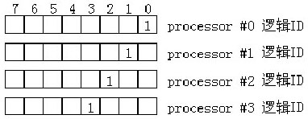

在上图的设置里, 4 个处理器的逻辑 ID 如下.

1) processor #0: 逻辑 ID 为 1.

2) processor #1: 逻辑 ID 为 2.

3) processor #2: 逻辑 ID 为 4.

4) processor #3: 逻辑 ID 为 8.

逻辑 ID 使用 **mask 码方式设置**(即每个位可以被 mask), **每个处理器**的**逻辑 ID 值**在**各自的初始化阶段**在 LDR 设置.

当使用 logical 目标模式发送 IPI 消息时, ICR 的 destination field(目标域)提供一个 mask 值, 这个 mask 值用来匹配和选择目标处理器.

## 3.2. DFR

DFR(destination format register)设置两种匹配模式: **flat 模式**(1111B)和**cluster 模式**(000B).

在 flat 模式里, 当 LDR 的**逻辑 ID**与 IPI 消息中的**destination field 值**进行**按位 AND**操作, 结果为 True 时, 属于目标处理器.

```x86asm
;  下面是发送 IPI
mov DWORD [APIC_BASE + ICR1], 0C000000h  ;  logical ID 值
mov DWORD [APIC_BASE + ICR0], 4830h   ;  使用 logical 目标模式
```

在上面的代码里, 使用 logical 目标模式发送 IPI 消息, ICR 的 destination field 值为 0C000000h, 那么它将匹配两个处理器(前面所举例列了 4 个逻辑 ID).

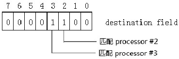

如上所示, 这个 destination field 值(0x0c)将找到两个符合的目标处理器(处理器 2 和处理器 3), 因此这个 IPI 消息将发送到两个处理器上.

>实验 18-9: 使用 logical 目标模式发送 IPI 消息

在使用 logical 目标时, 需要先为每个处理器设置一个 logical ID 值, 在这个实验里我们将使用 logical 目标模式来定位目标处理器.

代码清单 18-23(topic18\ex18-9\protected.asm):

```x86asm
       inc DWORD [processor_index]                             ;  增加 index 值
       inc DWORD [processor_count]                             ;  增加 logical
processor 数量
       mov ecx, [processor_index]                              ;  取 index 值
       mov edx, [APIC_BASE + APIC_ID]                         ;  读 APIC ID
       mov [apic_id + ecx * 4], edx                            ;  保存 APIC ID
; *
; * 分配 stack 空间
; *
       mov eax, PROCESSOR_STACK_SIZE
       mul ecx
       mov esp, PROCESSOR_KERNEL_ESP + PROCESSOR_STACK_SIZE
       add esp, eax
;  设置 logical ID
       mov eax, 01000000h          ;  模值
       shl eax, cl            ;  ID=(1 << index)
       mov [APIC_BASE + LDR], eax        ;  写入逻辑 ID
```

每个处理器的 logical ID 值为 1\<\<\index, index 值是处理器的编号(从 0 开始编号). 那么, index 值为 2 时, 第 2 号处理器的 logical ID 值是 04H; index 值为 3 时, 第 3 号处理器的 logical ID 值是 08H.

代码清单 18-24(topic18\ex18-9\protected.asm):

```x86asm
;  下面是发送 IPI
mov DWORD [APIC_BASE + ICR1], 0C000000h                 ;  发送目标为 0Ch
mov DWORD [APIC_BASE + ICR0], LOGICAL_ID | 30h         ;  发送 IPI
```

在上面的代码里, 使用 0C000000h 作为目标发送 IPI 消息时, 将匹配第 2 和第 3 号处理器. 下面是在 Westmere 架构 i5 处理器的机器上的运行结果.

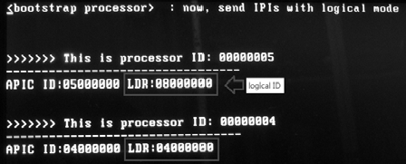

在上面的运行结果里, 在 LDR 里显示: APIC ID 编号为 05000000H 的处理器, 它的逻辑 ID 值为 08H; APIC ID 编号为 04000000H 的处理器, 它的逻辑 ID 为 04H. 使用 0CH 这个 destination field 值将使这两个处理器得到匹配.

# 4. 多处理器的初始化与编程

在 MP 系统平台上, system bus 上有多个 physical package, 或者只有 1 个 physical package, 但包含了多个 processor core 和 logical processor. 这些 processor 需要经过初始化才能被使用. BIOS 会进行一些初步初始化, 在支持多处理器的 OS 上, OS 有责任初始化和配置所有处理器.

在本节里, 我们将探讨 multi\-threading 平台(包括 Hyper-threading 和 multi-core 技术)的初始化.

## 4.1. Logical processor 的资源

在支持 Hyper-threading 技术的 Intel 处理器上, 每个 processor core 有两个 SMT(同步线程, 也就是 logical processor), 以笔者的 core i5 处理器为例, 其上有两个 core, 每个 core 上有两个执行单元, 属于双核心 4 线程处理器(典型地 i7 处理器属于 4 核 8 线程处理器).

这些 logical processor 的资源有三大类.

1) 部分资源是每个 logical processor 私有. 也就是说每个逻辑处理器都有独立的这些资源.

2) 部分资源是 core 上的两个 logical processor 共享的. 也就是说每个 core 有独立的这些资源, 而对于两个 SMT 来说是共享的. 一个 SMT 修改这些资源将影响另一个 SMT.

3) 部分资源依赖于处理器的实现, 这部分没有做明确的说明.

我们可以从 Intel 手册里得到关于 logical processor 资源的说明, 每个 logical processor 上独立的资源如下表所示.

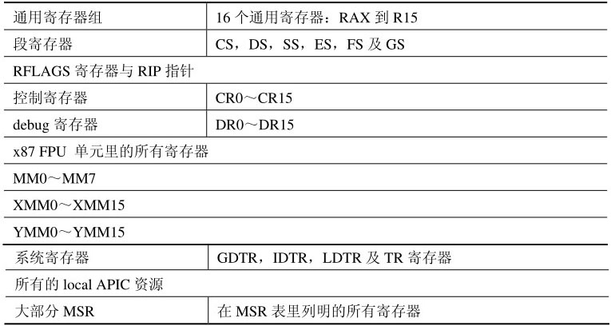

还有一些未在上表里列出的寄存器. 而在 Intel 手册里描述 SMT 共享的资源只有下面一条.

- MTRR(memory type rang register).

这个 MTRR 寄存器属于 core 内的两个 logical processor 共享(关于 MTRR 详情请参考 7.2 节所述).

下面的寄存器依赖于处理器实现, 也就是可能属于 SMT 独有, 也可能是 SMT 共享, 根据不同的处理器架构实现.

1) `IA32_MISC_ENABLE` 寄存器.

2) 与 Machine check 机制有关的 MSR.

3) 与 performance monitoring 机制有关的 MSR, 包括 control 寄存器与 counter 寄存器.

关于哪些 MSR 属于 SMT 独有, 哪些属于 SMT 共享, 最好参考 Intel 手册的 MSR 列表, 得到更准确详细的信息.

实际上, 可能在 Intel 手册里某些寄存器资源并没有明确标明, 也有部分信息是隐晦不清的, 或许还有部分是描述有误的.

## 4.2. Logical processor 的初始化

当 MP 系统 `power-up`(加电)或者 RESET(复位)后, **每个 processor** 会同时执行处理器内部的 **BIST** 代码. 基于 system bus 硬件会赋予其上的每个 logical processor **唯一的 APIC ID 值**, 这个 APIC ID 值就是前面 18.4.2.1 节所描述的 initial APIC ID(即最初的 APIC ID 值).

如前面 18.4.2.1 节所述, 当处理器支持 `CPUID.0B` 功能叶时, 这个 initial APIC ID 是 32 位的(尽管在不支持 x2APIC 模式下也是), 否则 initial APIC ID 是 8 位的.

这个 initial APIC ID 值会被写入到 local APIC 的 APIC ID 寄存器里作为每个处理器的 ID 值, 并且硬件会选择一个处理器作为 BSP(bootstrap processor), BSP 的 APIC ID 值通常为 0H. 在这个 BSP 的 IA32\_APIC\_BASE 寄存器的 bit 8 位(BSP 标志位)会置位, 指示属于 BSP.

而其余处理器的 `IA32_APIC_BASE` 寄存器 BSP 标志位会被清位, 指示属于 AP(application processor).

在确定 BSP 后, BSP 从 0FFFFFFF0H 地址(BIOS 代码)处执行第 1 条 CPU 指令. 我们知道, BSP 接着执行 BIOS 的自举代码, 完成 BIOS 设置.

在 Intel 手册的指引里, 当 BSP 完成 BIOS 的 boot strap 代码初始化工作后, 应向 system bus 广播 INIT-SIPI-SIPI 消息序列(除了自己), 唤醒其他 AP 处理器. BSP 提供 BIOS 的 bootstrap routine 地址给所有 AP 处理器接收, 引导 AP 处理器完成初始化设置.

> 实验 18-10: system bus 上处理器初始化及相互通信

接下来, 笔者将以实际例子来阐述 system bus 上所有处理器的初始化, 当然这个实验例子是很简单的, 并没有完全做到 Intel 推荐的详细步骤, 但绝对是具有代表性和可操作性的.

## 4.3. 实例目标

我们的最终目标是什么? 为了更具代表性, 在笔者的 Westmere 架构移动 Core i5 处理器平台上(属于双核 4 线程处理器), 让所有的 logical processor 进入到 64 位模式, 并且 3 个 AP 运行在 3 级权限下, 而 BSP 运行在 0 级权限下, 如下表所示.

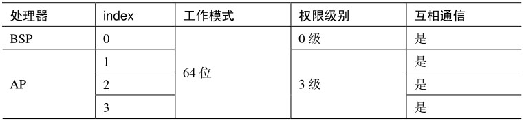

显然, 每个处理器必须走完从实模式到 64 位模式的切换流程, 第 1 个完成这个流程的必定是 BSP, 在实验里设它的 index 值为 0(处理器编号). 注意: 这个 index 值不是 APIC ID 号, 也不是 logical ID 号, 是为了便于管理而编的号.

## 4.4. 处理器的运行模式

第一个执行初始化工作的必定是 BSP, BSP 初始化完成后再通知其余的处理器进行初始化工作.

实际上, 在 OS 里处理器执行初始化流程完全依赖于 OS 的设计和实现. 典型地, OS 可以为每个处理器使用独立的运行环境, 也可以所有的处理器共有一个大环境, 如下表所示.

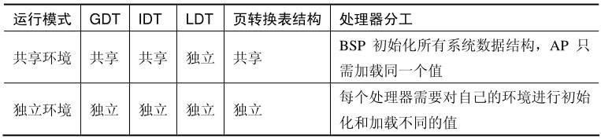

在共享环境里, 4 个主要的系统执行环境如下.

1) GDT 共享意味着所有处理器的 GDTR 是一致的, 需要加载同一个 GDT pointer 值.

2) IDT 共享意味着所有处理器的 IDTR 是一致的, 需要加载同一个 IDT pointer 值.

3) LDT 可以选择使用独立, 为每个处理器加载不同的 LDTR 值.

4) Paging 机制的页转换表结构尤其重要, 当共享页转换表时意味着所有处理器的 CR3 寄存器值是一致的, 需要加载同一个页表转换表基址.

因此, 并不需要所有处理器都在整个初始化流程执行一遍. BSP 将要做更多的工作. 系统中的 GDT、IDT 及页转换表结构, 由 BSP 负责完成初始化设置, 其他的 AP 加载使用. 很多情况下, AP 只需完成自己份内的工作就可以了.

在独立的环境里, 每个处理器都有自己的一份运行环境, 每个处理器需要负责对自己的环境进行初始化和设置.

值得注意的是, 这些划分并不是绝对的, 可以做到既有共享的环境也有独立的环境. 在笔者的实验实例里是使用处理器共享环境的模式.

## 4.5. 共用流程

在这个实验里有很大一部分代码是所有处理器都需要共同执行一次的, 下面的代码是在 `long.asm` 模块里刚进入 64 位模式下的初始化阶段, 由所有处理器执行.

代码清单 18-25(topic18\ex18-10\long.asm):

```x86asm
entry64:
       mov ax, KERNEL_SS
       mov ds, ax
       mov es, ax
       mov ss, ax
;  设置 long-mode 的系统数据结构
       call bsp_init_system_struct
; ;  下面重新加载 64 位 环境下的 GDT 和 IDT
       mov rax, SYSTEM_DATA64_BASE + (__gdt_pointer - __system_data64_entry)
       lgdt [rax]
       mov rax, SYSTEM_DATA64_BASE + (__idt_pointer - __system_data64_entry)
       lidt [rax]
; *
; * 设置多处理器环境
; *
       inc DWORD [processor_index]             ;  增加处理器 index
       inc DWORD [processor_count]           ;  增加处理器计数
       mov eax, [APIC_BASE + APIC_ID]        ;  读 APIC ID
       mov ecx, [processor_index]
       mov [apic_id + rcx * 4], eax           ;  保存 APIC ID
       mov eax, 01000000h
       shl eax, cl
       mov [APIC_BASE + LDR], eax              ;  logical ID
; *
; * 为每个处理器设置 kernel stack pointer
; *
       ;  计数 stack size
       mov eax, PROCESSOR_STACK_SIZE   ;  每个处理器的 stack 空间大小
       mul ecx                                     ;  stack_offset=STACK_SIZE * index
       ;  计算 stack pointer
       mov rsp, PROCESSOR_KERNEL_RSP
       add rsp, rax       ;  得到 RSP
       mov r8, PROCESSOR_IDT_RSP
       add r8, rax                               ;  得到 TSS RSP0
       mov r9, PROCESSOR_IST1_RSP           ;  得到 TSS IDT1
       add r9, rax
; *
; * 为每个处理器设置 TSS 结构
; *
;  计算 TSS 基址
       mov eax, 104                                   ;  TSS size
       mul ecx                                     ;  index * 104
       mov rbx, __processor_task_status_segment-
__system_data64_entry+SYSTEM_DATA64_BASE
       add rbx, rax
       ;  设置 TSS 块
       mov [rbx + 4], r8                       ;  设置 RSP0
       mov [rbx + 36], r9                     ;  设置 IST1
       ;  计算 TSS selector 值
       mov edx, processor_tss_sel
       shl ecx, 4                                 ;  16 * index
       add edx, ecx                            ;  TSS selector
       ;  设置 TSS 描述符
       mov esi, edx                              ;  TSS selector
       mov edi, 67h                              ;  TSS size
       mov r8, rbx                                  ;  TSS base address
       mov r9, TSS64                                  ;  TSS type
       call set_system_descriptor
; *
; * 下面加载 TSS 和 LDT
; *
       ltr dx
       mov ax, ldt_sel
       lldt ax
; ;  设置 sysenter/sysexit, syscall/sysret 使用环境
       call set_sysenter
       call set_syscall
;  设 FS.base=0xfffffff800000000
       mov ecx, IA32_FS_BASE
       mov eax, 0x0
       mov edx, 0xfffffff8
       wrmsr
;  提取 x2APIC ID
       call extrac_x2apic_id
```

这个流程里的主要工作是: 加载 GDTR 与 IDTR; 增加处理器 index 与 count 计数, 保存各自的 APIC ID 值; 为每个处理器分配各自的 RSP 值; 为每个处理器设置独立的 TSS 段; 加载 TR 与 LDTR; 最后初始化 sysenter 与 syscall 指令使用环境.

## 4.6. BSP 的流程

在实例里, BSP 初始化的流程和以前的实验测试是一样的, 只是调整了一些初始化代码的次序, 以及额外增加了判断是否为 BSP 的流程.

代码清单 18-26(topic18\ex18-10\long.asm):

```x86asm
;  检测是否为 bootstrap processor
       mov ecx, IA32_APIC_BASE
       rdmsr
       bt eax, 8
       jnc application_processor_long_enter
; -------------------------------------
;  下面是 BSP 代码
; -------------------------------------
bsp_processsor_enter:
; ;  设置 call gate descriptor
       mov rsi, call_gate_sel
       mov rdi, __lib32_service   ;  call-gate 设在 __lib32_srvice() 函数上
       mov r8, 3                              ;  call-gate 的 DPL=3
       mov r9, KERNEL_CS                    ;  code selector=KERNEL_CS
       call set_call_gate
       mov rsi, conforming_callgate_sel
       mov rdi, __lib32_service            ;  call-gate 设在 __lib32_srvice() 函数上
       mov r8, 3                              ;  call-gate 的 DPL=0
       mov r9, conforming_code_sel        ;  code selector=conforming_code_sel
       call set_call_gate
; ;  设置 conforming code segment descriptor
       MAKE_SEGMENT_ATTRIBUTE 13, 0, 1, 0  ;  type=conforming code, DPL=0, G=1, D/B=0
       mov r9, rax                 ;  attribute
       mov rsi, conforming_code_sel       ;  selector
       mov rdi, 0xFFFFF                      ;  limit
       mov r8, 0                              ;  base
       call set_segment_descriptor
;  设置 #GP handler
       mov rsi, GP_HANDLER_VECTOR
       mov rdi, GP_handler
       call set_interrupt_handler
;  设置 #PF handler
       mov rsi, PF_HANDLER_VECTOR
       mov rdi, PF_handler
       call set_interrupt_handler
;  设置 #DB handler
       mov rsi, DB_HANDLER_VECTOR
       mov rdi, DB_handler
       call set_interrupt_handler
; ;  设置 int 40h 使用环境
       mov rsi, 40h
       mov rdi, user_system_service_call
       call set_user_interrupt_handler
;  开启中断许可
       NMI_ENABLE
       sti
       mov DWORD [20100h], 0            ;  lock 信号有效
```

通过 `IA32_APIC_BASE` 寄存器 bit 8(BSP 标志位)来判断当前执行代码处理器是否属于 BSP. 如果是 AP 则跳转到 `application_processor_long_enter` 执行 AP 剩余的 longmode 初始化流程.

在 BSP 流程里, 主要工作是设置 GDT 和 IDT 内的描述符数据, 最后开放 lock 信号.

## 4.7. Lock 信号

这个 Lock 信号是为了避免所有 AP 同时执行 startup routine 代码, 必须设置一个互斥执行的锁机制. 当 lock 信号为 0 时, 第 1 个读取并上锁(lock 信号置为 1)的 AP 获得执行权. 等待完成后重新开放 lock 信号有效.

在广播 INIT\-SIPI\-SIPI 消息前, 增加 processor 的计数, 清 lock 信号置为有效. 在实验里, 在 Lock 信号的值保存在硬编码地址值[20100h]位置上.

使用硬编码地址是为了代码的共用, 能在 protected.asm 模块和 long.asm 模块里对同一个值进行设置. 笔者暂时没有其他比较好的方式.

由于 protected.asm 模块执行在起始地址 9000h 的区域, 而 long.asm 模块执行在起始地址 10000h 的区域, 如果在 protected.asm 和 long.asm 模块块里同时定义一个 lock 信号 vacant 值, 那么在 startup routine 里会造成地址位置不一致, 使用 startup routine 代码不能做到通用性(在这么一种情况下, 例如: 当 AP 只需进入 protected 模式, 而不需进入 long-mode 时).

## 4.8. Startup routine

在 BSP 广播 SIPI(startup IPI)消息时, 需为接收 SIPI 消息的处理器提供 startup routine 代码的入口地址, 这个 startup routine 代码必须提供在 4K 边界上, 1M 地址以内的 real\-mode 地址(也就是 startup routine 提供的是 1M 以内的物理地址).

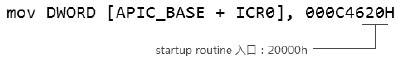

以上面的广播 SIPI 消息代码为例, 它提供的 vector 值为 20h, 那么 startup routine 入口地址在 20000h 地址里.

代码清单 18-27(common\application_processor.asm):

```x86asm
; *------------------------------------------------------
; * 下面是 startup routine 代码
; * 引导 AP 执行 setup 模块, 执行 protected 模块
; * 使所有 AP 进入 protected 模式
; *------------------------------------------------------
startup_routine:
       ; *
       ; * 当前处理器处理 16 位实模式
       ; *
       bits 16
       mov ax, 0
       mov ds, ax
       mov es, ax
       mov ss, ax
; *
; * 测试 lock, 只允许 1 个 local processor 访问
; *
test_ap_lock:
       ; *
       ; * 测试 lock, lock 信号在 20100h 位置上
       ; * 以 CS + offset 的形式使用 lock 值
       ; *
       lock bts DWORD [cs: 100h], 0
       jc get_ap_lock
; *
; * 获得 lock 后, 转入执行 setup --> protected --> long 序列
; *
       jmp WORD 0: SETUP_SEG
get_ap_lock:
       pause
       jmp test_ap_lock
       bits 32
startup_routine_end:
```

这是完整的 startup routine 代码. 注意: 它实现在 common\application_processor.asm 文件里. 笔者它提取出来放在共用的文件目录(common 目录完整路径为 x86\source\common\), 这样的好处是, 可以放在 protected.asm 模块和 long.asm 模块里共用.

这个 startup routine 代码几乎没做什么工作, 最重要的是使用 spin lock 形式来获取 lock, 让同一时刻只有一个 AP 进入 setup.asm -> protected.asm -> long.asm 执行序列来初始化.

这个 lock 信号值, 如前面所述使用了硬编码 CS: offset 形式, 当有下面示例时:

```x86asm
mov DWORD [APIC_BASE + ICR0], 00c4620H  ;  startup routine 在 20000h
mov DWORD [APIC_BASE + ICR0], 00C4630H  ;  startup routine 在 30000h
```

当发送不同地址的 startup routine 时, 例如: 一个在 20000h, 一个在 30000h. 使用[CS: 100h]形式能保证让 BSP 知道目标的 lock 信号位于固定的 100h 偏移位置上, BSP 可以维护这个 `[20100h]` 和 `[30100h]` 地址的 lock 信号.

值得注意的是, 处理器在接收 INIT 消息后, 处于 INIT 状态, 此时处理器工作模式是实模式, 因此这个 startup routine 代码必须以 16 位实模式代码的角度来设计.

## 4.9. BSP 广播 INIT-SIPI-SIPI 消息

BSP 在执行完 `long-mode` 的一些初始化工作后, 最后**广播 INIT\-SIPI\-SIPI 消息**序列到 system bus 上, 唤醒所有其余的处理器并执行 startup routine 代码.

代码清单 18-28(`topic18\ex18-10\long.asm`):

```x86asm
       ; *
       ; * 下面发送 IPI, 使用 INIT-SIPI-SIPI 序列
       ; * 发送 SIPI 时, 发送 startup routine 地址位于 200000h
       ; *
       mov DWORD [APIC_BASE + ICR0], 000c4500h   ;  发送 INIT IPI, 使所有 processor
执行 INIT
       DELAY
       DELAY
       mov DWORD [APIC_BASE + ICR0], 000C4620H ;  发送 Start-up IPI
       DELAY
       mov DWORD [APIC_BASE + ICR0], 000C4620H ;  再次发送 Start-up IPI
       ; *
       ; * 等待 AP 完成初始化
       ; *
wait_for_done:
       cmp DWORD [ap_done], 1
       je next
       nop
       pause
       jmp wait_for_done
next:   ;  触发 apic timer 中断
       mov DWORD [APIC_BASE + TIMER_ICR], 10
       DELAY
```

Intel 推荐发送两次 SIPI 消息, 这是因为, 当 system bus 上某个处理器没收到 SIPI 消息, SIPI 消息不会自动重发, 主动发送两次 SIPI 消息将避免这种情况的发生.

注意: 发送两次 SIPI 消息, 并不会使某些处理器收到两条 SIPI 消息. 这或许是 Intel 保证的, 或许是基于 system bus 上的消息仲裁手段.

在每次广播 IPI 消息时应插入一些延时代码, Intel 推荐的是发送 INIT 消息后延时 10ms, 每发送一次 SIPI 消息延时 200??s, 这个时间延迟比较难控制. 因此, 具体时间根据情况所定.

## 4.10. BSP 等待 AP 回复响应

代码清单 18-29(topic18\ex18-10\long.asm):

```x86asm
       ; *
       ; * 等待 AP 完成初始化
       ; *
wait_for_done:
       cmp DWORD [ap_done], 1    ;  假如所有处理器完成后, 触发 apic timer 中断
       je next
       nop
       pause
       jmp wait_for_done
next:   ;  触发 apic timer 中断
       mov DWORD [APIC_BASE + TIMER_ICR], 10
       DELAY
```

当发送完 `INIT-SIPI-SIPI` 消息序列后, BSP 等待 AP 完成. 在这个实例里, 笔者使用一种回复响应机制: 也就是所有 AP 完成后发送 IPI 消息回复 BSP, 报告已完成所有的初始化工作.

这种机制可以去掉 BSP 使用延时进行等待的方法, 非常灵活实用. 并且可以让 AP 处理器主动与 BSP 进行通信.

## 4.11. AP 初始化工作

在代码清单 18-25 里, 当判断处理器不是属于 BSP 时, 转入 application\_processor\_long\_enter 执行每个 AP 剩余的工作, 如下面的代码所示.

代码清单 18-30(common\application_processor.asm):

```x86asm
; -------------------------------------------------
;  下面是 application processor 转入到 long-mode
; -------------------------------------------------
application_processor_long_enter:
       bits 64
;  设置 LVT error
       mov DWORD [APIC_BASE + LVT_ERROR], APIC_ERROR_VECTOR
; *
; * 注释掉 kernel 代码, 转入到 user 代码
; *
       ; 释放 lock, 允许其他 AP 进入
    ;    lock btr DWORD [20100h], 0
; ============== Ap long-mode 初始化完成 ======================
       ; *
       ; * 向 BSP 回复 IPI 消息
       ; *
;         mov DWORD [APIC_BASE + ICR1], 0h
;         mov DWORD [APIC_BASE + ICR0], PHYSICAL_ID | BP_IPI_VECTOR
;  设置用户有权执行 0 级的例程
       mov rsi, SYSTEM_SERVICE_USER8
       mov rdi, user_hlt_routine
       call set_user_system_service
       mov rsi, SYSTEM_SERVICE_USER9
       mov rdi, user_send_ipi_routine
       call set_user_system_service
;  计算 user stack pointer
       mov ecx, [processor_index]
       mov eax, PROCESSOR_STACK_SIZE
       mul ecx
       mov rcx, PROCESSOR_USER_RSP
       add rax, rcx
; ;  切换到用户代码
       push USER_SS | 3
       push rax
       push USER_CS | 3
       push application_processor_user_enter
       retf64
       sti
       hlt
       jmp $
application_processor_user_enter:
       mov esi, ap_msg
       mov rax, LIB32_PUTS
       call sys_service_enter
       ;  发送消息给 BSP, 回复完成初始化
       mov esi, PHYSICAL_ID | BP_IPI_VECTOR
       mov edi, 0
       mov eax, SYSTEM_SERVICE_USER9
       int 40h
       ; 释放 lock, 允许其他 AP 进入
       lock btr DWORD [20100h], 0
       mov eax, SYSTEM_SERVICE_USER8
       int 40h
       jmp $
```

在 AP 初始化流程里几乎没做什么工作, long-mode 环境的设置大部分工作已经在前面的共同流程里完成, 并且由 BSP 完成对 GDT 与 IDT 的设置.

内存中的系统数据表, 如: paging 结构表, GDT, IDT, LDT 及 TSS, 还有中断 vector 的设置都由 BSP 设置, AP 无须重复设置.

在实例里, AP 接着的工作如下.

1) 为 3 级权限的用户代码提供一些中断服务例程.

2) 切换到 3 级权限.

3) 开放 lock 信号.

4) 发送 IPI 消息给 BSP, 回复已完成工作.

5) 进入 hlt 状态, 等待 IPI 消息.

由于发送 IPI 消息(`APIC_BASE` 映射为用户不可访问)和开启中断执行 HLT 指令需要 0 级的权限, 因此在 0 级权限里, 设置了两个用户中断服务例程, 使得在用户层里也可以发送 IPI 和执行 HLT 指令.

```x86asm
代码清单 18-31(common\application_processor.asm):

; ---------------------------------
;  user_send_ipi_routine()
;  input:
;        rsi - ICR0, rdi - ICR1
; ---------------------------------
user_send_ipi_routine:
       mov DWORD [APIC_BASE + ICR1], edi
       mov DWORD [APIC_BASE + ICR0], esi
       ret
; ---------------------------------
;  在用户级代码里开启中断和停机
; ---------------------------------
user_hlt_routine:
       sti
       hlt
       ret
```

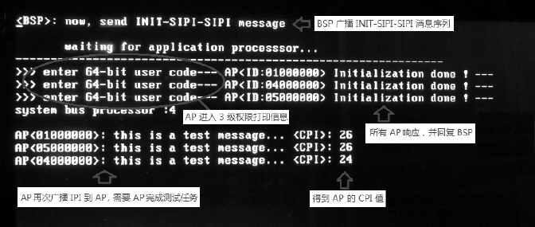

这个实验共有 3 个 IPI 消息发送阶段, 从上面的运行结果图可以看到:

1) BSP 初始化完成后广播 INIT-SIPI-SIPI 序列.

2) 3 个 AP 初始化完成分别发送 IPI 给 BSP, 回复响应, 确认完成.

3) 最后 BSP 广播 IPI 到 3 个 AP, 让它们计算一个函数打印信息函数, 计算 AP 的 CPI(clocks per instruction)值.

这时候, BSP 处于 64 位模式的 0 级权限代码, 而 AP 处于 64 位模式的 3 级用户权限下. System bus 上的所有处理器都可以互相通信交流.

BSP 发送 IPI 消息, AP 响应执行时需要建立互斥执行机制(除非每个处理器 paging 映射基地址不同或者每个处理器使用独立的 IDT).

而 AP 发送 IPI 给 BSP 响应执行时, 由于 system bus 上只有一个 BSP 不必建立互斥机制. BSP 只能一次接收一条 IPI 消息.
