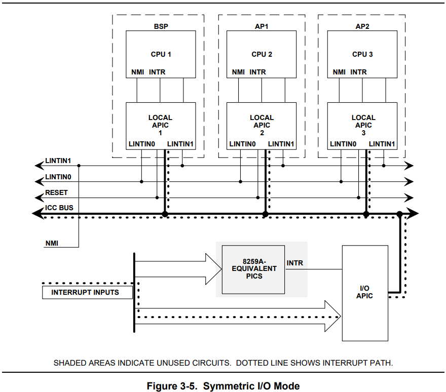
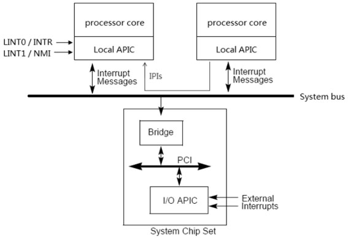
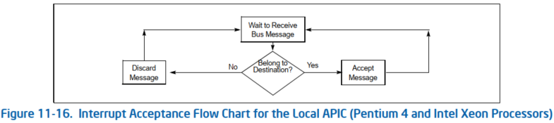
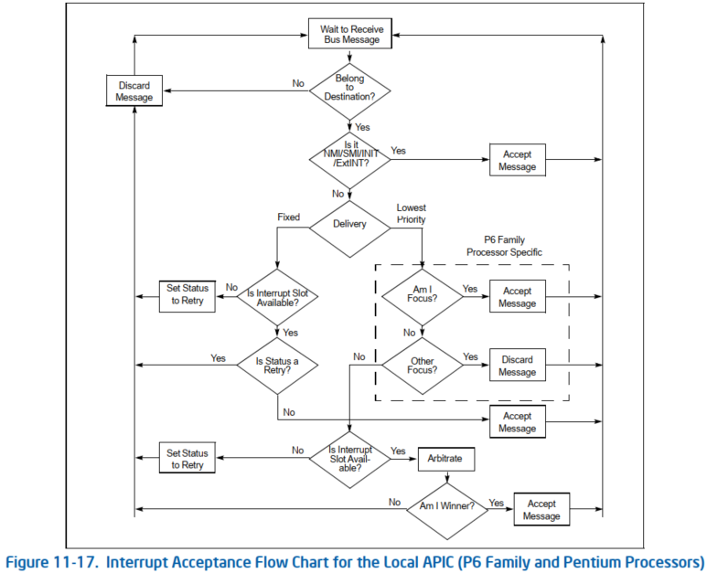
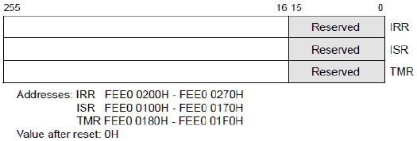
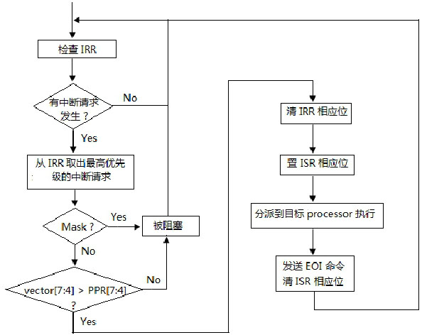
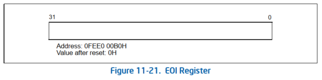

<!-- @import "[TOC]" {cmd="toc" depthFrom=1 depthTo=6 orderedList=false} -->

<!-- code_chunk_output -->

- [中断模式](#中断模式)
- [中断源触发中断](#中断源触发中断)
  - [LINT0/LINT1](#lint0lint1)
    - [LINT0](#lint0)
    - [LINT1](#lint1)
  - [LVT](#lvt)
  - [I/O APIC](#io-apic)
  - [IPI](#ipi)
- [local APIC 接收中断消息](#local-apic-接收中断消息)
  - [Pentium 4 和 Intel Xeon Processors 处理概述](#pentium-4-和-intel-xeon-processors-处理概述)
  - [P6 Family 和 Pentium Processors 处理概述](#p6-family-和-pentium-processors-处理概述)
  - [1.1. local interrupt(本地中断源)的处理](#11-local-interrupt本地中断源的处理)
  - [1.2. system bus 上中断消息的处理: IPI 消息或 IO APIC 消息](#12-system-bus-上中断消息的处理-ipi-消息或-io-apic-消息)
- [2. 检查目标](#2-检查目标)
- [3. IRR 和 ISR 仲裁](#3-irr-和-isr-仲裁)
  - [3.1. IRR/ISR/TMR](#31-irrisrtmr)
  - [3.2. 处理概述](#32-处理概述)
  - [3.3. IRR 寄存器的状态](#33-irr-寄存器的状态)
    - [3.3.1. 从 IRR 中取出最高优先级的中断请求](#331-从-irr-中取出最高优先级的中断请求)
  - [3.4. TMR 寄存器的状态](#34-tmr-寄存器的状态)
  - [3.5. ISR 寄存器的状态](#35-isr-寄存器的状态)
  - [3.6. 是否被屏蔽](#36-是否被屏蔽)
  - [3.7. 判断优先级](#37-判断优先级)
  - [3.8. 清 IRR 相应位](#38-清-irr-相应位)
  - [3.9. 置 ISR 相应位](#39-置-isr-相应位)
- [中断处理程序](#中断处理程序)
  - [EOI](#eoi)
    - [发送 EOI 命令](#发送-eoi-命令)
    - [写 EOI 到特定的 I/O APIC](#写-eoi-到特定的-io-apic)
    - [Linux 实现](#linux-实现)
- [local APIC 收到 EOI](#local-apic-收到-eoi)
- [I/O APIC 收尾](#io-apic-收尾)
- [清除 ISR](#清除-isr)
- [小结](#小结)

<!-- /code_chunk_output -->

# 中断模式

`Symmetric I/O Mode` (**对称 I/O 模式**): 使系统能够与多个处理器一起运行.



现代 8259 一般连在 I/O APIC 的 IRQ0 上

# 中断源触发中断

这里不讨论传统 PIC 模式.

local APIC 可以接收的中断源见 `1. APIC体系概述`



`APIC体系概述` 中提到, **local APIC** 可以接收的中断有:

* LINT0/LINT1: 仍然由 local APIC 的 LVT 寄存器配置;

* LVT: 由 local APIC 的 LVT 寄存器配置;

* I/O APIC: 由 I/O APIC 配置并转发到 system bus 上, 然后由 local APIC 接收;

* IPI: 用于处理器间的中断消息.

## LINT0/LINT1

典型地物理连接方式是:

* **LINT0** 作为处理器的 `INTR pin` 接着**外部 8259 类的中断控制器的 INTR 输出端**, 而 LAPIC 系统中一般是连接到 I/O APIC 的 RTE0.

* **LINT1** 作为处理器的 `NMI pin` 接着**外部设备的 NMI 请求**.

### LINT0

直接忽略

### LINT1

当 local APIC 被 disable 时, LINT0 被直接作为处理器的 INTR pin 使用, LINT1 被直接作为处理器的 NMI pin 使用.


## LVT

软件设置后, 仅仅在当前 CPU 自己触发中断, 也就是本地中断源.

* Delivery mode: 可以是 fixed, SMI, NMI, INIT, ExtINT


## I/O APIC

连接到 I/O APIC 的一个外设:

* Delivery mode: 只能是 fixed, Lowest Priority 或者 ExtINT

* tirgger mode: 可以是 level 或者 edge

一般外设使用的是 fixed (delivery mode, 交付模式) 和 level/edge (tirgger mode, 触发模式).

第一. 驱动实际上是需要先配置 I/O APIC, 填写相应的 RTE.

第二. 外设产生中断

驱动写 RTE: 先写高 32 位(保证 mask set), 再写低 32 位. 同时保证 低 32 位的 mask bit 最后 clear, 因为 clear 会产生中断. 而在 clear mask bit 之前, 必须保证 RTE 的其他位已经填写完整.

> 同样, 屏蔽某个 RTE, 需要先写入 低 32 位并设置 mask bit, 然后再写入高 32 位.

物理上:

对于 edge 触发的设备, 只要电平有变化, 就是造成引脚的 assert, 从而产生中断.

对于 edge 触发的设备, 驱动需要在相应 RTE 中标明触发中断的电平(high/low), 然后将其拉到相应的电平, 从而产生中断. 当中断处理完后, 会收到 EOI, 从而将电平拉回.

虚拟化, 需要根据 RTE 状态: 写 RTE

第三. I/O APIC 硬件检查

需要判断下面的信息, 确认是不是要触发中断.

* RTE[bit 16]: **mask 位**, 值为 0, 表明没有被屏蔽.

* RTE[bit 14]: **remote IRR**, 对于 level 模式的才有意义, 值为 0, 表明该中断没有被 local APIC 处理.

* RTE[bit 13]: pin polarity, 表示 high/low 电平触发中断, 当前电平满足 pin polarity.

```cpp
// lvl 是当前 pin state: 1 - high, 0 - low
((rte.bits.intr_polarity == IOAPIC_RTE_INTPOL_AHI) && (lvl == 1U)));
```

以上条件均满足了才进行下一步.

第四. I/O APIC 产生中断消息并转发

a. I/O APIC 会读取相应 RTE 信息

b. I/O APIC 会**设置** RTE 中的 **delivery status** 为 1(pending), 表明中断已经被触发, 但还没有 delivery 完成.

c. **remote IRR**(RIRR) 设置:

  * 对于 level 触发的, I/O APIC 会设置 RTE 的 remote IRR, 表明该中断已经被 local APIC 处理.

  * 对于 edge 触发的, RTE 中的 remote IRR 没有意义.

d. 最后 I/O APIC 格式化一条中断消息, 发送中断消息从 PCI 桥通过 system bus 到指定的处理器(或一组处理器), 由相应处理器的 local APIC 进行处理.

e. 中断消息发送到 system bus 后, 就已经**不属于 I/O APIC 的处理范围**了, 而是在 system bus 硬件和 local APIC 的管辖之内. 最终的中断消息将由 local APIC 来接收处理.

## IPI

写高 32 位不会产生 IPI, 当往 ICR 寄存器的**低 32 位**写入 **IPI 命令字**时, 处理器就产生了 **IPI 消息**发送到 **system bus** 上.


# local APIC 接收中断消息

当 local APIC 收到来自本地源的中断、来自 I/O APIC 或 IPI 的中断消息时, 它处理消息的方式取决于处理器实现, 如以下各节所述.

## Pentium 4 和 Intel Xeon Processors 处理概述

> 系统总线

使用 Pentium 4 和 Intel Xeon 处理器时, local APIC 处理本地中断、中断消息和 IPIs 如下:



1) 首先它先确认**自己是否是指定的目的地**(参见下图). 如果它是指定的目标, 则接受消息; 如果不是, 则**丢弃消息**.

2) 如果 local APIC 确定它是中断的指定目标, 并且中断请求是 **NMI**、**SMI**、**INIT**、**ExtINT** 或 **SIPI**, 则**中断将直接发送到 CPU** 进行处理.

3) 如果 local APIC 确定它是中断的指定目标, 但中断请求**不是** 2) 中给出的中断之一, 则 local APIC 会在 **IRR** 中设置适当的位.

> 也就是说仅仅 delivery mode 是 fixed 或者 Lowest Priority 会设置 IRR.

4) 当中断在 IRR 寄存器中处于待处理状态(pending)时, local APIC 会根据**中断的优先级**和 **PPR** 中的**当前处理器优先级**, 一次分派一个中断给处理器(请参阅下面 "任务和处理器优先级").

5) 当一个 fixed 中断被分派给处理器内核进行处理时, 处理进程例程的完成由指令处理进程代码中的指令指示, 该指令将写入 local APIC 中的中断结束 (EOI) 寄存器(参见第 11.8.5 节 "信令中断服务完成"). 写入 EOI 寄存器的操作会导致本地 APIC 从其 ISR 队列中删除中断, 并 (对于 level 触发的中断) 在总线上发送一条消息, 指示中断处理已完成. (对 EOI 寄存器的写入不得包含在 NMI、SMI、INIT、ExtINT 或 SIPI 的处理进程例程中.

## P6 Family 和 Pentium Processors 处理概述

> APIC 总线

对于 P6 系列和 Pentium 处理器, local APIC 处理本地中断、中断消息和 IPIs 如下:



1) (仅限 IPI)**local APIC** 会检查 **IPI** 消息, 以确定它是否是 IPI 的指定目的地, 如第 11.6.2 节 "确定 IPI 目的地"中所述. 如果它是指定的目的地, 则继续其接受过程; 如果不是目标, 则会丢弃 IPI 消息. 当中断消息是 lowest-priority delivery mode 时, local APIC 将与被指定为 IPI 消息收件人的其他处理者进行仲裁(请参阅第 11.6.2.4 节 "最低优先级传送模式").

2) 如果 local APIC 确定它是中断的指定目的地, 并且中断请求是 NMI、SMI、INIT、ExtINT 或 INIT-deassert 中断, 或者是 MP 协议 IPI 消息之一(`Boot IPI<BIPI>`、`Final Boot IPI<FIPI>` 和 `Startup IPI<SIPI>`), 则中断将直接发送到处理器内核进行处理.

3) 如果 local APIC 确定它是中断的指定目的地, 但中断请求不是 2) 中给出的中断之一, 则 local APIC 在 IRR 和 ISR 寄存器中包含的两个待处理中断队列之一中查找空槽(见图 11-20). 如果有插槽可用(请参阅第 11.8.4 节, "Interrupt Acceptance for Fixed Interrupts"), 将中断放置在插槽中. 如果槽不可用, 它将拒绝中断请求, 并将其发送回发送方并发送重试消息.

4) 当中断在 IRR 寄存器中处于待处理状态(pending)时, local APIC 会根据中断的优先级和 PPR 中的当前处理器优先级, 一次将它们分派给处理器一个(请参阅第 11.8.3.1 节 "任务和处理器优先级").

5) 当 fixed 中断被发送到处理器核心进行处理时, 处理程序例程的完成通过指令处理程序代码中的一条指令来指示, 该指令写入本地 APIC 中的中断结束 (EOI) 寄存器(请参见第 11.8.5 节"信号中断服务完成"). 写入 EOI 寄存器的操作会导致本地 APIC 从其队列中删除中断, 并且(对于电平触发中断)在总线上发送一条消息, 表明中断处理已完成. (对于 NMI、SMI、INIT、ExtINT 或 SIPI, 处理程序例程中不得包含对 EOI 寄存器的写入. )

## 1.1. local interrupt(本地中断源)的处理

软件设置后, 仅仅在当前 CPU 自己触发中断.

local APIC 的

* **LVT 寄存器能产生中断**;

* **LVT LINT0** 能接收外部 **8259** 中断控制器的中断请求;

* **LVT LINT1** 能接收外部设备的 **NMI** 中断请求.

LVT 寄存器产生的**本地中断源处理**上与 **system bus 上接收的中断消息有些不同**, 下图描述了对**本地中断处理(！！！**)的简要流程.


> 注: 图有些问题, 根据 Intel 手册, 所有具有 **NMI**, **SMI**, **INIT**, **ExtINT**, **start-up** 或 **INIT-deassert** delivery 模式的中断都会绕过 IRR 和 ISR 寄存器, 并直接发送到处理器内核进行处理, 像下面 system bus 图一样.

> 问题: 如果不是 level fixed 的, 那 ISR 什么时候 clear?

**本地中断源受 LVT 寄存器的 mask(屏蔽)位影响**, 当 LVT 寄存器的 mask 位置位时, 本地中断源将被屏蔽不能被响应.

同时, 本地中断受到 **IRR**(Interrupt Request Register)、**ISR**(In-Service Register)的仲裁影响, 这部分的处理与**system bus**上使用 **Fixed 交付模式**的中断消息处理是一致的.

IRR 相应位代表 **Local APIC 接收了中断**但**还未提交到 CPU**进行处理.

1. 当 Local APIC 接收到一个中断, 设置其对应的 IRR 相应位.

2. 当 CPU 准备好了处理下一个中断, **Local APIC 清除 IRR 上的最高位**, **设置 ISR 的相应位**, 然后将中断提交到处理器进行处理.

3. 当 CPU 处理最高级别中断, Local APIC 通过设置 IRR 相应位来接收其它 fixed 中断. 当**中断处理程序**发出**写 EOI 寄存器**, **Local APIC 就会清除 ISR 最高位**.

> 对于**除了** NMI, SMI, INIT, ExtINT, start\-up 或 INIT-Deassert 传送模式之外的所有中断, **中断处理程序**必须包括对**中断结束(EOI)寄存器**的写入. 此写操作必须在**处理程序例程的末尾**, 在 **IRET 指令之前**的某个时间发生. 此操作表示**当前中断的服务已完成**, local APIC 可以从 ISR 发出下一个中断.

4. 然后, Local APIC 又清除 IRR 中最高位, 设置 ISR 相应位, 处理器进入下一次的中断处理.

> 收到 EOI 后, Local APIC **清除 ISR 中的最高优先级位**, 并将下一个最高优先级中断发送给处理器. 如果终止的中断是**电平触发！！！的中断**, 则 **Local APIC** (自动的)还向 **所有 I/O APIC** 发送 **中断结束消息 (end-of-interrupt message！！！**).

注意: EOI 寄存器和 EOI 消息是两回事！！！.

## 1.2. system bus 上中断消息的处理: IPI 消息或 IO APIC 消息

**system bus 属于广播总线**, 也就是说**所有的 system bus**上的消息**每个 CPU 都可以看得到**, 也都**可以处理**.

当 local APIC 接收到 **system bus 上中断消息**, 包括**IPI 消息！！！** 及**I/O APIC 发送过来的中断消息！！！**, local APIC 将首先判断自己**是否属于中断消息请求的目标对象(！！！因为 system bus 是广播的！！！**), 正如我们前面的实验 18-9 里使用**logical 目标模式**发送 IPI 消息时, local APIC 将**比较 destination field 里的值**, 判断自己**是否属于 IPI 消息的目标**. 如果是, 按下图的典型中断处理流程执行.


对于使用**SMI、NMI、INIT、ExtINT, 以及 Start\-Up 的 delivery mode**的中断请求, **无须经过 IRR 和 ISR 寄存器的仲裁规则**, 直接发送 processor core 进行处理.

# 2. 检查目标

**local APIC**接收到**system bus**上来自 I/O APIC 的中断消息或者**IPI**(处理器间消息)后, 需要检查**是否在消息发送的目标**内.

而 local APIC**本地产生的中断源**(即**由 LVT 寄存器产生的中断**)则不存在这个问题.

如前面的 IPI 机制所述, **IPI 消息目标的确定**依赖于**shorthand 或 no shorthand 类型**, 还包括 physical 目标模式和 logical 目标模式.

# 3. IRR 和 ISR 仲裁

对于使用 **Fixed** 交付模式的 system bus 上的中断消息以及本地中断, local APIC 将使用 **IRR**(`Interrupt Request Register`, **中断请求寄存器**)和 **ISR**(`In-Service Register`, **服务状态寄存器**)进行**仲裁**.

> 实际上还要受 **TPR**(`Task Priority Register`)和 **PPR**(`Processor Priority Register`)的影响, 关于这两个寄存器请参考 18.9 节描述.

**IRR 和 ISR 仅仅用于 Fixed 中断！！！**, 所有具有 NMI, SMI, INIT, ExtINT, start\-up 或 INIT\-deassert**传送模式**的中断都会绕过 IRR 和 ISR 寄存器, 并直接发送到处理器内核进行处理.

## 3.1. IRR/ISR/TMR



## 3.2. 处理概述

**IRR、IRR 及 TMR(Trigger Mode Register, 触发模式寄存器**)的**每 1 位对应一个中断 vector**, 共 256 位, 对应 256 个 vector.

当**中断请求发生**, local APIC 接受了中断请求并**在 IRR 相应的位置位**, 则在 IRR 中**有多少个位置位**表示 local APIC 已经**接受了多少个中断请求**.



## 3.3. IRR 寄存器的状态

IRR 相应位代表 local APIC 已经接收了中断但还未提交到 CPU 进行处理. 当 Local APIC 接收到一个中断, 会设置其对应的 IRR 相应位.

当 CPU 准备处理下一个中断, Local APIC 清除 IRR 上的最高位, 设置 ISR 的相应位, 然后将中断提交到处理器进行处理.

当 CPU 在处理最高级别的中断, Local APIC 可以通过设置 IRR 相应位来发送其它 fixed 中断. 当中断处理程序写 EOI 寄存器(下一节), Local APIC 就会清除 ISR 最高位. 然后, Local APIC 重复清除 IRR 中最高位, 设置 ISR 相应位, 处理器进入下一次的中断处理.


**local APIC 会不断地检查 IRR(！！！**), 看是否有中断需要处理, IRR 会出现下列情况.

1) IRR 为 0, 表示没有中断请求发生.

2) IRR 有 1 个或数个位被置位, 表示有 1 个或数个中断请求需要处理.

当处理器在运行着中断服务例程时, 可能会不断有新的中断请求发生, IRR 只能接受一个 vector 号对应的中断请求. 当一个中断请求发生而 IRR 相应位已经被置位, 这个中断请求可能会被忽略.

当 **IRR 寄存器取的中断**发分派到**处理器执行**, IRR 的**相应位会被自动清位**, local APIC**可以通过设置 IRR 相应位重新接受这个 vector 的中断请求**.

### 3.3.1. 从 IRR 中取出最高优先级的中断请求

当 IRR 记录着有**数个中断请求**时, local APIC 抽取出**最高优先级的中断请求**, 依据 vector 的大小来决定.

```x86asm
bsr eax, IRR   ;  从 IRR 得到被置位的最高位
```

local APIC 从 IRR 中找到**为 1 的最高位**, 这个位就是**最高优先级中断的 vector 值**.

## 3.4. TMR 寄存器的状态

**触发模式寄存器**(TMR)指示**中断的触发模式**. 在 **Local APIC** 接收到中断并设置了 **IRR** 后:

* 对于 **edge** 触发的中断将 TMR 的相应位**清零**;

* 对于 **level** 触发的中断将 TMR 相应位**置一**.

如果在生成相应中断向量的 **EOI 周期时 TMR 位被置 1**, 则会向**所有 I/O APIC**发送 **EOI 消息**.

## 3.5. ISR 寄存器的状态

local APIC 会记录在**已经分派给处理器正在处理的中断请求**, ISR 同样会有下列状态.

1) ISR 为 0, 表示没有中断服务例程在执行.

2) ISR 有 1 个或数个位被置位, 表示有 1 个或数个中断服务例程正在执行.

出现有**数个中断服务例程在执行**是由于前一个中断服务例程在运行期间, 有**更高优先级别的中断请求发生**并且**处理器没有关闭中断**, local APIC 分派这个更高优先级的中断请求给处理器执行((无需等待写入 EOI 寄存器). 然后会中断当前正在执行的中断处理程序, 处理更高优先级的中断. 当完成更高优先级处理后, 恢复被中断的中断服务.

**前一个**中断服务例程**尚未执行完毕**(未发送 EOI 命令给 local APIC), **ISR** 的相应位还**未被清位**. 当**高优先级**的中断服务例程执行完毕后返回到被前一个被中断的中断服务例程继续执行, 才有机会发 **EOI 命令进行清位**.

## 3.6. 是否被屏蔽

对于**可屏蔽的中断请求(LVT 寄存器的 local interrupt 源, 以及 Fixed 交付模式的 IPI 消息！！！**), 下面的情形下可以被屏蔽.

1) **eflags.IF 被清位**, 则所有可屏蔽的中断都被屏蔽.

2) **LVT 寄存器的 mask 位被置位**, 将屏蔽对应的中断请求.

system bus 上的**IPI 消息(使用 Fixed delivery 模式**)也受到 IF 标志位的影响. 值得注意的是, 当**中断服务例程使用 Interrupt-\gate**时, 进入中断服务例程**处理器会自动清 IF 标志, 屏蔽新的中断请求**.

当中断请求被屏蔽, 处理器将阻塞中断请求的执行, 直至条件允许.

## 3.7. 判断优先级

local APIC 将**从 IRR 抽取出来的最高优先级中断请求**和"**处理器当前优先级**"进行比较, 如前面所述, 处理器**当前优先级**记录在**PPR(Processor Priority Register**)里.

当 IRR 寄存器记录的中断请求优先级高于 PPR 寄存器里的中断门坎值时, **中断请求将得到响应**. 否则将处理 pending 状态悬挂着.

## 3.8. 清 IRR 相应位

当 IRR 记录的**中断请求被允许响应**时, local APIC 将**清 IRR 的相应位**, 表示该中断请求得到响应.

## 3.9. 置 ISR 相应位

local APIC 将在 **ISR 相应位置位**指示**该中断请求正在执行**, 并提交到处理器 core 去执行中断处理程序.

# 中断处理程序

## EOI

对于除了 **NMI**、**SMI**、**INIT**、**ExtINT**、**start-up** 或 **INIT-Deassert** 交付模式交付的中断之外的所有中断(即使用 **Fixed delivery 模式** 或者 **Lowest Priority 模式**), 并且是 **level 触发**的, **中断处理程序**需要在结尾触发 EOI.

### 发送 EOI 命令

每次**执行完中断处理程序**必须 **发送 EOI 命令到 local APIC**, 通过将 **local APIC 的 EOI 寄存器写 0(程序员操作！！！**)实现

```x86asm
mov DWORD [APIC_BASE + EOI], 0  ;  发送 EOI 命令
```



此写操作必须在**处理程序例程的末尾**, 在 **IRET 指令之前**的某个时间发生. 此操作表示当前中断的服务已完成, local APIC 可以从 ISR 发出下一个中断.

### 写 EOI 到特定的 I/O APIC

**系统软件**可能更倾向于将 EOI 定向到**特定**的 I/O APIC, 而**不是**让 **local APIC** 向**所有 I/O APIC** 发送中断结束消息.

**软件**可以通过**设置** `Spurious-Interrupt Vector Register`(**SVR**) 的第 12 位来**禁止广播 EOI 消息**. 如果该位置 1, 即使相关的 TMR 位指示**当前中断是电平触发**, 也不会在 EOI 周期产生广播 EOI. 该位的默认值为 0, 表示执行 EOI 广播.

如果处理器不支持抑制 EOI 广播, 则 SVR 的第 12 位保留为 0. local APIC 版本寄存器的第 24 位报告了对 EOI 广播抑制的支持; 如果该位设置为 1, 则支持该功能. 如果支持, 该功能在 xAPIC 模式和 x2APIC 模式下均可用.

希望执行电平触发中断定向 EOI 的系统软件应设置 SVR 的第 12 位, 并在**每次 EOI 之后**将 EOI 发送到 local xAPIC 以进行电平触发中断, 然后将 EOI 发送到生成中断的 I/O APIC(这可以通过**写入 I/O APIC 的 EOI 寄存器**来完成). 执行定向 EOI 的系统软件必须保留将电平触发中断与系统中的 I/O APIC 相关联的映射.

### Linux 实现

中断处理程序的最后往往调用 `.irq_eoi()` -> `ioapic_ack_level()`

```cpp
// arch/x86/kernel/apic/io_apic.c
static void ioapic_ack_level(struct irq_data *irq_data)
{
    ...
    // vector
	i = cfg->vector;
    // 读取 TMR
	v = apic_read(APIC_TMR + ((i & ~0x1f) >> 1));

	/*
	 * We must acknowledge the irq before we move it or the acknowledge will
	 * not propagate properly.
	 */
    // 写 lapic 的 eoi 寄存器
    // level 触发的会触发 lapic 的广播 eoi message
	apic_eoi();

	/*
	 * Tail end of clearing remote IRR bit (either by delivering the EOI
	 * message via io-apic EOI register write or simulating it using
	 * mask+edge followed by unmask+level logic) manually when the
	 * level triggered interrupt is seen as the edge triggered interrupt
	 * at the cpu.
	 */
    // level 触发
	if (!(v & (1 << (i & 0x1f)))) {
		atomic_inc(&irq_mis_count);
        // 用来 clear remote IRR
        // 要么, 通过写 ioapic 的 eoi 寄存器来发送
        // 要么, 通过 mask+edge, unmask+level 来模拟发送
		eoi_ioapic_pin(cfg->vector, irq_data->chip_data);
	}
    ...
```

**写 local APIC 的 EOI 寄存器**是必须的

I/O APIC 的 0x20 以下的不支持 EOI 寄存器.

* 对于具有 EOI 寄存器的 I/O APIC, Linux 使用这个 EOI 寄存器进行精确 EOI.

* 对于没有 EOI 寄存器的 I/O APIC, Linux 需要模拟 EOI 消息: 修改 trigger mode 成 edge, 然后再修改回 level, 并且这个过程中将 RTE 屏蔽.

之所以使用 mask+edge, unmask+level 来模拟发送, 是因为有些系统 (Linux/Xen) 会假定当一个 RTE 被配置成 edge 触发时, I/O APIC 硬件会自动 clear remote IRR. 这里需要设置 mask bit, 也是为了防止修改过程中触发中断.

```cpp
// arch/x86/kernel/apic/io_apic.c
static void __eoi_ioapic_pin(int apic, int pin, int vector)
{
    // IO APIC 支持 EOI 寄存器
	if (mpc_ioapic_ver(apic) >= 0x20) {
		io_apic_eoi(apic, vector);
	} else {
        // IO APIC 不支持 EOI 寄存器
		struct IO_APIC_route_entry entry, entry1;

		entry = entry1 = __ioapic_read_entry(apic, pin);

		/*
		 * Mask the entry and change the trigger mode to edge.
		 */
		entry1.masked = true;
		entry1.is_level = false;

		__ioapic_write_entry(apic, pin, entry1);

		/*
		 * Restore the previous level triggered entry.
		 */
		__ioapic_write_entry(apic, pin, entry);
	}
}
```

所以虚拟化情况下, 可以判断写的 RTE 中 trig_mode 是否为 edge, 如果是, 则直接 clear remote IRR.

# local APIC 收到 EOI

收到 EOI 命令后, 如果终止的中断是 **电平触发的中断！！！**(通过 **TMR** 判断), 则 **Local APIC** 还向**所有 I/O APIC** 发送**中断结束消息(end-of-interrupt message！！！**).

这个硬件自动完成.

# I/O APIC 收尾

当**从 local APIC** 接收到的 **EOI 消息**匹配中断向量(Vector)字段时, RTE 中的 **remote IRR** 被重置为 0.

这个过程由 I/O APIC 硬件自动完成.

# 清除 ISR

Local APIC **清除 ISR 中的最高优先级位**(Local APIC 会**自动操作！！！**, 不是设置寄存器的 delivery status 位！！！), 指示中断服务例程已经完成并将下一个最高优先级中断发送给处理器.

# 小结


对于使用 **SMI、NMI、INIT、ExtINT, 以及 Start\-Up 的 delivery mode** 的中断请求, **无须经过 IRR 和 ISR 寄存器的仲裁规则**, 直接发送 processor core 进行处理.
