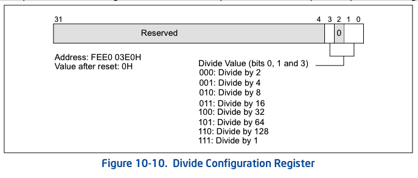
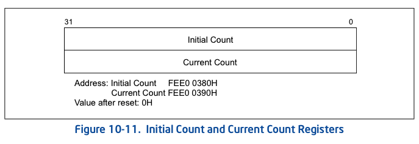
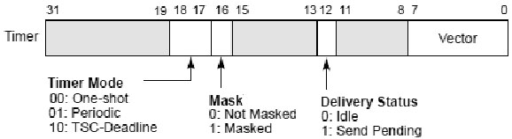
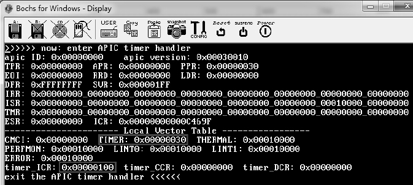

<!-- @import "[TOC]" {cmd="toc" depthFrom=1 depthTo=6 orderedList=false} -->

<!-- code_chunk_output -->

- [1. 简介](#1-简介)
- [2. APIC timer 组成](#2-apic-timer-组成)
  - [2.1. Divide configuration 寄存器](#21-divide-configuration-寄存器)
  - [2.2. Initial-count 寄存器](#22-initial-count-寄存器)
  - [2.3. Current-count 寄存器](#23-current-count-寄存器)
  - [2.4. LVT timer 寄存器](#24-lvt-timer-寄存器)
- [3. 计数模式](#3-计数模式)
  - [3.1. one-shot 和 periodic 模式](#31-one-shot-和-periodic-模式)
    - [3.1.1. one-shot 计数模式(一次性)](#311-one-shot-计数模式一次性)
    - [3.1.2. Periodic 计数模式(周期)](#312-periodic-计数模式周期)
  - [3.2. TSC-deadline 计数模式(到达 TSC 值)](#32-tsc-deadline-计数模式到达-tsc-值)
    - [3.2.1. 软件使用逻辑](#321-软件使用逻辑)
    - [3.2.2. 使用准则](#322-使用准则)
- [4. 使用 APIC Timer](#4-使用-apic-timer)
  - [4.1. 使能 APIC Timer](#41-使能-apic-timer)
  - [4.2. 初始化步骤](#42-初始化步骤)
  - [4.3. 实现](#43-实现)
  - [4.4. ASM 代码示例](#44-asm-代码示例)
  - [4.5. C 语言代码示例](#45-c-语言代码示例)
- [5. 参考](#5-参考)

<!-- /code_chunk_output -->

# 1. 简介

使用 APIC Timer 的最大好处是每个 cpu 内核都有一个定时器(避免了定时器资源的抢占问题, 你要是抢走了一个 cpu 核心, 你就肯定抢走了一个定时器), 这里的 cpu 内核是指和核心数, 把超线程技术的那个内核也算进去了. 相反的我们之前使用的 PIT(Programmable Interval Timer)就不这样, PIT 是共用的一个. 因为这样, 我们不需要考虑任何资源管理问题, 我们能够很轻松的使用它.

但是 APIC 有一个比较麻烦的是, 它的精度和 CPU 的频率有关(这里的频率指的是 CPU 的外频, 现在主流的就是 200MHz, 但是有点飘, 这个我在最后解释). 而 PIT 使用的是一个标准的频率(1193182Hz). 如果要使用 APIC Timer, 那么你必须自己知道每秒钟能触发多少个中断.

# 2. APIC timer 组成

本地 APIC 单元包含一个**32 位可编程定时器**, 可用于软件时间事件或操作. 这个计时器是通过**编程四个寄存器**来设置的

1) `LVT timer`(**LVT 计时器**)寄存器. LVTT

2) `Initial-count`(**初始计数器**)寄存器. TMICT, 读写寄存器.

3) `Current-count`(**当前计数器**)寄存器, 只读寄存器.

4) `Divide configuration`(**clock 频率配置**)寄存器.

如果 `CPUID.06H:EAX.ARAT[bit 2] = 1`, 处理器的 APIC 定时器运行在一个**恒定的速率**, 不管 `P-state` 转换, 它继续以相同的速率运行在深 C-states(run in deep C-states).

如果 `CPUID.06H:EAX.ARAT[bit 2] = 0` 或如果不支持 CPUID 06H, APIC 计时器可能会暂时停止, 而处理器处于深 c 状态或在过渡期间由增强的 Intel SpeedStep®技术造成.

## 2.1. Divide configuration 寄存器

Divide configuration 寄存器用来**配置 timer 计数的时钟频率**, 和`time-stamp counter`一样, local APIC timer 的计数器使用**固定的 clock 频率**, 但是它可以通过 Divide configuration 寄存器进行具体频率的配置, 如下所示.



**Timer 的计数频率**使用**system bus 时钟或核心水晶(core crystal)时钟频率除以上图所列出来的值**, 当配置使用除 1 时, 将使用与**TSC**(`time-stamp counter`)及`IA32_FIXED_CTR2`计数器相同的**计数频率**. 这个寄存器的初始值为 0, 即使用 system bus 频率除以 2 的计数频率.

## 2.2. Initial-count 寄存器

`initial-count` 与 `current-count`寄存器是 32 位寄存器, 在**开始计数时**, **软件**需要在**Initial\-count(初始计数)寄存器**提供一个**非 0 值**的初始计数值.



## 2.3. Current-count 寄存器

一旦**设置初始计数值**(`initial-count`寄存器), local APIC 会将**初始计数值**复制到**只读**的**current\-count(当前计数)寄存器**里.

current\-count 寄存器的值开始**减 1, 直至为 0 值**. current\-count 减为 0 时产生**timer 中断**.

## 2.4. LVT timer 寄存器

APIC timer 支持**三种计数模式**, 在 LVT timer 寄存器里设置.

LVT timer 寄存器属于 7 个 local vector table 寄存器之一.

使用 timer 前, 软件对 APIC timer 进行相关的编程设置, 如下所示.



LVT timer**只能使用 Fixed delivery 模式和 edge 触发**, 并且**必须提供一个 vector 值**.

LVT 计时器寄存器决定了当计时器计数为 0 时生成的计时器中断时传递给处理器的**向量号 vector**.

LVT 计时器寄存器中的掩码标志可以用于掩码计时器中断.

# 3. 计数模式

LVT timer 提供了三种计数模式.

1) `One-shot`(一次性)计数模式.

2) `Periodic`(定期)计数模式.

3) `TSC-deadline`(达到 TSC 值)计数模式.

## 3.1. one-shot 和 periodic 模式

可以通过定时器 LVT entry 配置定时器, 进行一次性或周期性操作.

在**一次性**和**周期模式**, 写 0 到`initial-count register`初始计数寄存器有效地停止本地 APIC 定时器.

### 3.1.1. one-shot 计数模式(一次性)

在`one-shot`模式下, 写`initial-count register`启动 Timer, `initial-count register`会被复制到`Current-Count register`, 然后`Current-Count register`开始不断减小, 直到最后降到零. 到零会产生一个定时器中断并且保持 0 值直到软件重新编程.

这种模式的优势是, 软件可以精确地控制定时器的 IRQ 的发生时间. 例如, 系统可以根据进程的优先级来设置任务切换(一些任务使用较短的 CPU 时间, 一些任务使用较长的 CPU 时间), 并且不会产生任何不必要的 IRQs(这句话我也不太清楚什么意思, 不过大约就是可以精确地控制切换进程的时间到时 IRQ 产生, 因为进程切换也耽误时间). 一些系统通过为计数器付值的方法去实现通用的高精度计时器服务. 换个例子来说就是, 有 3 个任务需要分别在 1234ns、333ns、4444ns 的时候去做, 这样的话, 就设定定时器显示 333ns, 到时中断发生时执行任务二, 同时设定定时器 901ns, 到时中断发生时执行任务一, 同时在设定定时器 441111ns, 定时后执行任务三(原文的英语的例子我是不理解为什么要写那么折腾了, 我就简单的按上面举例了).

缺点是, 一次性触发可能会**影响实时性**(因为在**设置的时候**会**耽误一些**, 导致的不确定性), 并且还需要为了避免竞争, 维护新的计数值和老的计数值.

```assembly
;  设置 LVT timer, LVTT 寄存器
       mov DWORD [APIC_BASE + LVT_TIMER], TIMER_ONE_SHOT | APIC_TIMER_VECTOR
;  写入 initial-count 值, TMICT 寄存器
       mov DWORD [APIC_BASE + TIMER_ICR], 256
```

上面的代码向**LVT timer 寄存器**写入设置的值使用了 one\-shot 模式.

**initial\-count 寄存器**被写入 256 值. 一旦写入 initial\-count 值, APIC timer 就开始计数.

### 3.1.2. Periodic 计数模式(周期)

在 perodic 模式下, 写`initial-count register`启动 Timer, 同时 Local APIC 会将`initial-count register`复制到`Current-Count register`, 然后`Current-Count register`开始不断减小, 直到最后降到零. 到零会产生一个定时器中断.

当计数达到 0 并产生计时器中断时, 将自动从`initial-count register`重新加载`Current-Count register`, 并重复计数减少, 周而复始.

如果在**减少过程中**设置了`initial-count register`, 计数将使用新的初始数值**重新启动**.

当写入新的`initial-count`值时, local APIC 将重新装入新的 initial\-count 值进行计数.

* `initial-count register`是读写寄存器;
* `Current-Count register`是只读的.

可以使用这种方法通过 Local APIC 实现定时按照**一定时间间隔**触发中断的功能. "当前计数"寄存器中的值的递减速度依赖于当前 CPU 的主频除以一个叫做"分频寄存器"("Divide Configuration Register")的值(换个思路来说就是, 多少个 tick 减少 1).

举例来说, 对于一个 2.4GHz 的 CPU 使用的 CPU 总线频率是 800MHz(大家说的外频 800MHz), "分频寄存器"("Divide Configuration Register")设置的是"除四"("divide by 4"), 并且初始计数(initial count)设置到 123456. 那么结果就是当前计数(current count)每 200M 分之 1 秒减 1, 大约 617.28us 触发一个 irq(一次中断), 也就是 1620.01Hz.

```x86asm
;  设置 LVT timer, LVTT 寄存器
       mov DWORD [APIC_BASE + LVT_TIMER], 0x00020030  ;  使用 periodic 模式
;  写入 initial-count 值, TMICT 寄存器
       mov DWORD [APIC_BASE + TIMER_ICR], 0xff
```

## 3.2. TSC-deadline 计数模式(到达 TSC 值)

TSC-deadline 模式允许软件使用 local APIC 计时器在**绝对时间**发出**中断信号**.

`CPUID.01H.ECX.TSC_Deadline[bit 24]` 表示是否支持 `TSC-Deadline`模式.

前面也有提到, local apic 定时器的操作模式由 LVT timer 寄存器决定.

当设置为 `TSC-deadline mode` 模式下, 对 `Initial Count` 的**写入**会**被忽略**, `Current Count` 永远为 0. 此时 Timer 受 `IA32_TSC_DEADLINE` MSR(地址`6E0H`, 每个逻辑处理器)控制, 为其写入一个**非零 64 位**值(目标 TSC)即可**激活 Timer**, 使得在 **TSC**(time-stamp counter, 时间戳计数器)达到该值时触发一个中断. 该中断**只会触发一次**, 触发后`IA32_TSC_DEADLINE`MSR 就**被重置为零**. 因此, 每次对`IA32_TSC_DEADLINE` MSR 的写操作最多会产生一个定时器中断.

注:

写入 LVT Timer Register 切换到 TSC-Deadline Mode 是一个 **Memory 操作**, 该操作和接下来的 WRMSR 指令间必须添加一个`MFENCE`以保证不会乱序

`IA32_TSC_DEADLINE` MSR 的**硬件复位值为 0**. 在**其他定时器模式**(LVT `bit 18 = 0`)中, `IA32_TSC_DEADLINE` MSR 读取零, 而忽略写入.

**前两种模式**下, 为**Initial Count 写入 0**即可**停止 Timer**运作, 在第三种模式下则是为`IA32_TSC_DEADLINE`MSR 写入**0**, 此外**修改模式**也会**停止 Timer 运行**. 当然, 也可以通过`LVT Timer Register`中的**Mask 屏蔽 Timer 中断**实现同样的效果.

TSC-Deadline 模式同上述两种模式有很大的区别. 触发方式发生了区别, 上述两种方式是基于**当前计数减少到 0 触发**的, 而 TSC-Deadline 模式是软件设置了一个"deadline", 然后当 CPU 的时间戳大于或等于"deadline"的时候触发一次 IRQ.

相比于`one-shot`触发模式, `TSC-deadline`模式可以得到更高的精度(因为时间戳的生成是 CPU 的时钟, 而不是 CPU 总线频率), 并且它更容易处理资源竞争(最后这句话我真不太理解).

TSC 见`15.6`.

### 3.2.1. 软件使用逻辑

软件可以使用以下算法将`TSC-deadline`计时器配置为传递单个中断:

1. 通过验证`CPUID.1: ECX.24 = 1`来检测对 TSC-deadline 模式的支持.
2. 通过用`10b`编程 LVT timer 寄存器的`bit 18:17`选择 TSC-deadline 模式.
3. 使用需要定时器中断的**目标 TSC 值**对`IA32_TSC_DEADLINE` MSR 进行编程. 这使处理器为计时器设防(This causes the processor to arm the timer).
4. 当时间戳计数器的值大于或等于 IA32_TSC_DEADLINE 的值时, 处理器将产生**定时器中断**. 然后, 它**撤消计时器**并**清除 IA32_TSC_DEADLINE MSR**. (时间戳计数器和 IA32_TSC_DEADLINE MSR 均为 64 位无符号整数. )
5. 软件可以通过重复步骤 3 重新设防计时器(re-arm the timer).

### 3.2.2. 使用准则

以下是 TSC-deadline 模式的使用准则:

* 对 IA32_TSC_DEADLINE MSR 的写入未序列化. 因此, 系统软件不应将 IA32_TSC_DEADLINE MSR 的 WRMSR 用作序列化指令. 对 IA32_TSC_DEADLINE 和其他 MSR 寄存器的读写访问将按程序顺序进行.
* 通过将 0 写入 IA32_TSC_DEADLINE MSR, 软件可以随时撤防计时器(disarm the timer).
* 如果配备了计时器(timer is armed), 则软件可以通过将新值写入 IA32_TSC_DEADLINE MSR 来更改 deadline(向前或向后).
* 如果软件取消了计时器的设防或推迟了最后期限, 则竞赛条件可能会导致发送虚假的计时器中断. 希望软件通过检查当前值来检测此类虚假中断.
* 在 xAPIC 模式下(local APIC 寄存器是内存映射), 软件必须按顺序对 LVT 条目的内存映射进行写操作, 包括启用 TSC-deadline 模式以及写 IA32_TSC_DEADLINE MSR 的任何后续 WRMSR. 通过在内存映射的写入之后和任何 WRMSR 之前执行 MFENCE 指令, 软件可以确保正确的排序. (在 x2APIC 模式下, WRMSR 指令用于写入 LVT 条目. 处理器确保该写入的顺序以及 deadline 之前的所有后续 WRMSR; 无需防护.)

```x86asm
;  测试是否支持 APIC timer TSC-deadline 模式
       mov eax, 1
       cupid
       bt ecx, 24       ;  TSC-deadline 位
       jnc no_support
;  设置 TSC-deadline 模式, 操作 LVTT 寄存器
       mov DWORD [APIC_BASE + LVT_TIMER], 0x00040030
;  写入目标 TSC 值, 操作 IA32_TSC_DEADLINE MSR 寄存器
       rdtsc        ;  读当前 TSC 值
       mov ecx, IA32_TSC_DEADLINE
       add eax, 256      ;  current_TSC + 256
       wrmsr        ;  写入目标 TSC 值
       ; ;
no_support:
       ;  ... ...
```

上面代码显示, 当处理器支持`TSC-deadline`计数模式时, 将**LVT timer 寄存器**设置为`TSC-deadline`模式, **软件**通过读取**当前的 TSC 值**, 将**目标 TSC 值**设置为**当前的 TSC 值加上 256**.

当往`IA32_TSC_DEADLINE`寄存器**写入 0**时, 将**停止 APIC timer**的运作.

>实验 18-11: 测试 APIC timer 的 one-shot 模式

在这个实验里, 简单地使用 APIC timer 中断, 在 APIC timer 中断处理程序里打印出所有 local APIC 寄存器的信息. 实验的源码在 topic18\ex18-11\protected.asm 文件里, 请读者自行阅读.



上面是在 Bochs 里的运行结果, 产生 timer 中断时在处理程序里打印出 local APIC 寄存器的相关信息: APIC timer 使用 30h 中断向量号, initial\-count 寄存器被设置为 0x00000100 值.

# 4. 使用 APIC Timer

## 4.1. 使能 APIC Timer

首先, 应该通过写 MSR 寄存器使能 Local APIC 硬件.

其次, 配置一个用于定时器的中断, 并且软件开启 APIC.

最后, 配置 APIC Timer 的中断向量以及操作模式.

具体操作方法, 参考 Inter 开发手册 Vol3A Chapter 9.

## 4.2. 初始化步骤

这里使用的方式是使用**CPU 总线频率**作为基准源, 有很多种方法能够完成这部分所讲的内容, 并且每种方法都不一样. 例如: Real Time Clock, TimeStamp Counter, PIT or even polling CMOS registers. 这里要讲的内容仍然要用到 PIT, 因为他很简单. 按照如下步骤执行:

1. 重置 APIC 到一个已知的状态
2. 使能 APIC Timer
3. 重置 APIC Timer 的计数器
4. 设置另外的一个已知时钟源
5. 获取 APIC TImer 的计数器的当前值
6. 以秒为基准校准一下
7. 设置 APIC Timer 计数器的分频
8. 设置接受 APIC Timer 中断触发

APIC Timer 可以被设置为经过若干个 tick 以后触发一次中断, 这里设置的地方叫做"分频数"(divide value). 这意味着可以通过将这一数值乘以 APIC Timer 的计数来获得当前 CPU 总线的频率. 这里的分频数可以设置最小值是 1 最大值是 128, 具体的请参考 Intel 编程手册 Vol3A Chapter9.5.4. (注, 网上有人说在 Bochs 上设置分频数为 1 不好用, 于是他设置了 16).

## 4.3. 实现

在开始前, 我们先来定义一系列常量和函数.

```cpp
apic        = the linear address where you have mapped the APIC registers

APIC_APICID = 20h
APIC_APICVER    = 30h
APIC_TASKPRIOR  = 80h
APIC_EOI    = 0B0h
APIC_LDR    = 0D0h
APIC_DFR    = 0E0h
APIC_SPURIOUS   = 0F0h
APIC_ESR    = 280h
APIC_ICRL   = 300h
APIC_ICRH   = 310h
APIC_LVT_TMR    = 320h
APIC_LVT_PERF   = 340h
APIC_LVT_LINT0  = 350h
APIC_LVT_LINT1  = 360h
APIC_LVT_ERR    = 370h
APIC_TMRINITCNT = 380h
APIC_TMRCURRCNT = 390h
APIC_TMRDIV = 3E0h
APIC_LAST   = 38Fh
APIC_DISABLE    = 10000h
APIC_SW_ENABLE  = 100h
APIC_CPUFOCUS   = 200h
APIC_NMI    = (4<<8)
TMR_PERIODIC    = 20000h
TMR_BASEDIV = (1<<20)

        ;Interrupt Service Routines
isr_dummytmr:   mov         dword [apic+APIC_EOI], 0
        iret
isr_spurious:   iret
        ;function to set a specific interrupt gate in IDT
        ;al=interrupt
        ;ebx=isr entry point
writegate:  ...
        ret
```

同样的也需要配置一些 IDT 项, 并且需要设置一个用于处理中断的中断门和处理函数. 这里是:

```cpp
interrupt 32: timer, IRQ0
interrupt 39 : spurious irq, IRQ7
```

如果有需要, 那就直接改代码就好了.

## 4.4. ASM 代码示例

提供一种 asm 的代码示例, 大家看看就好了, 汇编都差不多也就两种语法, intel 和 at&a.

```cpp
        ;you should read MSR, get APIC base and map to "apic"
        ;you should have used lidt properly

        ;set up isrs
        mov         al, 32
        mov         ebx, isr_dummytmr
        call            writegate
        mov         al, 39
        mov         ebx, isr_spurious
        call            writegate

        ;initialize LAPIC to a well known state
        mov         dword [apic+APIC_DFR], 0FFFFFFFFh
        mov         eax, dword [apic+APIC_LDR]
        and         eax, 00FFFFFFh
        or          al, 1
        mov         dword [apic+APIC_LDR], eax
        mov         dword [apic+APIC_LVT_TMR], APIC_DISABLE
        mov         dword [apic+APIC_LVT_PERF], APIC_NMI
        mov         dword [apic+APIC_LVT_LINT0], APIC_DISABLE
        mov         dword [apic+APIC_LVT_LINT1], APIC_DISABLE
        mov         dword [apic+APIC_TASKPRIOR], 0
        ; 启用 APIC
        ;okay, now we can enable APIC
        ;global enable
        mov         ecx, 1bh
        rdmsr
        bts         eax, 11
        wrmsr
        ;software enable, map spurious interrupt to dummy isr
        mov         dword [apic+APIC_SPURIOUS], 39+APIC_SW_ENABLE
        ;map APIC timer to an interrupt, and by that enable it in one-shot mode
        mov         dword [apic+APIC_LVT_TMR], 32
        ;set up divide value to 16
        mov         dword [apic+APIC_TMRDIV], 03h

        ;ebx=0xFFFFFFFF;
        xor         ebx, ebx
        dec         ebx

        ;initialize PIT Ch 2 in one-shot mode
        ;waiting 1 sec could slow down boot time considerably,
        ;so we'll wait 1/100 sec, and multiply the counted ticks
        mov         dx, 61h
        in          al, dx
        and         al, 0fdh
        or          al, 1
        out         dx, al
        mov         al, 10110010b
        out         43h, al
        ;1193180/100 Hz = 11931 = 2e9bh
        mov         al, 9bh     ;LSB
        out         42h, al
        in          al, 60h     ;short delay
        mov         al, 2eh     ;MSB
        out         42h, al
        ;reset PIT one-shot counter (start counting)
        in          al, dx
        and         al, 0feh
        out         dx, al      ;gate low
        or          al, 1
        out         dx, al      ;gate high
        ;reset APIC timer (set counter to -1)
        mov         dword [apic+APIC_TMRINITCNT], ebx
        ;now wait until PIT counter reaches zero
@@:     in          al, dx
        and         al, 20h
        jz          @b
        ;stop APIC timer
        mov         dword [apic+APIC_LVT_TMR], APIC_DISABLE
        ;now do the math...
        xor         eax, eax
        xor         ebx, ebx
        dec         eax
        ;get current counter value
        mov         ebx, dword [apic+APIC_TMRCURRCNT]
        ;it is counted down from -1, make it positive
        sub         eax, ebx
        inc         eax
        ;we used divide value different than 1, so now we have to multiply the result by 16
        shl         eax, 4      ;*16
        xor         edx, edx
        ;moreover, PIT did not wait a whole sec, only a fraction, so multiply by that too
        mov         ebx, 100    ;*PITHz
        mul         ebx
    ;-----edx:eax now holds the CPU bus frequency-----
        ;now calculate timer counter value of your choice
        ;this means that tasks will be preempted 1000 times in a second. 100 is popular too.
        mov         ebx, 1000
        xor         edx, edx
        div         ebx
        ;again, we did not use divide value of 1
        shr         eax, 4      ;/16
        ;sanity check, min 16
        cmp         eax, 010h
        jae         @f
        mov         eax, 010h
        ;now eax holds appropriate number of ticks, use it as APIC timer counter initializer
@@:     mov         dword [apic+APIC_TMRINITCNT], eax
        ;finally re-enable timer in periodic mode
        mov         dword [apic+APIC_LVT_TMR], 32 or TMR_PERIODIC
        ;setting divide value register again not needed by the manuals
        ;although I have found buggy hardware that required it
        mov         dword [apic+APIC_TMRDIV], 03h
```

## 4.5. C 语言代码示例

```cpp
void apic_timer_init(uint32 quantum){
    uint32 tmp, cpubusfreq;

    //set up isrs
    writegate(32,isr_dummytmr);
    writegate(39,isr_spurious);

    //initialize LAPIC to a well known state
    (uint32*)(apic+APIC_DFR)=0xFFFFFFFF;
    (uint32*)(apic+APIC_LDR)=((uint32*)(apic+APIC_LDR)&0x00FFFFFF)|1);
    (uint32*)(apic+APIC_LVT_TMR)=APIC_DISABLE;
    (uint32*)(apic+APIC_LVT_PERF)=APIC_NMI;
    (uint32*)(apic+APIC_LVT_LINT0)=APIC_DISABLE;
    (uint32*)(apic+APIC_LVT_LINT1)=APIC_DISABLE;
    (uint32*)(apic+APIC_TASKPRIOR)=0;

    //okay, now we can enable APIC
    //global enable
    // 启用 APIC
    cpuSetAPICBase(cpuGetAPICBase());
    //software enable, map spurious interrupt to dummy isr
    (uint32*)(apic+APIC_SPURIOUS)=39|APIV_SW_ENABLE;
    //map APIC timer to an interrupt, and by that enable it in one-shot mode
    (uint32*)(apic+APIC_LVT_TMR)=32;
    //set up divide value to 16
    (uint32*)(apic+APIC_TMRDIV)=0x03;

    //initialize PIT Ch 2 in one-shot mode
    //waiting 1 sec could slow down boot time considerably,
    //so we'll wait 1/100 sec, and multiply the counted ticks
    outb(0x61,inb(0x61)&0xFD)|1);
    outb(0x43,0xB2);
    //1193180/100 Hz = 11931 = 2e9bh
    outb(0x42,0x9B);    //LSB
    in(0x60);   //short delay
    outb(0x42,0x2E);    //MSB

    //reset PIT one-shot counter (start counting)
    (uint8)tmp=inb(0x61)&0xFE;
    outb(0x61,(uint8)tmp);      //gate low
    outb(0x61,(uint8)tmp|1);        //gate high
    //reset APIC timer (set counter to -1)
    (uint32*)(apic+APIC_TMRINITCNT)=0xFFFFFFFF;

    //now wait until PIT counter reaches zero
    while(!(inb(0x61)&0x20));

    //stop APIC timer
    (uint32*)(apic+APIC_LVT_TMR)=APIC_DISABLE;

    //now do the math...
    cpubusfreq=((0xFFFFFFFF-(uint32*)(apic+APIC_TMRINITCNT))+1)*16*100;
    tmp=cpubusfreq/quantum/16;

    //sanity check, now tmp holds appropriate number of ticks, use it as APIC timer counter initializer
    (uint32*)(apic+APIC_TMRINITCNT)=(tmp<16?16:tmp);
    //finally re-enable timer in periodic mode
    (uint32*)(apic+APIC_LVT_TMR)=32|TMR_PERIODIC;
    //setting divide value register again not needed by the manuals
    //although I have found buggy hardware that required it
    (uint32*)(apic+APIC_TMRDIV)=0x03;
}
```

在最开始的时候我说过 CPU 总线频率不固定的这件事情, 主要是在实测过程中会发生一些偏差, 应该不算是漂移. 大约在 199.90~200.10MHz 之间飘. 这点同硬件的哥们研究过, 后来得出的结果是一个叫做"自动跳频"技术造成的, 好像可以关了这个就好了, 具体我也没试验. 只是希望别给大家带来不必要的麻烦.

# 5. 参考

https://blog.csdn.net/borisjineman/article/details/51050094