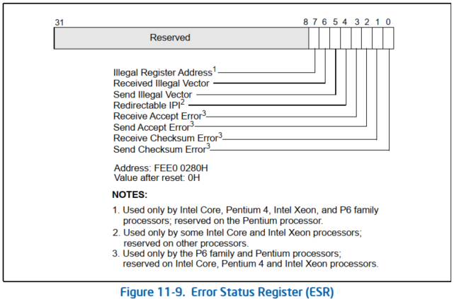
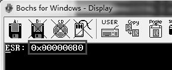
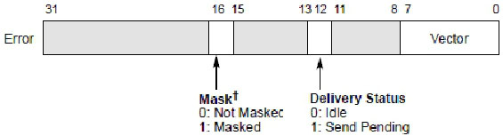
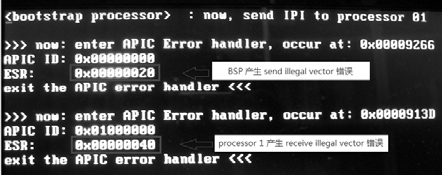

<!-- @import "[TOC]" {cmd="toc" depthFrom=1 depthTo=6 orderedList=false} -->

<!-- code_chunk_output -->

- [清 ESR](#清-esr)
- [LVT error 寄存器](#lvt-error-寄存器)
- [发送 IPI 消息的错误](#发送-ipi-消息的错误)

<!-- /code_chunk_output -->

当在 **local APIC 处理中断时(！！！**)检测到**错误的发生(！！！**), local APIC 的 **ESR**(`error status register`, **错误状态寄存器**)将记录发生的错误条件.



ESR 共可记录**8 个发生的错误**, 图中的 Receive Accept Error(bit 3)、Send Accept Error(bit 2)、Receive Checksum Error(bit 1), 以及 Send Checksum Error(bit 0)这些状态位仅使用于 P6 和 Pentium 处理器上, 这里我们忽略这些状态位.

1) Redirectable IPI(bit 4): 当 local APIC 发送一个**lowest\-priority delivery 模式的 IPI 消息**时, 如果处理器的 local APIC 是**不支持该类型的 delivery 模式**, 则将发生错误记录在 ESR 寄存器的 bit 4 位上.

2) Send Illegal Vector(bit 5): 当 local APIC 发送一个**IPI 消息**时, 使用了**无效的 vector 值**(如前面的 18.9.2 节所描述的无效 vector), ESR 的 bit 5 将被置位记录这个错误.

3) Recevie Illegal Vector(bit 6): 当 local APIC 接收到一个**IPI 消息**, 或者**从 LVT 产生的本地中断源**里, 检测到使用了**无效的 vector 值**时, ESR 的 bit 6 被置位记录这个错误. 值得注意的是, 这个错误发生后 IPI 和本地中断请求没有被提交到处理器, 因此 IRR(interrupt request register)也没有置位指示有中断请求发生.

4) Illegal Register Address(bit 7): 当软件尝试访问保留的 local APIC 寄存器地址(即**不支持的 local APIC 寄存器**)时, 产生错误记录在 ESR 的 bit 7 位.

Intel 明确提到, ESR 是可读/写的寄存器, 在读 ESR 值前, 应先写 ESR, 如下面的 read\_esr()函数所示.

代码清单 18-32(lib\apic.asm):
```x86asm
; -----------------------------------
;  read_esr(): 读 ESR
; -----------------------------------
read_esr:
       mov DWORD [APIC_BASE + ESR], 0  ;  写入 ESR (任何值)
       mov eax, [APIC_BASE + ESR]
       ret
```

往 ESR 写入一个值, 将使得 local APIC 更新 ESR 的状态信息, 这个状态是 ESR 最新的状态. 这个写入的值不影响 ESR 的读出值.

```x86asm
mov DWORD [APIC_BASE + 0], 0   ;  访问一个保留的 local APIC 地址空间
call read_esr       ;  读 ESR 值
```

在上面的代码里, 访问[APIC_BASE+0]这个 local APIC 地址空间将产生 Illegal Register Address 错误, ESR 的 bit 7 将被置位.



ESR 读出来的值是 0x00000080.

# 清 ESR

**向 ESR 写入一个任意值**, 将清 ESR 的所有错误状态(ESR 清为 0). 这里其实是进行 back\-to\-back 写入操作, 如果需要获得写入后的 ESR 值, 实际上等于写 2 次 ESR(第 2 次写入是为了读取 ESR). 这与读 ESR 前写入值的情形不一样(这种情况是写入 1 次, 读取 1 次).

下面的代码将清 ESR.

```x86asm
mov DWORD [APIC_BASE + ESR], 1  ;  写入 ESR(清 ESR)
mov DWORD [APIC_BASE + ESR], 1  ;  再次写入 ESR(为了读取 ESR)
mov eax, [APIC_BASE + ESR]    ;  读 ESR(写入 ESR 后的值)
```

上面代码的后两条指令可以使用前面的 read_esr()函数来代替实现读取 ESR. 第 2 次的写入操作是为了对 ESR 进行读取.

# LVT error 寄存器

**软件**设置 LVT error 寄存器提供相应的 local APIC**错误处理机制**. 当 LVT timer 寄存器被设置为提供 non\-masked 的 error 中断处理器时, local APIC 检测错误将引起 error 中断的产生, 并设置 ESR 寄存器的相关位.

而在 masked(屏蔽)的 error 中断里, APIC error 中断处理程序不会得到调用, local APIC 在 ESR 里置相应的错误状态.



在上图的 LVT error 寄存器里, 软件需提供一个 error 中断处理程序的 vector 值, 而 bit 16 位是 mask 位, 为 1 时设置 masked 的 error 中断. LVT error 寄存器设置的 error 中断只能使用 Fixed delivery 模式及 edge 触发模式.

```x86asm
;   开启 APIC
       call enable_xapic
;   设置 APIC error handler
       mov esi, APIC_ERROR_VECTOR
       mov edi, apic_error_handler
       call set_interrupt_handler
;  设置 LVT error 寄存器, 使用 non-masked 错误处理
       mov DWORD [APIC_BASE + LVT_ERROR], APIC_ERROR_VECTOR
; ;  产生错误
       mov DWORD [APIC_BASE + 0], 0   ;  产生 Illegal Register Address 错误
       jmp $
```

在上面的代码里设置了 LVT error 寄存器, 使用了 non-masked(非屏蔽)的 error 中断处理. 接下来对[APIC_BASE+0]寄存器地址进行访问将会产生无效的寄存器地址错误.

# 发送 IPI 消息的错误

在处理器发送 IPI 消息使用无效的 vector 时, 将产生两个 APIC error.

1) 发送方产生 send illegal vector 错误.

2) 接收方产生 receive illegal vector 错误.

当 APIC error 中断是 `non-masked` 时, 将在两个处理器间产生 APIC error 中断处理程序的调用.

>实验 18-12: 测试 IPI 消息中的 APIC error 中断

在这个实验里, 完整的源代码在 topic18\ex18-12\protected.asm 文件里. 我们将使用下面的代码测试发送 IPI 消息时产生的 error 中断.

```x86asm
mov DWORD [APIC_BASE + ICR1], 02000000h   ;  给 processor 1 发送 IPI
mov DWORD [APIC_BASE + ICR0], LOGICAL_ID | 0 ;  no shorthand, logical mode, fixed
```

代码中使用了 logical 目标模式, 给 processor #1 发送 IPI 消息, 这个 IPI 消息提供的 vector 为 0, 这是一个无效的 vector. 下面是在 Core i5 处理器上的运行结果.



在这个结果里, 我们看到 APIC error 中断 handler 被调用了 2 次: BSP 发送了一条 IPI 消息到 processor 01(使用了 logical 目标模式), 产生了 error 中断(APIC ID 为 00000000h). 处理器 01(它的 APIC ID 为 00000001h)也产生了 error 中断.

注意: 这两个产生 error 中断的原因是不同的, 一个是 send illegal vector 错误, 一个是 recevie illegal vector 错误(它们的 ESR 值不同).