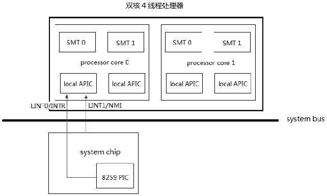
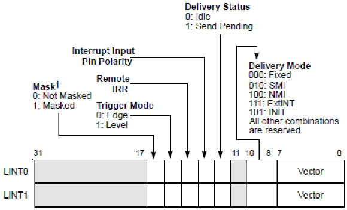
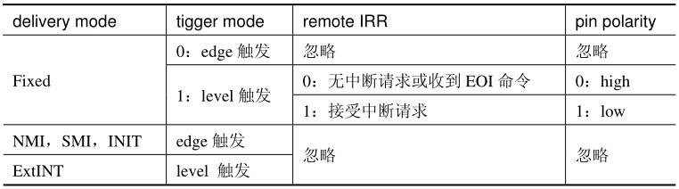
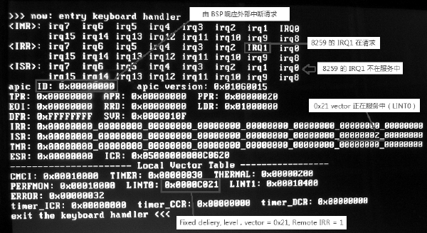
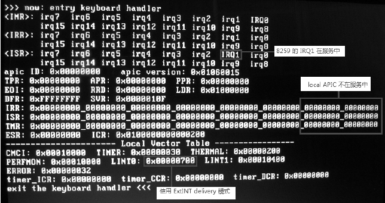
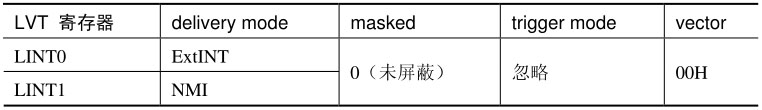
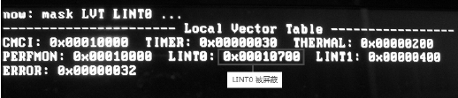
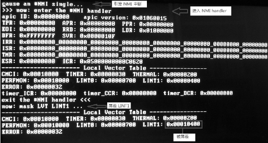

<!-- @import "[TOC]" {cmd="toc" depthFrom=1 depthTo=6 orderedList=false} -->

<!-- code_chunk_output -->

- [LINT0 与 LINT1 寄存器](#lint0-与-lint1-寄存器)
  - [使用 Fixed 模式时](#使用-fixed-模式时)
  - [初始化以及 BIOS 设置](#初始化以及-bios-设置)
- [从 LINT0 屏蔽外部中断请求](#从-lint0-屏蔽外部中断请求)
- [从 LINT1 屏蔽 NMI](#从-lint1-屏蔽-nmi)
  - [通过 NMI_EN 寄存器来屏蔽 NMI](#通过-nmi_en-寄存器来屏蔽-nmi)
  - [通过 LINT1 来屏蔽 NMI](#通过-lint1-来屏蔽-nmi)

<!-- /code_chunk_output -->

Local APIC 接收的**外部中断源**其中一部分来自于 **LINT0(Local Interrupt 0**)和 **LINT1(Local Interrupt 1**)连接的**外部硬件**, 如下所示.



在上图里, Intel 的双核 4 线程处理器上 **BSP(APIC ID 为 00H**)的

- LVT **LINT0 连接到外部 system chip(系统芯片**)里的**8259 类的中断控制器 INTR 接口**.

- LVT **LINT1 接连到 system chip 的 NMI 口**.

而实际中上面 4 个 logical processor 里剩余的**3 个 logical processor(application processor)的 LINT0 与 LINT1 被忽略**, 它们**接收不到来自外部 8259 中断控制器和 NMI 接口的中断请求**, 只能**接收来自 I/O APIC 的中断消息**.

因此, **8259 中断控制器**并**不适合在 MP 环境下使用, 推荐使用 I/O APIC 在 MP 环境工作(！！！**).

当 **local APIC 被 disable！！！** 时, **LINT0** 被直接作为处理器的 **INTR pin 使用**, **LINT1** 被直接作为处理器的 **NMI pin 使用**.

# LINT0 与 LINT1 寄存器

LVT 中的 **LINT0 与 LINT1 寄存器**是**最为复杂的寄存器**, 比起其他的 LVT 寄存器, 额外多了几个域: **Interrupt Input Pin Polarity** 位, **Remote IRR** 位, 以及 **Tigger Mode** 位, 如下所示.



* **Fixed delivery**: **Trigger Mode(触发模式**)的设置只能使用在 **Fixed delivery** 模式下. 置 0 时使用 edge 触发, 置 1 时使用 level 触发.

* 在 NMI、SMI 和 INIT 的 delivery 模式下, **LINT0** 和 **LINT1** 固定使用 **edge** 触发模式;

* 在 ExtINT delivery 模式下固定使用 **level** 触发模式, 如下表所示.



Remote IRR 位用来指示在 Fixed delivery 的 level 触发模式下中断服务例程是否正在执行(置位)中, 当处理器收到 EOI 命令时 Remote IRR 位被清 0.

典型地, **LINT0** 与 **LINT1** 分别使用 **ExtINT** 和 **NMI** delivery 模式.

## 使用 Fixed 模式时

当使用 Fixed 模式时, 我们需要提供中断服务例程的 **vector**, 如下面代码所示.

```x86asm
mov eax, 0x8000 | KEYBOARD_VECTOR  ;  Fixed 模式, level 触发, vector=0x21
mov [APIC_BASE + LVT_LINT0], eax  ;  设置 LVT LINT0 寄存器
```

在代码里, 我们使用了 Fixed 交付模式及 level 触发, 并将整个 LINT0 的 vector 设置为 **IRQ1**(keyboard 中断)的中断请求 vector 值. 因此在这种情况下, **所有的 8259 中断控制器**传过的中断请求使用**同一个中断处理程序**进行处理(例如: IRQ0 的 timer 中断和 IRQ1 的 keyboard 中断).

下面, 我们看看在真实机器上的执行结果.



这个结果里面按下一个键由 BSP 处理器响应中断请求, 进入了 Keyboard 中断处理程序, 出现了下面几个现象.

1) 当 **LINT0** 使用 **Fixed** delivery 模式时, local APIC 将响应的是由 LINT0 引发的中断请求, 而不是由 8259 中断控制器提交的中断请求. 这时候 8259 中断控制器的 IRR IRQ1 在请求中, ISR IRQ1 并没有得到响应(IRQ1 不在服务中).



我们对比一下上面使用 ExtINT delivery 模式下的运行结果, 这个结果反映了当使用 ExtINT 交付模式时, 处理器使用 8259 中断控制器提交的中断 vector, 结果表明 8259 的 IRQ1 正处于服务中(ISR 的 IRQ1 被置位), 而 local APIC 并没有在服务中.

2) local APIC 的 ISR 在服务中(vector 为 0x21).

3) LINT0 的值为 0000C021H, 表示使用 Fixed 交付模式及 level 触发, 并且 Remote IRR 此时被置位, 说明 8259 的中断通过 LINT0 正在服务中.

通过上面的实验, 我们清楚了 Fixed delivery 与 ExtINT delivery 的区别及意义.

## 初始化以及 BIOS 设置

在处理器 INIT 或 Reset 后, local APIC 所有的 LVT 寄存器都被 **masked**(屏蔽), 而在 **BIOS** 运行期间会对 LINT0 和 LINT1 进行设置, 因此在 OS 启动之前, LINT0 和 LINT1 已经可以正常工作了.

典型地, BIOS 对 LINT0 和 LINT1 的设置如下表所示.



如前面所述: LINT0 被用做连接到外部的 **8259** 类中断控制器, 因此使用了 **ExtINT delivery** 模式, 而 LINT1 被用做接收外部硬件的 NMI 信号, 因此使用了 **NMI delivery** 模式. 它们的 vector 都必须使用 00H.

经过 BIOS 的设置后, LVT LINT0 的值为 00000700H(ExtINT 交付模式), 而 LINT1 的值为 00000400H(NMI 交付模式).

由于 mask 位被清 0, 表示此时已经可以接收外部硬件的中断请求.

# 从 LINT0 屏蔽外部中断请求

由于 LINT0 连接到外部的 8259 中断控制器, 于是当 local APIC 是处于 enable 状态时, 可以通过 LINT0 来达到屏蔽来自 8259 中断控制器的外部中断请求.

因此, 屏蔽来自 8259 中断控制器的硬件中断请求的方法可以归纳为下面几条.

1) 对 `eflage.IF` 标志位进行清位, 使用 CLI 指令或 POPF 指令置 eflags.IF 为 0.

2) 使用 **8259 中断控制器**的 **IMR**(Interrupt Mask Register, 中断屏蔽寄存器)进行相应的中断屏蔽.

3) 使用 local APIC 的 LVT LINT0 寄存器进行屏蔽.

上面几种屏蔽外部硬件中断是有很大区别的:

* 对 **IF** 标志位进行清位操作将屏蔽**所有的可屏蔽中断**, 包括 local APIC 和来自外部中断控制器的中断请求.

* 而使用 8259 中断控制器的 IMR 的屏蔽方式, 将在 8259 中断控制器端来屏蔽**某个**或**全部**仅来自于 8259 中断控制器的中断请求.

* 使用 local APIC 的 LINT0 寄存器的屏蔽方式, 将在 local APIC 端实现屏蔽功能. 而 **8259** 中断控制器**已经**将中断请求发送到 local APIC 的 **LINT0** 里.

>实验 18-13: 通过 LINT0 屏蔽来自 8259 中断控制器的中断请求

在这里作为一个测试实验, 我们通过对 **LINT0 寄存器**的 **bit 16** 置位从而屏蔽连接的外部 8259 中断控制器的中断请求. 下面是测试的主体代码, 完整代码在 `topic18\ex18-13\protected.asm` 文件中.

代码清单 18-33(topic18\ex18-13\protected.asm):

```x86asm
;  开启 8259 的 IRQ1 键盘中断请求许可
call enable_keyboard
mov esi, msg0
call puts
;  屏蔽 LINT 0
mov eax, [APIC_BASE + LVT_LINT0]  ;  读 LINT0 寄存器
bts eax, 16        ;  mask 位置位
mov [APIC_BASE + LVT_LINT0], eax  ;  写 LINT0 寄存器
call dump_lvt       ;  打印 LVT
sti          ;  打开中断许可
```

**这个实验**使用 **IRQ1** 的键盘中断来测试屏蔽 LINT0 寄存器后的效果, 下面是在 Core i5 处理器的笔记本式计算机上的运行结果.



在这个实验里, 8259 中断控制器和 IF 中断标志都是允许中断产生的. 而**仅**在 LINT0 被屏蔽的情况下, 按下**任意键**来自 8259 中断控制器的 IRQ1 键盘中断请求将**得不到处理器的响应**.

# 从 LINT1 屏蔽 NMI

由于 LINT1 直接连接到外部的 NMI(不可屏蔽)请求, 作为处理器的 NMI pin 使用. 同样, 可以通过屏蔽 LINT1 的方式对 NMI 进行屏蔽.

因此, 要屏蔽 NMI 可以使用下面的方法.

1) 可以通过芯片组(Intel 的 PCH 芯片, 或者说南桥芯片)LPC 桥中的 NMI_EN 寄存器(I/O 端口地址为 70H)的设置来关闭 NMI.

2) 通过 local APIC 的 LINT1 寄存器来屏蔽 NMI.

## 通过 NMI_EN 寄存器来屏蔽 NMI

在 Intel 的 PCH(Platform Controller Hub)芯片组文档里显示, NMI_EN 寄存器的

I/O 端口地址为 70H, 这个 I/O 地址同时也是 RTC(Real Time Clock)index 寄存器.

下面的代码清单实现在 inc\CPU.inc 文件里, 是关闭 NMI 的宏.

代码清单 18-34(inc\CPU.inc):

```86asm
; ------------------------------------------------
;  macro: NMI_DISABLE 关闭 NMI 请求
;  description:
;    设置 NMI_EN 寄存器的 bit 7 为 1
; ------------------------------------------------
%macro NMI_DISABLE 0
       in al, NMI_EN_PORT     ;  port 0x70
       or al, 0x80       ;  disable all NMI source
       out NMI_EN_PORT, al
%endmacro
```

在 NMI\_DISABLE 宏里通过对 I/O 端口 70H 的 bit 7 进行置位而关闭所有的 NMI 请求源.

## 通过 LINT1 来屏蔽 NMI

通过 local APIC 的 LINT1 寄存器 bit 16 位来屏蔽 LINT1, 从而达到屏蔽 NMI, 代码如下所示.

```x86asm
mov eax, [APIC_BASE + LVT_LINT1]    ;  读 LINT1 寄存器
bts eax, 16          ;  masked
mov [APIC_BASE + LVT_LINT1], eax    ;  写 LINT1 寄存器
```

对 LINT1 屏蔽后, 所有来自外部的 NMI 请求将得不到处理器的响应.

>实验 18-14: 通过 LINT1 屏蔽来自外部的 NMI 请求

同样, 这里作为一个测试实验, 实验的源代码在 topic18\ex18-14\protected.asm 文件里, 下面是 protcted.asm 的部分代码.

代码清单 18-35(topic18\ex18-14\protected.asm):

```x86asm
NMI_ENABLE       ;  允许产生外部 NMI
mov esi, msg0
call puts       ;  打印信息
DO_NMI        ;  产生 NMI, 第 1 次调用 NMI handler
mov esi, msg1
call puts
;  屏蔽 LINT1
mov eax, [APIC_BASE + LVT_LINT1]
bts eax, 16       ;  masked
mov [APIC_BASE + LVT_LINT1], eax
call dump_lvt
call println
DO_NMI        ;  再次产生 #NMI 请求, 将被屏蔽
jmp $
```
在这个代码里先开启 NMI 许可(目的是测试 LINT1 屏蔽后的效果), 关键的地方是使用 DO\_NMI 宏来引发 NMI 的产生(这个宏实现在 inc\CPU.inc 文件里), 从而调用 NMI handler.

接下来屏蔽 LINT1 后, 再使用 DO_NMI 来试图再次产生 NMI, 但这次的 NMI 将被屏蔽掉.

代码清单 18-36(topic18\ex18-14\protected.asm):

```x86asm
; -----------------------------------------
;  #NMI handler
; ----------------------------------------
nmi_handler:
       jmp do_nmi_handler
nmi_msg0 db '>>> now: enter the #NMI handler', 10, 0
nmi_msg1 db 'exit the #NMI handler <<<', 10, 0
do_nmi_handler:
       mov esi, nmi_msg0
       call puts
       call dump_apic     ;  打印 local APIC 寄存器信息
       CLEAR_NMI      ;  清 NMI 状态
       mov esi, nmi_msg1
       call puts
       iret
```
在这个 NMI handler 里只是简单地打印所有 local APIC 寄存器的信息并清 NMI 状态, 下面是在笔者的 Core i5 处理器笔记本式计算机上的运行结果.



在这个结果里, NMI handler 只被调用了一次, 就在屏蔽 LINT1 之前. 当屏蔽 LINT1 后, 再次使用 DO\_NMI 宏来引发 NMI, 这个 NMI 被屏蔽, NMI handler 没有被调用.

在这个实验里, 我们看到已经成功通过 LINT1 来屏蔽外部的 NMI 请求.