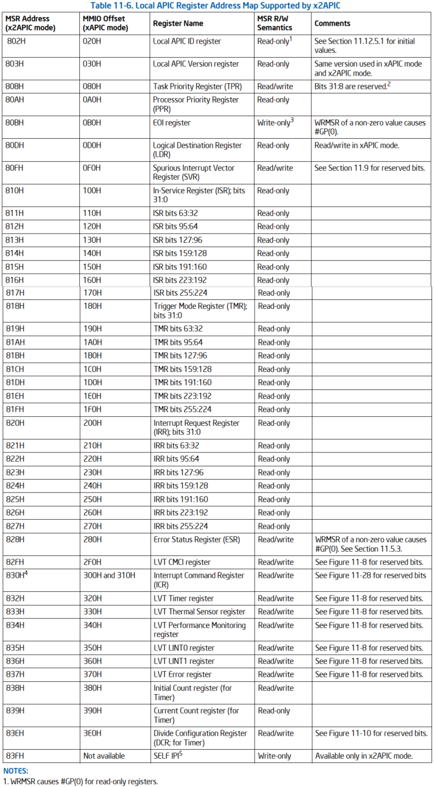
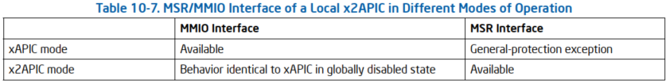
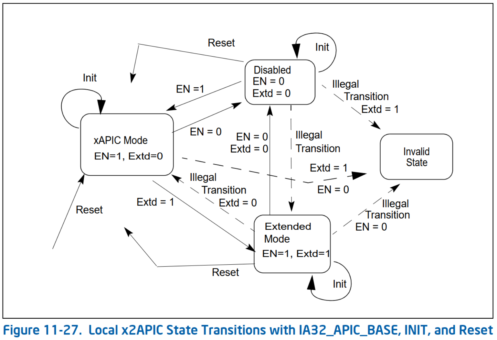

# 概述

x2APIC 是进一步扩展的版本, 并向下兼容 xAPIC, 新增了一组 MSR 寄存器来代替内存映射的寄存器.

在 x2APIC 中处理器的 ID 地址被扩展为 32 位, 后面我们将讨论到 x2APIC ID.

1) 保留与 xAPIC 架构兼容的所有关键元素.

* 交付模式

* 中断处理的优先级

* 中断源

* 中断目标类型

2) 提供扩展来扩展逻辑目标模式和物理目标模式的处理器寻址能力

3) 添加新功能以增强中断传递 (interrupt delivery) 的性能

4) 降低基于链接的平台架构上逻辑目标模式中断传递的复杂性.

5) 使用 MSR 编程接口在 x2APIC 模式下访问 APIC 寄存器, 而不是内存映射接口. 在 xAPIC 模式下运行时仅仅支持内存映射接口.

# 检测并开启 x2APIC 模式

## 访问 APIC 寄存器

## 寄存器地址空间

1) WRMSR 导致 #GP(0) 只读寄存器.

2) WRMSR 会导致尝试将 读/写 寄存器中的保留位设置为 1(包括每个寄存器的 `63:32` 位)时出现 `#GP(O)`

3) RDMSR 会导致只写寄存器出现 #GP(O).

4) MSR 831H 是保留的; 读/写 操作会导致一般保护异常. 在 MMIO 偏移位 310H 的 APIC 寄存器的内容可以在 x2APIC 模式下通过地址 830H 的 MSR 访问.

5) 仅在 x2APIC 模式下支持 SELF IPI 寄存器.

# x2APIC 寄存器可用性

只有当本地 APIC 已切换到 x2APIC 模式(如第 10.12.1 节中所述)时, 才能通过 MSR 接口访问本地 APIC 寄存器. 当本地 APIC 未处于 x2APIC 模式时, 通过 RDMSR 或 WRMSR 访问 MSR 地址范围 0800H 到 0BFFH 中的任何 APIC 寄存器会导致常规保护异常. 在 x2APIC 模式下, 内存映射接口不可用, 对 MMIO 接口的任何访问都将类似于处于全局禁用状态的传统 xAPIC 的行为. 表10-7提供了传统和扩展模式以及传统和寄存器接口之间的交互.

# x2APIC 模式下的 MSR 访问

为了允许在 x2APIC 模式下高效访问 APIC 寄存器, 在写入 APIC 寄存器时, WRMSR 的序列化语义会放宽. 因此, 系统软件不应使用 "WRMSR to APIC registers in x2APIC mode" 作为序列化指令. 对 APIC 寄存器的读写访问将按程序顺序进行. 一个APIC 寄存器的 WRMSR 可能会在前面的所有存储都全局可见之前完成;软件可以通过在 WRMSR 之前插入序列化指令、SFENCE 或 MFENCE 来防止这种情况.

RDMSR 指令未序列化, 在 x2APIC 模式下读取 APIC 寄存器时, 此行为保持不变. 使用 RDMSR 指令访问 APIC 寄存器的系统软件不应期望序列化行为. (注意: 基于 MMIO 的 xAPIC 接口由系统软件映射为未缓存的区域. 因此, 对 xAPIC-MMIO 接口的读/写在 xAPIC 模式下具有序列化语义.

# MSR 和 x2APIC 寄存器在 VM-exit 的控制

VMX 体系结构允许 VMM 使用 VMX 过渡 MSR 区域指定要在 VMX 过渡上加载或存储的 MSR 列表(请参阅VM-exit MSR-store 地址字段、VM-exit MSR-load 地址字段和 VM-entry Intel® 64 和 IA-32 架构软件开发人员手册第 3C 卷中的 MSR-load 地址字段).

X2APIC MSR 不能在 VMX 转换上加载和存储. 如果 VMM 已指定转换应访问从 0000_0800H 到 0000_08FFH 的地址范围(用于访问 X2APIC 寄存器的范围)中的任何 MSR, 则 VMX 转换将失败. 具体而言, 如果任何 VMX 转换 MSR 区域中的 128 位条目的 31: 0(表示为 ENTRY_LOW_DW)满足表达式: "ENTRY_LOW_DW& FFFFF800H = 00000800H". 此类故障会导致关联的 VM 条目失败(通过重新加载主机状态), 并导致关联的 VM 退出导致 VMX 中止.

# x2APIC 状态转换

reset 以后都会回到 xAPIC

接收到 INIT 状态不变
