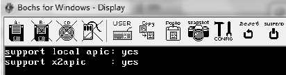
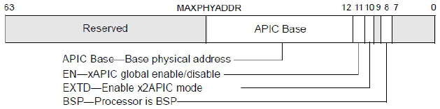
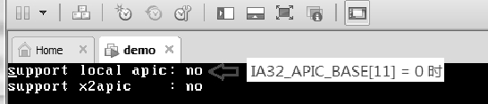
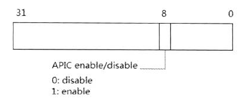
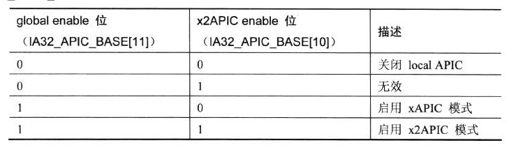
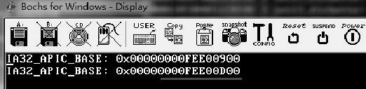
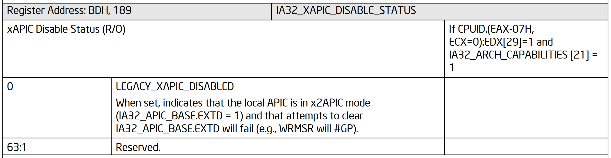

<!-- @import "[TOC]" {cmd="toc" depthFrom=1 depthTo=6 orderedList=false} -->

<!-- code_chunk_output -->

- [1. 检测 local APIC 版本](#1-检测-local-apic-版本)
  - [1.1. 检测是否支持 x2APIC](#11-检测是否支持-x2apic)
- [2. 开启和关闭 local APIC](#2-开启和关闭-local-apic)
  - [2.1. global enable/disable APIC](#21-global-enabledisable-apic)
  - [2.2. software enable/disable APIC](#22-software-enabledisable-apic)
  - [2.3. 开启 x2APIC 模式](#23-开启-x2apic-模式)
- [3. x2apic 状态转换](#3-x2apic-状态转换)
- [4. 强制 x2apic](#4-强制-x2apic)

<!-- /code_chunk_output -->

local APIC 的**核心功能**由**一组可编程的 APIC 寄存器**实现, 在**使用 local APIC 之前软件应该检测是否支持 local APIC**.

# 1. 检测 local APIC 版本

注: cpuid 指令用于 Intel IA32 架构下获取 CPU 信息, 详见其他内容

从**P6 系列**处理器开始, 可以使用**CPUID 指令**检测芯片上 local APIC 的存在或不支持.

**软件**首先需要检测**是否支持 APIC on Chip 上的 local APIC**. 使用 `CPUID.01H:EDX[9]` 位来检测, `EDX[9]=1` 时支持 local APIC.

在 P6 和 Pentium 处理器后使用的将是 APIC 版本, 从 Pentium 4 开始**默认使用的是 xAPIC 版本**.

代码清单 18-1(lib\apic.asm):

```x86asm
; -----------------------------------------------------------
;  support_apic(): 检测是否支持 APIC on Chip 的 local APIC
; ----------------------------------------------------
support_apic:
      mov eax, 1
      cpuid
      bt edx, 9    ;  APIC bit
      setc al
      movzx eax, al
      ret
```

上面这段代码是个示例. **返回 1 值**时, 在 pentium4 后的处理器是支持**xAPIC 版本**.

上面只是检测**是否支持 Local APIC**, 下面是检测**是否支持 x2APIC 版本**的

## 1.1. 检测是否支持 x2APIC

使用 `CPUID.01H:ECX[21]` 位来检测**是否支持 x2APIC**, 如以下代码所示.

代码清单 18-2(lib\apic.asm):

```x86asm
; --------------------------------------------
;  support_x2apic(): 检则是否支持 x2apic
; --------------------------------------------
support_x2apic:
      mov eax, 1
      cpuid
      bt ecx, 21
      setc al     ;  x2APIC bit
      movzx eax, al
      ret
```

support_x2apic()函数返回 1 时支持 x2APIC 体系.

>实验 18-1: 检测是否支持 local APIC 与 x2APIC

下面作为实验 18-1 我们可以检测一下我们的处理器是否支持 local APIC 和 x2APIC, 实验代码很简单, 只是使用上面的 `support_apic()` 和 `support_x2apic()` 函数来检测.

完整的源代码在 `topic18\ex18-1\proected.asm` 文件里.



上面是 Bochs 里的运行结果, 笔者开启了 **Bochs 的 x2APIC 选项**, 在笔者的移动 Core i5 处理器上并不支持 x2APIC, 在 VMware 上运行 x2APIC 也是不支持的.

# 2. 开启和关闭 local APIC

可以使用**两种方式开启和关闭 local APIC**.

1) global enable/disable APIC(在 **global 层面**上开启和关闭 local APIC).

2) software enable/disable APIC(**软件临时**开启和关闭 local APIC).

## 2.1. global enable/disable APIC

软件可以使用 **IA32_APIC_BASE 寄存器**来**开启和关闭 local APIC**, 它的结构如下.



上图中的 **IA32_APIC_BASE 寄存器**是在**支持 x2APIC 的体系**下, 在**不支持 x2APIC** 的情况下 **bit 10 位是保留位**. **IA32_APIC_BASE 寄存器**还可以**设置 APIC 寄存器的基地址**. 这个地址值的**宽度依赖于 MAXPHYADDR**值.

**bit 11 位是 APIC enable 位**, 当 `EN = 0` 时**关闭 APIC**, 在这个情况下**等于处理器内没有 APIC on Chip 的 APIC**, 因此这个位将**影响到 CPUID.01H:EDX[9] 标志位(！！！**)的结果.

代码清单 18-3(lib\apic.asm):

```x86asm
; ------------------------------
;  clear_apic(): 清掉 local apic
; ------------------------------
clear_apic:
      mov ecx, IA32_APIC_BASE
      rdmsr
      btr eax, 11       ;  clear APIC enable flag
      wrmsr
      ret
```

上面的代码用于**清 IA32_APIC_BASE 寄存器的 APIC enable 位(这里通过了 MSR 寄存器**), 我们可以测试一下.



当**清掉** `IA32_APIC_BASE[11]` 位时, 使用 support_apic()函数返回的结果是 0, **不支持 APIC 功能**.

**在 Pentium 和 P6 处理器的 APIC 版本**里, 使用**IA32_APIC_BASE 寄存器的 enable 位来关闭 APIC**, 要**重新打开 APIC 必须经过 reset 重启**. 在**xAPIC 版本**里(使用 system bus 通信的 Pentium 4 处理器上)**重新开启 APIC 无须 reset**.

在**关闭 APIC 前**, 软件应该**确认没有中断需要传送**, local APIC 寄存器设置的信息可能会丢失.

## 2.2. software enable/disable APIC

软件也可以使用 **SVR**(`Spurious Interrupt Vector`) 来**临时打开和关闭 APIC**, SVR 如下.



**SVR 的地址**在 **APIC_BASE 的 F0h 偏移量**上, **bit 8 位是 APIC enable 位**. **只有**当 `IA32_APIC_BASE[11]` 为 1 时(即**开启 APIC**), **SVR 的 APIC enable 才有意义**.

在 `IA32_APIC_BASE[11]=1` 时, `SVR[8]=0`, 可以**临时关闭 APIC**. 只有当 `IA32_APIC_BASE[11]=1` 并且 **SVR[8]=1** 时, **APIC 才真正开启**.

代码清单 18-4(lib\apic.asm):

```x86asm
; --------------------------------
;  enable_xapic()
; --------------------------------
enable_xapic:
      bts DWORD [APIC_BASE + SVR], 8  ;  SVR.enable=1
      ret
; -------------------------------
;  disable_xapic()
; -------------------------------
disable_xapic:
      btr DWORD [APIC_BASE + SVR], 8  ;  SVR.enable=0
      ret
```

上面两个函数分别用来进行 software enable 和 disable APIC.

在**处理器 reset**时, SVR 的初始值是 0x000000FF, **APIC 是关闭的**. 在**BIOS 初始化运行期间**, `SVR[8]`被置为 1, **APIC 是开启**的.

我们可以测试一下 SVR 的值, 代码如下.

```x86asm
mov eax, [APIC_BASE + SVR]   ;  读取 SVR 的值
```

在 VMware 上运行时, SVR 的值为 0x0000010F, 在真实的机器上也是这个结果. `SVR[8]`已经被 BIOS 设置为 1(开启 APIC).

当**local APIC 被 disable！！！** 时, **处理器的 LINT0**和**LINT1 pin 直接被作为 INTR！！！和 NMI pin！！！** 使用.

在**Intel**机器中, 当**Enable APIC**时, **LINT0 和 LINT1**连接到**8259 中断控制器和 NMI**, 使用**LVT LINT0 寄存器**的**mask 位**, 可以**屏蔽 8259 中断控制器的中断请求**. 然而在 AMD 机器中 8259 通过中断消息机制传送到 local APIC, 也就不能通过 LVT LINT0 寄存器的 mask 位进行屏蔽.

## 2.3. 开启 x2APIC 模式

当检测到处理器支持 **x2APIC 版本**时, 处理器**既支持 xAPIC 模式也支持 x2APIC**模式. 经过**BIOS 的初始化**后, 处理器**开启的是 xAPIC**模式. **软件(非 BIOS 行为！！！**)可以选择使用 **IA32_APIC_BASE 寄存器**来**开启 x2APIC 模式**, 如下表所示.



只有当**IA32_APIC_BASE 寄存器**的**bit 10(enable x2APIC mode)和 bit 11(enable APIC)位同时置位**时, 才能**启用 x2APIC 模式**. Intel 明确说明, 当**启用 x2APIC 模式**后, **必须同时清 bit 10 和 bit 11 位先关闭 local APIC, 才能重新启用 xAPIC 模式**. 如果尝试单独清 bit 10 和 bit 11 任何一个位, 都会引发 `#GP` 异常.

代码清单 18-5(lib\apic.asm):

```x86asm
enable_x2apic:
      mov ecx, IA32_APIC_BASE
      rdmsr
      or eax, 0xc00      ;  bit 10, bit 11 置位
      wrmsr
      ret
```

上面的 enable_x2apic()函数用来**启用 x2APIC 模式**.



上面的结果, 已经将 `IA32_APIC_BASE` 寄存器的 bit 10 和 bit 11 置位, 开启 x2APIC 模式. 在**不支持 x2APIC 模式的处理器**上, **尝试写 bit 10 位, 将会引发 #GP 异常**.

# 3. x2apic 状态转换


# 4. 强制 x2apic



这个是 read-only 的 MSR

依赖 `CPUID.(EAX-07H,ECX=0):EDX[29]=1`

Bit 29: Enumerates support for the IA32_ARCH_CAPABILITIES MSR

依赖 `IA32_ARCH_CAPABILITIES[21] = 1`, 0x10A,

bit 21:

XAPIC_DISABLE_STATUS: Enumerates that the IA32_XAPIC_DISABLE_STATUS MSR exists, and that bit 0 specifies whether the legacy xAPIC is disabled and APIC state is locked to x2APIC.

这个强制 x2apic 了, 不让使用 xapic