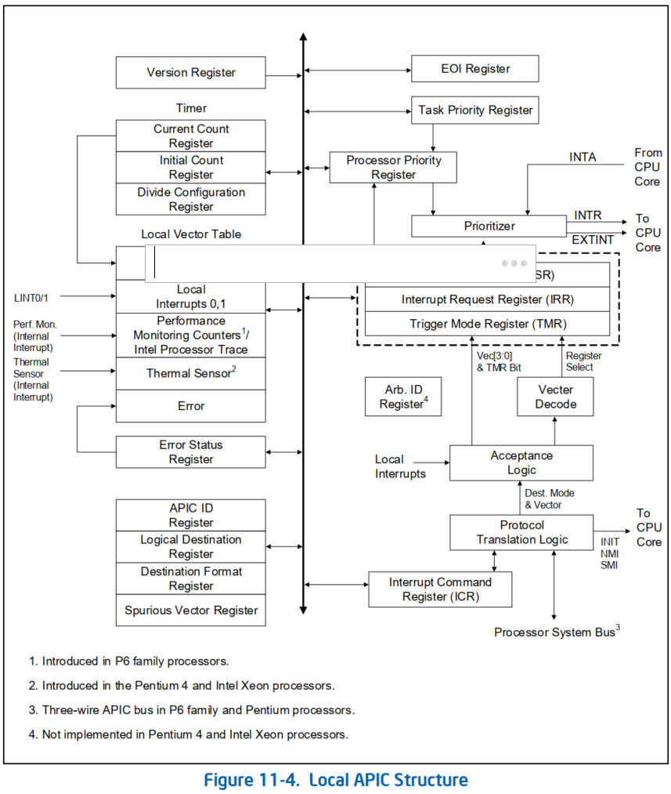
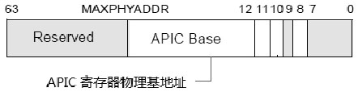
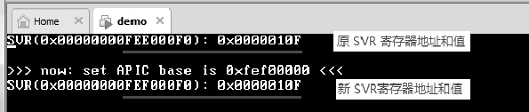
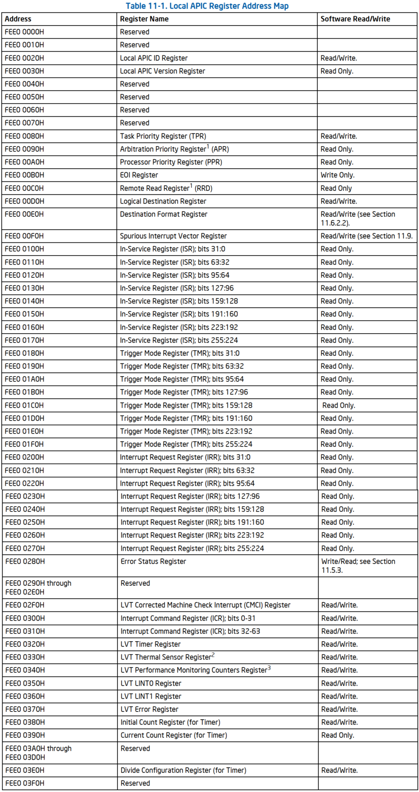
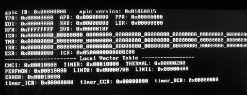
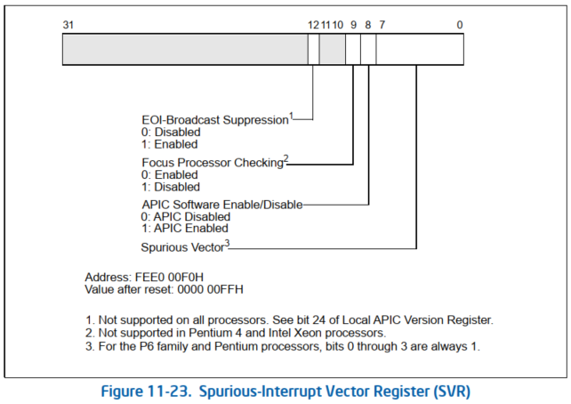

<!-- @import "[TOC]" {cmd="toc" depthFrom=1 depthTo=6 orderedList=false} -->

<!-- code_chunk_output -->

- [1. 两种寄存器映射方式](#1-两种寄存器映射方式)
- [2. local APIC 概述](#2-local-apic-概述)
- [3. local APIC 寄存器地址](#3-local-apic-寄存器地址)
  - [3.1. local APIC 寄存器基地址](#31-local-apic-寄存器基地址)
    - [3.1.1. local APIC 寄存器重定位](#311-local-apic-寄存器重定位)
- [4. local APIC 寄存器列表](#4-local-apic-寄存器列表)
- [5. SVR](#5-svr)

<!-- /code_chunk_output -->

# 1. 两种寄存器映射方式

* **APIC** 和 **xAPIC 版本**中, local APIC 寄存器映射到**物理地址**中.

* **x2APIC 模式**中 local APIC 寄存器映射到 **MSR 寄存器组**.

下面说明 local APIC 寄存器映射到**物理地址**中 的设置逻辑.

# 2. local APIC 概述



图 11-4 给出了 local APIC 的功能框图.

软件通过读取和写入其寄存器与 local APIC 交互.

APIC 寄存器内存映射到处理器物理地址空间的 **4 KB** 区域, 初始起始地址为 `FEE00000H`.为了正确执行 APIC 操作, 必须将此地址空间映射到已指定为强不可缓存 (UC) 的内存区域.

# 3. local APIC 寄存器地址

local APIC **寄存器的地址**是以 `APIC_BASE`(在 `IA32_APIC_BASE MSR` 寄存器中)作为基地址, **每个 local APIC 寄存器**都有**自己对应的偏移量**, 以 **local APIC ID 寄存器**的地址为例: 它的**偏移量是 20H**, 那么 local APIC ID 寄存器的地址就是 `APIC_BASE + 20H`.

## 3.1. local APIC 寄存器基地址

local APIC 寄存器的**基地址值**来自 `IA32_APIC_BASE` 寄存器.



当**处理器 power\-up** 或 **reset** 时 **APIC base** 值为 **FEE00000h**. APIC base 值的**宽度依赖于 MAXPHYADDR 值**(**36 位, 40 位或 52 位**), **低 12 位为 0**值, 因此 APIC base 地址将在 **4K 页边界**上.

在**分页机制**下, 由于 **APIC base 是物理地址(!!!**), 而**软件代码**里使用的是 **virtual address**, 因此系统必须负责**某个区域的 virtual address 映射到 APIC base 的物理地址(!!!**)上, 以便于**在软件里使用 MOV 指令访问 local APIC 寄存器**.

代码清单 18-6(`lib\page32.asm`):

```asm
; 0x800000 映射到 0xFEE00000(Local APIC 区域)
      mov DWORD [PDT_BASE + 4 * 8], 0xFEE00000 | PS | PCD | PWT | RW | P
; PCD=1, PWT=1
      mov eax, [xd_bit]
      mov DWORD [PDT_BASE + 4 * 8 + 4], eax          ; XD 位
```

上面这段代码将 **virtual address 0x800000** 映射到**物理地址 0xFEE00000** 上, 如果我们定义一个常量符号 `APIC_BASE` 为 **0x800000** 值, 那么:

```asm
mov eax, [APIC_BASE + SVR]   ;访问 local APIC 的 SVR
```

上面的代码就是**基于 APIC_BASE 地址加上 local APIC 寄存器的偏移量来访问 local APIC 寄存器(!!!**), 其中 `APIC_BASE` 的值就是 **0x800000**. 当然, 如果愿意也可以使用一对一的映射形式(virtual address 和 physical address 相等, 也就是 virtual address 0xFEE00000 映射到物理地址 0xFEE00000), 我想没有 OS 会使用这样的映射方式.

值得注意的是, 由于 APIC base 物理地址是提交到 local APIC 硬件上, 因此 APIC base 的物理地址必须以 strong uncacheable(**不可缓存**, UC)的**内存类型映射**. 我们在映射的时候使用 PCD=1, 并且 PWT=1 的 PAT 属性来指定 page 的内存类型(关于 PAT 属性详情, 请参考 11.7 节描述). 这段区域也可以指定为 XD(Execute disable)类型

### 3.1.1. local APIC 寄存器重定位

xAPIC 版本的 local APIC 寄存器的地址允许被重定位, 使用 `IA32_APIC_BASE` 寄存器提供一个新值. 在开启分页机制的环境下, 我们还必须考虑到上面所说的映射 page 的内存类型.

代码清单 18-7(lib\apic.asm):

```x86asm
; ------------------------------------
;  set_apic_base(): 设置 APIC base 地址
;  input:
;   esi: 低 32 位, edi: 高半部分
; ------------------------------------
set_apic_base:
      call get_MAXPHYADDR    ;  得到 MAXPHYADDR 值
      mov ecx, 64
      sub ecx, eax
      shl edi, cl
      shr edi, cl       ;  去掉 MAXPHYADDR 以上的位
      mov ecx, IA32_APIC_BASE
      rdmsr
      mov edx, edi
      and esi, 0xfffff000
      and eax, 0x00000fff    ; 保持原来的 IA32_APIC_BASE 寄存器低 12 位
      or eax, esi
      wrmsr
      ret
```

为了做得更好一些, 这个 `set_apic_base()` 函数通过得到 MAXPHYADDR 值来设置 APIC base 地址的宽度, 这样的话, 即使输入地址 0xFFFFFFFF\_FFFFFFFFF 也只能写入 0x0000000F\_FFFFF000(在 MAXPHYADRR 为 36 的情况下).

实验 18-2: 测试 APIC base 的重定位

在这个实验里, 我们将 APIC base 默认的 0xFEE00000 地址, 重定位在 0xFEF00000 位置上并进行对 local APIC 寄存器的读取.

代码清单 18-8(topic18\ex18-2\protected.asm):

```x86asm
mov esi, 0xFEF00000    ;  重定位在 0xFEF00000 上
mov edi, 0
call set_apic_base
```

这段代码输入 0xfef00000 地址给 set\_apic\_base()函数设置新的 APIC base 地址值, 然后使用

```x86asm
mov esi, [APIC_BASE + 0xfef00000 - 0xfee00000 + SVR]
```

这条指令在新的 APIC base 地址上读取 SVR 的值, 这里需要计算新 APIC base 对应的 virtual address 值.



我们可以看到, 这个结果中使用基于新 APIC base 地址的 SVR 值和原 SVR 的值是相同的, 表明 APIC base 地址已经成功设置为新的地址.

# 4. local APIC 寄存器列表

LAPIC 的寄存器有:

* **ICR**: 用于发送 **IPI**(中断的信息)

* **IRR**: 当前 LAPIC 接收的消息

* **ISR**: 当前 CPU 增长处理的中断

* **TPR** 和 **PPR**: CPU 中断处理的优先级

下面是 local APIC 寄存器的完整列表, **APIC 寄存器的基地址是 FEE00000H**.



> 注: 在基于 Intel 微架构 Nehalem 的处理器中, local APIC ID 寄存器不再读写, 它是只读的.

这些 local APIC 寄存器共**占据了 4K 的页空间**, 每个 local APIC 寄存器地址都是**16 字节边界对齐**的, 寄存器宽度分别为 **32 位,64 位, 以及 256 位**.

下面的**寄存器是 256 位**的.

1) **ISR**(`In-Service Register`).

2) **TMR**(`Trigger Mode Register`).

3) **IRR**(`Interrupt Request Register`).

这些寄存器的**每一位**对应**一个中断 vector(共 256 个 interrupt vector**), 而 **64 位寄存器**只有一个 **ICR**(`Interrupt Command Register`), 其余寄存器都是 32 位的.

因此, **访问一个完整的 64 位寄存器**需要进行 **2 次 DWORD 访问**, 256 位的寄存器需进行 8 次 DWORD 访问.

>实验 18-3: 打印 local APIC 寄存器列表

在这个实验里, 笔者使用`dump_apic()`函数打印 local APIC 寄存器的信息, 这个 dump\_apic()函数实现在 lib\apic.asm 文件里, 函数比较长, 为节省篇幅这里不列出来, 读者可自行查阅.



这个图是运行在 Westmere 微架构移动 Core i5 处理器上的结果, 这些 local APIC 寄存器的值经过了 BIOS 的初始化设置. 除了 LINT0,LINT1 及 Thermal 寄存器外, 其他的 LVT 寄存器都被 mask(屏蔽).

# 5. SVR

SPURIOUS INTERRUPT: 假中断

当处理器将其任务优先级提高到大于或等于当前正断言处理器 INTR 信号的中断级别时, 可能会出现特殊情况. 如果在发出 INTA 周期时, 要分配的中断已被屏蔽(由软件编程), 则 local APIC 将提供一个虚假中断向量. 分配虚假中断向量不会影响 ISR, 因此此向量的处理程序不能返回 EOI.

虚假中断的向量编号在 SVR (`spurious-interrupt vector register`, 虚假中断向量寄存器)中指定. 可读可写.



> 即使设置了掩码位, 也不要使用 虚假向量对 LVT 或 IOAPIC RTE 进行编程. 虚假向量 ISR 不会执行 EOI. 如果由于某种原因, LVT 或 RTE entry生成了一个中断, 则 ISR 中的 spurious vector 对应的 bit 将为 1. 这将屏蔽具有相同或较低优先级的所有中断.

如果处理器不支持抑制 EOI 广播, 则 SVR 的第 12 位保留为 0. local APIC 版本寄存器的第 24 位报告了对 EOI 广播抑制的支持; 如果该位设置为 1, 则支持该功能. 如果支持, 该功能在 xAPIC 模式和 x2APIC 模式下均可用.

此寄存器中字段的功能如下: 

* 虚假中断号(`Spurious Vector`): local APIC 生成虚假向量时要传送给处理器的向量号.
  * Pentium 4 和 Intel Xeon 处理器. 该字段的 0 到 7 位可通过软件编程.
  * P6 系列和奔腾处理器. 该字段的第 4 位到第 7 位由软件编程, 第 0 位到第 3 位硬连线到逻辑位. 软件写入 0 ~ 3 无效.

* APIC 软件开关(`APIC Software Enable/Disable`): 允许软件临时启用(1)或临时禁用(0) local APIC

* 焦点处理器检查(`Focus Processor Checking`): 在使用最低优先级传递模式时是否启用焦点处理器检查. 0 启用, 1 禁用. 在 Pentium 4 和 Intel Xeon 处理器中, 此位是保留的, 应清除为 0.

* 抑制 EOI 广播(`Suppress EOI Broadcasts`): level 触发的中断的 EOI 是否导致 EOI 消息广播到 I/O APIC (0) 或不广播到 I/O APIC (1). 此位的默认值为 0, 表示执行 EOI 广播. 如果处理器不支持 EOI 广播抑制, 则此位保留为 0.

