<!-- @import "[TOC]" {cmd="toc" depthFrom=1 depthTo=6 orderedList=false} -->

<!-- code_chunk_output -->

- [1. local APIC ID 寄存器](#1-local-apic-id-寄存器)
- [2. APIC ID 在 multi-threading 处理器下](#2-apic-id-在-multi-threading-处理器下)
  - [2.1. 检测处理器是否支持 multi-threading](#21-检测处理器是否支持-multi-threading)
  - [2.2. multi-threading 下的 APIC ID](#22-multi-threading-下的-apic-id)
  - [2.3. xAPIC ID](#23-xapic-id)
    - [2.3.1. SMT](#231-smt)
    - [2.3.2. initial xAPIC ID 值的查询](#232-initial-xapic-id-值的查询)
  - [2.4. x2APIC ID](#24-x2apic-id)
    - [2.4.1. 测试是否支持 CPUID 0B leaf](#241-测试是否支持-cpuid-0b-leaf)
    - [2.4.2. x2APIC ID 值的查询](#242-x2apic-id-值的查询)
    - [2.4.3. 枚举 x2APIC ID 的 level 数](#243-枚举-x2apic-id-的-level-数)
  - [2.5. Intel Hyper-threading 技术的处理器](#25-intel-hyper-threading-技术的处理器)
  - [2.6. 支持 multi-core 和 Hyper-threading 技术的处理器](#26-支持-multi-core-和-hyper-threading-技术的处理器)
  - [2.7. 在 multi-core 和 Hyper-threading 技术下的 x2APIC ID](#27-在-multi-core-和-hyper-threading-技术下的-x2apic-id)
- [3. multi-threading 技术的使用](#3-multi-threading-技术的使用)
  - [3.1. 收集处理器的 Package/Core/SMT ID](#31-收集处理器的-packagecoresmt-id)
  - [3.2. 提取 Package/Core/SMT ID 值](#32-提取-packagecoresmt-id-值)
    - [3.2.1. SMT_MASK_WIDTH 与 CORE_MASK_WIDTH](#321-smt_mask_width-与-core_mask_width)
    - [3.2.2. SMT_SELECT_MASK 与 CORE_SELECT_MASK](#322-smt_select_mask-与-core_select_mask)
    - [3.2.3. 32 位 x2APIC ID 的排列规则](#323-32-位-x2apic-id-的排列规则)
  - [3.3. 分解提取 3-level 结构的 x2APIC ID](#33-分解提取-3-level-结构的-x2apic-id)
    - [3.3.1. 枚举 MASK_WIDTH 值](#331-枚举-mask_width-值)
    - [3.3.2. 计算 SMT_SELECT_MASK 值](#332-计算-smt_select_mask-值)
    - [3.3.3. 得到 SMT_ID 值](#333-得到-smt_id-值)
    - [3.3.4. 计算 CORE_SELECT_MASK 值](#334-计算-core_select_mask-值)
    - [3.3.5. 得到 Core_ID 值](#335-得到-core_id-值)
    - [3.3.6. 计算 PACKAGE_SELECT_MASK 值](#336-计算-package_select_mask-值)
    - [3.3.7. 得到 Package_ID 值](#337-得到-package_id-值)
  - [3.4. 分解提取 8 位的 xAPIC ID](#34-分解提取-8-位的-xapic-id)
- [4. multi-threading 处理器编程](#4-multi-threading-处理器编程)
  - [4.1. 枚举所有处理器的 APIC ID](#41-枚举所有处理器的-apic-id)
  - [4.2. BSP 与 AP 处理器](#42-bsp-与-ap-处理器)
  - [4.3. 枚举所有 processor](#43-枚举所有-processor)
  - [4.4. 提供 start-up 代码](#44-提供-start-up-代码)

<!-- /code_chunk_output -->

无论是在 Intel 还是 AMD 平台上, local APIC ID 都非常重要. 在**处理器 power\-up 或 reset**后, **处理器和 bus 硬件**上赋予**每个 local APIC 唯一的 initial APIC ID 值**, 这个唯一的 APIC ID 值基于**system bus 上的拓扑结构**构建, 可以使用下面的方法查询这个值.

1) 在处理器支持**CPUID 0B leaf** 的情况下, 使用`CPUID.0B: EDX[31: 0]`得到**32 位**的 APIC ID 值.

2) **不支持 CPUID 0B leaf** 时, 使用`CPUID.01: EBX[31: 24]`得到 **8 位**的 APIC ID 值.

然后, 在**处理器 power\-up 或者 reset**期间, 这个**initial**值被写入到**local APIC ID 寄存器**里(在**支持 CPUID 0B leaf**但**不支持 x2APIC 模式**时, **只保存 32 位 APIC ID 值的低 8 位**).

**APIC ID**实际上也是**每个 logical processor**在**system bus**(或者 Pentium 和 P6 处理器使用的**APIC bus**)上的**唯一编号**. 这个编号可以被使用在**处理器间进行通信**, **系统软件**可以使用这个编号**动态调度任务给某些处理器执行**.

# 1. local APIC ID 寄存器

**local APIC ID 寄存器**保存着 **APIC ID 值**, 地址在**偏移量 20H** 位置上, 如下所示.

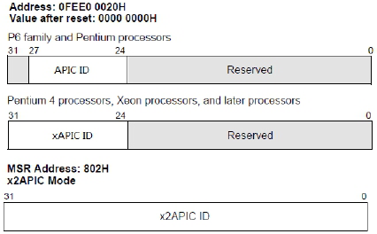

在 P6 和 Pentium 处理器使用的 **APIC 版本**里, APIC ID 值是 **4 位**. Pentium 4 以后的处理器上的 **xAPIC 版本**里**APIC ID 值是 8 位**, **x2APIC 版本**上使用**32 位的 APIC ID 值**(实际上, 在**支持 CPUID 0B leaf 的处理器**上**APIC ID**都使用**32 位的 x2APIC ID 值！！！**).

在本节后续的内容主要围绕着 **8 位的 xAPIC ID** 和 **32 位的 x2APIC ID 值**进行探讨.

# 2. APIC ID 在 multi-threading 处理器下

Intel 的处理器实现了两种技术:

- 从后期的**Pentium 4** 处理器开始加入的**Hyper-Threading(超线程**)技术, 使用**逻辑 core**技术, **两个 logical processor**共用一个**physical package(物理处理器**).
- 从**Core duo**处理器开始加入的**multi-core(多处理器核心**)技术, 使用的是**物理 core 技术**, 一个**physical package**上有**两个物理 core 单元**.

**multi\-threading**技术**不单指 Hyper-Threading(超线程**), 也包括了**multi\-core(多处理器核心**)技术.

- 现在**Intel**的处理器上的**multi\-threading**实现了**Hyper\-Threading**与**multi-core 相结合**.
- 而**AMD**的**multi\-threading**技术以**multi\-core**形式实现.

两种技术都有的话, 在**有 cluster 的 MP 系统**中, 会有**多个 cluster**, **每个 cluster**会有多个**physical package(物理处理器**), **一个 physical package**会有**多个物理 processor core 单元(2 个, multi-core 技术**), **每个物理 core 单元**内有**多个 logical processor(逻辑, Hyper\-Threading 技术, 2 个**), logical processor 就是指**SMT 单元**, 用来**执行单元的线程**, 拥有自己的**资源(处理器的 stat 信息**)和**自己的 local APIC**等.

## 2.1. 检测处理器是否支持 multi-threading

对于处理器是否支持**multi\-threading**技术, 软件可以使用`CPUID.01: EDX[28]`位进行检测, 为 1 时表示支持, 如以下代码所示.

代码清单 18-9(lib\cpuid.asm):

```x86asm
; -----------------------------------------------------
;  support_multi_threading(): 查询是否支持多线程技术
; -----------------------------------------------------
support_multi_threading:
      mov eax, 1
      cpuid
      bt edx, 28     ;  HTT 位
      setc al
      movzx eax, al
      ret
```

上面这个 support\_multi\_threading()函数用来检测处理器**是否支持 multi\-threading 技术**, 可以使用在 Intel 和 AMD 平台上. 然而, 这里**无法得知是支持 Hyper\-threading 还是 multi\-core 技术**.

## 2.2. multi-threading 下的 APIC ID

在**multi\-threading**技术下, **initial APIC ID**通常分成**3\-level 或 4\-level 的拓扑结构**, 因此**一个完整的 APIC ID**将分为**3 或 4 个 sub\-field(子域**), 某些处理器的**32 位 x2APIC ID 还可以超过 4-level**, 这些具体的 sub\-field 信息需要通过**CPUID 的相关 leaf**进行查询.

## 2.3. xAPIC ID

当**MP 系统里包含 cluster**时, **8 位的 initial APIC ID**被分成**4-level 结构**, 最高层为 Cluster ID, 下面是一个使用 cluster bridge 连接各个 cluster 的示意图, **每个 cluster**内有**数个 physical package**.

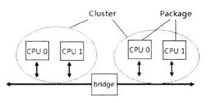

在**没有 Cluster 的 MP 系统**里, initial xAPIC ID 被分成**3-level 结构**.

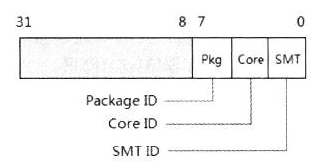

如上所示, **8 位的 initital xAPIC ID 结构**的**3 个子域**分别如下.

1) **Package ID**: APIC ID**最上层是 Package ID**, 在一个 MP(multi-processor)系统里, system bus 会有**多个 physical package**, 每个 physical package 就是**一个物理处理器**. APIC ID 里的**package ID**就是用来区分**cluster 内(！！！**)(假如**system bus 上有 cluster**)或者**system bus 上的物理处理器**的.

2) **Core ID**: Package ID 下一层是**Core ID**, 用来区分**physical package**内的**processor core**, 在一个**单核**的处理器上, **Core ID 的值为 0**.

3) **SMT ID**: Core ID 下一层是 SMT ID, **每个 SMT ID**代表一个**logical processor**, SMT ID 用来区分**processor core 内的 logical processor(！！！**).

这些**Package ID、Core ID 及 SMT ID**子域的宽度依赖于处理器的实现, **每个处理器在 power-up**时, **bus 硬件**会赋一个**initial APIC ID 给 local APIC**, 这个 initial APIC ID 值可以从**CPUID 指令**里查询得到. **软件**可以使用**CPUID 的 01 leaf 和 04 leaf**来**查询和枚举 initial APIC ID 的子域**. 然而值得注意的是, 这个**initial APIC ID 值**可能与通过**local APIC ID 寄存器**查出来的**ID 值不一样**. 在**某些处理器(！！！**)上, **local APIC ID 寄存器是可写的**, BIOS 或 OS 可能会写给 local APIC ID 寄存器不一样的 ID 值(当然, 改写的可能性极少).

### 2.3.1. SMT

**SMT(Simultaneous Multi\-Threading**)直译为**同步的多线程**, 就是指**Intel 的 Hyper\-Threading 技术**, 在**processor core 内**实现**两个共享物理 core 执行单元的线程**. 这些线程单元拥有自已的处理器资源(**处理器的 state 信息！！！**), 包括**有自己的 local APIC**. logical processor 就是指**SMT 单元**.

### 2.3.2. initial xAPIC ID 值的查询

显然, system bus 硬件产生的 8 位的 initial xAPIC ID 会被保存到 local APIC ID 寄存器里, 软件可以使用 CPUID.01: EBX[31: 24]查询得到 initial xAPIC ID 值.

代码清单 18-10(lib\apic.asm):

```x86asm
; -------------------------------------
;  get_apic_id(): 得到 initial apic id
; -------------------------------------
get_apic_id:
       mov eax, 1
       cpuid
       mov eax, ebx
       shr eax, 24
       ret
```

这个 get\_apic\_id()函数用来获得当前运行代码的处理器的**8 位的 initial xAPIC ID 值**, 在 CPUID 指令的 01 leaf 返回的 EBX 寄存器[31: 24]位里.

思考一下, 这个 initial xAPIC ID 值, 只会对**当前运行的线程**(也就是**当前 logical processor！！！**)执行后所返回的.

## 2.4. x2APIC ID

在处理器支持**CPUID 0B leaf**或者**支持 x2APIC 模式**的情况下, 软件可以查询到一个**32 位的 x2APIC ID 值**, 结构如下.

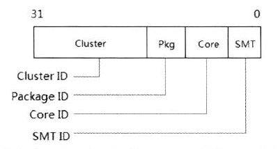

**x2APIC ID 值可能会超过 4 个子域**, 依赖于处理器的实现, **有多少个子域**及**每个子域的宽度**必须使用**CPUID 指令的 0B leaf 进行查询和枚举**. 然而在**没有 cluster 的情况下(cluster 为 0**), 处理器还是使用 3\-level 的结构, 也就是**32 位的 x2APIC ID 依然使用了 3\-level 结构**.

值得注意的是, **CPUID 指令的 0B leaf**并**不依赖于 local APIC 的 x2APIC 模式**.

不支持 x2APIC 模式的处理器, 并不代表不支持 CPUID 0B leaf, 因此, 在不支持 x2APIC 模式的处理器上, 如果支持 CPUID 的 0B leaf, 软件依然可以使用 CPUID 0B leaf 来查询 32 位的 x2APIC ID 值.

CPUID 0B leaf 允许处理器查询超过 8 位的 xAPIC ID 值(在 xAPIC 模式下), 使用 CPUID 01 leaf 查询得到的 8 位 xAPIC ID 值(由 CPUID.01: EBX[31: 24]得到)等于使用 CPUID 0B leaf 查询得到的 32 位 x2APIC ID 值的低 8 位(即 CPUID.01: EBX[31: 24]=CPUID.0B: EDX[7: 0]).

只有在处理器支持 x2APIC 模式情况下, 才可能使用**完整的 32 位 x2APIC ID 值**, 操纵**超过 256 个 logical 处理器**.

### 2.4.1. 测试是否支持 CPUID 0B leaf

CPUID 指令的 0B leaf 用来查询和枚举处理器扩展的拓扑结构, 在近期的处理器上才实现了 0B leaf.

代码清单 18-11(lib\apic.asm):

```x86asm
;  测试是否支持 leaf 11
       mov eax, 0
       cpuid
       cmp eax, 11
       jb extrac_x2apic_id_done    ;  不支持 0B leaf
```

上面这段代码用来测试是否支持 0B leaf, 关于测试 CPUID 指令支持的**最大 leaf(叶号**), 请参考 4.3 节所述.

### 2.4.2. x2APIC ID 值的查询

当处理器**支持 CPUID 0B leaf**时, 软件就可以使用**CPUID 0B leaf**来查询 x2APIC ID 值, 代码如下所示.

代码清单 18-12(lib\apic.asm):

```x86asm
; ---------------------------------------
;  get_x2apic_id(): 得到 x2APIC ID
; ---------------------------------------
get_x2apic_id:
       mov eax, 11
       cpuid
       mov eax, edx   ;  返回 x2APIC ID
       ret
```

上面的 get\_x2apic\_id()函数用来查询**x2APIC ID 值**, CPUID.0B: EDX[31: 0]返回的是**当前运行线程(当前运行的 logical processor！！！)下的 32 位 x2APIC ID 值**.

### 2.4.3. 枚举 x2APIC ID 的 level 数

前面提及, x2APIC ID 的子域(level 数)可以使用 CPUID 0B leaf 来枚举. EAX 寄存器输入 main\-leaf 号(即 0BH), ECX 寄存器输入 sub\-leaf 号枚举, 最终的结果值表示在 physical package 内有多少 level.

在第 1 次发起 CPUID 0B leaf 查询时, 使用 EAX=0BH(main-leaf), ECX=0(subleaf), 每次递增 ECX, 直到返回的 ECX[15: 8]=0 为止, 它的算法描述如下.

```c
#define SMT  1
#define CORE  2
#define INVALID 0
int get_x2apic_id_level()
{
   sub_leaf=0;     /* sub-leaf 号 */
   do
   {
       eax=0Bh;     /* EAX=main-leaf */
       ecx=sub_leaf;   /* ECX=sub-leaf */
       cpuid();     /* 执行 CPUID 指令枚举 */
       sub_leaf++;     /* 递增 sub-leaf */
   } while (ecx.level_type ！= INVALID);  /* 返回的 ECX[15: 8] 值不等于 0 时, 重复迭代*/
   return ecx.level;       /* 返回的 ECX[7: 0] 值就是 level 数 */
}
```

每次执行 CPUID 指令时, 返回的 ECX[15: 8]值是一个 level 类型, SMT level 是 1 值, 而 CORE level 是 2 值, 0 是无效, 其他值保留. 在最后一次迭代中, ECX[7: 0]就是 level 数.

代码清单 18-13(lib\apic.asm):

```x86asm
; -------------------------------------------------
;  get_x2apic_id_level(): 得到 x2APIC ID 的 level 数
; -------------------------------------------------
get_x2apic_id_level:
       mov esi, 0
enumerate_loop:
       mov ecx, esi   ;  sub-leaf
       mov eax, 11    ;  main-leaf
       cpuid
       inc esi
       movzx eax, cl   ;  ECX[7: 0]=level 数
       shr ecx, 8
       and ecx, 0xff   ;  测试 ECX[15: 8]
       jnz enumerate_loop  ;  ECX[15: 8] ！= 0 时, 重复迭代
       ret
```

上面这个 get\_x2apic\_id\_level()函数就实现了枚举出 x2APIC ID 的 level 数. 注意, 这个 level 数是指在 package 内的 level 数(即 SMT\_ID 和 CORE\_ID).

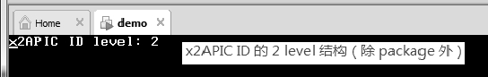

上面这是使用 get\_x2apic\_id\_level()函数枚举的结果, 这个结果里 x2APIC ID 有 2\-level 结构, 我们可以对比一下 3\-level 结构图(除 package 外).

如果处理器支持 CPUID 0B leaf(枚举查询 32 位的 x2APIC ID)但不支持 x2APIC 模式, 那么只能操作 256 个 logical processor. system bus 上有超过 256 个 logical processor 的话, 超出的处理器在 xAPIC 模式下并不能使用到.

## 2.5. Intel Hyper-threading 技术的处理器

Intel 的 Hyper-threading 是 multi\-threading 技术的一种形式, 允许在**一个处理器里实现 2 个执行线程**, 这些**线程(SMT)共享 processor core 的执行单元**, 可是**每个 SMT 有自己的处理器状态(！！！**), 这些 SMT 代表一个 logical processor, 如下所示.

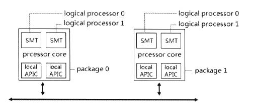

我们看到, 上图的 MP 系统下, 每个 physical package 中有两个 logical processor, 那么在这个 system bus 上共有 4 个 logical processor.

这些 logical processor 的 APIC ID 值如下.

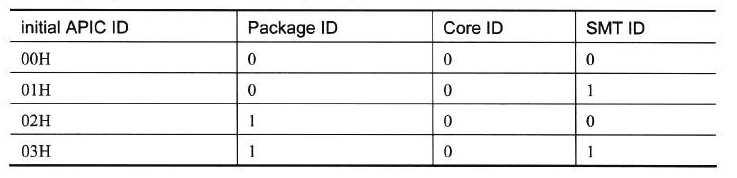

因为是**单核 Hyper-threading 处理器**, 所以**只有一个 core**. Core ID 都为 0 值. 我们看到, 这其实是 2\-level 的 APIC ID 结构, **Core ID 子域被忽略**.

## 2.6. 支持 multi-core 和 Hyper-threading 技术的处理器

在 Intel 的处理器上同时可以支持 multi\-core 和 SMT 技术, 下面是使用**8 位的 xAPIC ID 下**的**双核心 SMT 处理器 MP 系统结构**.

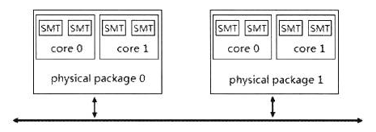

在**system bus**上有**2 个 physical package(即物理处理器**), **每个 package**上有**2 个 processor core**, 每个处理器核心有**2 个 logical processor**, 因此在 system bus 上共有 8 个 logical processor, 它们的 APIC ID 值如下.

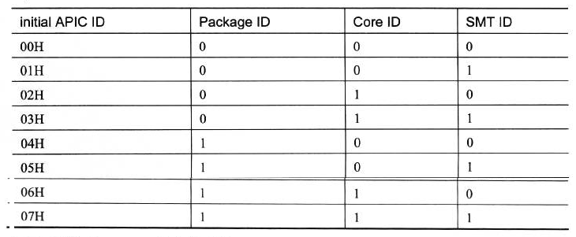

在上面的这个**3\-level**的拓扑结构里, APIC ID 号规则是先排**package ID**, 再到 Core ID, 最下层是 SMT ID, 形成最终的 8 位值.

## 2.7. 在 multi-core 和 Hyper-threading 技术下的 x2APIC ID

在一个**4 核 8 线程处理器**下, **每个 logical processor**使用**x2APIC ID**, 如下所示.

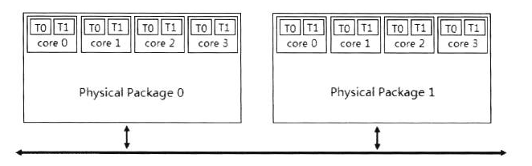

处理器支持**multi\-core 技术**, **每个物理 package**中有**4 个 processor core**. 同时**每个 processor core**支持**2 个 SMT**. **每个 package**里有**8 个 logical processor**, 在 system bus 上共有 16 个 logical processor, 那么它们在 system bus 上的 x2APIC ID 如下.

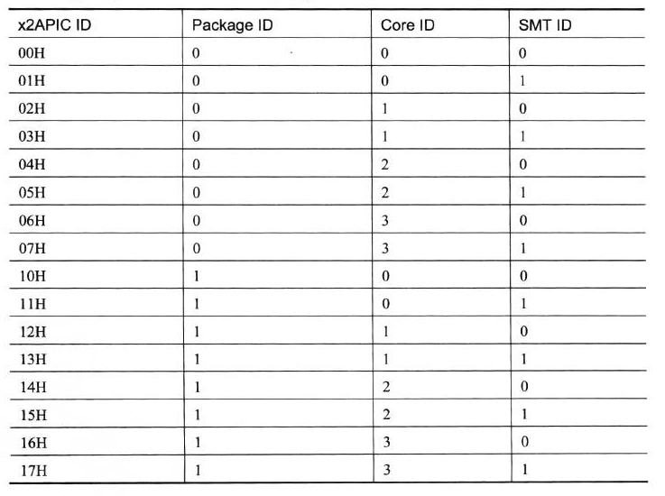

在上面的表格中, **x2APIC ID**同样使用**3\-level 的拓扑结构**, 最高层是**Package ID**, **system bus 上含有两个 physical package**, 分别为**package 0 和 package 1**, 那么最上层的值就是 0 和 1. 接着是 4 个 core ID, 从 0 到 3. 最下层是 SMT ID, 分别为 0 和 1.

与 8 位的 xAPIC ID 不同的是, 上层的不同 package ID 值造成 x2APIC ID 值并不连续. (详请参见 18.4.3.2 节所述. )

# 3. multi-threading 技术的使用

在处理器出现**multi\-threading**技术(包括**multi\-core**和**SMT**技术)**前**, 在 OS 中只能提供软件层上的 multi\-threading 技术, 由软件模拟 multi\-threading 技术并**不能真正做到线程的同步执行**, **单处理器上某一时刻只能执行一个任务**.

然而, multi\-core 和 SMT 的出现, 为处理器提供了物理层上的 multi\-threading 技术. 为多个处理器执行单元可以同步执行多个任务提供了基础设施.

显然, 硬件层上的 multi\-threading 比软件层上的具有更高的效率和吞吐量.

## 3.1. 收集处理器的 Package/Core/SMT ID

在一个**multi\-threading 处理器**中, **OS**可以根据**logical processor 的 APIC ID 值**分配和调度任务(线程)在**哪个 logical processor 里执行**.

处理器在**power\-up 或 reset 后**, system bus 上的**logical processor**被赋予**唯一的 initial APIC ID 值**, **OS 初始化**时应该**收集 system bus 上 logical processor 的 3\-level 结构的 APIC ID 或 x2APIC ID 值的 Package ID、Core ID, 以及 SMT ID**, 以便可以在某个 logical prcessor 上分配执行任务, 如下所示.

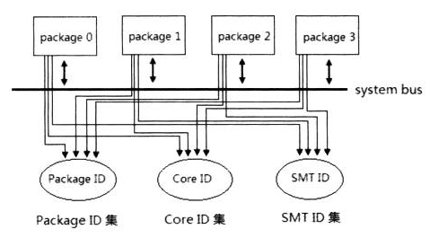

在 Package/Core/SMT ID 的收集中, 或许可以实施不同的方案或者策略. 例如在上面的一个 4 个 package 的 MP 系统里, 我们可以将收集到的所有的 logical processor 统一放在一个数据结构里.

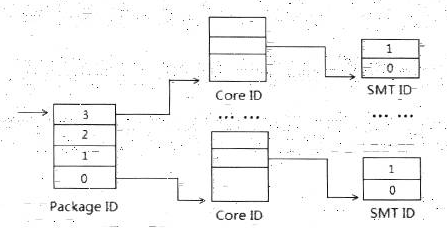

上图的结构类似于 paging 的各级页换转表结构, 在 Package\_ID 数组里有多少个元素, 则表示有多少个物理处理器.

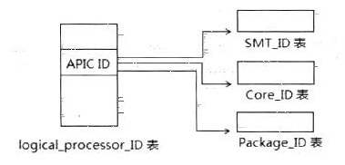

上图中我们以每个 logical processor 的 APIC ID 数组为主, 每个 APIC ID 值对应于各自的 Package\_ID 表、Core\_ID 表, 以及 SMT\_ID 表的收集形式. logical\_processor_ID 表有多少个元素代表有多少个 logical processor.

## 3.2. 提取 Package/Core/SMT ID 值

在收集的过程中, 需要从已知的 8 位 xAPIC ID 值或 32 位的 x2APIC ID 值中提取出 Package ID、Core ID, 以及 SMT ID 值.

Intel 提供了**两种提取 Package/Core/SMT ID 值的方式**, 对应于 8 位的 APIC ID(xAPIC ID)和 32 位的 x2APIC ID.

1) 使用 CPUID 指令的 01 leaf 和 04 leaf: 这种方式使用在**8 位**的 APIC ID 和 xAPIC ID 值上.

2) 使用 CPUID 指令 0B leaf 的扩展枚举拓扑结构功能: 这种方式使用在**32 位的 x2APIC ID 值**上.

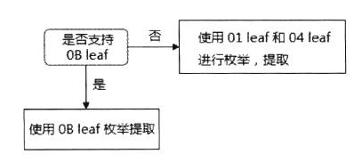

当处理器支持扩展的 CPUID 0B leaf 时, 使用 0B leaf 枚举查询 32 位的 x2APIC ID 值, 以及相应的 SMT\_MASK\_WIDTH 与 CORE\_MASK\_WIDTH 值进行提取.

如果不支持, 则应使用 01 leaf 查询 8 位的 APIC ID 值, 使用 04 leaf 查询 package 内最大的 logical processor 计算值, 以及 package 内最大的 core 计算值, 从而算出 SMT\_MASK\_WIDTH 和 CORE\_MASK\_WIDTH 值, 再进行提取工作.

### 3.2.1. SMT_MASK_WIDTH 与 CORE_MASK_WIDTH

现在, 我们来看看 SMT\_MASK\_WIDTH 和 CORE\_MASK\_WIDTH 是什么, 如下所示.

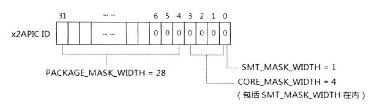

SMT\_MASK\_WIDTH 值和 CORE\_MASK\_WIDTH 值, 以及 PACKAGE\_MASK\_WIDTH 值分别指示 SMT/Core/Package 子域在 APIC ID 值中所占位的宽度, 从而可以用来从 APIC ID 中提取 Package/Core/SMT ID 值.

以上图的 32 位 x2APIC ID(从 CPUID 0B leaf 枚举而来)为例:

1) SMT\_MASK\_WIDTH 的值为 1, 那么 SMT ID 占 1 位宽.

2) CORE\_MASK\_WIDTH 的值为 4, 那么 CORE ID 占 4 位宽, 可是这个 CORE\_MASK\_WIDTH 值包括 SMT\_MASK\_WIDTH 在内, 因此 CORE\_MASK\_WIDTH 实际只有 3 位.

3) PACKAGE\_MASK\_WIDTH 的值为 28, 那么 Package ID 占 28 位宽(这个值是不确定的).

实际上, 除了 SMT\_MASK\_WIDTH 和 CORE\_MASK\_WIDTH 准确外, 剩下的 28 位并不只是代表 PACKAGE\_MASK\_WIDTH(或许还会有 Cluster 甚至其他 level 结构的子域), 在 3\-level 的结构里, 高 28 位就暂且作为 PACKAGE\_MASK\_WIDTH 值. 28 位加上 CORE\_MASK\_WIDTH 的 4 位就是 32 位的 x2APIC ID.

在 CPUID 0B leaf 里, SMT\_MASK\_WIDTH 和 CORE\_MASK\_WIDTH 的值直接来自枚举所返回的 EAX[4: 0]值. 而在 CPUID 04 leaf 里, SMT\_MASK\_WIDTH 和 CORE\_MASK\_WIDTH 的值需要计算得到.

### 3.2.2. SMT_SELECT_MASK 与 CORE_SELECT_MASK

SELECT\_MASK 用来 enable/disalbe 相应的域(即 Package/Core/SMT 域), 从而能在 APIC ID 里提取 Package/Core/SMT ID 值, 如下所示.

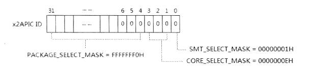

这些 SELECT\_MASK 值是基于 MASK\_WIDTH 值计算而来的. CORE\_MASK\_WIDTH=4(包括 SMT\_MASK\_WIDTH 值), 因此它的 SELECT\_MASK 值为 0EH(即 1110B).

### 3.2.3. 32 位 x2APIC ID 的排列规则

根据前面所述, x2APIC ID 值的排列规则是由 Package/Core/SMT 的 MASK\_WIDTH 值造成.

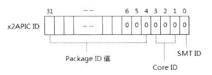

根据上图所示, 对照前面 18.4.2.6 节在 MP 系统下 4 核 8 线程的处理器的 x2APIC ID.

1) 当 Package=0, Core=3, SMT=1 时, 它的 x2APIC ID 为 07H.

2) 当 Package=1, Core=3, SMT=1 时, 它的 x2APIC ID 为 17H.

这就是 package 值不同造成 x2APIC ID 不连续的原因. 然而 8 位的 xAPIC ID 会使用不同的排列规则, 我们在后面将会看到.

## 3.3. 分解提取 3-level 结构的 x2APIC ID

Intel 为 x2APIC ID 专门开辟了一个 CPUID 0B leaf 来枚举 32 位的 x2APIC ID 拓扑结构. 前面我们已经了解过使用 CPUID0B leaf 来查询 x2APIC ID 值和 level 数.

### 3.3.1. 枚举 MASK_WIDTH 值

CPUID.0B: EAX[4: 0]可以获得 Core/SMT 的 MASK\_WIDTH 值, 依赖于 ECX 输入的 sub\-leaf 号, 下面是类 C 的算法.

```c
#define SMT  1   /* level-type 为 SMT */
#define CORE  2   /* level-type 为 CORE */
#define INVALID 0
int smt_mask_width=0;
int core_mask_width=0;
int package_mask_width=0;
void get_mask_width()
{
   sub_leaf=0;    /* 第 1 次枚举时的 sub-leaf 值为 0 */
   do
   {
      eax=11;    /* main-leaf */
      ecx=sub_leaf;  /* sub-leaf */
      cpuid();    /* 执行 CPUID 指令 */
      sub_leaf++;    /* 在接下来的枚举中, 每次递增 sub_leaf */
      /*
       * 当 ECX[15: 8] 为 1 时, eax[4: 0] 得到 SMT_MASK_WIDTH 值
       * 当 ECX[15: 8] 为 2 时, eax[4: 0] 得到 CORE_MASK_WIDTH 值
       * 当 ECX[15: 8] 为 0 时, 枚举结束
       */
      if (ecx[15: 8] == SMT)
          smt_mask_width=eax[4: 0];
      else if (ecx[15: 8] == CORE)
          core_mask_width=eax[4: 0];
      else
      {
          /* 当 ECX[15: 8] == 0 时, ECX[7: 0] == 0 时, CPUID 0B leaf 枚举失败 */
          if (ECX[15: 0] == 0)
          {
              /* 这种情况下, 只能使用 01 leaf 和 04 leaf 来提取 8 位的 xAPIC ID 值 */
          }
      }
   } while (ecx[15: 8] ！= INVALID);  /* 返回 ECX[15: 8] ！= 0 时, 重复迭代 */
   /* 3-level 结构中, 剩下属于 PACKAGE_MASK_WIDTH 值 */
   package_mask_width=32 - core_mask_width;
}
```
在开始枚举时, 输入 EAX=0BH 的 main-leaf 值, ECX=0H 的 sub\-leaf 值, 每次迭代 sub\-leaf 都增 1(即 ECX 递增). ECX[15: 8]返回的是 level 的类型(包括: 1 为 SMT 类型, 2 为 CORE 类型).

1) CPUID 指令返回的 ECX[15: 8]=1 时, 说明是 SMT level, 那么 EAX[4: 0]返回的是 SMT_MASK_WIDTH 值.

2) 当 ECX[15: 8]=2 时, 说明是 CORE level, 那么 EAX[4: 0]返回的是 CORE_MASK_WIDTH 值.

3) 当 ECX[15: 8]=0 时, 所有的 level 都枚举完了(实际上只有 2 个 level, 即 SMT 和 CORE 类型).

4) 当第一次枚举时输入 ECX=0(sub-leaf 为 0), 即返回的 ECX[7: 0]=0 时, 如果 ECX[15: 8]为 0, 说明枚举失败(可能并不支持 CPUID 0B leaf 功能).

最后, 当 SMT\_MASK\_WIDTH 和 CORE\_MASK\_WIDTH 值都得到后, 在 3\-level 结构里高位剩下的位宽就是 PACKAGE\_MASK_WIDTH 值. 关于 CPUID 0B leaf 的详细说明最好参考 Intel64 手册 Volume 2A 中 CPUID 指令的说明.

### 3.3.2. 计算 SMT_SELECT_MASK 值

当得到 SMT\_MASK\_WIDTH 值后, 使用下列的算法来得到 SMT\_SELECT\_MASK 值.

```
SMT_SELECT_MASK=~(0xFFFFFFFF << SMT_MASK_WIDTH)
```

以 SMT\_MASK\_WIDTH=1 为例.

```
1) 0xFFFFFFFF\<\<SMT\_MASK\_WIDTH 的结果为 0xFFFFFFFE.

2) 0xFFFFFFFE 取反的结果就是 0x00000001.
```

使用这个算法来得到 SMT\_SELECT\_WIDTH 值, 这是 Intel 推荐的. 当然, 我们也可以有自己的算法, 如下面是第 2 种算法.

```
SMT_SELECT_MASK=(1 << SMT_MASK_WIDTH) - 1
```

上面这个算法的结果是一样的.

```
1) 1\<\<SMT_MASK_WIDTH 的结果为 2.

2) 2\-1 的结果为 1(也就是 0x00000001 形式).
```

喜欢使用哪个算法, 任君选择, 目的只有一个, 就是求出 mask 位.

### 3.3.3. 得到 SMT_ID 值

我们使用上面的 SMT\_SELECT\_MASK 来得到 SMT\_ID 值.

```
SMT_ID=x2APIC_ID & SMT_SELECT_MASK
```

简单地说, 以 SMT\_MASK\_WIDTH=1 为例, 事实上 SMT\_ID 就是 x2APIC ID 的 Bit 0(只不过其中的算法似乎是绕了个圈). 如果 SMT\_MASK\_WIDTH=2, 那么 SMT\_ID 就是 x2APIC ID 的[1: 0](共 2 位).

### 3.3.4. 计算 CORE_SELECT_MASK 值

由于 CPUID 0B leaf 得到的 CORE_MASK_WIDTH 值包含 SMT_MASK_WIDTH 在内, 因此 CORE_SELECT_MASK 的计算要有所改变.

```
CORE_SELECT_MASK=(~(0xFFFFFFFF << CORE_MASK_WIDTH)) ^ SMT_SELECT_MASK
```

以 CORE\_MASK\_WIDTH=4 为例.

```
1) ~(0xFFFFFFFF\<\<CORE\_MASK\_WIDTH)的结果是 0x0000000F.

2) 0x0000000F\^SMT\_SELECT\_MASK 的结果是 0x0000000E.
```

### 3.3.5. 得到 Core_ID 值

同样, 使用下面的式子来得到 Core\_ID 值.

```
Core_ID=(x2APIC_ID & CORE_SELECT_MASK) >> SMT_MASK_WIDTH
```

由 CORE\_SELECT\_MASK 提取的值需经过右移 SMT 的宽度才能得到独立的 Core\_ID 值.

### 3.3.6. 计算 PACKAGE_SELECT_MASK 值

在 3\-level 结构中, CPUID 0B leaf 中无须得到 PACKAGE_MASK_WIDTH 值, 因为除了 Core 和 SMT 外, 剩下就是 Package level 了. PACKAGE_SELECT_MASK 值的计算直接依赖于 CORE_MASK_WIDTH 值.

```
PACKAGE_SELECT_MASK=0xFFFFFFFF << CORE_MASK_WIDTH
```

这个 CORE\_MASK\_WIDTH 包含了 SMT\_MASK\_WIDTH 在内, 以 CORE\_MASK\_WIDTH=4 为例, 0xFFFFFFFF<\<\4 的值为 0xFFFFFFF0.

### 3.3.7. 得到 Package_ID 值

使用下面的式子来得到 Package\_ID 值.

```
Package_ID=(x2APIC_ID & PACKAGE_SELECT_MASK) >> CORE_MASK_WIDTH
```
同样需要去掉低 4 位的 Core\_ID 和 SMT\_ID 值才能得到独立的 Package\_ID 值.

实验 18\-4: 从 x2APIC ID 里提取 Package\_ID Core\_ID 以及 SMT\_ID 值

下面我们来做实验练习从 x2APIC ID 提取 Package/Core/SMT ID 值, 并打印相关信息, 在程序的主体代码里, 使用 extrac\_x2apic\_id()函数来提取 Package/Core/SMT ID 值, 这个函数实现在 lib\apic.asm 文件里, 比较长, 请读者自行查阅.

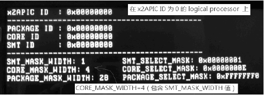

这个图是在 Westmere 微架构 Core i5 处理器上的运行结果, 结果显示:

1) x2APIC ID 值为 0(即在 0 号 logical processor 上运行).

2) 它的 Package/Core/SMT ID 值都是 0.

那么, 从这个处理器的 x2APIC ID 提取的结果如下.

1) `SMT_MASK_WIDTH=1`, `SMT_SELECT_MASK=1`.

2) `CORE_MASK_WIDTH=4`, `CORE_SELECT_MASK=0EH`.

3) `PACKAGE_MASK_WIDTH=28`, `PACKAGE_SELECT_MASK=0xFFFFFFF0`.

正如前面所说, `CORE_MASK_WIDTH` 值包含了 `SMT_SELECT_MASK` 值, 实际它应该为 3.

## 3.4. 分解提取 8 位的 xAPIC ID

# 4. multi-threading 处理器编程

在**multi\-threading**技术(包括**Hyper\-Threading**与**multi\-core**)处理器下, **system bus**上含有**多个 logical processor(逻辑处理器**), 如前面所述, 每个 logical processor 被赋予唯一的 APIC ID 值, **APIC ID 是在 system bus 上识别 logical processor 的标识符**. logical processor 之间根据这个 APIC ID 值相互通信.

## 4.1. 枚举所有处理器的 APIC ID

BIOS 或 OS 初始化期间需要枚举出 system bus 上所有的 logical processor 信息, 包括: 共有多少个处理器; 它们的 APIC ID 是多少等. 这些信息需要被记录下来.

**BIOS 或 OS**的另一个重要工作是**对所有的 processor 进行必要的设置和初始化**工作.

## 4.2. BSP 与 AP 处理器

在**处理器 power-up**或**reset**阶段时, 由**硬件(！！！)选出一个 processor 作为 BSP(bootstrap processor)处理器**, BSP 处理器的 **IA32\_APIC\_BASE 寄存器**的**bit 8 被置位**, 指示**属于 BSP 处理器**.

剩下的 **processor 都为 AP(application processor)处理器**, IA32\_APIC\_BASE 寄存器的**bit 8 被清 0**, 如下所示.

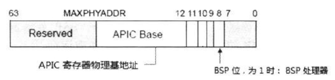

在 BIOS 执行阶段, 由 BSP 处理器执行 BIOS 的自举代码, 其余的**AP 处理器**处于**等待 BSP 处理器发送信息状态**. 例如: 在笔者的双核 4 线程 Core i5 处理器中, 共有 4 个 logical processor, 典型地: **APIC ID 为 0 的处理器为 BSP 处理器**.

## 4.3. 枚举所有 processor

**BSP 处理器**执行**BIOS 自举代码**进行初始化后, 需要通过**发送 IPI 消息！！！**形式(Intel 推荐依次发送 INIT\-SIPI\-SIPI 消息序列)来**唤醒和初始化所有 AP 处理器**.

典型地, **BSP 唤醒 AP 处理器**执行**BIOS 的 start-up 代码(BIOS 的！！！**). BSP 和 AP 处理器在**各自的运行期间**可以读取**local APIC ID 寄存器**来得到属于自已的**APIC ID**, 并增加**处理器计数值**.

>实验 18-6: 枚举所有的 processor 和 APIC ID 值

现在, 我们通过实验 18\-6 来实现**枚举 system bus 上共有多少个 processor**, 以及列出它们的**APIC ID 值**. 这里我们需要**实现 IPI(Inter-processor interrupt)消息机制！！！**. **发送 IPI 消息**需要使用**local APIC**的**ICR(Interrupt Command Register, 中断命令寄存器**), 我们将在稍后探讨 IPI 机制.

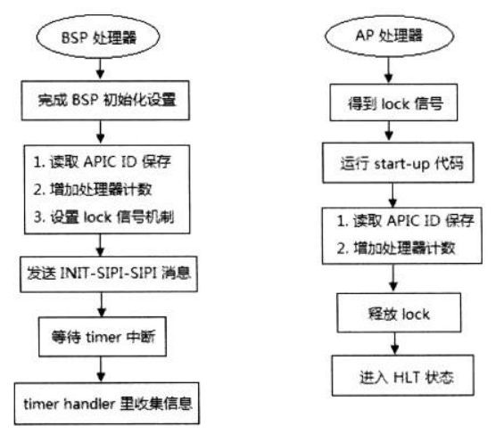

如上所示, 完成这个实验需要从**BSP 和 AP 处理器两个角度**进行思考并编写相应的代码, 在**各自运行期间**, 收集**属于自己的信息**. **BSP 处理器的职责之一**是**为 AP 处理器提供 Start\-up 代码**, 控制**同一时间只允许一个 AP 处理器运行这段 start\-up 代码**.

## 4.4. 提供 start-up 代码

典型地, **start\-up 代码**应该**属于 BIOS 代码的一部分**, **BSP 处理器运行时**需要**加载 start\-up 代码到内存 1M(16 位实模式)以下 4K 边界上**, 以**供 AP 处理器读取运行**.

代码清单 18-17(topic18\ex18-6\protected.asm):

```x86asm
; *
; * 下面是 startup routine 代码
; * 引导 AP 处理器执行 setup 模块, 执行 protected 模块
; * 使所有 AP 处理器进入 protected 模式
; *
startup_routine:
       bits 16
       mov ax, 0
       mov ds, ax
       mov es, ax
       mov ss, ax
; *
; * **** 开启计数器 ****
; * 统计每个 AP 处理器从等待到完成初始化所使用指令和 clock 数
; *
       mov ecx, IA32_FIXED_CTR_CTRL
       mov eax, 0B0Bh
       mov edx, 0
       wrmsr
       ENABLE_COUNTER 0, (IA32_FIXED_CTR0_EN | IA32_FIXED_CTR2_EN)
; 测试 lock, 同一时刻只允许 1 个 local processor 访问
test_ap_lock:
       lock bts DWORD [vacant], 0
       jc get_ap_lock
       jmp WORD 0: SETUP_SEG                ;  进入实模式的 setup.asm 模块
get_ap_lock:
       jmp test_ap_lock
       bits 32
startup_routine_end:
       jmp $
```

代码清单 18\-17 是这个实验的 start\-up 代码入口. 值得注意的是, 当**AP 接收到 INIT IPI 消息**执行**INIT 操作**时, 处理器处于实模式状态.

在这个实验里, **BSP 和 AP 执行的代码是完全一样的**(进入 setup.asm 模块再到 protected.asm 模块执行), 所不同的是, AP 执行插入了上面的 startup\_routine 入口代码, 用来控制 AP 处理器接**顺序执行 setup.asm 和 protected.asm 模块代码**.

代码清单 18-18(topic18\ex18-6\protected.asm):

```x86asm
; ; ;  实验 18-6: 枚举所有的 processor 和 APIC ID 值
; ; ;  测试 bootstrap processor 还是 application processor ?
       mov ecx, IA32_APIC_BASE
       rdmsr
       bt eax, 8
       jnc ap_processor
; ;  ** 下面是 BSP 代码 ***
       ; *
       ; * perfmon 初始设置
       ; * 关闭所有 counter 和 PEBS
       ; * 清 overflow 标志位
       ; *
       DISABLE_GLOBAL_COUNTER
       DISABLE_PEBS
       RESET_COUNTER_OVERFLOW
       RESET_PMC
; 设置 APIC performance monitor counter handler
       mov esi, APIC_PERFMON_VECTOR
       mov edi, apic_perfmon_handler
       call set_interrupt_handler
; 设置 APIC timer handler
       mov esi, APIC_TIMER_VECTOR
       mov edi, apic_timer_handler
       call set_interrupt_handler
; 设置 LVT 寄存器
       mov DWORD [APIC_BASE + LVT_PERFMON], FIXED_DELIVERY | APIC_PERFMON_VECTOR
       mov DWORD [APIC_BASE + LVT_TIMER], TIMER_ONE_SHOT | APIC_TIMER_VECTOR
; *
; * 复制 startup routine 代码到 20000h
; * 以便于 AP processor 运行
; *
       mov esi, startup_routine
       mov edi, 20000h
       mov ecx, startup_routine_end - startup_routine
       rep movsb
; *
; * 增加处理器编号计数
; * BSP 处理器为 processor #0
; *
       inc DWORD [processor_index]      ;增加 index 值
       inc DWORD [processor_count]      ;增加 logical processor 数量
       mov ecx, [processor_index]           ;处理器 index 值
       mov edx, [APIC_BASE + APIC_ID]       ;读取 APIC ID 值
       mov [apic_id + ecx * 4], edx         ;保存 APIC ID
; *
; * 分配 stack 空间
; *
; * 分配方法:
; *      1)  每个处理器的 index * STACK_SIZE 得到 stack_offset
; *      2) stack_offset 加上 stack_base 值
; *
       mov eax, PROCESSOR_STACK_SIZE     ;每个处理器的 stack 空间大小
       mul ecx                                     ;  stack_offset=STACK_SIZE * index
       mov esp, PROCESSOR_KERNEL_ESP
       add esp, eax
       mov esi, bp_msg1
       call puts
       mov esi, msg
       call puts
       mov esi, edx
       call print_dword_value
       call println
       mov esi, bp_msg2
       call puts
; *
; * 开放 lock 信号
; *
       mov DWORD [vacant], 0                        ;lock
       ; *
       ; * 下面发送 IPI, 使用 INIT-SIPI-SIPI 序列
       ; * 发送 SIPI 时, 发送 startup routine 地址位于 200000h
       ; *
       mov DWORD [APIC_BASE + ICR0], 000c4500h      ;发送 INIT IPI
       DELAY
       DELAY
       mov DWORD [APIC_BASE + ICR0], 000C4620H      ;发送 Start-up IPI
       DELAY
       mov DWORD [APIC_BASE + ICR0], 000C4620H      ;再次发送 Start-up IPI
       ; * 等所有 AP 完成
test_ap_done:
       cmp DWORD [ap_done], 1
       jne get_ap_done
       mov DWORD [APIC_BASE + TIMER_ICR], 100       ;开启 apic timer
       hlt
       jmp $
get_ap_done:
       jmp test_ap_done
       jmp $
```

上面是这个实验的主体代码, 其主要的工作如下.

1. **开启 local APIC**.

2. **判断当前**执行的处理器是**BSP 处理器还是 AP 处理器**: 通过 `IA32_APIC_BASE[8]` 位判断, BSP 与 AP 处理器执行不同的代码.

3. 在 **BSP 处理器**代码里, 通过**设置 local timer 的中断**来执行定时.

4. 复制 **start\-up routine 代码**到**20000h**位置上, 因为 **AP 处理器执行的入口**将放在 20000h 位置上(**通过 20000h 位置**再转入到 **setup.asm** 和 **protected.asm 模块**).

5. 读取 **APIC ID** 保存起来, 并**增加计数值 processors**, 置 **lock 信号 vacant 为有效(未上锁**).

6. 第 1 次发送 **INIT 消息**到**所有的 AP 处理器**, 所有 AP 处理器执行 **INIT 操作**.

7. 第 2 次发送 **SIPI 消息**到**所有的 AP 处理器**, **vector 值**为**0x20**(它**提供 20000h 的入口地址！！！**).

8. 第 3 次发送 **SIPI 消息**到**所有的 AP 处理器**, 由于 **SIPI 消息可能发送失败**而**不会自动重发**, 因此, 应该再次发送 SIPI 消息避免上次发送失败.

9. 检查所有 **AP 处理器**是否已经**执行完毕**, 如果是, **开启 APIC timer 中断**.

10. **BSP 处理器**进入 **timer 中断 handler 执行**, 打印出所有 logical processor 的汇总信息.

11. 在**每个 AP 处理器**进入 **startup routine 代码前**必须**测试 lock 信号是否有效**, **获得 lock 后(！！！**)才被允许进入 startup routine 执行. 在得到 lock 进入**执行代码前**开启两个计数器: 一个是 **IA32\_FIXED\_CTR0 计数器**用来统计 **AP 的执行指令数**, 一个是 **IA32\_FIXED\_CTR2 计数器**用来统计**所使用的 clock cycle 数**.

12. 在 **AP 处理器**进入到 protected.asm 模块的**ap\_processor 代码**处, 每个 AP 处理器关闭之前开启的两个计数器, 收集到**执行指令数和 clock 数信息**, 并打印出来. 在 ap\_processor 代码里同样是**读取 APIC ID 值**, 保存起来并**增加处理器计数**.

13. 每个 **AP 处理器执行完**毕后**释放 lock 信号 vacant 为有效(置 0**), 允许另一个 AP 处理器进入 setup.asm 模块执行.

14. 最后执行 **CLI 指令与 HLT 指令**, 处理器进入 **halt 状态**.

这个实验的最后结果是, **BSP 处理器还在运行**, 而**所有 AP 处理器最后进入停机状态**, 可以**等待 BSP 处理器再次发送 IPI 消息**.

代码清单 18-19(topic18\ex18\-6\protected.asm):

```x86asm
; ---------------------------------------------
;  apic_timer_handler(): 这是 APIC TIMER 的 ISR
; ---------------------------------------------
apic_timer_handler:
       jmp do_apic_timer_handler
at_msg2  db 10, '--------- summary -------------', 10
         db  'processor: ', 0
at_msg3  db 'APIC ID : ', 0
do_apic_timer_handler:
       mov esi, at_msg2
       call puts
       mov ebx, [processors_count]
       mov esi, ebx
       call print_dword_decimal
       call println
       mov esi, at_msg3
       call puts
       xor ecx, ecx
at_loop:
       mov esi, [apic_id + ecx * 4]
       call print_dword_value
       mov esi, ', '
       call putc
       inc ecx
       cmp ecx, ebx
       jb at_loop
       mov DWORD [APIC_BASE + EOI], 0
       iret
```

在 **BSP 处理器**的**执行 timer 中断 handler** 里将输出汇总信息: **processor 的数量**和 **APIC ID 值**.

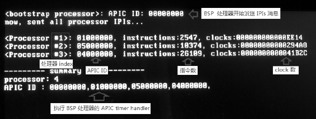

上面是在 Westmere 微架构移动 Core i5 处理器笔记本式计算机上的运行结果. 我们看到, 这个处理器由于是**双核心 4 线程的**, 因此共有**4 个 logical processor**, **BSP 处理器**的**APIC ID 为 0**, 其他 3 个 AP 处理器的**APIC ID 为 1、4、5**. 值得奇怪的是, 4 个逻辑处理器的编号并不是接 0、1、2、3 的顺序排列, 而是 0 与 1 对应一个 core, 而 4 与 5 对应一个 core.

实验 18-6 结果显示另一个比较有趣的地方是, 由于**同一时刻只有一个处理器有权执行 startup routine 代码**, 而其余的处理器在不断地测试 lock, 处于**等待状态**. 因此, 造成**每个 AP 执行的指令数**和**clock 都不一样**.

1) Processor #1 处理器(APIC ID 为 01000000H)最先获得 startup routine 运行权, 所以它无须等待直接进入 startup routine 运行.

2) Processor #3 处理器(APIC ID 为 04000000H)最后获得 startup 运行权. 它执行的指令数和花费的 clock 数必然是最多的. 不但要等待前两个处理器完成 startup routine 代码, 并且大量的时间都在不断地测试 lock.

注意: 指令数的显示是十进制格式, clock 数是十六进制格式, 如果按照这个值来计算 CPI(clock per instruction)值, CPI=60948/2547=23, 我们可以对比实验 15-13 的结果, 是差不多的.

另一个现象是, 4 个 logical 处理器 APIC ID 值并不是连贯的. 如果将 APIC ID 值 extract(提取)出 Package ID、Core ID, 以及 SMT ID, 如下所示.

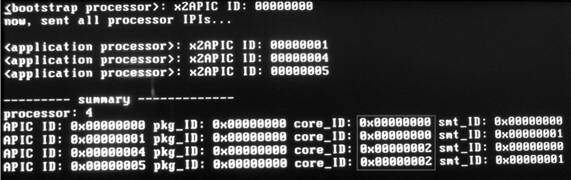

上面是另一个显示结果(分解出 Package/Core/SMT ID 值), 这个结果显示 Package ID 为 0(表示只有一个物理处理器), 而 Core 有两个编号(表示有两个核心), 可是 Core ID 值并不是连续的, 从而造成了 system bus 上分配的 APIC ID 值并不是连贯的.