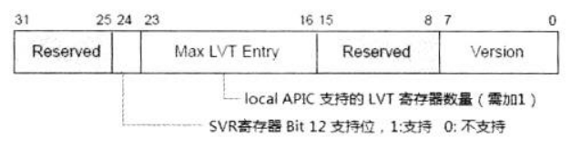
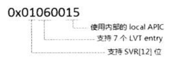

在 local APIC 内有一个 **version register**, 指示了 local APIC 的版本. 这是 read only 的.

local APIC 版本寄存器分为**三个部分**.

1) **version**: 指示 local APIC 使用**外部的 82489DX 芯片**, 还是使用**处理器内部的 APIC**.

2) **Max LVT Entry**: 指示 local APIC**支持多少个 LVT 寄存器**, 这个值需**加上 1**才是真正的 **LVT 寄存器个数**.

3) **bit 24**: 这个位指示**是否支持 SVR**(Spurious Interrupt Vector Register)的 bit 12 位, 为 1 时支持, 否则不支持.

`SVR[12]` 是 Suppress EOI Broadcast(**抑制** EOI 广播到 I/O APIC)位, 在版本寄存器的 bit 24 为 1 时, 可以对 `SVR[12]` 进行置位(当 `SVR[12]` 置位时, delivery mode 为 Fixed 模式, 且属于 level 触发中断, 它的中断服务例程完成后, 发送 EOI 命令时将不会广播发送到 I/O APIC).

上面是从实验 18-3 的运行结果中得到的, 在笔者的移动 Core i5 处理器上的 local APIC 版本寄存器的值, 它支持**7 个 LVT entry(LVT 寄存器**).

