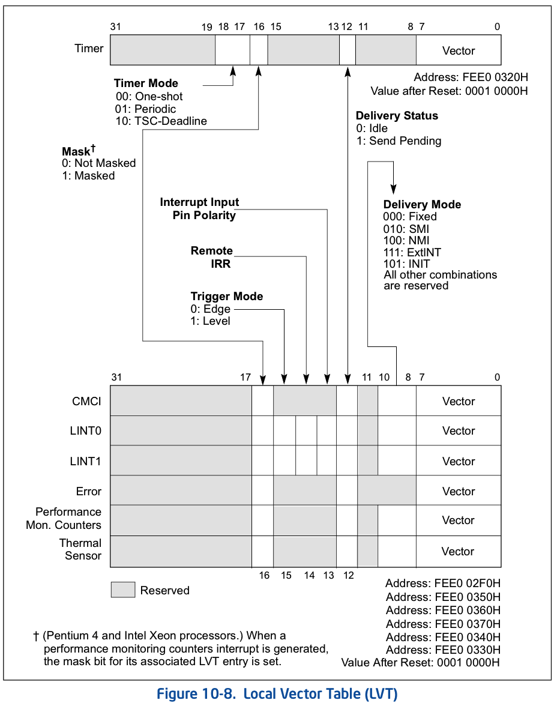

<!-- @import "[TOC]" {cmd="toc" depthFrom=1 depthTo=6 orderedList=false} -->

<!-- code_chunk_output -->

- [1. LVT 寄存器](#1-lvt-寄存器)
  - [1.1. 7 个 LVT 寄存器](#11-7-个-lvt-寄存器)
    - [1.1.1. CMCI](#111-cmci)
    - [1.1.2. Timer](#112-timer)
    - [1.1.3. Thermal Monitor](#113-thermal-monitor)
    - [1.1.4. Performance Counter](#114-performance-counter)
    - [1.1.5. LINT0](#115-lint0)
    - [1.1.6. LINT1](#116-lint1)
    - [1.1.7. Error](#117-error)
- [2. 寄存器域](#2-寄存器域)
  - [2.1. vector: 向量号](#21-vector-向量号)
  - [2.2. delivery mode: 交付模式](#22-delivery-mode-交付模式)
  - [2.3. delivery status(Read Only): 交付状态](#23-delivery-statusread-only-交付状态)
  - [2.4. interrupt input pin polarity](#24-interrupt-input-pin-polarity)
  - [2.5. remote IRR(Read Only)](#25-remote-irrread-only)
  - [2.6. tirgger mode: 触发模式](#26-tirgger-mode-触发模式)
  - [2.7. mask: 屏蔽位](#27-mask-屏蔽位)
  - [2.8. timer mode: timer 计数模式](#28-timer-mode-timer-计数模式)

<!-- /code_chunk_output -->

# 1. LVT 寄存器

软件设置后, **只在当前 CPU 上发生中断**. 其他 CPU 不感知.

## 1.1. 7 个 LVT 寄存器

LVT(**Local Vector Table**)寄存器是 **local APIC 本地中断源产生者**, 在新的处理器上 local APIC 支持**最多 7 个 LVT 寄存器**, 分别如下.

### 1.1.1. CMCI

LVT CMCI 寄存器: 地址偏移量在 2F0H.

负责发送 Corrected Machine Check Error Interrupt, 即被纠正的 Machine Check Error 累积至超过一个阈值后, 便会引起一个 CMCI 中断(从至强 5500 起才有此项, 该功能默认禁止)

### 1.1.2. Timer

LVT Timer 寄存器: 地址偏移量在 320H.

负责发送由 **APIC Timer** 产生的**中断**

### 1.1.3. Thermal Monitor

LVT Thermal Monitor 寄存器: 地址偏移量在 330H.

负责发送由**温度传感器**产生的中断(从奔腾 4 起才有此项)

### 1.1.4. Performance Counter

LVT Performance Counter 寄存器: 地址偏移量在 340H.

负责发送由**性能计数器**Overflow 产生的中断(从 P6 family 起才有此项)

所以针对 Pentium 4 和 Intel Xeon 处理器, 当生成性能监控计数器中断时, 其关联 LVT 条目的 mask bit 会被设置.

### 1.1.5. LINT0

LVT LINT0 寄存器: 地址偏移量在 350H.

负责**转发**来自 **LINT0 引脚**的中断

### 1.1.6. LINT1

LVT LINT1 寄存器: 地址偏移量在 360H.

负责**转发**来自 **LINT1 引脚**的中断

### 1.1.7. Error

LVT Error 寄存器: 地址偏移量在 370H.

负责发送 **APIC 内部错误**时产生的中断

# 2. 寄存器域

软件**对这些寄存器进行编程**设置, 可以**接收和产生 local interrupt 源**. 每个寄存器由若干部分组成, 并**不是每个寄存器的子域都相同**.

如上所示, 这些子域如下.

## 2.1. vector: 向量号

**vector**(`bit7 ~ bit0`): 由软件设置 local interrupt 的**中断 vector**, 和一般的中断处理一样, 这个 vector 值被**用于在 IDT 中查找 interrupt 描述符**.

## 2.2. delivery mode: 交付模式

**delivery mode**(`bit10 ~ bit8`): 这个 3 位值提供 **5 个 delivery mode(交付模式**), 即

* **Fixed 模式**(`000B`): 传递 vector 字段中指定的中断.

* **SMI 模式**(`010B`): 通过处理器的本地 SMI 信号路径将 SMI 中断传送到处理器内核. 使用此交付模式时, 应将 vector 字段设置为 00H 以备将来兼容.

* **NMI 模式**(`100B`): 向处理器提供 NMI 中断. vector 信息将被忽略.

* **INIT 模式**(`101B`): 向处理器内核传递 INIT 请求, 这会导致处理器执行 INIT. 使用此交付模式时, 应将 vector 字段设置为 00H 以备将来兼容. 不支持 LVT CMCI 寄存器、LVT Thermal Monitor 寄存器或 LVT performance counter 寄存器.

* `110B`: 保留的, 不支持任何 LVT 寄存器.

* **ExtINT 模式**(`111B`): 使处理器对中断的响应, 就好像中断源自外部连接的(8259A系列)中断控制器一样. 与 ExtINT 对应的特殊 INTA 总线周期被路由到外部控制器. **外部控制器**应**提供向量信息**. APIC 架构仅支持系统中的一个 ExtINT 源, 通常包含在兼容性桥中. 系统中只有一个处理器应将 LVT 条目配置为使用 ExtINT 交付模式. LVT CMCI 寄存器、LVT Thermal Monitor 寄存器或 LVT performance counter 寄存器是不支持的.

## 2.3. delivery status(Read Only): 交付状态

**delivery status**(`bit 12`): 这个位指示**中断在 delivery 时的状态**:

- 0 为 **idle(空闲)状态**, **当前没有中断在交付中**, 或者**中断已经交付给 processor 进行处理**;

- 1 为 **pending**(悬挂)状态, 当前的中断**已经 delivery**, 但**processor 未进行处理**.

只有将 delivery status 恢复 idle(空闲)状态才能允许接受**下一次中断(！！！**).

## 2.4. interrupt input pin polarity

**interrupt input pin polarity**(bit 13): 这个位**只用于 LVT LINT0 和 LVT LINT1 寄存器(对应于 LINT0 和 LINT1 接口**), 它们分别**对应于处理器的 INTR 和 NMI pin**.

这个位设置连接的 **pin 的中断触发信号**:

* 为 0 表示 **high\-level**, 只有处于 high 才会产生中断

* 为 1 表示 **low\-level**, 只有处于 low 才会产生中断

## 2.5. remote IRR(Read Only)

remote IRR flag(bit 14): 只读的. 表示该中断是不是已经被 local APIC 接收并在处理中. 仅仅使用在 **delivery 模式为 Fixed** 并且 **level 触发模式**中.

* local APIC **已经接收并处理由 INTR 和 NMI 交付的中断**时, 会设置此 bit 为 1.

* local APIC **接收到 EOI 命令**时, 会重置此 bit 为 0.

对于**边沿触发中断**, 其**含义未定义**. 有些系统 (Linux/Xen) 会假定当一个 LVT 被配置成 edge 触发时, local APIC 硬件会自动 clear remote IRR.

看上图, 这个位**只用于 LVT LINT0 和 LVT LINT1 寄存器**.

Linux 中对这个 bit 使用的不多, 也就是热迁移时候来检查.

## 2.6. tirgger mode: 触发模式

**trigger mode**(bit 15): **仅用于 LVT LINT0 和 LVT LINT1 寄存器**, 设置它们的**触发模式**.

- 0 为 **edge 触发**,
- 1 为 **level 触发**.

## 2.7. mask: 屏蔽位

**mask**(bit16): 设置 local interrupt 的**屏蔽位**, 为 1 时设置为屏蔽中断的响应.

## 2.8. timer mode: timer 计数模式

**timer mode**(bit18~bit17): **仅使用于 LVT Timer 寄存器**, 设置 Timer count**计数模式**.

* 00: one-shot(一次性计数);

* 01: periodic 周期计数;

* 10: TSC-deadline(指定 TSC 值计数).
