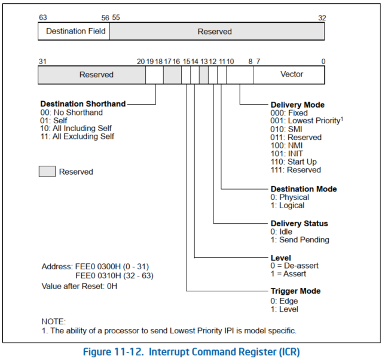
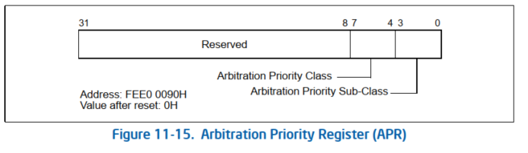

<!-- @import "[TOC]" {cmd="toc" depthFrom=1 depthTo=6 orderedList=false} -->

<!-- code_chunk_output -->

- [1. ICR 寄存器](#1-icr-寄存器)
- [2. Destination Shorthand 域](#2-destination-shorthand-域)
- [3. Destination Mode 域](#3-destination-mode-域)
- [4. Destination Field 域](#4-destination-field-域)
- [5. Delivery Mode 域](#5-delivery-mode-域)
  - [5.1. Lowest Priority 模式](#51-lowest-priority-模式)
  - [5.2. Start Up 模式](#52-start-up-模式)

<!-- /code_chunk_output -->

Local APIC 提供了一个机制, 可以让软件发起 IPIs. 使用的就是 **中断命令寄存器** (**ICR**). ICR 可用于以下功能:

* 将中断发送到另一个处理器.

* 允许处理器将其收到但未处理的中断转发给另一个处理器进行处理.

* 指示处理器中断自身(执行自我中断).

* 将特殊 IPI, 比如 start-up IPI (SIPI) 消息, 发送给其他处理器.

使用此寄存器生成的中断通过**系统总线**(对于 Pentium 4 和 Intel Xeon 处理器)或 **APIC 总线**(对于 P6 系列和 Pentium 处理器)传送到系统中的其他处理器. 处理器发送最低优先级 IPI 的能力是特定于型号的, BIOS 和操作系统软件应避免这种情况.

# 1. ICR 寄存器

**logical processor** 可以使用 **ICR(interrupt command register**) 向**一个**或**一组 logical processor**发送 **inter-processor interrupt(IPI) 进行通信**.

注: IPI 有两个意思, `Intra-process interrupt`(处理器内部中断, 也称为 self-IPI) 和 `Inter-processor interrupt`(处理器之间中断), 所以有些资料会统称 IPIs.



上图是在 **xAPIC 模式**下, **64 位**的 ICR 分为**两部分映射在物理地址**上:

* **高 32 位**地址偏移量是 **310H**;

* **低 32 位**地址偏移量是 **300H**

在 **x2APIC 模式**下使用 **RDMSR 和 WRMSR 指令**访问 **64 位的 MSR 地址是 830H**.

**ICR 与 LVT 寄存器部分域作用是相同的**, 此外还新增了几个域.

# 2. Destination Shorthand 域

这个域设置发送 IPI 消息的**目标类型**.

1) **00** (`No Shorthand`): 这个模式用户可以**自定义**提供发送的**指定目标**.

2) **01** (`Self`): logical processor 给**自己发送 IPI 命令**.

3) **10** (`All including self`): 给**所有 logical processor 发送 IPI 命令**, **包括自己**.

4) **11** (`All excluding self`): 给所有 logical processor 发送 IPI 命令, 但**不包括自己**.

> 为什么 Linux 内核没有使用?

# 3. Destination Mode 域

这个域使用在 **No Shorthand 模式**中, 提供**查找目标 processor 的方式**.

- 0 为 **physical 方式**,

- 1 为 **logical 方式**.

它们的使用依赖于 **LDR(Logical Destination Register**)和 **DFR(Destination Format Register**). 我们将在后面进行探讨.

# 4. Destination Field 域

这个域提供**目标 processor 地址**. 我们将在后面的发送 IPI 消息部分进行探讨.

# 5. Delivery Mode 域

在 ICR 的 **delivery mode**里增加了 **2 个交付模式**: **Lowest Priority 模式**和 **Start Up 模式**, **去掉了 ExtINT 模式**.

## 5.1. Lowest Priority 模式

> 001B

与 fixed 模式相同, 不同之处在于中断被传送给在 destination 字段中指定的处理器集中以最低优先级执行的处理器. 处理器发送最低优先级 IPI 的能力是特定于型号的, BIOS 和操作系统软件应避免使用.

使用 lowest priority 交付模式匹配的**目标 logical prcessor**或**一组 logical processor**运行在**低优先级**下.

在最低优先级交付模式下, ICR 被编程为使用逻辑或简写目标机制选择处理器, 向系统总线上的多个处理器发送 IPI. 然后, 选定的处理器通过系统总线或 APIC 总线相互仲裁, 优先级最低的处理器接受 IPI.

对于基于 Intel Xeon 处理器的系统, 芯片组总线控制器接受来自系统中 I/O APIC 代理的消息, 并将中断定向到系统总线上的处理器. 当使用最低优先级交付模式时, 芯片组从一组可能的目标中选择一个目标处理器来接收中断. 奔腾 4 处理器在系统总线上提供特殊的总线周期, 告知芯片组系统中每个逻辑处理器的当前任务优先级. 芯片组保存此信息并在收到中断时使用它来选择优先级最低的处理器.

对于基于 P6 系列处理器的系统, 最低优先级仲裁中使用的处理器优先级包含在每个本地 APIC 中的仲裁优先级寄存器 (APR) 中. 图 11-15 显示了 APR 的布局.



APR 计算如下:

```cpp
IF (TPR[7:4] ≥ IRRV[7:4]) AND (TPR[7:4] > ISRV[7:4])
    THEN
        APR[7:0] ← TPR[7:0]
    ELSE
        APR[7:4] ← max(TPR[7:4] AND ISRV[7:4], IRRV[7:4])
        APR[3:0] ← 0.
```

这里, TPR 值是 TPR 中的任务优先级值(见图 11-18), IRRV 值是 IRR 中设置的最高优先级位的向量编号(见图 11-20)或 00H(如果未设置 IRR 位), ISRV 值是 ISR 中设置的最高优先级位的向量编号(见图 11-20). 在目标处理器之间进行仲裁后, APR 中值最低的处理器将处理 IPI, 而其他处理器将忽略它.

(P6 系列和 Pentium 处理器. )对于这些处理器, 如果存在焦点处理器, 则它可以接受中断, 而不管其优先级如何. 如果处理器当前正在处理该中断或它有该中断的待处理请求, 则称该处理器为中断的焦点. 对于 Intel Xeon 处理器, 不支持焦点处理器的概念.

在使用最低优先级交付模式但不更新 TPR 的操作系统中, 芯片组中保存的 TPR 信息可能会导致中断始终从逻辑集交付到同一处理器. 此行为在功能上与 P6 系列处理器向后兼容, 但可能会导致意外的性能影响.

## 5.2. Start Up 模式

> 110B

logical processor 可以发送**SIPI(Start\-Up IPI**)消息给**目标 logical prcessor**或**一组 logical processor**.

在 MP 系统里所有的 AP(Application Processor, 应用处理器)在完成自己的初始化后, 进入 `wait-for-SIPI` 状态.

等待从**BSP(Bootstrap Processor, 自举处理器)发送过来的 SIPI 消息**, 然后每个 AP 处理器**执行自己的配置程序**.
