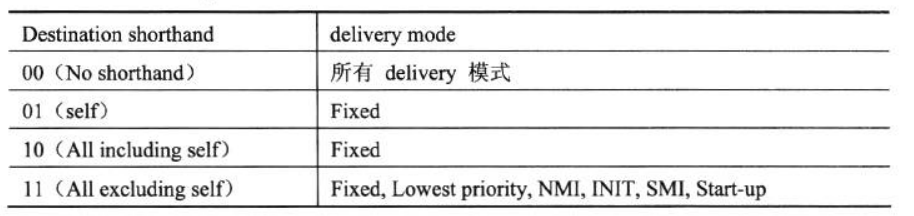

<!-- @import "[TOC]" {cmd="toc" depthFrom=1 depthTo=6 orderedList=false} -->

<!-- code_chunk_output -->

- [1. delivery mode 的设置](#1-delivery-mode-的设置)
  - [1.1. 在 LVT 寄存器中](#11-在-lvt-寄存器中)
  - [1.2. 在 ICR 中](#12-在-icr-中)
- [2. trigger 模式的设置](#2-trigger-模式的设置)
  - [2.1. 在 LVT 寄存器中](#21-在-lvt-寄存器中)
  - [2.2. 在 ICR 中](#22-在-icr-中)

<!-- /code_chunk_output -->

在 **power-up 或 reset**后, 所有 LVT 寄存器初始化为 00010000H, 它们的 mask 位置位, 指示**这些 local interrupt 都是屏蔽**的, **ICR 并没有 mask 位, 它的初始值为 0**.

# 1. delivery mode 的设置

> 交付模式

## 1.1. 在 LVT 寄存器中

1) **CMCI 寄存器**、**Thrrmal monitor** 寄存器和 **Preformance monitor** 寄存器只能使用 **Fixed、SMI 及 NMI 交付模式**.

2) **LINT0 和 LINT1 寄存器**只能使用 **Fixed、ExtINT 及 NMI 交付模式**.

## 1.2. 在 ICR 中

**delivery mode** 的使用依赖于 **destination shorthand 模式(发送 IPI 消息的目标类型**), 如下表所示.



# 2. trigger 模式的设置

> 触发模式

APIC 定义的中断触发的时机有两种: **Edge triggered(边缘触发**) or **Level triggered(水平触发**)

Edge triggered(边缘触发)意味着中断信息的发送是通过**电平转换来触发**的(**上升沿**或者**下降沿**), 也就是类似于脉冲信号. 这意味着信号**如果没有被接受就会丢掉**. 多个统一中断向量的中断触发会产生**多个中断信息**.

Level triggered(水平触发)是通过**维持电平来触发**的. 系统会**周期性的检查引线的电平**, 如果符合要求(比如高电平), 那么就认为中断向量被触发. 在电平未清除之前, 重复触发会被 ignore 掉(因为一直在高电平?? 还是一直触发呢??).

准确的说**edge**分为 `low-to-high edge triggered`(**上升沿**)和 high\-to\-low edge triggered(**下降沿**); **level**分为 active high level\-sensitive(**高电平维持**)和 active low level\-sensitive(**低电平维持**). 具体需要查看**各个芯片的文档**.

```
[root@centos7 ~]# cat /proc/interrupts
           CPU0       CPU1       CPU2       CPU3
  0:         45          0          0          0   IO-APIC-edge      timer
  1:          1          1          1          0   IO-APIC-edge      i8042
  8:          1          0          0          0   IO-APIC-edge      rtc0
  9:          4          0          0          0   IO-APIC-fasteoi   acpi
 12:          1          0          2          1   IO-APIC-edge      i8042
 16:         10          1         12          2   IO-APIC-fasteoi   ehci_hcd:usb1
 23:         13          1         14          1   IO-APIC-fasteoi   ehci_hcd:usb2
 24:          0          0          0          0   PCI-MSI-edge      PCIe PME, pciehp
 25:          0          0          0          0   PCI-MSI-edge      PCIe PME
 26:        117         14        290          5   PCI-MSI-edge      xhci_hcd
 27:      12853          5         57          0   PCI-MSI-edge      p4p1
 28:       1085        488       3997       2156   PCI-MSI-edge      0000:00:1f.2
 29:          3          2         24         10   PCI-MSI-edge      i915
 30:         38          5        420          0   PCI-MSI-edge      snd_hda_intel
 31:          0          0         10          1   PCI-MSI-edge      mei_me
 32:         26          9         23          0   PCI-MSI-edge      snd_hda_intel
NMI:          0          0          0          0   Non-maskable interrupts
LOC:      66556      45656      22277      19634   Local timer interrupts
SPU:          0          0          0          0   Spurious interrupts
PMI:          0          0          0          0   Performance monitoring interrupts
IWI:       3765        552        416        338   IRQ work interrupts
RTR:          1          0          0          0   APIC ICR read retries
RES:       1541       1212       1102        713   Rescheduling interrupts
CAL:        949       1092       1070       1171   Function call interrupts
TLB:         79        120        226        131   TLB shootdowns
TRM:          0          0          0          0   Thermal event interrupts
THR:          0          0          0          0   Threshold APIC interrupts
DFR:          0          0          0          0   Deferred Error APIC interrupts
MCE:          0          0          0          0   Machine check exceptions
MCP:          4          4          4          4   Machine check polls
ERR:          0
MIS:          0
PIN:          0          0          0          0   Posted-interrupt notification event
PIW:          0          0          0          0   Posted-interrupt wakeup event
```

查看 `/proc/interrupts`, 会发现**两种不同 APIC**的设置: `apic-edge` 和 `apic-fasteoi`. 前者如其名字, 代表**edge triggered**; 后者是**level trigger**, 并且**中断的状态(ISR)会保持(！！！水平触发情况下, 详见下面章节！！！**), 直到 **EOI(end of interrupt, 代表中断处理完毕**)被 **PIC(programmable Interrupt Controller)接收到**, 才会**被清除**.

在 **LVT LINT0 和 LINT1 寄存器**里可以由**用户设置**中断的**触发模式**, 其他 LVT 寄存器使用**固定的触发模式**, 依赖于 **delivery mode**.

## 2.1. 在 LVT 寄存器中

1) **Fixed 模式**: LNT0 和 LINT1 寄存器 bit 15 为 0 时使用 edge 触发, 为 1 时使用 level 触发.

2) **NMI、SMI 及 INIT 模式**: 固定使用 **edge 触发模式**.

3) **ExtINT 模式**: 固定使 用**level 触发**模式.

LVT **timer**和 LVT **error**寄存器固定使用**edge 触发模式**.

## 2.2. 在 ICR 中

**只支持 edge 触发模式**, 当设置为 level 触发时 local APIC 将忽略, 使用 edge 触发模式代替.
