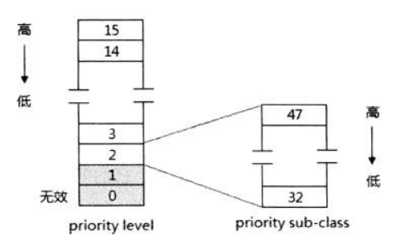
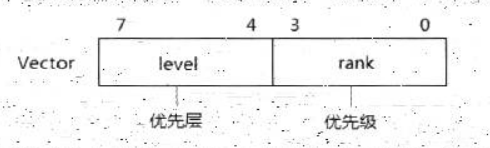
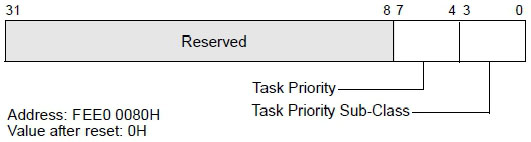

<!-- @import "[TOC]" {cmd="toc" depthFrom=1 depthTo=6 orderedList=false} -->

<!-- code_chunk_output -->

- [1. local interrupt 的 vector 设置](#1-local-interrupt-的-vector-设置)
- [2. 有效的 vector 值](#2-有效的-vector-值)
  - [2.1. 使用 0~15 时](#21-使用-015-时)
  - [2.2. 使用 16~31 时](#22-使用-1631-时)
- [3. local interrupt 的优先级](#3-local-interrupt-的优先级)
  - [3.1. TPR(Task Priority Register)](#31-tprtask-priority-register)
  - [3.2. 处理器当前的优先级](#32-处理器当前的优先级)
- [4. 在 64 位模式下的优先级](#4-在-64-位模式下的优先级)

<!-- /code_chunk_output -->

**LVT 寄存器和 ICR 寄存器**的 **vector 域**提供 local interrupt 的 vector 值, 这个 vector 的使用将和保护模式下中断/异常处理的 vector 一致, **从 IDT 里读取 interrupt 描述符**.

# 1. local interrupt 的 vector 设置

在 **LVT 寄存器和 ICR 寄存器**里 vector 域的设置依赖于它们的 **delivery mode(交付模式**).

1) **Fixed 模式**: 允许在 vector 里提供**自定义的 vector 值**.

2) **NMI 模式**: vector 值被忽略, processor 将使用**固定的 2 号 NMI vector 值**.

3) **SMI 模式**: vector 值必须设置为 **0 值**.

4) **ExtINT 模式**: 使用在 **LVT 寄存器**里, **ICR 不支持**. 使用 ExtINT 模式, processor 将接收由**外部中断控制器(如 8259 中断控制器)经 data bus 发送过来的 vector 值**.

5) **INIT 模式**: vector 值必须设置为**0 值**.

6) **Lowest priority** 模式和 **Start-Up** 模式: 使用在 **ICR 寄存器**里, 允许在 vector 提供**自定义的 vector** 值.

# 2. 有效的 vector 值

在前面所述的需要提供 vector 值时, 不应该使用 x86/x64 体系中预定义(或保留)的 0~31 号作为 vector, 正常的中断向量号应该使用 `32~255`(用户自定义的 vector).

## 2.1. 使用 0~15 时

vector 设置为 0~15, 它是**无效的中断向量号**, 中断**不会被响应**. local APIC 将在 **ESR**(`Error Status Register`)里记录**这个错误**. 从而引发 **LVT error 中断(通过 LVT Error 寄存器！！！**), 在**未屏蔽时**将执行由 **LVT error 寄存器**设置的错误处理程序.

## 2.2. 使用 16~31 时

vector 设置为 16~31, local APIC **不会认为它是非法**的(不会记录在 ESR 中). 可是当 local interrupt 使用这个范围内的中断向量号将会和系统所定义中断/异常处理例程产生冲突. 引起调用 OS 中预定义的异常处理例程, 导致**执行错误的中断处理**.

# 3. local interrupt 的优先级

在 local APIC 里, **中断的优先级基于中断 vector(！！！**)来判定, **vector 的值越大**, **优先级越高**. 将 256 个中断向量号分为 **16 个 priority level(中断优先等级**)或称为 **priority class**, 基于下面的算法.

```c
priority_level = vector / 16
```

那么, priority 将分成 `0 ~ 15` 的等级, **每个等级对应 16 个中断向量号**.



**等级 0** 对应的 **vector 为 0~15**, **等级 1**对应的 **vector 为 16~31**, 因此这两个在 local APIC 中属于**无效的 priority level**(**等级 0 无效, 等级 1 不应该使用**).

那么有效的 priority level 是 2~15, 如上图所示, 等级 2 对应于 32~47 的中断向量号. 等级 15 是最高级, 等级 2 最低.



根据前面所述, 通常**一个中断向量号(！！！还是一字节宽！！！**), 可以分为**两部分**, **高 4 位**对应于 **priority level**, **低 4 位是 rank**或 sub-class 值. 在同一个等级里, rank 值高则优先级高.

## 3.1. TPR(Task Priority Register)

local APIC 提供了一个 **TPR**(`task priority register`, **任务优先级寄存器**), 在 TPR 里设定一个值, 允许 local APIC **只响应优先级高于这个值的中断**.



如上所示, `TPR[7: 4]` 设定一个中断门坎值. 假如**软件设置** `TPR[7: 4]` 值为 **0**, 则 local APIC**允许响应所有的中断请求**; 假如 `TPR[7: 4]` 值为 15, 则抑制所有的中断. 下面是 TPR 的使用算法.

```c
if (vector[7: 4] > TPR[7: 4])  /* 中断请求的优先级是否高于 TPR 的门坎值 */
{
       /* 响应中断请求 */
}
else
{
       /* 低于或等于: 中断请求被屏蔽 */
}
```

值得注意的是, 使用 **NMI、SMI、INIT、ExtINT, 以及 Start-Up 交付模式**的中断**不受 TPR 的影响**.

## 3.2. 处理器当前的优先级

然而, 一个**中断请求能得到响应**, 并**不是**只依据 `TPR[7: 4]` 的值, 还需要**依赖于 ISR**(`In-Service Register`), 在 **TPR 和 ISR 的互相作用**下产生 "**处理器当前的优先级**".

```cpp
if (TPR[7: 4] >= MSB_OF(ISR)) /* TPR[7: 4]和 ISR 记录的最高中断服务例程 vector[7: 4]进行比较 */
{
   PPR[7: 0]=TPR[7: 0];
}
else
{
   PPR[7: 4]=MSB_OF(ISR) & 0xf0;  /* PPR 的 [7: 4] 位 */
   PPR[3: 0]=0;        /* 低 4 位为 0 */
}
```

在 `TPR[7: 4]` 和 **ISR** 记录的**正在服务的最高中断优先级服务例程**的 `vector[7: 4]` 间进行比较, 两者中的**最高值**就是"**处理器当前的优先级**", 它记录在**只读的 PPR**(`Processor Priority Register`, **处理器优先级寄存器**)里.


**PPR 和 TPR 这两个寄存器**的结构和意义是一样的. 当**ISR 的值为 0** 时 **PPR 的值就等于 TPR 的值**. **中断请求的优先级**只有**高于** `PPR[7: 4]` 才可能被响应(！！！).


从上面的运行结果我们可以看到, 当设 **TPR** 的值为**0x32** 时(**PPR** 也为 **0x32**), **0x33 号**中断请求记录在 **IRR** 里(第 **0x33 位置位**), 但**被抑制没有响应**.

# 4. 在 64 位模式下的优先级

在 **x64 体系**里, 提供了 **CR8 寄存器作为 TPR(Task Priority Register)的编程接口**, CR8 寄存器仅在 64 位模式下有效:


访问 CR8 寄存器需要 0 级的权限, CR8 寄存器**仅使用低 4 位**(`bit 3 ~ bit 0`), 这个值是前面所述的 16 个 priority level(优先等级).

```cpp
void write_cr8(int priority_level)
{
       cr8=priority_level & 0x0f;   /* 写 CR8 寄存器 */
       TPR[7: 4]=cr8[3: 0];     /* 更新 TPR */
       TPR[3: 0]=0;
}
int read_cr8()
{
       cr8[3: 0]=TPR[7: 4];     /* 从 TPR 里读 */
       return cr8;
}
```
CR8 寄存器的作用是和 TPR 一致的. 从上面的式子我们可以看到:

1) 当**写 CR8 寄存器**时, `TPR[7: 4]` 值将被更新为 **CR8** 的值.

2) 当**读 CR8 寄存器**时, CR8 寄存器的值从 `TPR[7: 4]` 里得到.

因此, CR8 的值和 `TPR[7: 4]` 里的值是相同的. 当然, local APIC 需要被 enable(开启)