<!-- @import "[TOC]" {cmd="toc" depthFrom=1 depthTo=6 orderedList=false} -->

<!-- code_chunk_output -->

- [1. APIC 概述](#1-apic-概述)
- [硬件](#硬件)
- [2. I/O APIC 寄存器](#2-io-apic-寄存器)
  - [2.1. indirect register(间接访问寄存器) 访问](#21-indirect-register间接访问寄存器-访问)
  - [2.2. direct register(直接寄存器) 访问](#22-direct-register直接寄存器-访问)
  - [2.3. I/O APIC 寄存器的基址](#23-io-apic-寄存器的基址)
  - [2.4. 开启和设置 I/O APIC 基址](#24-开启和设置-io-apic-基址)
- [3. direct register(直接寄存器)](#3-direct-register直接寄存器)
  - [3.1. Index Register](#31-index-register)
  - [3.2. Data Register](#32-data-register)
  - [3.3. EOI Register](#33-eoi-register)
- [4. indirect register(间接寄存器)](#4-indirect-register间接寄存器)
  - [4.1. I/O APIC ID 寄存器](#41-io-apic-id-寄存器)
  - [4.2. I/O APIC version 寄存器](#42-io-apic-version-寄存器)
  - [4.3. Redirection table 寄存器](#43-redirection-table-寄存器)
    - [4.3.1. remote IRR](#431-remote-irr)
    - [4.3.2. delivery status](#432-delivery-status)
    - [4.3.3. polarity](#433-polarity)
    - [4.3.4. mask](#434-mask)
    - [4.3.5. 中断消息相关](#435-中断消息相关)
- [5. I/O APIC 的 IRQ](#5-io-apic-的-irq)
  - [5.1. IRQ0](#51-irq0)
  - [5.2. IRQ2](#52-irq2)
  - [5.3. IRQ1/IRQ3~IRQ15](#53-irq1irq3irq15)
  - [5.4. IRQ16~IRQ23](#54-irq16irq23)
- [6. 对比 8259](#6-对比-8259)
  - [6.1. 中断处理](#61-中断处理)
  - [6.2. 中断仲裁和优先级](#62-中断仲裁和优先级)
  - [6.3. 仲裁](#63-仲裁)
  - [6.4. 优先级](#64-优先级)
- [7. I/O APIC 的中断处理](#7-io-apic-的中断处理)
- [8. I/O APIC 与 8259 并存时的处理](#8-io-apic-与-8259-并存时的处理)

<!-- /code_chunk_output -->

# 1. APIC 概述

APIC 分为两部分: **local APIC** 与 **I/O APIC**. local APIC 位于**处理器内部**, 而 I/O APIC 则**属于芯片组的一部分**. local APIC 与 I/O APIC 通过 system bus 进行通信.

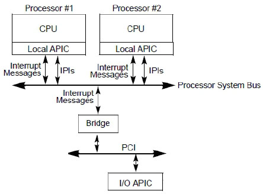

上图展示了 **I/O APIC** 是如何与处理器通信的, 像处理器间通信一样, I/O APIC 发送**中断消息**从 **PCI 桥**通过 **system bus** 到达**指定的处理器(或一组处理器**).

**I/O APIC** 与 **8259 兼容类的中断控制器**最大的不同是,

* **8259 中断控制器**的输出口 INTR 连接到**处理器的 INTR 引脚**(当 **local APIC**开启时, 连接到 **local APIC 的 LINT0 口**上). 在 8259 向处理器发送中断请求过程中, 8259 与处理器需要**来回的通信响应**. 详情请参考 17.1.5 节所述.

* 而对于 **I/O APIC**, 是通过直接**写 I/O APIC 设备内存映射的地址空间(！！！**), 在 system bus 中**传送中断消息**, **无须处理器发出 acknowledge cycle(响应周期)确认**. 因此, I/O APIC 的中断响应更快.

# 硬件

I/O APIC 位于 LPC 控制器中(`Architecture\0. 基本架构\x86\0. Learning\2. x86_64编程体系探索及编程\第4篇 中断体系\第17章 8259中断控制器\0. LPC控制器.md`)

中断引脚(`Architecture\6. PCI\0. Learning\1. PCI express体系结构导读\第3篇 Linux与PCI总线\第15章 Linux PCI的中断处理\1. PCI总线的中断路由.md`)如下:

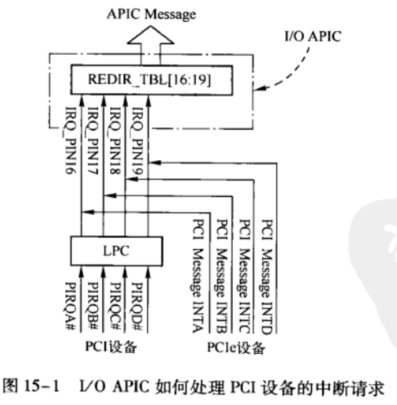

# 2. I/O APIC 寄存器

I/O APIC 的寄存器也是通过**内存映射方式**映射到处理器**物理地址空间**.

**I/O APIC 的寄存器**工作在**两种访问方式**:

- **direct register(直接访问的寄存器**)

- **indirect register(间接访问的寄存器**)

## 2.1. indirect register(间接访问寄存器) 访问

1) 通过向 **index 寄存器(直接访问寄存器**)写入需要访问的 **I/O APIC 寄存器(间接访问寄存器**)的 **index 值**;

2) 然后从 **data 寄存器**读出 I/O APIC 寄存器的值.

```x86asm
mov DWORD [IOAPIC_INDEX_REG], 10h    ;向 index 寄存器写入低 32 位 index 值
mov eax, [IOAPIC_DATA_REG]           ;从 data 寄存器读 10h 寄存器的低 32 位
mov DWORD [IOAPIC_INDEX_REG], 11h    ;写入高 32 位 index 值
mov edx, [IOAPIC_DATA_REG]           ;读 10h 寄存器的高 32 位
```

在上面的代码示例里, 在 **32 位**代码下: 当**读的寄存器是 64 位宽**, 那么需要分**两次读(每次只能读 32 位寄存器**). 寄存器的 index 分两次写入 index 寄存器, 再从 data 寄存器读出值.

```x86asm
mov DWORD [IOAPIC_INDEX_REG], 10h    ;向 index 寄存器写入 index 值
mov rax, [IOAPIC_DATA_REG]           ;读入完整的 64 位值
```

在 **64 位**代码下, 软件可以**一次读取 64 位 I/O APIC 寄存器**的值, 寄存器的 **index** 值必须是 **8 byte 边界**上.

## 2.2. direct register(直接寄存器) 访问

直接访问的寄存器有三个, 如下表所示.

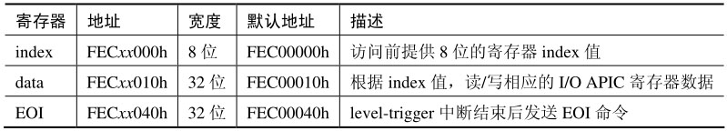

**软件**通过 **index 和 data 寄存器**来**间接访问 I/O APIC 的所有寄存器**.

EOI(End Of Interrupt)寄存器**仅使用在 level 触发模式(！！！**)上, 对 **edge 触发模式的中断无影响**.

在设置 SVR[bit 12], 也就是抑制广播 EOI 消息时候, 系统软件会通过**写入这个 RTE 所在的 I/O APIC 的 EOI 寄存器**来完成.

## 2.3. I/O APIC 寄存器的基址

在上表中的直接访问寄存器里, 地址中 xx(**bit 19 到 bit 12**)代表它们的地址是未确定的, 最终由 **OIC(other interrupt controller)控制器来决定**.

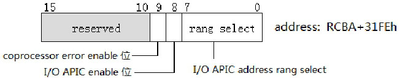

**OIC 寄存器**的 **bit 7 ~ bit 0** 指定了 **I/O APIC 寄存器的基地址(！！！**), 对应 I/O APIC direct 寄存器的 **xx 值**(`bit 19 ~ bit 12`).

在默认情况下, **OIC 寄存器的值为 0h**, 那么 **I/O APIC 寄存器的地址值**就是:

* index 寄存器为 FEC00000h;

* data 寄存器为 FEC00010h;

* EOI 寄存器为 FEC00040h.

**BIOS 可能会选择修改这个值**, 软件需要查询或者直接设定一个值来保证正确访问 I/O APIC 寄存器.

**OIC 寄存器的地址**位于 **RCBA**(`root complex base address`)寄存器(PCIE 的 RC 基地址！！！IO APIC 属于 PCIE 设备！！！)的 **31FEh 偏移量**上. 需要访问 OIC 寄存器必须**先得到 RCBA 寄存器的地址**.

代码清单 19-1(lib\pic.asm):

```x86asm
; -------------------------------------------------
;  get_root_complex_base_address(): 得到 RCBA 地址
;  output:
;        eax - RCBA address(memroy space)
; -------------------------------------------------
get_root_complex_base_address:
; 读 RCBA 寄存器
       READ_PCI_DWORD  0, 31, 0, 0F0h   ;读 bus 0, device 31, function 0, offset F0h
       and eax, 0FFFFC000h              ;得到 base address
       ret
```

上面的 get\_root\_complex\_base\_address()函数用来获得 RCBA 寄存器地址, **RCBA 寄存器**位于 **PCI bus 上的 device 31 设备(LPC bridge**), 通过**宏 READ\_PCI\_DWORD(！！！用来读取 PCI 信息, 传 BDF 信息即可**)读取.

```x86asm
READ_PCI_DWORD  0, 31, 0, 0F0h
```

上面的代码使用 **READ\_PCI\_DWORD 宏**来**读取 bus 0, device 31, function 0 第 F0h 偏移量的寄存器！！！**, 这个寄存器就是 **RCBA 寄存器！！！**, 其中 `bit 31 ~ bit 14` 就是 RCBA 基地址(物理地址). 这个宏实现在 `inc\pci.inc` 头文件里.

**重要(！！！**): 通过 **PCI 的宏**找到 **RCBA 基地址**, 然后通过**相应的偏移**找到 **OIC 寄存器(IO APIC 被认为是一个 controller！！！)**, 通过该**寄存器的相应位获取 I/O APIC 寄存器的基址**, IO APIC 的**相关寄存器**都是在该**基址的相应偏移位置**.

## 2.4. 开启和设置 I/O APIC 基址

**OIC 寄存器**的另一个重要作用是**开启 I/O APIC**. bit 8 置位时开启 I/O APIC, I/O APIC 地址可用, 下面的代码来做这项工作.

代码清单 19-2(lib\ioapic.asm):

```x86asm
;------------------------------------
; enable_ioapic(): 开启 ioapic
;------------------------------------
enable_ioapic:
       ;开启 ioapic
       call get_root_complex_base_address
       mov esi, [eax + 31FEh]
       bts esi, 8                       ;IOAPIC enable 位
       and esi, 0FFFFFF00h              ;IOAPIC range select
       mov [eax + 31FEh], esi           ;enable ioapic
       ;设置 IOAPIC ID
       mov DWORD [IOAPIC_INDEX_REG], IOAPIC_ID_INDEX
       mov DWORD [IOAPIC_DATA_REG], 0F000000h          ;IOAPIC ID=0Fh
       ret
```

得到 **OIC** 的值(`RCBA + 31FEh`)后, 第 8 位置位, 并且将 `I/O APIC range select` 值设为 0. 那么我们的 I/O APIC 将使用默认的地址值.

代码清单 19-3(inc\ioapic.inc):

```
%define IOAPIC_INDEX_REG                    0FEC00000h
%define IOAPIC_DATA_REG                     0FEC00010h
%define IOAPIC_EOI_REG                      0FEC00040h
```

在 `inc\ioapic.inc` 文件里定义了这些寄存器常量值, 方便在程序代码里进行访问. 注意, 在笔者的代码里这些地址值使用的 paging 映射方式是: 虚拟地址和物理地址相同.

当然, 完全可以使用不同的映射方式(只是需要注意, 得到 RCBA 寄存器时返回的是物理地址, 但是你并不知道 RCBA 值是多少, 会造成映射上的一些困扰, 最好是在开启 paging 机制前开启 I/O APIC 和设置 I/O APIC 基地址值).

# 3. direct register(直接寄存器)

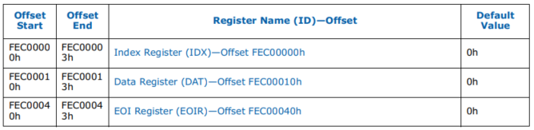

## 3.1. Index Register

索引寄存器将选择要由软件操作的 APIC 间接寄存器. 软件将对该寄存器进行编程以选择所需的 APIC 内部寄存器.

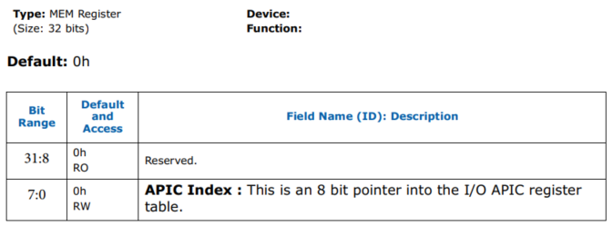

## 3.2. Data Register

此32位寄存器指定要读取或写入索引寄存器指向的寄存器的数据. 此寄存器只能以 DW 为单位进行访问.


EOI(End Of Interrupt)寄存器**仅使用在 level 触发模式(！！！**)上, 对 **edge 触发模式的中断无影响**.

在设置 `SVR[bit 12]`, 也就是抑制广播 EOI 消息时候, 系统软件会通过**写入这个 RTE 所在的 I/O APIC 的 EOI 寄存器**来完成.

## 3.3. EOI Register

当**向该 I/O APIC 的这个寄存器写入**时, **I/0 APIC** 将检查写入该 register 的**低 8 位**, 并将其与 `I/0 Redirection Table`(I/O 重定向表)中**每个条目**的**向量字段**进行**比较**. 找到匹配项后, `RTE.RIRR` 将**被清除**. 如果多个条目具有相同的向量, 则每个条目都将具有 `RTE.RIRR` 已清除. 仅使用位 `7:0`. 位 `31:8` 将被忽略.

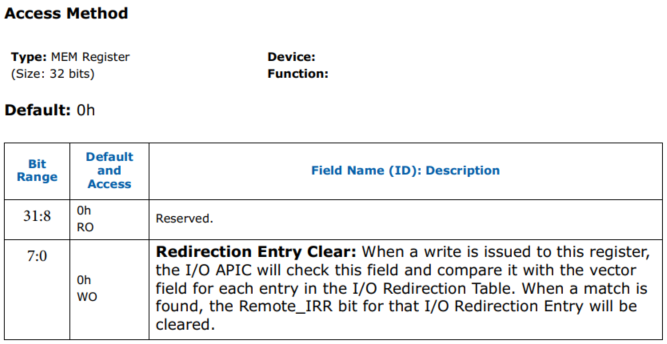

# 4. indirect register(间接寄存器)

现在 **PCH(platform controller hub**)芯片上的 **I/O APIC** 只有 **3 组间接访问寄存器**:

- **I/O APIC ID 寄存器**,
- **I/O APIC version 寄存器**
- **24 个 interrupt redirection table 寄存器**.

> 目前的 RTE 已经扩展到可以有 120 个 (RTE 119), 也就是 index 0xFE ~ 0xFF.

如下表所示.

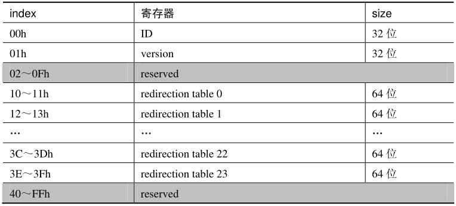

**每个 redirection table 寄存器**是 **64 位**宽, 在 32 位环境下访问需要分高/低 32 位进行两次读或写操作. 在 64 位代码下可以一次性访问 64 位寄存器.

比如, 32 位环境访问 RTE 23, 需要分两次访问.

* 低 32 位通过 index 3E 访问

* 高 32 位通过 index 3F 访问

## 4.1. I/O APIC ID 寄存器

这个寄存器如同 local APIC ID 寄存器一样重要, 当有**多个 I/O APIC 芯片**存在时, 唯一指定 I/O APIC 的编号. **软件必须为 I/O APIC 设置一个 ID 值(！！！软件设置！！！**).

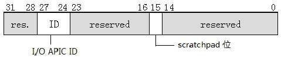

如上所示, I/O APIC ID 寄存器的 bit 27~bit 24 共 **4 位(同时只能支持 16 个 IO APIC??**)值为 ID 值, **软件在使用前必须设置一个值**, I/O APIC ID 值将会在 **system bus** 的**仲裁上使用**到. 在前面代码清单 19-2 里的 `enable_ioapic()` 函数里将 I/O APIC ID 值设为 0Fh.

Bit 15 位是 scratchpad 位, 笔者不知道这个位的作用, Intel 的 PCH 文档里并没有给出说明.

## 4.2. I/O APIC version 寄存器

**每个 I/O APIC 芯片**的 **version 寄存器**指明了 I/O APIC 在 **implementation(硬件实现**)上的情况, 包括了 **I/O APIC 的版本**和**最大包含的 redirection table 数量**.


如上所示, version 寄存器的 `bit 23 ~ bit 16` 域指明了 `redirection table` 寄存器的**数量**. PCH 硬件设这个值为 17h(十进制 23), 表示有 24 个 redirection table 寄存器, 而 version 的值为 20h.

## 4.3. Redirection table 寄存器

> 中断重定向表

可以这样认为, **Redirection table 寄存器**的作用结合了 local APIC 的 **LVT**(`local vector table`) 寄存器和 **ICR**(`interrupt command register`)的功能. 既像 LVT 寄存器一样**产生中断消息**, 也像 ICR 一样具有**发送中断消息**到目标处理器的功能.

而这个**中断消息**是当 **IRQ 线**上的**外部硬件产生中断请求**时, **I/O APIC** 从 **redirection table 寄存器**读取中断信息**发送到目标处理器**.

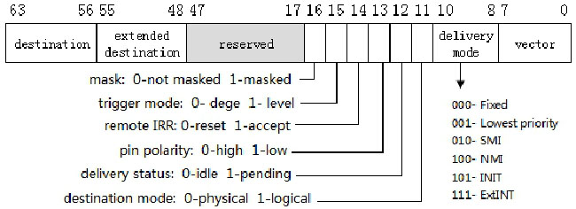

从整个 redirection table 角度看, **每个 redirection table 寄存器**就是一个**RTE(redirection table entry**).

### 4.3.1. remote IRR

**remote IRR**(RIRR, Read Only, 只读): 表示该中断是不是已经被 local APIC 接收并在处理中. 此位用于**电平** (level) 以及 **fixed** 模式触发中断.

对于**边沿触发中断**, 其**含义未定义**. 有些系统 (Linux/Xen) 会假定当一个 RTE 被配置成 edge 触发时, I/O APIC 硬件会自动 clear remote IRR.

对于电平 (level) 触发中断:

* 当 I/O APIC 向 **local APIC** 发送**电平中断**时, 此位设置为 1;

* 当**从 local APIC** 接收到的 **EOI** 消息匹配中断向量(Vector)字段时, 此位被重置为 0.

> 注意, 对于 SMI、NMI、INIT 或 ExtINT 交付模式, 此位从不设置. **仅用于 fixed 交付模式**.

### 4.3.2. delivery status

**delivery status**(DS, Read Only, 只读): 此字段包含此中断交付的**当前状态**.

* 0 = Idle(空闲). 此中断没有激活.

* 1 = Pending(等待中). 已注入中断, 但 delivery 尚未完成.

注意, 写这个 bit 没有任何效果.

### 4.3.3. polarity

polarity(POL, 极性, 可读可写): 这个 bit 指定了连接到中断引脚的中断信号的极性.

* 0. high 信号激活.

* 1. low 信号激活.

### 4.3.4. mask

`mask`(MSK, 可读可写): 用于屏蔽中断, 0 表示不屏蔽, 1 表示屏蔽.

### 4.3.5. 中断消息相关

在上图的 redirection table 寄存器结构与 **LVT 寄存器**、**ICR 大致相同**, I/O APIC 中断消息也需要提供下面的四大要素.

1) 中断服务例程的 **vector 值**.

2) 中断的 **Delivery mode**: 支持 Fixed、lowest priority、SMI、NMI、INIT, 以及 ExtINT 模式.

中断服务例程的有效 vector 在 `16~255`(软件应避免使用 `16~31` 保护模式下**系统使用**的异常处理 vector). 对于**Fixed**与**lowest priority 交付模式**需要**显式提供 vector**, 而**SMI、NMI 及 INIT 交付模式**vector 域必须**写 0**.

**ExtINT 交付模式(！！！**)被使用在 **I/O APIC**连接着**外部的 8259 兼容类中断控制器**, 由 **8259 中断控制器**提供 **vector 值**.

3) `trigger mode`(**触发模式**, 可读可写): edge 或 level 触发模式.

4) `destination Mode`(DSM, 可读可写): 提供 **physical** 或 **logical 目标模式**.

5) `destination`(**目标处理器**): 提供**目标处理器 ID 值**.

* `Destination ID`(**DID**): 如果 bit 11 为 0 (物理目标模式), 则 bit 59:56 为目标处理器 ID. 这种情况下, bit 63:59 应该为 0. 如果 bit 11 为 0 (逻辑目标模式), 则 bit 63:56 指定一组处理器的逻辑目标地址.

* `Extended destination ID`(**EDID**): 表示 address 的 bit 11:4.

# 5. I/O APIC 的 IRQ

I/O APIC 的 **redirection table** 表支持 **24 个 RTE**(即**24 个 redirection table 寄存器**), **每一个** redirection table 寄存器**对应一条 IRQ(interrupt request)线**, 因此 **I/O APIC 支持 24 条 IRQ 线(！！！**),  **每根线**可以连接**一个外设！！！**.

如下表所示.

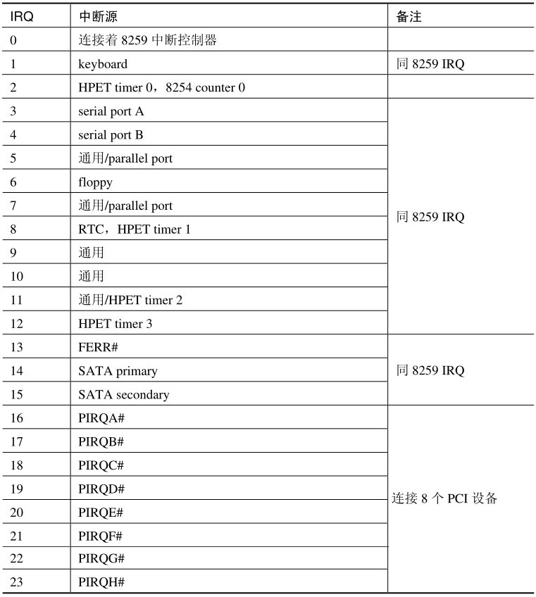

## 5.1. IRQ0

在 I/O APIC 的 **IRQ0 线** 上连接着 **8259 中断控制器的 INTR 输出口**, **redirection table 0 寄存器**需要**使用 ExtINT delivery 模式**, 由 **8259 中断控制器提供 vector**, 如下面的代码所示.

```x86asm
mov DWORD [IOAPIC_INDEX_REG], IRQ0_INDEX    ;RTE0 低 32 位 index 值
mov DWORD [IOAPIC_DATA_REG], PHYSICAL_ID | EXTINT   ;使用 ExtINT delivery 模式
mov DWORD [IOAPIC_INDEX_REG], IRQ0_INDEX + 1    ;RTE0 高 32 位 index
mov DWORD [IOAPIC_DATA_REG], 0      ;APIC ID=0
```

## 5.2. IRQ2

在 PCH 中, **HPET**(`high precision event timer`, **高精度定时器**)的 **timer 0** 可以连接到 **I/O APIC** 的 **IRQ2 线**, 而在 **8259 中断控制器**里 **IRQ2 线**串接着 **8259 从片**.

## 5.3. IRQ1/IRQ3~IRQ15

除了**IRQ0 和 IRQ2 线的不同**外, **I/O APIC** 与 **8259** 的 **IRQ1、IRQ3 ~ IRQ15 连接的硬件设备和作用是相同**的.

## 5.4. IRQ16~IRQ23

**I/O APIC** 比 8259 多出了 **8 条 IRQ 线**, 可以由 PCH 上的**每个 PCI 设备**的 **4 个 interrupt pin 连接(！！！**`INTA~D#`).

在 **PCH 中所支持**的 **8 个 PCI 设备**及它们**所使用的 IRQ 线**如下表所示.

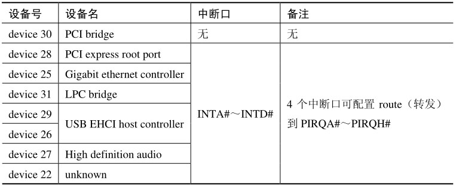

> 这里的 `PIRQA# ~ PIRQH#` 指的就是 **I/O APIC** 的 `IRQ_PIN16 ~ IRQ_PIN23`.

这些设备都是在 **PCI bus 0(！！！**)上, **8 个设备**的分别的 **4 个中断口**(`INTA# ~ INTD#`)可以**配置 route(转发**)到 redirection table 上的 **8 个 IRQ 中断源**(`PIRQA# ~ PIRQH#`), 由 **PCH**的 **chipset configure register**(即 **RCBA 寄存器**, 由前面所说的 `get_root_complex_base_address()` 函数来获得)中**各自**的 `device interrupt route register`(**设备中断通路寄存器**)进行设置.

因此, I/O APIC 的 `IRQ16 ~ IRQ23`(8 个 IRQ, 即对应 8 个 RTE！！！)对应着上面的 **8 个 PCI 设备中断口(！！！**).

# 6. 对比 8259

I/O APIC 对于 8259 的优势是明显的, 当有 **多个 I/O APIC 芯片**存在时, 每个 I/O APIC 有它自己的 **I/O APIC ID 标识**, **每个 redirection table 寄存器**有自己的 **vector**. I/O APIC 处理外部中断的能力将大幅提升.

## 6.1. 中断处理

I/O APIC 的中断处理与 8259 有极大的不同:

* **8259** 向 **BSP 处理器(！！！所以无法用到 MP 多处理器平台！！！**)发送的**中断请求消息**需要处理器**以 INTA 周期来响应**;

* I/O APIC 直接发中断消息到处理器, 属于**直接触发形式**, 并且 I/O APIC 中断消息可发送至 system bus 上的**指定目标处理器**.

**system bus 属于广播总线**, 也就是说**所有的 system bus** 上的消息**每个 CPU 都可以看得到**, 也都**可以处理**.

## 6.2. 中断仲裁和优先级

对于中断请求**仲裁**和**优先级**, 也有下面的不同.

## 6.3. 仲裁

* **I/O APIC 对中断的仲裁**使用 **local APIC(！！！IO APIC 本身不仲裁！！！**)的 **IRR**(`interrupt request register`)、**ISR**(`in-service register`)、**TPR**(`task priority register`), 以及 **PPR**(`processor priority register`), 受到 **local APIC 的制约**.

* **8259** 使用控制器自己**内部**的 **IMR**(`interrupt mask register`)、**IRR**, 以及 **ISR** 仲裁.

## 6.4. 优先级

* 8259 的中断优先级按 **IRQ 次序进行排序**, 在初始状态下优先级是 **IRQ0、IRQ1、IRQ8 ~ IRQ15、IRQ3 ~ IRQ7 的次序**.

* 由于受到 local APIC 的影响, **I/O APIC** 的**优先次序**是按 **IRQ 的中断 vector 大小**来排序.

# 7. I/O APIC 的中断处理

IOAPIC 通常有 **24 个不具有优先级的管脚**, 用于**连接外部设备**.

当 **IRQ 线(连接的外设线！！！**)上有中断请求发生时, **I/O APIC**在**redirection table(通常是操作系统设定的**)里找到管脚对应的**RTE(redirection table entry 或者说 redirection table 寄存器**), 读取 **RTE** 内的**中断消息内容**, 通过其各个字段, 格式化出一条包含该中断所有信息的中断消息, 再经由 **system bus(！！！老式的通过专门的 APIC 总线**), 那么后续的中断处理器流程就和 18.11 节所述的"local APIC 的中断处理"是一致的.

中断消息发送到 system bus 后, 就已经**不属于 I/O APIC 的处理范围**了, 而是在 system bus 硬件和 local APIC 的管辖之内. 最终的中断消息将由 local APIC 来接收处理.

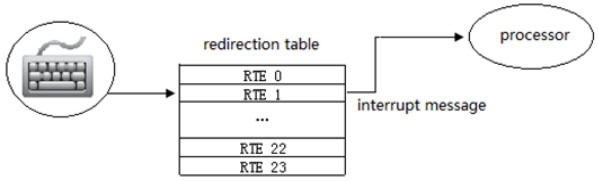

上图是 I/O APIC 对**IRQ1 线**上的**键盘中断请求**处理的示意, 可以认为 **I/O APIC** 的职责主要是**读取 RTE 和转送中断消息**.

当**按下一个键 I/O APIC 检测并确认接受中断**, 在 **redirection table 寄存器**里的 **delivery status** 状态位里记录(**置位时 pending 状态**), 组织发起一次中断消息到 **system bus**.

处理器接收中断消息根据中断的 vector 在 **local APIC** 的 IRR(interrupt request register)相应位置位.

在通过 local APIC 中断优先级仲裁后进入 ISR(中断服务例程), **redirection table** 寄存器的 **delivery status 恢复 idle(空闲**)状态允许接受**下一次键盘中断(！！！**).

# 8. I/O APIC 与 8259 并存时的处理

> 8259 一般同时连在 lapic 的 LINT0 和 I/O APIC 的 IRQ0, 为了
>
> * 如果 lapic 启用了, 那就屏蔽 BSP lapic 的 LVT LINT0, 从而让 I/O APIC 统一处理.
> * 如果 lapic 没有启用, 那就直接当传统的 INTR 用.

**PCH** 里是**同时存在 8259 与 I/O APIC 芯片**的, **软件上**需要**避免硬件的中断同时由 8259 和 I/O APIC 来处理**. 当 8259 和 I/O APIC 的功能重叠时, 例如: **8259 和 I/O APIC**可以同时接收**键盘中断请求**时, 将会进行**两次中断处理**.

1) 一次是 **BSP 处理器响应 8259 提交的中断请求**.

2) 一次是**目标处理器响应 I/O APIC 提交的中断请求**.

比较有趣的是, 当 **I/O APIC** 发送的中断消息的目标处理器不是 BSP 时, 这两个中断服务例程**可能会同时进行**, 如果涉及共同访问同一块内存时, 这样又会造成错乱.

总而言之, 必须避免同时处理的这种情况发生. 显然, 由 **I/O APIC 统一处理所有的中断请求是个好主意**. 我们需要**屏蔽所有来自 8259 的中断请求**.

下面的代码从 **8259 中断控制器**里进行屏蔽.

```x86asm
mov al, 0FFh      ;所有 mask 位置位
out 21h, al       ;写入 8259 master 片的 IMR
```

下面的代码**从 BSP 的 local APIC 里进行屏蔽**.

```x86asm
bts DWORD [APIC_BASE + LVT_LINT0], 16   ;  LINT0 的 mask 位置位
```

关于**屏蔽 LINT0 寄存器**的方法介绍, 详情请参考 18.14.2 节的描述. 注意, **必须对 BSP 处理器的 LVT LINT0 进行屏蔽**, 因为 **8259** 只能向 **BSP** 发送中断请求.

>实验 19-1: 使用 I/O APIC 处理键盘中断

在这个实验里, 我们将输入一些按键并回显出来, 测试 I/O APIC 的中断处理方式. 实验的 IRQ1 中断服务例程实现在 lib\ioapic.asm 文件里.

代码清单 19-4(lib\ioapic.asm):

```x86asm
; -----------------------------------
;  ioapic_keyboard_handler()
; -----------------------------------
ioapic_keyboard_handler:
       in al, I8408_DATA_PORT                   ;  读键盘扫描码
       movzx eax, al
       cmp eax, key_map_end - key_map
       jg ioapic_keyboard_handler_done
       mov esi, [key_map + eax]
       call putc        ;  打印按键
ioapic_keyboard_handler_done:
       mov DWORD [APIC_BASE + EOI], 0           ;  发送 EOI 命令
       iret
```

这个 ioapic\_keyboard\_handler()很简单, 读取键盘扫描码后转换为 ASCII 字符打印在屏幕上. 作为使用 I/O APIC 的演示例子, 并没有进行什么按键的处理. 最后别忘了需要加上给 local APIC 发送 EOI 命令的指令.

注意, 从 18.5 节所述, 当 local APIC 的 SVR(Spurious-Interrupt Vector Register, 伪中断向量寄存器)的 bit12 为 0 时, 对于 I/O APIC 的 Fixed 交付模式并且是 level 触发的中断, 给 local APIC 发送 EOI 命令, local APIC 也会广播 EOI 给 I/O APIC.

代码清单 19-5(topic19\ex19-1\protected.asm):

```x86asm
; 实验 ex19-1: 使用 I/O APIC 处理键盘中断
       cli
       ; * 建立 IRQ1 中断服务例程
       mov esi, IOAPIC_IRQ1_VECTOR
       mov edi, ioapic_keyboard_handler
       call set_interrupt_handler
       ; * 设置 IOAPIC 的 redirection table 1 寄存器
       mov DWORD [IOAPIC_INDEX_REG], IRQ1_INDEX
       mov DWORD [IOAPIC_DATA_REG],  LOGICAL | IOAPIC_IRQ1_VECTOR
       mov DWORD [IOAPIC_INDEX_REG], IRQ1_INDEX + 1
       mov DWORD [IOAPIC_DATA_REG], 08000000h    ;  目标处理器是 processor #4
       ;  屏蔽 LINT0
       bts DWORD [APIC_BASE + LVT_LINT0], 16
       ;  打印等待信息
       mov esi, msg
       call puts
       sti
       jmp $
```

上面是实验的主体代码, 它所做的工作主要如下.

1) 建立 IRQ1 中断服务例程对应的 IDT 表项(使用 `set_interrupt_handler()`函数).

2) 设置 I/O APIC 的 IRQ1 所对应的 redirection table 寄存器信息, 使用的是 logical 目标模式, 而目标处理器将使用 processor #4(第 4 个逻辑处理器).

3) 屏蔽 8259 的所有中断请求.

在设置前最好先关闭中断许可, 避免设置完成前发生中断. 最后, 打印等待信息, 等待用户按下按键. 键盘服务例程将会打印出来用户的按键. 下面是实验的运行结果.


在运行时, 笔者输入了"hello, world"按键后, 如上面的结果回显在屏幕上. 笔者最后输入了一个回车键, 会显示一个乱码符号, 这是由于没有对其他按建进行处理.

