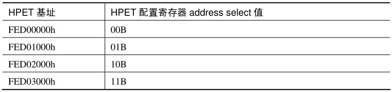
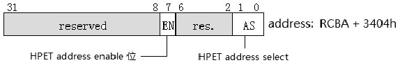
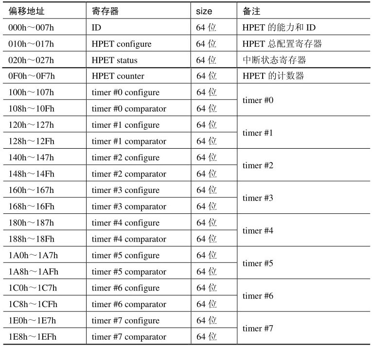
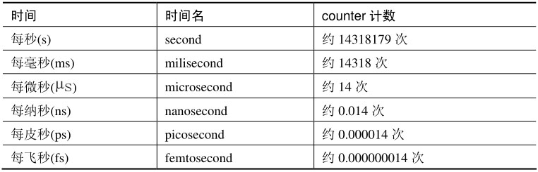
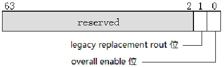
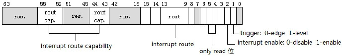
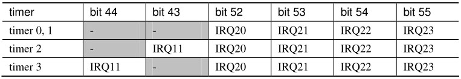
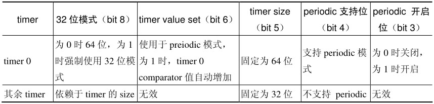
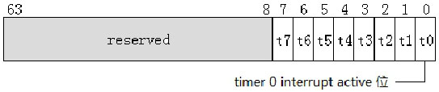

<!-- @import "[TOC]" {cmd="toc" depthFrom=1 depthTo=6 orderedList=false} -->

<!-- code_chunk_output -->

- [HPET 寄存器基址](#hpet-寄存器基址)
- [HPET 的工作原理](#hpet-的工作原理)
  - [2.1 HPET 寄存器](#21-hpet-寄存器)
  - [2.2 HPET counter 频率](#22-hpet-counter-频率)
  - [2.3 HPET 配置](#23-hpet-配置)
  - [2.4 Timer 定时器配置寄存器](#24-timer-定时器配置寄存器)
  - [2.5 Timer 0 的配置](#25-timer-0-的配置)
  - [2.6 HPET status 寄存器](#26-hpet-status-寄存器)
  - [2.7 开启和初始化 HPET](#27-开启和初始化-hpet)

<!-- /code_chunk_output -->

我们将了解一下 HPET(high precision event timer)的使用, 作为对 `I/O APIC` 另一个补充**应用实例**的讲解.

**HPET 的所有寄存器**使用**直接内存映射形式**(不像 I/O APIC 寄存器的**间接访问方式**), **软件直接访问寄存器所映射的地址**.

注: **外设**一般都有自己的**寄存器(配置空间**), **映射方式**不一定一致.

# HPET 寄存器基址

根据 Intel 的 PCH datasheet 文档介绍, **HPET 寄存器基址**有**4 个选择**, 如下表所示.



最终的**HPET 寄存器基址**由**HPET 配置寄存器 address select 域**来决定, HPET 配置寄存器结构如下所示.



**HPET 配置寄存器**的 bit 7 位是 HPET 寄存器**内存映射地址开启位(！！！**), 置位时 **HPET 地址区域可用**. bit 1 和 bit 0 是 HPET 地址选择域, 在上表中的 **4 个 HPET 寄存器基址中选择一个**, 默认值为 00B, 使用 **FED00000h 作为 HPET 寄存器的基址**.

**HPET 配置寄存器**位于 **RCBA(root complex base address**)的 **3404h 偏移地址**上, 和前面所说**OIC 寄存器处理同一个配置空间(！！！RC 配置空间中, 和 OIC<IO APIC>是同等地位关系, 都是 PCIE 直接外设！！！**), 使用 `get_root_complex_base_addrss()` 函数获取**RCBA 地址**.

**重要(！！！**): 通过 **PCI 的宏**找到 **RCBA 基地址**, 然后通过**相应的偏移**找到**HPET 配置寄存器(不同于 HPET 寄存器的 configure 寄存器！！！**), 通过该**寄存器的地址选择域获取 HPET 寄存器的基址**, HPET 的**相关寄存器**都是在该**基址的相应偏移位置**.

# HPET 的工作原理

HPET 有 **1 个 main counter(主计数器**)寄存器和**最多 8 个 timer(定时器**), 记为 `timer 0 ~ timer 7` **定时器**. **每个 timer** 有自己的**一对寄存器**, 分别是: **configure(timer 配置寄存器**)和 **comparator value(timer 比较值寄存器**).

**HPET counter** 按**固定的频率进行计数**, HPET 会检查 **counter 的值**与**timer 的 comparator 值**进行对比. 当 **counter 的值**达到**任何一个 timer 的 comparator 值**时将产生中断(当**配置可产生中断时**).

那么, 如果 counter**同时达到**了**多个 timer 所设定 comparator 值**就会产生**多个中断**. **HPET**的**8 个 timer**可以配置为使用**不同的 IRQ 线(！！！**), 这些**同时产生中断就可以同时进行处理(！！！**).

## 2.1 HPET 寄存器

HPET 寄存器分 **5 组**, 分别是: **ID 寄存器**, **configure 寄存器**, **status 寄存器**, **counter 寄存器**, 以及**每个 timer**的**configure/comparator 寄存器对**. 如下表所示.



**每个 HPET 寄存器**都是**64 位宽**, 因此, 在 32 位的代码下, 软件访问完整的 64 位寄存器需要进行**两次的 32 位读/写操作**. 如以下代码所示.

```x86asm
mov DWORD [HPET_TIMER0_COMPARATOR + 4], 0   ;  timer#0 comparator 寄存器高 32 位
mov DWORD [HEPT_TIMER0_COMPARATOR], 1431800  ;  timer#0 使用 100ms 定时
```

**HPET ID 寄存器**是**只读寄存器**, 软件可以读取 HPET 具备哪些功能, 其中一个是得到 HPET counter 的**计数频率**.

## 2.2 HPET counter 频率

**HPET ID 寄存器**的**高 32 位**返回一个**32 位的 counter 计数频率值**, 读 ID 寄存器时这个值将返回 0429B17Fh(十进制数 69841279, **固定的！！！**). HPET counter 将是**69841279 fs 计数 1 次**, 也就是 69.841279 ns 计数 1 次. 那么, 每纳秒 counter 计数=1/69.841279≈**0.014(次**).



上表列出了所有的**时间单位内 counter 的计数次数**. 需要使用 100ms 的定时, 我们可以为 timer 的 comparator 寄存器设 1431800. 10us 的定时 comparator 可以设为 140.

那么**软件**上可使用的**最小定时精度是 69ns(！！！**). 也就是说, **timer comparator 的值设为 1**时, 是**69ns 产生一次中断**.

## 2.3 HPET 配置

HPET 的**configure 寄存器**(**HPET base+10h**)对 HPET 进行总体上的配置, 这个寄存器**只有两个配置位**, 如下所示.



Overall enable 位(bit 0)**必须设为 1**, 允许**HPET counter 进行计数**. 否则 HPET counter 将**停止计数也不会产生中断**.

当**legacy replacement route 位(bit 1)置位**时:

1) **timer 0**固定使用**I/O APIC**的**IRQ2 或 8259 的 IRQ0**.

2) **timer 1**固定使用**I/O APIC**的**IRQ8 或 8259 的 IRQ8**.

在这种情况下**timer 0**和**timer 1**将不受**timer 0 configure**和**timer 1 configure 寄存器的影响(！！！**), 使用**固定的 IRQ 线产生中断**. 否则将由各自的 configure 寄存器进行配置.

## 2.4 Timer 定时器配置寄存器

**每个 timer 定时器**有自己的**配置寄存器**, 进行具体的配置和管理, 如下所示.



**Bit 1** 指示 timer 使用的 **trigger 模式**(0 是 edge, 1 是 level), bit 2 位**开启和关闭 timer 的中断许可**(0 是 disable, 1 是 enable).

每个 timer 的 interrupt route(中断线路)配置由 route capability 和 route 两部分决定, bit 55~bit52, 以及 bit 44~bit 43 两个域是只读域, 决定 timer 具备配置到哪条 IRQ 线上的能力, 如下表所示.



timer 0、1、2, 以及 3 都可以配置使用 IRQ20~IRQ23. timer 2 和 3 可以额外使用 IRQ11.

timer 0 和 1 的配置还将受制于 HPET configure(HPET base+10h)寄存器的 legacy replacement route 位(当此位为 1 时, tiemr 0 和 1 固定使用 IRQ2 及 IRQ8). Timer 4、5、6, 以及 7 不能进行配置, 将使用固定的 processor message 形式, 不经过 IRQ 线路.

当知道可以配置到哪条 IRQ 线上后, interrupt route(bit 13~bit 9)具体配置到哪条 IRQ 线上, 需要软件写入相应的数值. 当 legacy replacement route 位为 1 时, 这个域对 timer 0 和 1 来说是被忽略的.

Bit 15(processor message interrupt 支持位), 固定为 1, 表明 PCH 支持 processor message interrupt 类型.

Bit 14(processor message interrupt 开启位), 对 timer 4、5、6, 以及 7 来说. 此位固定为 1, 表明 timer 4、5、6、7 必须使用 processor message interrupt 模式.

## 2.5 Timer 0 的配置

在上图的 timer configure 寄存器里, 有部分位只针对 timer 0 有效, 其他 timer 被忽略或使用固定的设置, 如下表所示.



只有 timer 0 才支持 periodic(周期)模式, periodic enable 置位时开启周期运行模式. 当开启 periodic 模式时, timer value set(bit 6)置位, timer 0 的 comparator 值将自动增加.

```x86asm
mov DWORD [HPET_TIMER0_CONFIG], 0000004Ch  ;  使用 64 位 size, period
ic 模式
mov DWORD [HPET_TIMER0_CONFIG + 4], 0
... ...
mov DWORD [HPET_TIMER0_COMPARATOR + 4], 0
mov DWORD [HPET_TIMER0_COMPARATOR], 123h  ;  comparator 值为 123h
```

在上面的代码里, timer 0 使用 periodic 模式(并且 timer value set 位置位), 当 HPET counter 值达到 123h 时, timer 0 产生一次中断. timer 0 的 comparator 值将自动增加为 246h. 当 counter 又达到 246h 时, timer 0 的 comparator 值又自动增加为 369h, 以这种形式达到周期性产生中断的目的.

如果 counter 的值达到最大值回绕到 0 重新开始计数, 那么如果此时 timer 0 的 comparator 达到 0FFFFFFFF\_FFFFFFF0h 值, 又需要增加 123h 值, 将回绕到 00000000_00000113h. 这样周而复始地使用 123h 的间隔值产生中断, 除非软件关闭中断产生.

## 2.6 HPET status 寄存器

当使用 **level 触发模式**时, 产生中断将记录在 HPET status 寄存器里, 如下所示.



bit 7~bit 0 每 1 位代表 1 个 timer 的中断状态, 对于使用 edge 触发模式的 timer 产生的中断将被忽略, 不会反映在 status 寄存器里.

当相应的 timer interrupt active 置位时, 软件需要在相应的位写入 1 清除 active 状态值. 如果写入 0 将是无效的.

## 2.7 开启和初始化 HPET

在使用 HPET 时必须对 HPET 进行初始化的配置工作, 下面的代码实现在 `lib\hpet.asm` 文件里.

代码清单 19-6(`lib\hpet.asm`):

```x86asm
; ------------------------------------
;  enable_hpet(): 开启 HPET(高精度定时器)
; ------------------------------------
enable_hpet:
; *
; * 读取 HPET 配置寄存器
; * Address Enable 位置位, 开启 HPET 地址
; * Address Select 域设置为 00B, HPET 基址位于 0FED00000h
;
       call get_root_complex_base_address
       mov esi, [eax + 3404h]
       bts esi, 7                        ;  address enable 位
       and esi, 0FFFFFFFCh              ;  address select=00B
       mov [eax + 3404h], esi
; *
; * 设置 HPET 的配置寄存器
; *
; * legacy replacement rout=1 时:
; *      1. timer0 转发到 IOAPIC IRQ2
; *      2. timer1 转发到 IOAPIC IRQ8
; *
; * overall enable 必须设为 1
; *
       mov eax, 3                       ;  Overall Enable=1, legacy replacement rout=1
       mov [HPET_BASE + 10h], eax
; *
; * 初始化 HPET timer 配置
; *
       call init_hpet_timer
       ret
; ------------------------------------------
;  init_hpet_timer(): 初始化 8 个 timer
; ------------------------------------------
init_hpet_timer:
; *
; * HPET 配置说明:
; *
; * 1). timer 0 配置 routed 到 IO APIC 的 IRQ2 上
; * 2). timer 1 配置 routed 到 IO APIC 的 IRQ8 上
; * 3). timer 2, 3 配置 routed 到 IO APIC 的 IRQ20 上
; * 4). timer 4, 5, 6, 7 必须使用 direct processor message 方式
; *    而不是 routed 到 8259 或 IO APIC 的 IRQ
; *
       ; *
       ; * timer 0 配置为: 周期性中断, 64 位的 comparator 值
       ; *
       mov DWORD [HPET_TIMER0_CONFIG], 0000004Ch
       mov DWORD [HPET_TIMER0_CONFIG + 4], 0
       mov DWORD [HPET_TIMER1_CONFIG], 00000004h
       mov DWORD [HPET_TIMER1_CONFIG + 4], 0
       mov DWORD [HPET_TIMER2_CONFIG], 00002804h
       mov DWORD [HPET_TIMER2_CONFIG + 4], 0
       mov DWORD [HPET_TIMER3_CONFIG], 00002804h
       mov DWORD [HPET_TIMER3_CONFIG + 4], 0
       ret
```

enable\_hpet()函数先读取 HPET 配置寄存器(通过 RCBA 基址+3404h), 开启 HPET 基址可用, address select 值设为 0(使用 FED00000h 基址), 并对 HPET 的总体 configure 寄存器进行设置, 这里将 timer 0 设置为使用 I/O APIC 的 IRQ2, timer 1 使用 IRQ8, 允许 counter 计数. 最后调用 init\_hpet\_timer()函数对剩余的 timer 进行设置.

>实验 19-2: 使用 HPET timer 的 10 分钟计时器

在这个例子里, 将 HPET 的 timer 0 定时器作为一个计时器使用, 使 timer 每秒产生一次中断, 当达到 10 分钟就停止计时. 下面是实验的主体代码.

代码清单 19-7(topic19\ex19-2\protected.asm):

```x86asm
;  实验 19-2: 使用 HPET timer 的计时器
       mov esi, IOAPIC_IRQ2_VECTOR
       mov edi, ioapic_irq2_handler
       call set_interrupt_handler
       ;  设置 I/O APIC redirection table 寄存器
       mov DWORD [IOAPIC_INDEX_REG], IRQ2_INDEX
       mov DWORD [IOAPIC_DATA_REG], LOGICAL | FIXED_DELIVERY | IOAPIC_IRQ2_VECTOR
       mov DWORD [IOAPIC_INDEX_REG], IRQ2_INDEX + 1
       mov DWORD [IOAPIC_DATA_REG], 08000000h   ;  使用 processor #4
       mov esi, msg
       call puts
       call get_video_current               ;  计时器打印的当前位置
       mov [position], eax
       ; *
       ; * 开启使用 timer 0, 使用每秒中断 1 次
       ; *
       START_HPET_TIMER 0, HPET_COUNT_SECOND, 1
       jmp $
```

由于 timer 0 使用 I/O APIC 的 IRQ2 线路, 因此需要为 I/O APIC IRQ2 设置相关的中断服务例程. Redirection table 2 寄存器使用 Fixed delivery 模式, edge 触发. 目标处理器使用 logical 目标模式(目标处理器为 processor #4).

最后使用 `START_HPET_TIMER` 宏来启动 timer 0 定时, 这个宏实现在 inc\hpet.inc 文件里.

代码清单 19-8(inc\hpet.inc):

```x86asm
; ----------------------------------------------------
;  宏 START_HPET_TIMER(): 开启定时器
;  input:
;        %1 – timer
;        %2 - 时间单位
;        %3 - 单位值
;
;  示例:
;        START_HPET_TIMER  0, HPET_COUNT_MILLISECOND, 100
; --------------------------------------------------------
%macro START_HPET_TIMER 3
      bts DWORD [HPET_BASE + 100h + (20h * %1)], 2
      mov DWORD [HPET_BASE + 108h + (20h * %1) + 4], 0
      mov DWORD [HPET_BASE + 108h + (20h * %1)], (%2 * %3)
      mov DWORD [HPET_COUNTER + 4], 0
      mov DWORD [HPET_COUNTER], 0
%endmacro
```

宏 START\_HPET\_TIMER 需要 3 个参数, 分别是 timer 编号、时间单位和单位值. 像实验例子里的使用方法:

```x86asm
START_HPET_TIMER 0, HPET_COUNT_SECOND, 1
```

使用 timer 0, 时间单位使用秒, 单位值为 1(即每秒产生中断一次). `HPET_COUNT_SECOND` 的常量值定义在 `inc\hpet.inc` 文件里, 它的值是 14318179(十进制数).

代码清单 19-9(topic19\ex19-2\protected.asm):

```x86asm
; --------------------------------------
;  IOAPIC IRQ2 中断 handler
; --------------------------------------
ioapic_irq2_handler:
      jmp do_ioapic_irq2_handler
second  dd 0
minute  dd 0
do_ioapic_irq2_handler:
      mov ebx, [minute]
      mov edx, [second]
      cmp ebx, 10
      jb print_timer
      STOP_HPET_TIMER 0      ;  停止 timer 中断产生
      jmp ioapic_irq2_handler_done
print_timer:
      mov esi, [position]
      call set_video_current
      cmp edx, 59        ;  是否达到 1 分钟
      jb ioapic_irq2_handler_next
      inc ebx         ;  是的话 minute++
      xor edx, edx
ioapic_irq2_handler_next:
      ;  打印分钟
      mov esi, ebx
      cmp ebx, 10
      mov eax, print_byte_value
      mov edi, print_dword_decimal
      cmovae eax, edi
      call eax
      mov esi, ': '
      call putc
      ; 打印秒钟
      mov esi, edx
      cmp edx, 10
      mov eax, print_byte_value
      mov edi, print_dword_decimal
      cmovae eax, edi
      call eax
      inc edx         ;  second++
      mov [second], edx
      mov [minute], ebx
ioapic_irq2_handler_done:
      mov DWORD [APIC_BASE + EOI], 0   ;  发送 EOI 命令
      iret
```

最后这是 I/O APIC 的 IRQ2 中断处理程序代码, 这个处理程序进行的处理是: 每调用一次增加一次 second 值. 当 second 值大于 59 时, minute 值增加一次. 并将它们的值打印在指定的位置上(由 position 值得到).

当 minute 达到 10(即 10 分钟)时, 处理程序关闭 timer 的中断许可. 在处理程序的末尾需发送 EOI 命令给 local APIC.


上图是在笔者的机器上运行的某刻抓拍的, 当显示到 10: 00(满十分钟)时会停止继续计时.